# 营销自动化——客户细分

> 原文：<https://towardsdatascience.com/marketing-automation-customer-segmentation-5924b45556b5?source=collection_archive---------14----------------------->

你了解你的顾客吗？客户分析变得至关重要。这些见解推动了企业的销售、营销和产品开发工作，研究表明，使用客户分析的公司利润更高。

阿列克斯·多罗霍维奇在 [Unsplash](https://unsplash.com?utm_source=medium&utm_medium=referral) 上的照片

顾客可以随时随地获得信息，包括去哪里购物、买什么、付多少钱等等。这使得利用预测分析和数据来预测客户在与品牌互动时的行为变得越来越重要。

客户分析的目标是创建一个单一的、准确的客户视图，以决定如何最好地获取和保留客户，识别高价值客户并主动与他们互动。对顾客的购买习惯和生活方式偏好了解得越多，预测行为就变得越准确，顾客的旅程就变得越好。如果没有大量准确的数据，从分析中得出的任何见解都可能非常不准确。

在本文中，我将展示如何创建客户分析仪表板，以及如何在现实生活中使用这些信息。对于这个实验，我将使用 [Kaggle](https://www.kaggle.com/) 数据集— [零售店案例研究数据集](https://www.kaggle.com/amark720/retail-shop-case-study-dataset?select=Transactions.csv)。

首先，我们来做探索性的数据分析，把我们的数据从不同的垃圾中清理出来。

该数据集包含以下表—客户、交易和产品。事务表包含以下列:

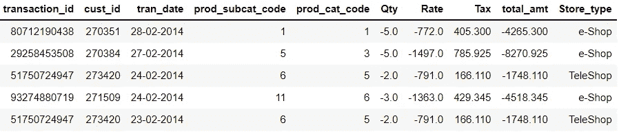

交易表头

*   transaction_id —事务标识符；
*   客户标识—客户标识符；
*   交易日期—交易的日期；
*   prod_subcat_code —产品子类别标识符；
*   prod_cat_code —产品类别标识符；
*   数量——产品数量；
*   费率——产品价格；
*   税费—本次采购的税费；
*   total _ amount—采购价值+税；
*   Store_type —进行购买的商店的类型；

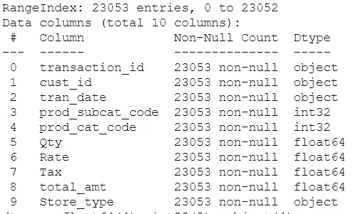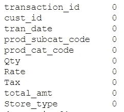

交易表信息

我在事务表中有将近 23K 的记录没有空值。它是一个玩具数据集，但在现实生活中，我们必须在使用前仔细检查和清理。

客户表包含以下列:

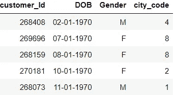

客户表格标题

*   customer_Id —客户标识符；
*   DOB——客户生日；
*   性别—客户性别；
*   city_code —客户在商店中注册的城市；

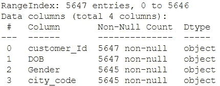

с客户表信息

customer 表有 5647 个不同的客户，看起来有些客户没有关于性别和城市代码的信息。如何处理这样的问题，我将在后面说明。

产品表包含以下列:

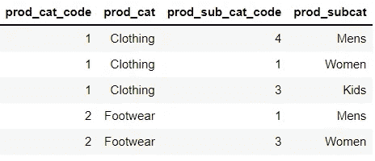

产品表格标题

*   prod_cat_code —产品类别标识符；
*   产品类别名称；
*   prod_sub_cat_code —产品子类别标识符；
*   prod_subcat —产品子类别名称；

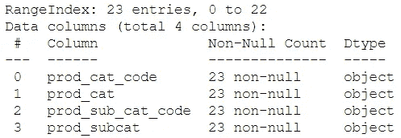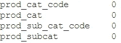

产品表信息

product 表有 23 个唯一的子类别，没有空值记录。

让我们加入我们的表，并对我们的事务表进行深入分析。我想检查以下信息—日期变化、交易表中有多少客户，以及他们购买了多少最受欢迎的产品。

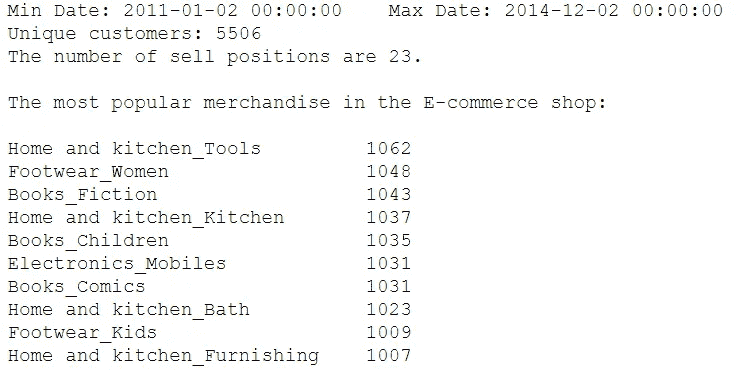

完整数据集分析

下一个分析将是我们的数量、价格、税收和价值列，以分析一些汇总统计数据。

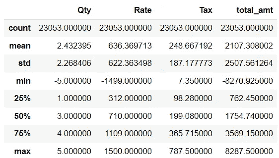

汇总统计数据

正如我所写的，这是玩具数据集，所以我们没有任何异常值，我们唯一拥有的是负值，但这意味着我们已经获得了有关з购买回报的信息，我们将在进一步的分析中使用。

我们开始做客户细分吧。第一个是 RFM 分析。对我来说，这是了解你的客户最简单快捷的方法之一。那么，什么是 RFM 分析呢？

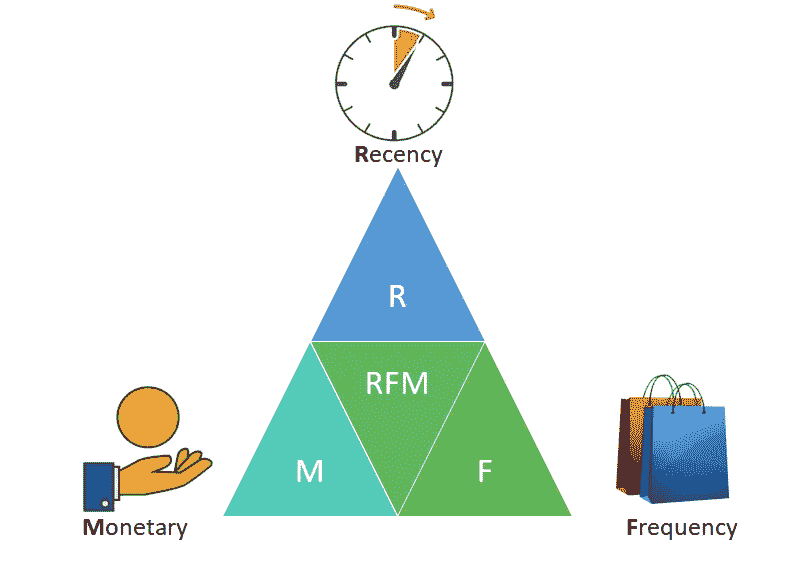

作者的 RFM 形象

RFM 是一种用于分析客户价值的方法。它通常用于数据库营销和直接营销，在零售和专业服务行业受到特别关注。

RFM 代表三个维度:

*   **最近度** —顾客购买了多久？
*   **频率**——他们多久购买一次？
*   **货币**价值——他们花了多少钱？

这种技术还有其他变体:

**RFD** — **新近度、频率、持续时间**是 RFM 分析的修改版本，可用于分析观众/读者/冲浪导向的商业产品的消费者行为。

**RFE** — **新近度、频率、参与度**是 RFD 分析的一个更广泛的版本，其中*参与度*可以定义为包括访问持续时间、每次访问的页数或其他此类指标。

**RFM-I** — **近期、频率、货币价值—互动**是 RFM 框架的一个版本，修改后用于说明与客户营销互动的近期和频率(例如，控制非常频繁的广告活动可能产生的威慑效应)。

**RFMTC** — **新近性、频率、货币价值、时间、流失率**由 I-Cheng 等人(2009)提出的一个扩展的 RFM 模型。该模型利用概率论中的伯努利序列，并创建公式来计算客户在下一次促销或营销活动中购买的概率。该模型已由 Alexandros Ioannidis 在输血和 CDNOW 数据集等数据集上实现。

我们需要做的第一件事是计算一段时间内数据集中每个客户的三个值— **最近度、频率、**和**货币**。我想以过去 3 个周期的半年为基础进行计算。

下一步是根据客户的近期、频率和货币价值创建三个不同的组，这将有助于我们命名我们的客户群。RFM 分数是最近值、频率值和货币值的简单总和，这个总和是 10、9、8 等整数值的结果。该分数将表明 RFM 分数的价值，它将允许我们对业务产品或客户做出决策。这是一个非常重要的指标，因为未来的决策过程涉及到用户或客户。

在最后，我们有三个时间段的 RFM 分析。

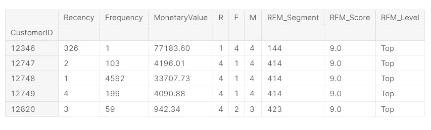

作者的 RFM 分析

但是，你会问——它是如何使用的？首先，我们可以计算不同时期的一些全局，并对其进行动态分析。

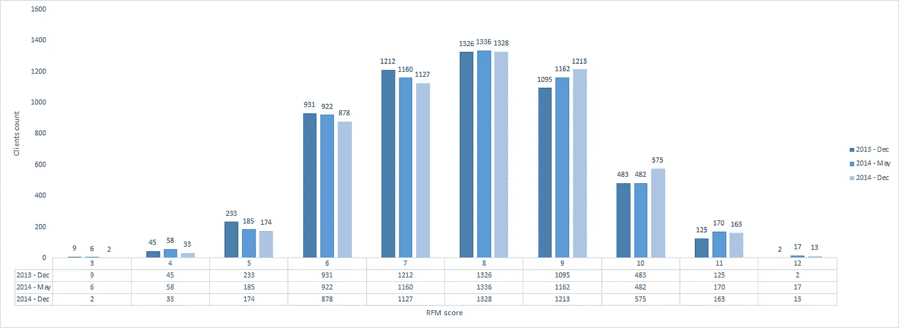

RFM 得分分析

这很有趣，但让我们用我们的 RFM 分数命名值。

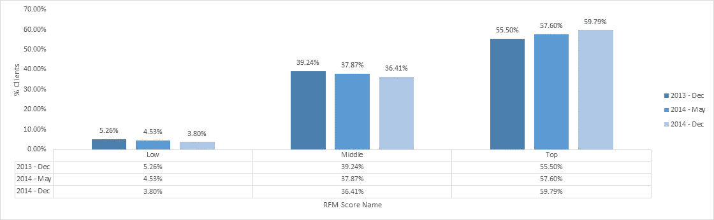

RFM 分数名称分析

这里我们可以看到，在过去的 1.5 年里，我们增加了顶级客户的数量。

让我们分别深入探讨 RFM 价值观，并对其进行动态分析。

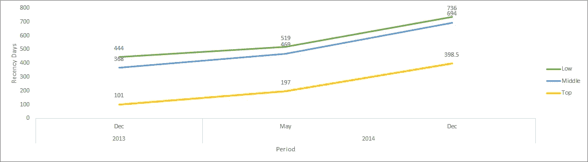

新近动态分析

我们延长了购买间隔时间，这表明客户参与度有所下降。

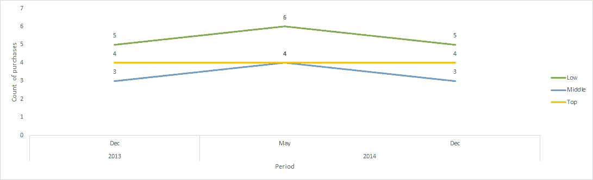

频率动态分析

降低中低消费群体的平均购买数量。

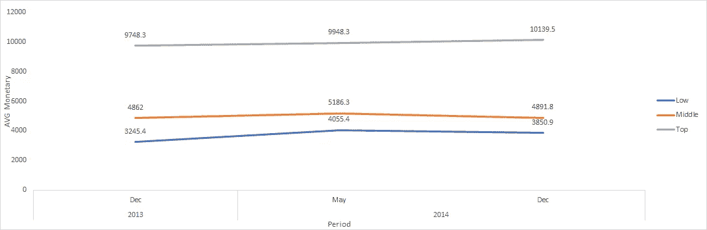

货币动态分析

在这里，我们可以看到高收入群体的收入略有增加，中低收入群体的收入有所减少。

为了得出一些结论，我们需要知道的下一步是对每个客户端进行深入分析，这有助于我们了解组之间的流量。

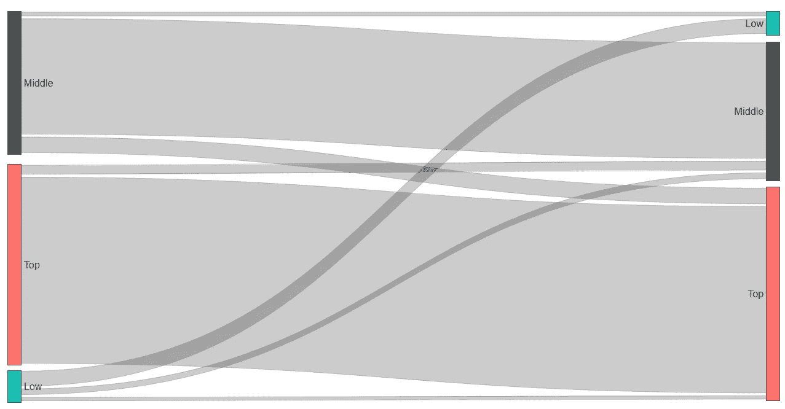

RFM 等级流程图

在这里，我们可以看到在过去半年中从一个组迁移到另一个组的用户数量。

正如你所看到的，RFM 分析很容易实现，但是为我们分析它提供了大量的变量。我展示的那部分，只是 RFM 能告诉你的关于你的客户的一小部分。

我们接着做进一步的分析。下一步是队列分析。我想对 2011 年做这样的分析。这种分析仅仅基于日期值。定义群组是群组分析的第一步。让我们试着根据每个客户进行第一笔交易的月份(由于发票日期而收到发票号)来创建每月分组。为了建立适当的群组，下一步是计算每个客户交易的时间偏移。这将允许我们以适当的方式报告每个群组的指标。为了创建时间偏移，我将创建一个函数，将日期拆分为年、月、日列。这将有助于根据时间日期轻松进行计算。

*留存率图表*

客户保持率是一个非常强大的指标，可以用来了解有多少客户仍然“活着”(或活跃)。在此之前，留存率向我们显示了活跃客户占总客户的百分比。

行为分析和客户分析的另一个有用指标是计算客户在商店购买的产品的平均数量，并将其可视化在类似的群组表中，如上面的留存分析。

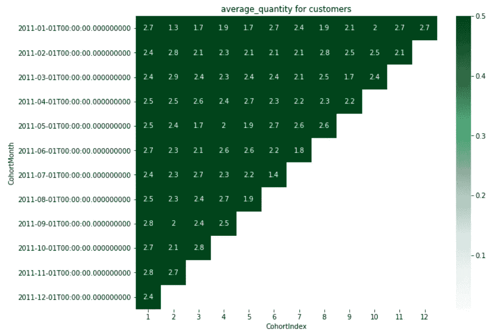

顾客购买产品的平均数量

正如你在玩具数据集中看到的，我们全年的顾客行为基本没有变化。

现在是时候利用数据科学算法的力量来构建客户群了。首先，在开始构建模型之前，我们需要对数据进行预处理。我将向您展示数据预处理步骤中使用的几个概念和其他注意事项。在构建和预处理管道之后，我将向您展示如何构建称为 K 均值聚类的流行机器学习算法，该算法将基于我们计算的 RFM 分数和我们稍后计算的其他因素。这将有助于我们根据用户的客户行为指标来明确和识别用户。

什么是 K-Means 聚类，为什么使用这种算法？

[收敛*k*——意为](https://en.wikipedia.org/wiki/K-means_clustering#/media/File:K-means_convergence.gif)

*   K-Means 是识别不同模式的最流行的无监督学习方法之一
*   K-Means 简单快速
*   适用于大型数据集

在构建 K-Means 算法之前，有一些关键的假设:

1.  所有变量必须对称分布，不应有偏差。
2.  所有变量应该具有相同或几乎相同的平均值。
3.  所有变量应该具有相同的方差水平。

好了，让我们创造一些额外的因素，使集群更丰富和有趣。Ler 从客户的社会人口统计信息开始。我有我想使用的关于生日、性别和城市的信息。对于出生日期，我将在最大交易日期计算用户的年龄、性别，以及我将使用 [One Hot Encoding](https://en.wikipedia.org/wiki/One-hot) 技术转换的城市。因此，我得到了下面的客户表，我将把它加入到 2014 年 12 月 2 日进行的最后一次 RFM 分析中。

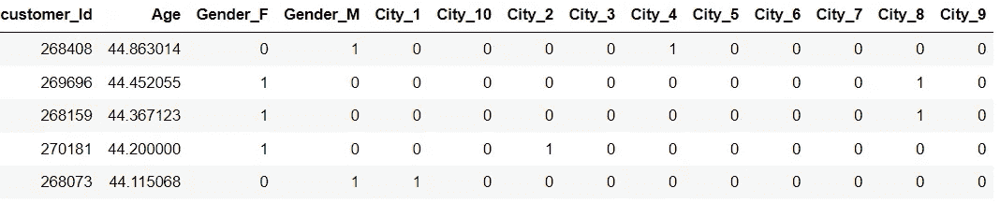

客户建议的表格

下一个功能将建立在类别和交易信息的基础上。这将是每个客户按类别购买的平均值。

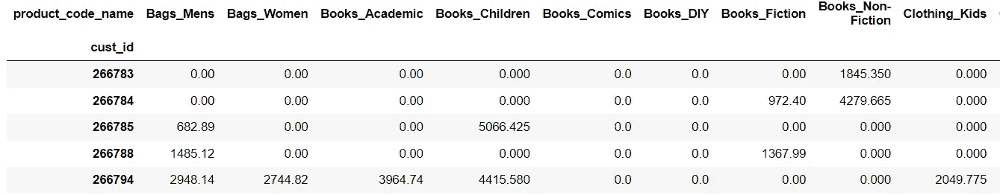

类别/交易特征

这就是我想在这个实验中使用的所有功能，但是数量和多样性只取决于您的业务需求和工程师的幻想。

由于算法限制，需要时间来预处理所有这些数据。我们可以使用一些提示和技巧:

*   我们有几种方法来消除数据的偏斜。第一个是对数变换。但是对数变换只适用于正值。
*   另一种消除偏斜的方法是广泛使用的 Z 变换，它对数据中的混合(正负)值很有效。

此外，我将在工作中解释不同的方法。这里有足够的信息来深入研究这项工作。

进一步的数据探索任务是识别偏斜度。偏斜度是对称(或缺乏对称)的度量。如果数据集在中心点的左侧和右侧看起来相同，则数据集的分布是对称的。直方图是显示数据偏斜度的有效图形技术。

通常，有 3 种类型的偏斜度:

1.  左偏数据
2.  正态分布数据
3.  右偏数据

我将使用 z 变换，因为我得到了一个负值，我想在我的分析中使用。

我们需要做的下一件事是确定集群的数量。如何识别集群的数量？在 KMeans 算法中，有几种方法可以确定聚类数:

*   目测法——所谓的弯头法(或弯头标准等)。)
*   这种定量方法叫做[轮廓系数](https://scikit-learn.org/stable/auto_examples/cluster/plot_kmeans_silhouette_analysis.html)
*   实验和想象

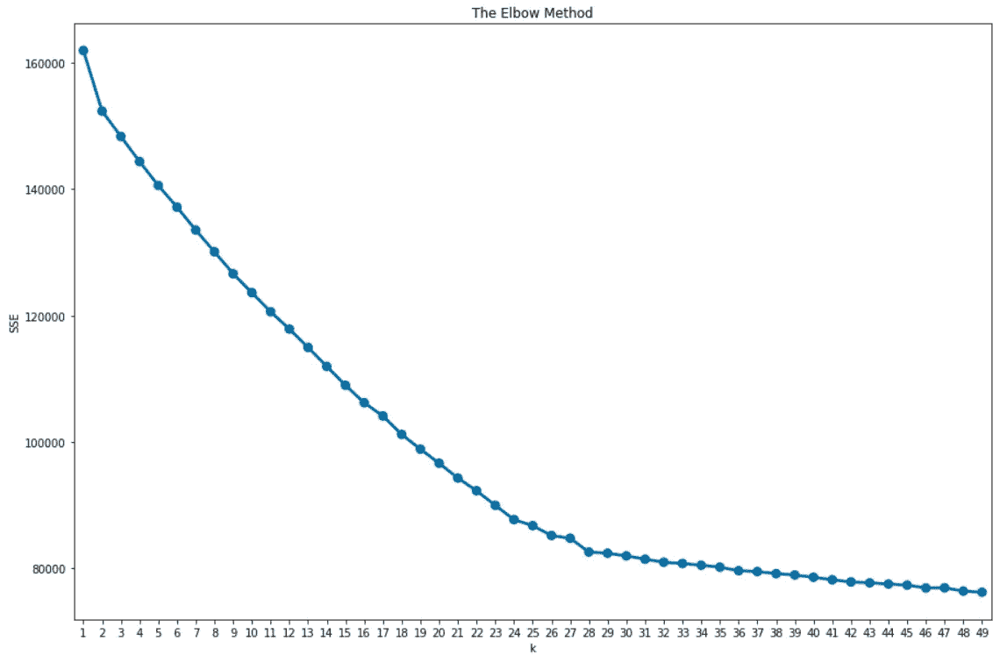

肘形图

我有太多的因素，所以为了使我的分析有意义，我需要建立许多集群。我想留下 20 个微团做进一步分析。

此外，我想向您展示如何计算基本指标来确定 Kmeans 算法的“适合度”。

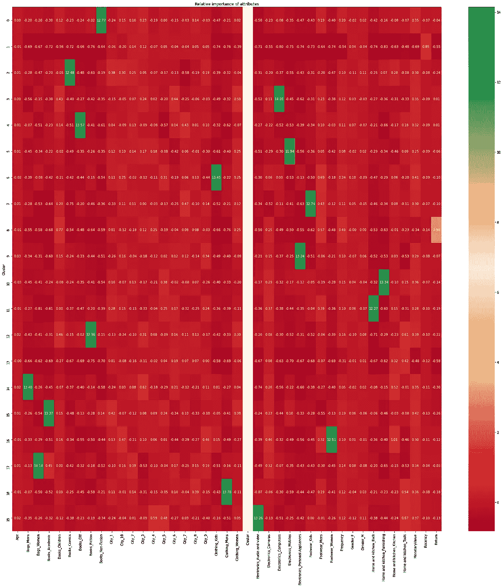

属性的相对重要性

这样的图表可以帮助你分析属性的相对重要性。

此外，还有一个更有用的图表——蜘蛛图，它可以帮助我们分析聚类之间存在差异的因素

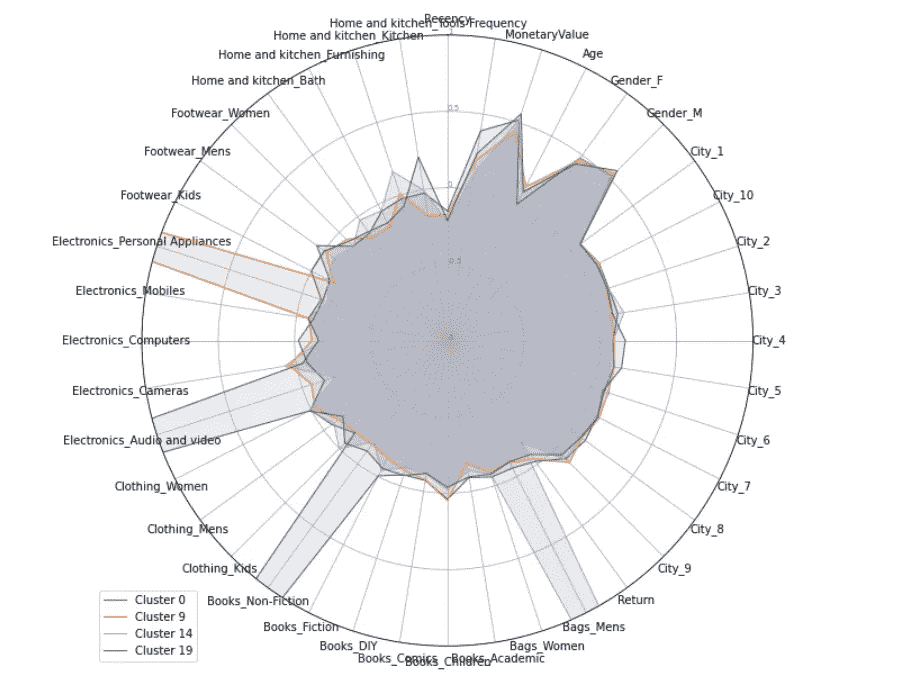

蜘蛛图

在这里，我们可以看到，这四个分类的最大区别在于客户在自己的分类中购买的商品类别。

这就是我想在这个分析中展示的全部，现在是下结论的时候了。

# 结论

因此，正如你所看到的，这些方法是一个强大的工具，可以帮助你更好地了解你的客户。

细分可以让企业更好地利用营销预算，获得相对于竞争对手的竞争优势，更重要的是，展示出对客户需求的更好了解。它还可以帮助:

*   营销效率——将庞大的客户群分解成更易于管理的部分，从而更容易识别目标受众，并使用最相关的渠道向最相关的人发起营销活动。
*   确定新的市场机会——在将客户分组的过程中，您可能会发现您已经确定了一个新的细分市场，这反过来可能会改变您的营销重点和策略。
*   更好的品牌策略——一旦你确定了客户的关键激励因素，如设计、价格或实际需求，你就可以恰当地给你的产品打上品牌。
*   改善分销策略—确定客户在哪里购物以及何时购物可以为产品分销策略提供信息，例如在特定的商店销售什么类型的产品。
*   客户保留——通过细分，营销人员可以识别出需要额外关注的群体、流失迅速的群体以及潜在价值最高的客户。它还可以帮助创建有针对性的策略，吸引客户的注意力，并为您的品牌创造积极、高价值的体验。

所以，不要害怕，开始让你的营销策略更有效率和利润。

你能在 Git 仓库中找到的所有代码— [链接](https://github.com/AndriiShchur/Marketing-automation)。