# 衡量营销活动

> 原文：<https://towardsdatascience.com/marketing-campaigns-ca7dd3cd72bf?source=collection_archive---------17----------------------->

## 衡量多渠道营销活动的效果

([https://www.istockphoto.com](https://www.istockphoto.com/nl)

# 介绍

几乎不言而喻的是，消费者的需求和欲望是当今创造新产品和新服务，并制定相应的计划来销售它们以获取利润的关键问题。客户关系管理是针对客户群量身定制的促销活动[1]。一种闭环营销系统和方法提供了在线和离线测量跨渠道的营销计划的投资回报的能力，包括印象、页面浏览量和响应水平。在这里，我们提供了一种机制，通过考虑多种活动的影响来衡量营销部门对销售渠道的贡献[2，3]。传统上，转化研究是营销人员评估广告效果的标准技术。本文将提供各种数据科学技术的路线图，这些技术用于了解营销活动的影响，并向在线订阅业务的利益相关者传达重要的、可操作的见解。

# 衡量营销活动的成功

整个数据科学学科的核心是将业务问题转化为可衡量结果的概念。数据专业人员最常被问到的一个问题是:

*   这场运动成功了吗？

最大的挑战之一是使用哪些指标来衡量营销活动的成功，因为有太多的指标。作为一名数据科学家，您会发现自己会反复使用大量的指标。几项研究的数据表明，对于营销团队来说，营销活动的成功通常是通过转化率来衡量的。也就是说，在所有接触过你的营销活动的人中，有多少人购买了该产品？

根据业务的不同，这可能意味着有人购买或订阅了你的服务。除此之外，许多订阅业务也关心留存。一旦用户注册了订阅，他们在一个月、三个月或十二个月后仍然是订阅者吗？特别值得关注的是，他的衡量标准可能特别难以衡量，因为这需要耐心。在用户最初订阅 90 天后，我们才能知道 90 天的保留率。

# 汇率

转化率是我们向最终转化为我们产品的人推销的百分比。在本文中，我们将关注订阅服务，并从订阅的角度讨论转换。

# 保留率

保留率是指在一段时间后仍保持订阅的人数百分比，我们将重点关注 1 个月的保留率。

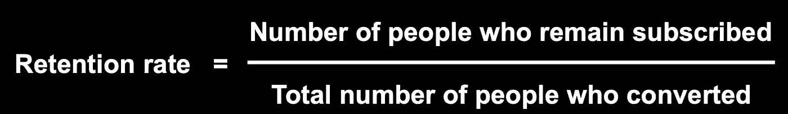

你可以在本文的 [GitHub 库](https://github.com/rhkaz/marketing_campaigns)找到我写的实现模型和生成图形的笔记本。

# 按渠道划分的每日营销范围

营销活动的一个关键方面是确定每天有多少用户在查看营销资产。这对于理解我们过去一个月的营销工作有多有效至关重要。

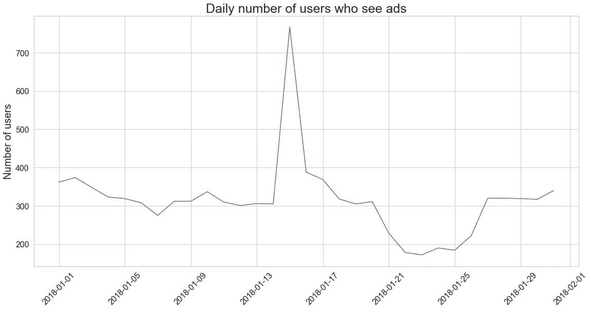

从图中的数据来看，很明显，在这个月的上半个月，每天大约有 300 名用户逗留。然而，我们在月中看到一个巨大的峰值。对此的一个可能的解释是，营销人员发出了一封大型营销邮件，这封邮件送达了许多不是网站日常访问者的用户。在深入研究和计算指标之前，可以考虑这些波动。

# 每日兑换率

当您想要了解您的营销活动的表现时，有必要了解关键指标在整个营销活动中是如何变化的。您的关键指标可以帮助您发现活动期间可能发生的问题，例如结账系统中的一个错误，该错误导致活动结束时转化率下降。随着时间的推移，指标也可以显示趋势，如在周末或特定假日获得更多订户。

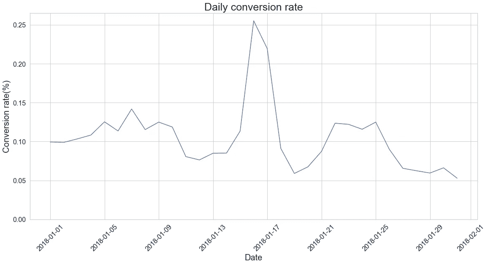

从表中可以明显看出，除了一月份的一天外，转换率相对稳定。

# 每日订户质量

通过查看每天的保留率，用户质量会随着时间的推移而变化。当根据用户的订阅时间来查看一段时间内的保留率时，我们实际上是在进行一种简单的群组分析，帮助我们评估每天带来的订户的质量。如果我们看到这一指标随着时间的推移而上升，这可能意味着我们正在更好地转化对我们的产品真正感兴趣的用户，或者我们正在改善用户订阅后的入职流程。

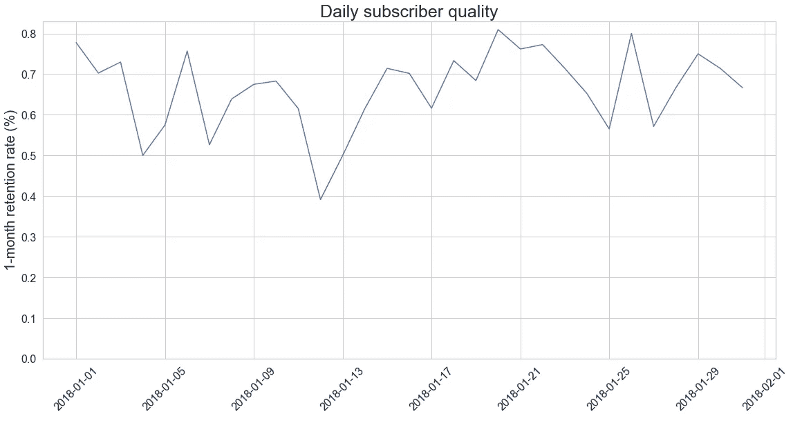

# 客户细分

有证据表明，除了高级指标之外，对客户进行细分也很重要。术语“细分”是指根据具体特征分解指标。例如，除了查看整体转换率之外，还可能需要查看不同年龄组的转换率。有可能某个活动的整体转化率很低，但对 55 岁及以上的用户非常有效。数据分析团队没有称这次活动为失败，而是学会了一种新的向老年人营销的方式。这些结果可用于开展一项活动，让 55 岁及以上的用户获得不同于其他人的营销技巧。

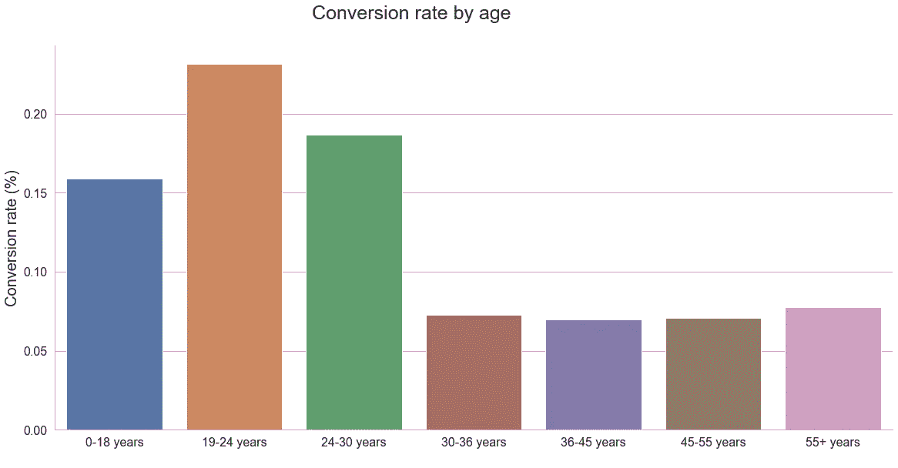

# 比较语言转换率

数据科学家必须向业务利益相关者清楚地传达结果。提出正确的问题是这一过程的基础。因此，数据科学需要从整体角度解决这个问题。例如，在我们的案例中，我们观察了不同的年龄组，它们与转化有关。接下来，我们可以跨语言进行比较，随后，这将使我们了解哪些语言相对于其他语言转换得更好。

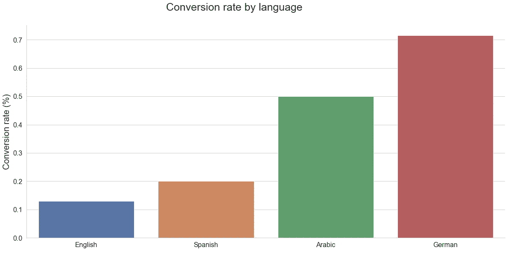

图中突出的是德语和阿拉伯语使用者的转化率比英语和西班牙语使用者高得多。

# 日常语言偏好

当我们进行跨语言比较时，我们可以了解哪些语言相对于其他语言转换得更好。我们还注意到英语和西班牙语的转换率要低得多。这可能会引发对不同语言之间的转换率差异进行更深入调查的冲动。

从数字上看，有一个明显的趋势:最流行的语言是英语。

# 跨年龄组的营销渠道

一些营销利益相关者可能想知道他们的营销渠道是否平等地接触到所有用户，或者一些营销渠道是否服务于特定的年龄人口统计。在营销团队中，经常会收到需要快速分析和可视化的请求。你越善于将结果可视化，你就越有可能将你的发现有效地传达给你的利益相关者。

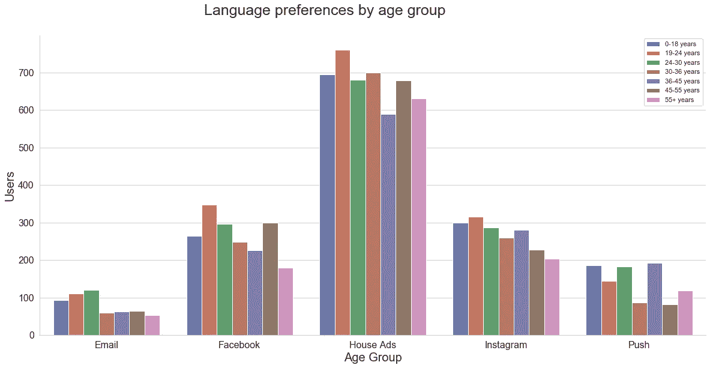

该图中的数据有意思的是，电子邮件没有到达年龄较大的群体，脸书也没有到达太多 18 岁以下的人。

# 各年龄组的转换率

您的营销利益相关者要求提供每个年龄组的每日转化率报告，他们需要尽快得到。他们希望你每月更新一次这份报告。这是一个利用你的功能的绝佳机会。这些函数不仅可以帮助您立即得到这份报告，还可以帮助您每个月刷新数据。

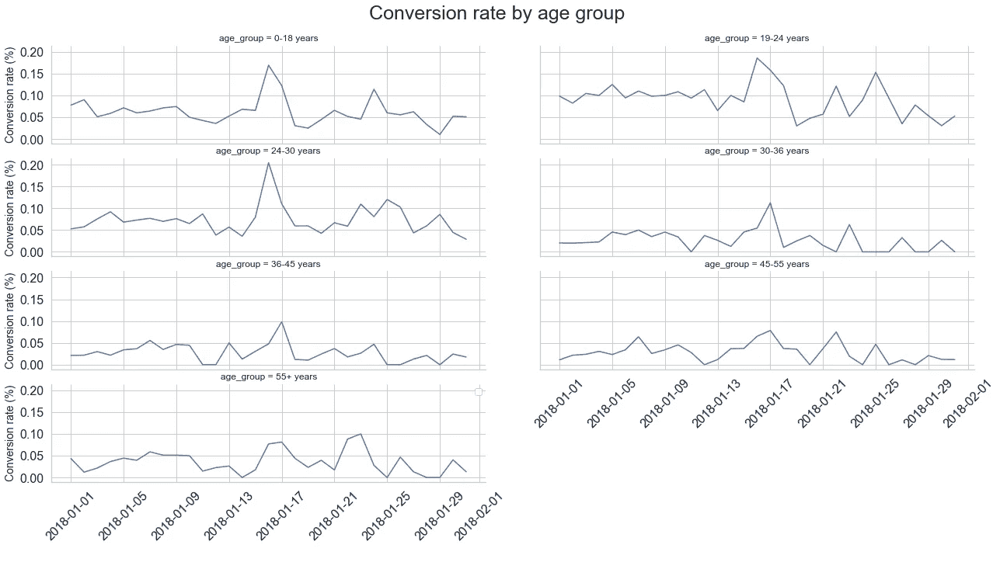

# 订阅渠道的保留率

我们已经计算了总订户和保留订户，我们可以回答哪个渠道的保留率最高的问题。在图中，您可以看到每个订阅渠道的保留率。

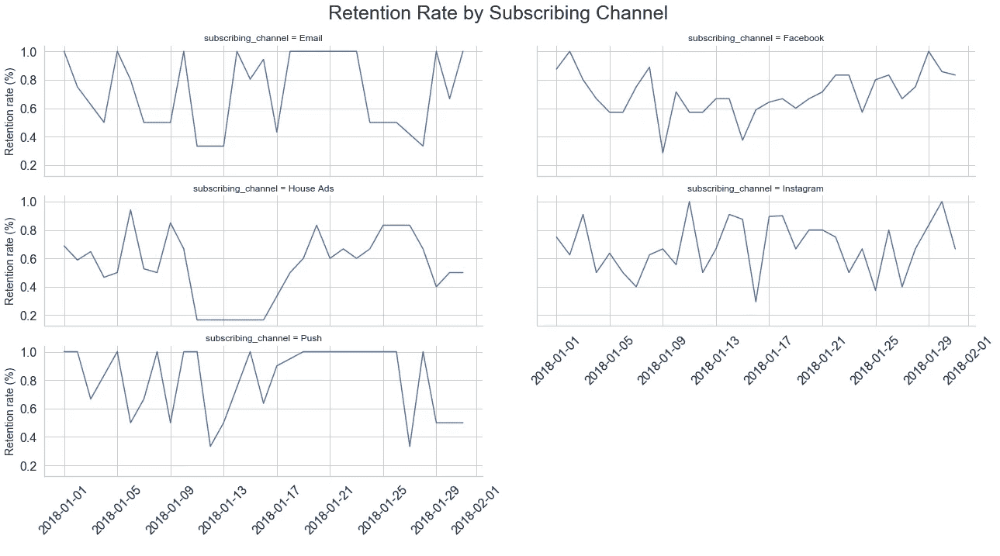

从这个图中，我们可以看到哪些渠道在驱动用户保持率最长。在电子邮件的情况下，可以观察到大的峰值，通常下降到 0。这很常见，因为电子邮件通常是批量发送的，导致用户在同一组有限的日子里订阅。当保留率为 0 时，这意味着这些天没有人订阅。

# 利益相关者报告

让我们利用我们对营销活动的了解，制作利益相关者可能不知道要问的报告，但很高兴你看了。house ads 团队已经开始担心他们在转换率中注意到的一些违规行为。利益相关者带着他们注意到的有关指标变化的担忧来找数据科学家是很常见的。其数据科学家的工作是确定这些变化是自然波动还是需要进一步调查。

# 房屋广告的转换率

之前的例子已经指出了房屋广告转化率的下降。有趣的是，问题是用户看到的广告不是他们喜欢的语言。我们评估了这个错误的影响。虽然人们不能忽视与活动中的错误相关的数据，但人们可以估计如果没有问题，转换可能会是什么样子。

# 一周中的趋势

指标波动的最常见原因之一可能是由于客户在一周的不同日子里的行为差异。例如，一些企业在工作日的表现一直比周末好。

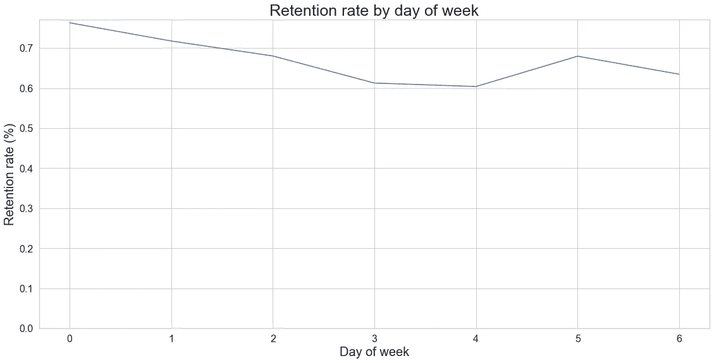

这个数字在几个方面很能说明问题。首先，与您可以看到的另一个数字不同，如果用户在一周的晚些时候订阅，保留率会更低，但这种差异很小，可能表明了其他情况，例如在周末发送更多的电子邮件，从而转化了低意向用户。因此，工作日的波动是常见的，即使有一致的模式，也不一定值得警惕。然而，这可能意味着当你试图最大限度地向顾客推销时，要进行修改。

# 每日房屋广告转换

既然你已经确认了房屋广告转化率自 1 月 11 日以来已经下降。自然，它要求需要确定下降的潜在原因。作为一名支持营销团队的数据科学家，一个人必须时刻面对波动的指标。因此，确定波动是由于用户行为的预期变化(即一周中各天的差异)还是技术实施或营销策略中的更大问题至关重要。在这里，我们将首先检查用户是否比平日更有可能在周末转换，并确定这是否是改变房屋广告转换率的原因。

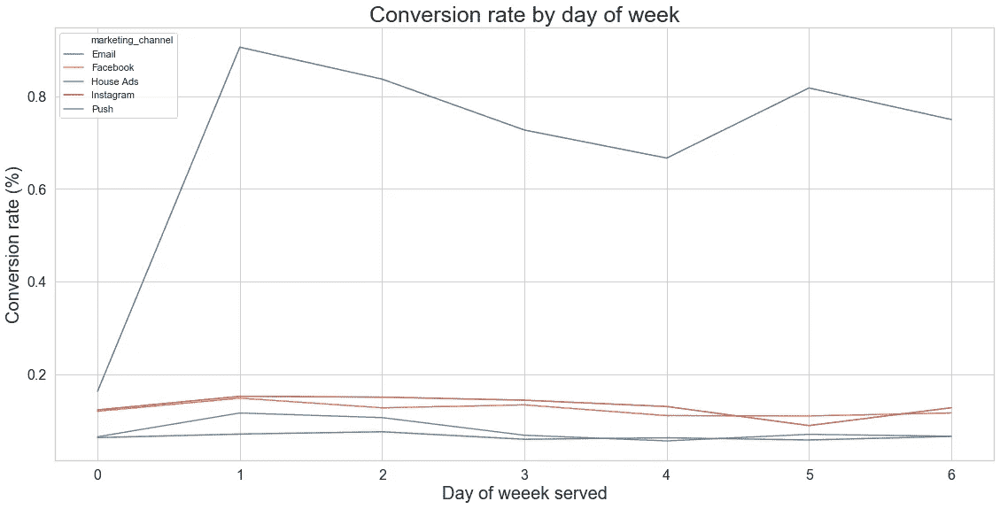

对该图的进一步观察显示，电子邮件转换率特别高，可能反映了跟踪误差，但房屋广告似乎在一周内保持稳定，周二略有峰值。这需要进一步调查。

# 按语言转换房屋广告

我们已经排除了一周中某一天用户看到我们的营销资产时的自然波动，因为它们会导致房屋广告转化率下降，随着时间的推移，按语言进行转化将是合理的。也许这种新的营销活动并不适用于不同的文化。理想情况下，营销团队在发起活动之前会考虑文化差异，但有时会出现错误，而确定原因是数据科学家的工作。通常，数据科学家是确定营销活动出了什么问题的第一道防线。他们的工作是创造性地思考，找出原因。

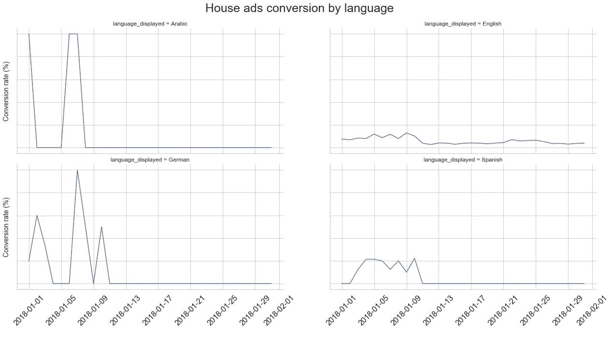

这些数字令人震惊的是，英语转换率在 11 日左右下降，而且似乎两周内没有其他语言的广告。这可能是进一步调查的一个候选。

# 确认房屋广告错误

这个过程的下一步是用户是否看到正确语言的广告。一种可能的方法是查看有多少百分比的用户没有收到正确语言的广告。

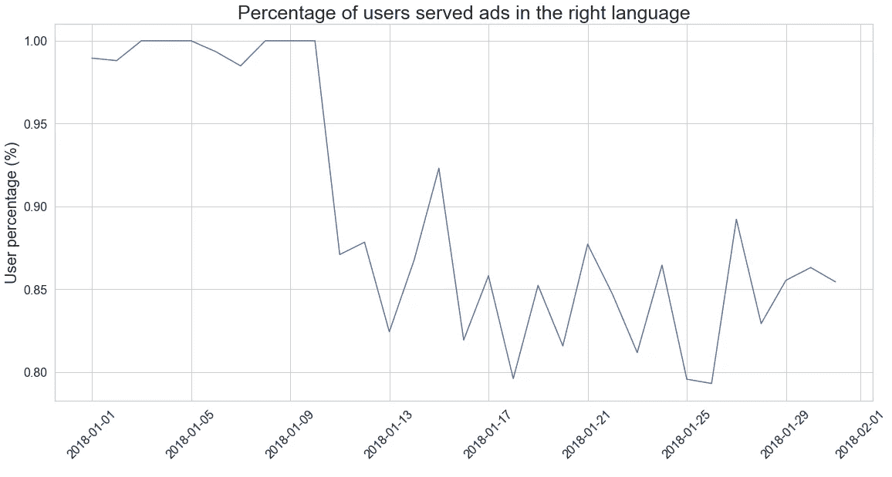

从图表中可以看出，到目前为止，房屋广告表现不佳的最大原因是因为所有的广告都是英文的，而不是每个用户的首选语言。

# 确定丢失用户的数量

我们发现房屋广告的转化率有所下降。问题似乎是用户看到的广告语言不是他们喜欢的语言。为了了解总体影响，我们可以将预期的转换数据集限制在错误发生的那几天。接下来，分别合计该期间的预期和实际订户数。最后，我们对我们预期的订阅者数量和我们收到的订阅者数量进行了比较，这为我们提供了由于语言错误而损失的订阅者数量的估计值。我们得出结论，32 名订户已经流失。这可能看起来不多，但对于小公司来说，这可能是至关重要的，尤其是在扩展到新市场时。

# 结论

营销活动测量的相关性得到了当前研究结果的支持，因为客户关系管理的一个重要方面是通过定制的促销活动瞄准客户群。虽然大多数贡献集中于选择有希望的目标客户，但只有少数作者提出了针对所选目标群体的具体差别优惠的问题。总之，我们关注这两个问题，并展示了如何衡量营销活动的有效性。衡量竞选成功的方法有很多。也就是说，有些指标你可能会发现反复使用。因此，如果不透过这些不同的镜头，我们就无法提供必要的背景来解释一些关键指标所显示的内容。每个活动分析会因其性质而异，并需要特定的方法，但这些基本原则如果应用，至少会提供一些严格性，以最小化结果中的偏差。

👋感谢阅读。如果你喜欢我的作品，别忘了喜欢，在 [medium](https://medium.com/@rashidkazmi) 上关注我。这将激励我为媒体社区提供更多的内容！😊

# 参考

[1] Reutterer 等人(2009)提出了一种针对和定制直接营销活动的动态细分方法。互动营销杂志第 20 卷，第 3-4 期，第 43-57 期

[2] Ascarza 等人(2018):追求增强的客户保持管理:回顾、关键问题和未来方向。斯普林格科学+商业媒体有限责任公司 2017。

[3] Cruz，d .和 Fill，C. (2008):评估病毒式营销:分离关键标准,《营销情报与规划》,第 26 卷第 7 期，第 743-758 页。