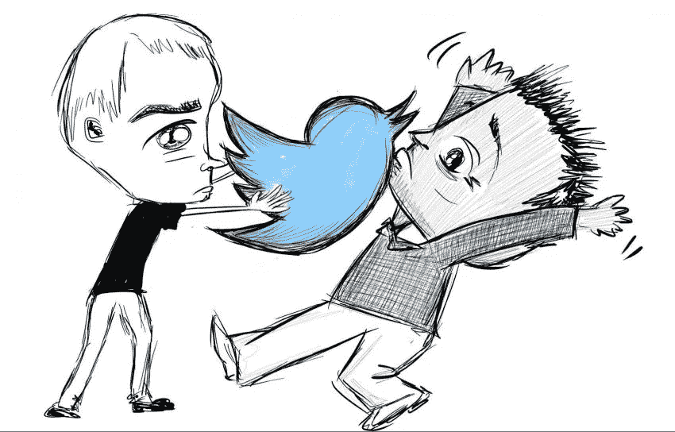
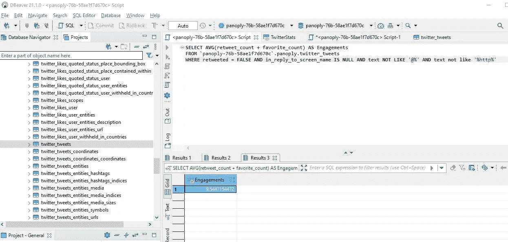
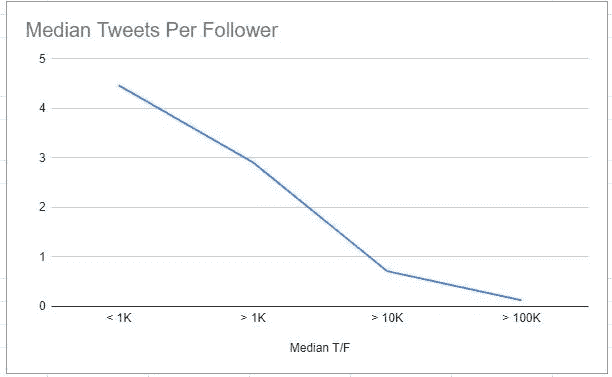
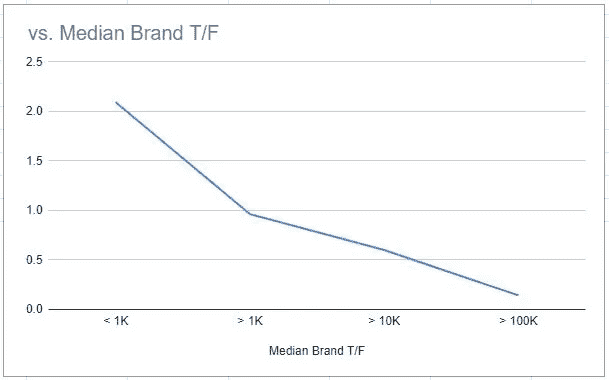
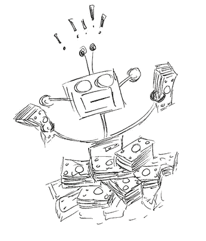
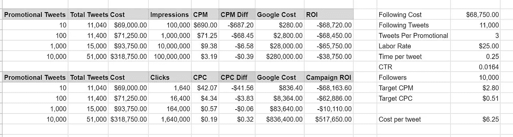
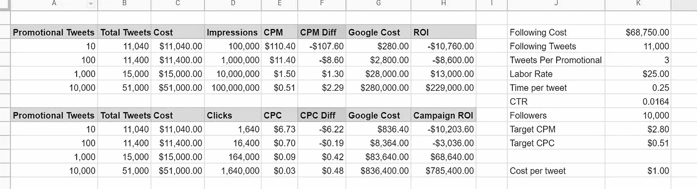

# 在 Twitter 上向软件工程师营销是一个昂贵的好主意

> 原文：<https://towardsdatascience.com/marketing-to-software-engineers-on-twitter-is-an-expensive-good-idea-733a1b13f367?source=collection_archive---------47----------------------->

## 软件工程师在推特上闲逛。

我知道这是一件趣闻，也是凭感觉，因为我职业生涯的大部分时间都是作为一名软件工程师度过的，而且十多年来我一直有一个 Twitter 账户。但你也可以更客观地证实这一点。

例如，在谷歌上搜索[“Twitter 上要关注的程序员”](https://www.google.com/search?q=programmers+to+follow+on+twitter&rlz=1C1CHBF_enUS688US688&sxsrf=ALeKk03TIhVeXzB8Xa-qgYS8_AscNu4TAA%3A1624541667911&ei=44nUYIKAN8ba-gSYp7uwDg&oq=programmers+to+follow+on+twitter&gs_lcp=Cgdnd3Mtd2l6EAMyAggAOgcIABBHELADOgYIABAHEB46CAgAEAgQBxAeOggIABAHEAUQHkoECEEYAFCFO1jQQ2CMRWgCcAJ4AIABe4gB4wmSAQM5LjSYAQCgAQGqAQdnd3Mtd2l6yAEIwAEB&sclient=gws-wiz&ved=0ahUKEwjC_aaosbDxAhVGrZ4KHZjTDuYQ4dUDCA4&uact=5)，确实会得到实际的搜索量(每个地方的[关键词](https://keywordseverywhere.com/))。当我输入其他职业，如律师、医生和教师，没有搜索量登记。

虽然我最初在 Twitter 上的存在主要是为了进行专业互动和推广业余爱好博客，但大约七年前，我开始自己创业，成为一名顾问。因此，社交媒体开始成为我提供的服务和任何产品的销售渠道。Twitter 也不例外。

我尽职尽责地在 Twitter 和 LinkedIn 上推广内容和产品，因为这就是“营销你的企业 101”最佳实践等等。我想很多创业者和独立人士都像我一样，死记硬背。

作者图片

# 提问:品牌应该在 Twitter 上向开发者营销吗？

但是出于我不会在这里让你厌烦的原因，大约四年前我结束了从写软件到开始开发营销业务的转变。对于这项业务，我们采取了一种金钱球/魔鬼经济学式的内容宣传方式。我们不承担工作，除非我们能模型化，至少在抽象上，我们创造的内容的投资回报率。

这让我最近问了一个多年前就应该问的问题:Twitter 是一个值得接触工程师的营销渠道吗？

常识和轶事经验说是的。但在我研究成功的影响者对该平台的使用时，挥之不去的疑虑一直在蔓延。

我并不怀疑他们能接触到人们并建立关系。这是毫无疑问的。我认为更多的是，他们对 Twitter 游戏的热爱导致他们看不到他们在平台上投入了多少劳动(和成本)来获得这些结果。

作者图片

这对这个领域的有影响力的人来说很好。但它可以转化为对品牌有吸引力的麻烦。这些天，我在帮助品牌营销部门避免在吸引人的麻烦上浪费金钱。

所以让我们从数据驱动的角度来看 Twitter，使用我现有的数据:我的推文和我的关注者。所有这些内容和人都严重扭曲了程序员。

# 搭建舞台:注意事项和方法

在深入研究之前，我想澄清几件事。

# 这里涉及的严格程度

首先，请理解，我不是要在这里发表一篇博士论文进行答辩。在我作为一名受薪软件工程师和开始开发营销业务的几年中，我是作为软件世界的专业管理顾问谋生的。我用来帮助客户的东西之一是从优秀的书 [*如何测量任何东西*](https://www.amazon.com/How-Measure-Anything-Intangibles-Business-ebook/dp/B00INUYS2U) 中提取的。

> *任何事情都是可以衡量的。如果一个事物可以用任何方式观察到，那么它就适合某种测量方法。不管测量结果有多“模糊”，如果它告诉你的比你以前知道的更多，它仍然是一个测量结果。而那些最有可能被视为不可测量的事情，实际上总是可以通过相对简单的测量方法来解决。*

所以收集这些数据并做出推论的目的并不是要有一个绝对无懈可击的案例。更确切地说，是把我们对这个渠道的概念从“我不知道，其他人也这么做，所以让我们试试吧”转变为有假设来进行实验。

作者图片

# 只关注 Twitter 追随者的建立和营销

大多数有影响力的开发者使用 Twitter 的方式相当简单。他们建立一个观众群，然后对观众说话。一路上的任何病毒式传播或标签成功都是额外收获。

我今天要看的是假设开发者营销品牌有兴趣以这种方式再造开发者影响者成功的数据。换句话说，我要看看成本和回报，就像一个开发工具品牌建立一个追随者，然后与这些追随者分享内容。

这意味着我不看赞助商的推文，不玩算法游戏，不购买关注者，也不瞄准标签。这些都是潜在可行的方法，可能会改变 Twitter 作为一个平台的整体投资回报率。但今天，我只想谈谈 Twitter 的“传统”活动，即建立追随者并与这些追随者分享内容。

# 方法论:如何收集 Twitter 数据

我将提供的最后一点内务管理是如何从 Twitter 中提取数据以及我提取了哪些数据的方法。

要从 Twitter 中获取数据，实际上可以使用[原生 Twitter 功能来下载数据](https://twitter.com/settings/download_your_data)。他们会在 24 小时内给你寄去压缩的档案。如果你不喜欢等待或者想要更精细的控制， [Twitter 也提供了一个 API](https://developer.twitter.com/en/docs) 。

然而，对我来说，这两件事我都没做。Hit Subscribe 实际上与 [Panoply](https://panoply.io/) 有关系，后者可以立即将各种来源的数据转换成关系格式。

这让我免去了争论 API 和导出的头痛。相反，它只是把一切都放入一个关系结构中。所以我直奔主题，就像这样:

作者图片

这让我可以访问我的推特账户上的所有数据。从那里，我使用了关于我的追随者(主要是程序员)和 tweets(历史上，主要是面向编程的)的信息。

这是我将用于分析的数据。不言而喻，尽管具有代表性，但这是一个*小*样本量。为了将我们最初的实验框架构建成一个稳健的模型，我们需要在前进的过程中获取更多的数据。

但我认为我这里有有趣的对话。

# 看看一些原始数据和发现

说完这些，让我们开始研究一些数据。当我们寻求为内容渠道建立 ROI 模型时，我们需要了解两个主要变量:

1.  总值
2.  使用该成本产生的成果(收入)

在数字营销领域，由于变量的蝴蝶效应般的爆炸，将推文等活动与顶线收入联系起来变得很棘手。所以我们可以走捷径，用几种简单的方法进行推理:

1.  考虑一个指标，比如一个网站的浏览量或点击数，并假设一个占位符估值，比如网站访问者或浏览量的美元价值。
2.  将每次印象或点击的成本与某人必须支付的广告费用进行比较。因此，如果你能以比普通广告活动更低的成本获得印象和点击，我们可以认为这是一个“好”的渠道。

因为第一种选择因企业而异，所以我将坚持第二种选择。让我们回顾一下与广告平台相比，展示的成本。

因此，我们通过 Twitter 进行的营销活动有两种成本，如果你愿意的话:

1.  建立追随者的成本
2.  创建内容营销成本如下

现在让我们用我的数据开始对此进行推理。

# 用每个关注者的 Tweets 来近似劳动力

我所能想到的衡量建立一个追随者的成本的最直接的方法是假设在平台上创建内容是产生追随者的原因。换句话说，推文与关注者的比例是多少？

看着我的 3892 名粉丝(在我写这篇文章的时候),我为每个人添加了一个专栏，计算他们的推文与粉丝的比率。然后我取那列的平均值。该值为 15.4。换句话说，在我的粉丝中，每个粉丝的平均推文数量是 15.4 条。

现在这个推理显然是不完善的。很明显，除了发推特，人们还有其他吸引粉丝的方式。众所周知，[詹姆斯·科米更换了他的推特账号](https://techcrunch.com/2017/11/07/james-comey-changes-his-twitter-handle-to-comey/)，得到了验证，并立刻吸引了成千上万的追随者。

作者图片

但是我们既没有足够的时间去了解平台外的追随者来源，也没有足够的数据来提供信息。因此，我将通过使用中位数而不是平均值来减少干扰。这让我们消除了 Comeys 和那些在 Twitter 上表现糟糕的人的离群值，他们用许多许多的 tweets 尖叫着进入他们的零粉丝的空白。

事实上，使用中间值会大大拉平数据。在我的关注者中，推文与关注者的比例中位数是更合理的，每个关注者 4.1 条推文。

# 追随者吸引力是一个正反馈循环

当我在这里看我的数据时，我开始想知道随着 Twitter 账户规模的扩大，它们在吸引追随者方面是否变得更有效率。所以我把 Twitter 用户分成了四个不互相排斥的群体:

1.  粉丝少于 1000 人的人。
2.  粉丝超过 1000 人的。
3.  粉丝超过一万的。
4.  最后是那些粉丝超过 10 万的。

取这些较小部分的中间值揭示了一个明显的趋势。

作者图片

这似乎证实了我暗中的怀疑。通往 10 万 Twitter 粉丝的道路并不是简单地发布 40 万条推文。随着追随者的增加，吸引更多的追随者——因为需要更多的研究来确定——变得更加容易。想到的一些可能的解释包括平台外的名气和大量追随者更容易吸引追随者的社会证明。

然而，对于我们的实验框架的轮廓来说，这已经足够了。我们可以看到平台上存在一个正反馈回路。

# 品牌比个人更有效率

接下来，我想特别区分品牌的数据。说实话，我的假设是，品牌需要更加努力地工作，发布更多推文来吸引追随者。毕竟，品牌经常自我宣传，在 Twitter 上也相当无聊。

但是，有趣的是，事实并非如此。

我浏览并手动识别了我的追随者中的所有品牌。然后我对它们进行了同样的分析，发现了同样的趋势。唯一的区别是品牌的“效率”似乎是两倍多。

总体而言，品牌的推文与关注者的比率约为 1.3，这是关注者的趋势。

作者图片

现在，我们开始进入这样一个阶段，我们可以添加一些成本预测，以建立一个品牌追随者。我们可以看到平台上有多少内容创作对应了什么样的关注规模。所以我们需要估算出创建这些内容的成本。

但在此之前，我还想收集最后一份原始数据。这将告诉我们如何以及何时开始“促销”

# 没有链接的推文比有链接的推文更吸引人

多年来，我在 Twitter 和社交媒体上的一个主要使用案例是推广我在其他渠道创建的内容。这通常采用“适当”帖子的形式，其中我不只是转储一个链接并说，“在这里。”相反，我花时间写了一个关于内容的导语，包括一些标签，并链接到内容。

我想看看这些内容与简单地为平台创建没有链接的内容相比如何。

寻找其他内容或优惠会影响参与度吗？

作者图片

为了在我们的主题餐巾纸背面近似描述这一点，我将赞和转发作为参与度的标志。我很想包括甚至权衡对推文的回复，但是我没有这些数据。

在这种情况下，我的计算很简单。我查看了整体参与度，以每条推文的转发数和收藏数来衡量。然后我把我的推文按照是否包含链接进行了分类。

*   我的推特平均获得 4.1 次点击。
*   我平均每条带有链接的推文有 3.7 次点击。
*   我的没有链接的推特平均获得了 9.54 次点击。

在这种情况下，我想坚持使用平均值，而不是使用中间值。我对剔除异常值不感兴趣，因为异常值代表大规模参与，这毕竟是我们所追求的。

# 建立活动成本模型

有了这些数据，我们现在有足够的数据来开始成本和 ROI 模型。我们可以看到如何建立一个追随者，这是主要的障碍。在此基础上，我们将讨论创建推广内容的成本和功效。

# 制作 Twitter 内容的成本

首先，让我们对发布一条推文的成本做一个大概的假设。我将称之为 15 分钟来生成一条平均推文，并估计这样做的劳动力成本为每小时 25 美元。

我的理由是，当然，你会在推特上回复一些诸如“谢谢！”在几秒钟内，你就可以把更多的时间投入到宣传和其他战略性的内容中。所以平均到 15 分钟。

至于成本，当然，任何人都可以发推特，你可能会让人们以最低工资来做这件事。但想必你需要一些营销知识。你有时也很可能会外包这项工作——而且成本比全职员工高。

但是在构建我们的模型时，为了便于讨论，我们将这些数字作为变量。这样，如果有人说，“Pff，25 美元是荒谬的，我们支付 10 美元，”我们可以简单地插入 10 美元，看看对 ROI 的预期影响。

作者图片

# 建立追随者的成本

考虑到这一点，建立一个追随者的成本是多少？

好吧，根据上面的品牌数据，你会发 2000 次微博来获得 1000 名粉丝，然后再发 9000 次微博来获得 10000 名粉丝。总共有 11000 条推文。

使用上面的成本数字，11，000 条推文意味着 2，750 个工时，成本为 68，750 美元。而且那个*感觉*就像它是方形的。如果我们假设这是入门级社交媒体专家两年的工资，这意味着我们预计入门级营销人员能够在几年内建立一个品牌的 10，000 名追随者。

同样值得一提的是，我正在考虑将建立追随者与推广内容和将人们与平台联系起来分离开来。换句话说，除了自我推销的推文，你不会建立一个追随者。你必须卷起袖子，创建特定于平台的内容来建立这些追随者(或者成为联邦调查局局长)。

# 为营销活动建立投资回报模型

为了开始建立 ROI 模型，我们如何将所有这些联系在一起？

好吧，这个难题的最后一个缺失部分是实际点击率(CTR)，这让我们可以用每次点击成本(CPC)来讨论。你可以通过谷歌搜索找到不同的数字，但是让我们用 HubSpot 的[数字，1.64%。(解释点击率作为关注者数量的函数下降的“原因”会很有趣，但鉴于我不理解这背后的原因，我将只使用他们的广义平均值。)](https://blog.hubspot.com/marketing/twitter-increase-clickthrough-rate)

假设我们想要建立一个 10，000 人的追随者，然后向该追随者推广内容。这是我们的成本和回报结构。

*   建造下面这座建筑需要 68750 美元。
*   一旦你开始推广内容，你需要为每次 10K 展示和 164 次点击支付 6 美元。这是每千分之 0.60 美元的成本(CPM)，以及 0.04 美元的 CPC。

因此，一旦你在这个平台上投入了将近 7 万美元，你就会获得极其丰厚的回报。[这篇文章](https://smallbusiness.chron.com/typical-cpm-74763.html)将谷歌广告的典型 CPM 定为 2.80 美元，你的 Twitter 追随者可能比谷歌搜索者更容易细分。[这篇文章](https://www.wordstream.com/blog/ws/2016/02/29/google-adwords-industry-benchmarks)将搜索广告的点击费定为 3.80 美元，展示广告为 0.51 美元。

但显然，在考虑营销时，我们需要考虑对平台的投资。

让我们假设，在你建立了你的追随者之后，你创建了 10 条、100 条、1000 条和 10000 条推广推文。更进一步，让我们假设你应该为每条推广推文创建大约三条非推广推文，以避免失去追随者。这是 CPM 和 CPC 的情况。

作者图片

# 如何解释价值观和模式

在这篇文章中，我一直在谈论通过减少不确定性的总体视角来创建活动模型。到目前为止，这是相当抽象的，但是你可以通过上面的电子表格截图看到我们如何更具体地处理这个问题。

任何需要更多研究或数据的东西都会成为模型中的一个变量。然后，我们可以在进行过程中给变量添加置信因子(或者最终将它们视为常数)。

例如，如果你想说你可以用更少的推文建立 10K 追随者，我们可以相应地调整“关注推文”单元格，观察对投资回报率的影响。类似于“目标 CPC”和“目标 CPM ”,我们从范围的低端获取数据，从而产生悲观的投资回报预测。如果谷歌广告的成本实际上比你的利基市场高得多，那么谷歌广告的相对投资回报率就会变得更高。

相反，这个模型目前假设你的 100%的追随者看到每条推文，这个百分比肯定太高了。人们对 Twitter 的零星消费和算法本身可能会减少印象，这是一个相当重要的因素，需要更多的研究才能正确建模。

这整个模型目前只着眼于相对于可比广告支出的投资回报率。当我们充实这一点时，我们也将看看 Twitter 本身作为一个主要资格平台和品牌意识的价值。当然，我们将着眼于比“埃里克的追随者”更大、更有代表性的数据集

但即使是这个早期的模型也大大减少了模糊性，呈现出一幅相当清晰的画面。

# 全进或全出:不要走过场

在 Hit Subscribe，我们帮助客户开展的大多数活动都是有机流量活动。原因是，从投资回报率的角度来看，你网站的有机流量是最蓝筹的内容营销手段。但这也是一场持久战，在你开始获得(通常是惊人的)回报之前，需要大量的时间和投资。

事实证明，开发者营销 Twitter 实际上非常相似。

即使我将模型中的成本降低到每条推特 1 美元，如果没有大量的推广投资，我们也看不到正回报。

作者图片

我认为这太乐观了，因为如果你在推文创作上省钱，只是把任何旧东西放进 Hootsuite，我认为你需要让 10K 粉丝看到的推文数量将会飙升到 11K 以上。这里的午餐似乎不免费，甚至不便宜。

当然，我们将继续构建和完善这个模型。但是基于我在这里得到的信息，我想说开发者营销品牌有两个清晰的、不相关的 Twitter 策略选择:

1.  为最低成本进行优化，敷衍了事地出现在 Twitter 上，这样你就不会完全从频道中消失。
2.  将 Twitter 视为一个合法的潜在客户生成渠道，但要明白，在产生回报之前，对该平台的投资必须是实质性的。

我认为真正的、定性的教训是，建立这样一个渠道不仅需要时间和大量投资，还需要人才。渠道中有影响力的工程师，通常通过热爱工作，倾注大量的精力，这样做，他们变得很擅长。

(我不是其中之一——就我个人而言，我很不擅长 Twitter。)

因此，如果你想重现他们的成功，就需要时间、金钱、人才，以及有人愿意并准备好将它视为一流的内容创作平台，而不仅仅是公告和推广的仓库。

## 附录:工具列表

如果您对我在这个建模练习中使用的各种工具感兴趣，下面是它们:

*   浏览器插件中，[关键词随处可见](https://keywordseverywhere.com/)。
*   [下载你的推特数据](https://twitter.com/i/flow/verify_account_ownership)。
*   [摄取数据的全景图](https://panoply.io/)。
*   [DBeaver](https://dbeaver.io/) ，我截图的 SQL 工作台。
*   谷歌计算表和图表。
*   如果你对我在模型中截屏的计算感兴趣，请联系我。我很乐意分享它的副本/模板版本，但我不会费心将其公之于众，除非人们特别要求。