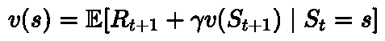

# 马尔可夫决策过程和贝尔曼方程

> 原文：<https://towardsdatascience.com/markov-decision-processes-and-bellman-equations-45234cce9d25?source=collection_archive---------7----------------------->

## [婴儿机器人强化学习指南](https://towardsdatascience.com/tagged/baby-robot-guide)

## 强化学习简介:第 2 部分


所有图片由作者提供。

# 介绍

在关于强化学习的 [***系列的第一部分***](/state-values-and-policy-evaluation-ceefdd8c2369) 中，我们看到了如何评估代理的行为，以衡量它在给定问题上的表现。

问题环境被分成一组状态，每个状态都被赋予一个值，这个值反映了在那个状态下有多好。通过选择使机器人宝宝朝着增加状态值的方向移动的动作，我们能够帮助他找到一个简单网格级别的出口。

此外，我们设法用有限的理论做到了这一点。我们没有预先定义完整的强化学习问题，而是在需要时推导出我们的方程，从简单的方程开始，并建立在我们以前使用过的方程的基础上。事实证明，我们采取的简单步骤已经让我们接近于定义完整的强化学习问题。在这一部分，我们将采取实现目标所需的最后几步。

## 第 1 部分可以在这里找到…

</state-values-and-policy-evaluation-ceefdd8c2369>  

## 密码

本文相关的 [***Jupyter 笔记本***](http://Reinforcement_Learning/Part 2 - Markov Decision Processes and Bellman Equations.ipynb) 可以在 github 上找到。这包含设置和运行下述级别和算法所需的所有代码。


# 马尔可夫过程(马尔可夫链)

在最后一部分，机器人宝宝设法找到了一个简单的网格水平的出路。不幸的是，它仍然没有回到妈妈身边，相反，它发现自己进入了一个新的层次，如下所示:


虽然这是一个相当小的水平，婴儿机器人可以看到出口，屋顶一直在漏水，所以地板上满是水坑。不幸的是，机器人宝宝并不是真的被设计成在雨天工作。水坑会减慢他的速度，更糟糕的是，会导致他打滑。结果是，如果他从一个有水坑的正方形开始，就不能保证他会朝着想要的方向移动。

然而，我们确实知道关于该系统的所有信息，包括水坑导致打滑的可能性:

*   小水坑有 20%的机会打滑，所以 80%的时间会选择方向。
*   大水坑有 60%的机会打滑，所以选择的方向只有 40%的机会被采用。

当打滑发生时，它将导致机器人宝宝向与选择的方向不同的方向移动。发生这种情况的概率将在其他可能的方向上平均分配。此外，我们最初只是观察环境。机器人宝宝将试图向出口走去，但受到系统动力学的支配。他无法控制他选择的路径，他的下一个状态将由他当前状态的转移概率决定。在这个阶段，没有行动或奖励。

所有这些都可以总结在下面的状态转换图中。


漏栅级的状态转移概率。

最初，机器人宝宝还没有决定向哪个方向移动。因此，从开始状态，他要么向东移动到 S1，要么向南移动到 S3，等概率为 0.5。

S1 有一个大水坑，所以，虽然机器人宝宝想搬到 S2，但这种情况发生的可能性只有 0.4%。更有可能的结果是，他会打滑，而不是结束在 S4 州或回到起点。因为打滑的概率是 0.6，这在两个可能的方向上平均分配，他到达 S4 的概率是 0.3，他回到起点的概率也是 0.3。

S4 也有一个大水坑，所以将与 S1 表现相同。来自 S4 的小机器人想要移动到出口，但是只有 0.4 的几率他会朝这个方向移动。相反，他可能会退缩，要么搬到 S1，要么搬到 S3，两者的概率都是 0.3。

类似地，如果他开始移动到 S3，其中包含一个小水坑，他的下一次移动带他到他想去的 S4 的机会是 0.8，打滑回到起点的机会是 0.2。S2 也有一个小水坑，所以从这里有 0.8%的机会他会移动到出口，0.2%的机会他会滑回 S1。

这些状态转移概率也可以用状态转移矩阵来表示，如下所示。这个矩阵告诉我们，从任何一个状态开始，到任何一个状态结束的可能性有多大。


泄漏电网等级的状态转移矩阵

请注意，离开任何状态的概率总和总是 1，如状态转移图上所示，以及状态转移矩阵中的每一行。此外，当机器人宝宝到达出口时，这是他不能再移动的最终状态。因此，在出口处，停留在出口处的转移概率为 1.0。

从关卡的起点开始，我们可以沿着一系列路径通过关卡，直到到达出口。这些路径中的每一条都代表一个*事件*，并且每个事件都将遵循由系统动力学定义的随机轨迹。由于状态转换的随机性，路径可以是任意长度。

因此，以下每个情节都是通过该级别的有效路径:

*   *出发，S1，S4，出口*
*   *出发，S3，S4，S1，S2，出境*
*   *出发，S1，S2，S1，S4，出境*

对于上面给出的层次，及其伴随的状态转移图和矩阵，我们已经描述了一个 ***马尔可夫过程*** (也称为 ***马尔可夫链*** )。这是一个随机过程的模型，其中一系列事件发生，事件发生的概率仅取决于当前状态。

我们网格级别中的完整状态集构成了*状态空间*，它定义了系统中所有可能的状态。这些状态中的每一个都独立于先前的状态，因此满足 ***马尔可夫性质。*** 关于一个状态的所有信息都包含在那个状态中。因此，我们不需要知道过去发生了什么来预测未来会发生什么。

实际上，预先知道系统的转移概率是不太可能的。因此，为了估计从一个状态转移到另一个状态的可能性，可以观察多个事件，然后取平均值。这种随机抽取样本来计算估计值的方法被称为*蒙特卡罗抽样*，我们将在以后的文章中对此进行全面研究。

# 马尔可夫奖励过程

马尔可夫过程定义了一个状态空间和在这些状态之间移动的转移概率。它没有具体说明哪些州是好州，也没有说明从一个州搬到另一个州是否好。为此，我们需要在系统中添加奖励，并从马尔可夫过程转移到马尔可夫奖励过程。

在这个系列的第一部分中，我们定义了机器人宝宝每次从一个方格移动到下一个方格时，他将获得-1 的奖励。这鼓励他选择最短的路径通过关卡，因为他花的时间越长，他的奖励就越低。请记住，我们试图最大化总累积奖励，因此有一个大的负奖励是不好的。

在这个漏水的关卡中，我们已经指定水坑会导致机器人宝宝减速，大水坑比小水坑需要更长的时间。考虑到这一点，我们可以修改我们的奖励如下:

*   小水坑的移动时间是标准方格的两倍。因此，考虑到这一点，移动到一个有小水坑的状态将给予-2 的奖励。
*   类似地，大水坑需要 4 倍的时间才能通过，所以进入一个有大水坑的州会得到-4 的奖励。

在这里，我们已经定义了当机器人宝宝进入水坑时，处于水坑中的惩罚发生，因此当进入水坑状态时，增加的负奖励将被给予。当退出包含水坑的状态时，归属奖励也是完全合理的，但是我们试图强调踏入大水坑是不好的！

我们已经将这些奖励添加到状态转换图中，如下所示。每次转换获得的奖励以红色显示，位于相关转换概率下方。


漏级的国家奖励程序

请注意，我们仍然只是在观察系统，还没有引入动作的概念。因此，机器人宝宝将以当前状态的转移概率从一个状态转移到下一个状态，只是现在他每移动一步都会得到奖励。

从开始状态，机器人宝宝可以向两个可能的方向移动，他可以移动到 S1 的大水坑中，并获得-4 的奖励。或者，他可以搬到州立 S3，那里有一个小水坑，所以他会得到较少的负奖励-2。因为机器人宝宝还没有能力选择自己走哪条路，所以搬到 S1 或 S3 的可能性是相等的，两者发生的概率都是 0.5。

虽然机器人宝宝还不能影响他通过关卡的路径，但是回报的增加确实让我们可以评估沿着一条特定的路径走有多好。由此，我们可以计算出，在给定转移概率的情况下，任何特定的状态有多好。

在第 1 部分中，我们介绍了 ***返回*** 的概念。这是从时间步长' *t* '开始的总累积奖励。例如，对于样本路径{ *起点，S1，S4，出口* }，返回将是(-4–4–1)=-9。请注意，虽然我们的系统中有一个“开始”状态，代表机器人宝宝进入网格级别的位置，但在计算回报时，没有必要从这个位置开始。例如，在时间步' *t* '我们可以说机器人宝宝处于状态 *S1* ，然后从这个位置开始计算回报，直到剧集结束。

此外，由于状态转换的随机性质意味着，理论上，序列可能是无限长的，我们在回报计算中添加了一个折扣因子。这可以防止回报值变得过大，并将注意力集中在近期获得的回报上。在每个递增的时间步长，奖励乘以折扣因子的递增幂，并且折扣因子被选择为 0 和 1 之间的值。因此，每一步获得的报酬的贡献随着时间而减少。

这为我们提供了贴现回报公式:


等式 1:贴现回报

其中:

*   *=回报(*从时间‘t’*开始，一集累积的奖励总额)*
*   ****rₜ₊₁****= t+1 时刻获得的奖励**
*   ****γ***(γ)=第*个贴现因子*，其中 0 ≤ *γ* ≤ 1。*

*如果我们选择任何一个状态作为起点(即我们在时间'*t【T21 ']的位置)，并沿着一条路径到该集的结尾，在每个时间步添加折扣奖励，我们会得到一个返回值，这将是对该状态值的一个非常粗略的估计，描述了在初始状态下有多好。如果返回值是一个很大的负值，那么这不是很好。**

*显然，考虑到系统中路径的随机性，单个事件的返回值并不是对一个州价值的最准确估计。所以我们取期望值，实际上是无限期事件的平均值。这给了我们 ***状态值函数 v(s):****

**

*等式 2:状态值函数*

*因此，在时间' *t* '时，如果我们从状态' *s* '开始，并测量预期收益，我们将得到状态' *s* '的值，描述处于该状态有多好。*

*考虑到我们还没有在混合中引入动作，价值函数似乎没什么用处。我们可以计算在某个特定的状态下有多好，但是还没有任何方法可以利用这个知识让我们选择一条可以获得最大回报的道路。然而，通过对这个等式进行轻微的重新调整，我们可以使它变得更加强大。*

*再次查看等式 1，返回值从时间' *t* '开始。目前，这体现在所有未来的奖励上。虽然回报已经被贴现，因此未来的回报对最终回报的贡献较小，但如果你想完全准确地计算回报，理论上你需要考虑所有未来时间点获得的回报。这使得事情变得相当不切实际，因为对于每个状态，你都需要考虑将来可能获得的每个奖励。*

*但是可以改变等式 1，从用所有未来回报来表达，改为递归，用未来回报来表达:*

**

*等式 3:根据即时回报和下一次回报给出的时间 t 的回报。*

*现在回报是根据即时回报加上下一个时间点的贴现回报给出的。通过将其代入等式 2，我们还可以用即时回报和未来贴现回报来表示状态值:*

**

*等式 4:用即时回报和下次回报表示的状态价值函数。*

*但是 *Gₜ₊₁* 只是下一个时间步的返回，在这一点上，我们将处于下一个状态，通过再次使用等式 2，就是下一个状态的期望值。所以我们也可以用递归的方式来表达状态值，使它成为即时奖励和下一个状态值的函数:*

**

*方程式 5:贝尔曼方程式*

*这种状态值函数的重排，将其分解为眼前的奖励**和下一个状态的贴现值**【γv(sₜ₊₁】**被称为**贝尔曼方程**，其中可以说是强化学习的基本方程。利用这一点，可以简单地通过预测下一个状态来计算任何状态的值，而不是必须检查每个未来的状态。一旦知道了状态的值，就可以选择在这些状态之间移动的最佳动作，并且最终可以找到解决给定问题的最佳策略。*****

***现在，我们可以将此应用于马尔可夫奖励过程中的状态，以计算它们的值。为此，我们首先需要以稍微不同的形式表达贝尔曼方程，如下所示:***

******

***等式 6:用转移概率和回报概率表示的贝尔曼等式。***

***在等式 6 中，我们简单地从将状态值函数表示为期望值，改为对状态' *s* '中可能发生的每个转换求平均值。***

**关于这个等式，有几点值得注意:**

*   **所有下一个状态和奖励的总和只是一种方便的写法，我们对所有下一个状态和奖励求和。因此，实际上有两个和:一个用于下一个状态，它使用移动到状态*s’，*的转移概率，另一个用于奖励，给定当我们从状态‘s’开始时接收奖励的概率’*r*’。**
*   ***p(s′，r|s)* 是移动到状态*s′*并得到奖励' *r'* 的概率，假设我们从状态' *s* '开始。**
*   **这些概率乘以立即获得的奖励和下一个状态的贴现值。**

**在这种格式中，我们可以将这个等式应用于我们的漏栅能级的状态。因此，例如，在*开始*状态，它有 2 个可能的转换，每个转换以 0.5 的概率发生，并且当分别移动到状态 *S1* 和 *S3* 时，给出奖励-4 和-2。因此，其状态值由下式给出:**

****

**等式 7:起始状态的状态值。**

**由于这是一个非常简单的水平，我们知道它最终将结束于退出状态并终止，我们可以通过将贴现因子' *γ* '设置为 1 来进一步简化它。然而，我们仍然剩下用状态 1 和 3 的值表示的*开始*状态的值，我们还不知道。**

**在本系列的第一部分中，我们看到了如何使用*迭代策略评估*来计算状态值。从每个状态的值为零的初始假设开始，我们可以迭代地改进这个估计，直到我们收敛到真实的状态值。虽然我们当时没有明确说明，但我们已经在使用贝尔曼方程的部分形式来实现这一点。**

**将迭代策略评估应用于我们的马尔可夫奖励过程版本的泄漏水平，得到如下所示的状态值。这些值是在 32 次迭代后获得的，此时任何状态值的最大变化都收敛到小于 0.001(尽管下面显示的值只有 1 个小数位):**

****

**MRP 的状态值。**

**从收敛的状态值我们可以看到，从起始状态开始，移动到出口，平均来说，会发生-16.3 的奖励惩罚。类似地，如果我们已经到达状态 *S2* ，那么我们可以预计，平均来说，到达出口会招致-4 的惩罚。**

**因此，现在我们知道了所有的状态值，我们可以将 S1*和 S3*的值代入上面的等式 7，以检查我们是否得到了起始状态的正确值:****

**v(开始)= 0.5 *[-4-11.9]+0.5 *[-2-14.8]=-16.35**

*类似地， *S2* 的值由 *S1* 和出口的值给出:*

**v(S2)= 0.8 *[-1]+0.2 *[-4-11.9]=-0.8-3.18 =-3.98**

*下面显示了漏网格级别上策略评估的前 23 次迭代。可以看到值是如何收敛的(只显示了总共 32 次迭代中的前 23 次，因为在这一点之后，状态值的变化会以比我们显示的 1 个小数位更高的精度发生):*

**

*漏网格级 MRP 的迭代策略评估*

*从计算出的状态值中很容易看出，穿过网格的最佳路线将是*起点，S1，S2，出口*，从而招致最低的惩罚。然而，在 MRP 中，我们没有办法选择行动，因此也没有办法选择走哪条路。要做到这一点，我们需要添加行动，并转移到马尔可夫决策过程(MDP)。*

# *马尔可夫决策过程*

*贝尔曼方程允许我们通过简单地一步预测下一个状态来计算状态值。使用这些值，我们可以看到哪些状态是好的，哪些状态应该避免。然而，在马尔可夫奖励过程中，我们无法控制我们要转移到哪个状态。为此，我们需要引入行动，转而采用马尔可夫决策过程(MDP)。*

*行动允许做出决定。因此，可以选择要去的国家和要获得的奖励。虽然，在一个随机系统中，你可能不总是得到所选择的行动或奖励。转移概率和奖励函数现在都依赖于动作。动作本身由一个**策略选择。**这定义了在任何特定状态下应该选择哪个动作。*

*通过对贝尔曼方程做非常细微的调整，我们可以修改它以考虑政策:*

**

*方程式 8:政策的贝尔曼方程式 ***π****

*公式 8 与公式 5 中的标准 Bellman 公式相比有细微的变化，很容易忽略这种变化。不同的是，现在状态'*s '*和下一个状态*sₜ₊₁*的值都用策略*π表示，我们将在下一个时间步移动到这两个状态。*这意味着，如果我们在时间“ *t* ”处于状态“ *s* ”，我们将选择策略“ *π* 给出的动作，并且我们将在所有未来状态中继续根据该策略选择动作。*

*正如我们对 MRP 所做的那样，我们可以将这个等式转化为一个可用的形式，即通过采取特定行动' *a* '，以后续状态*s '**结束，并接收奖励' *r'* ，对所有这些量求和:**

****

**等式 9:策略下的状态值 ***π*****

**这与等式 6 相同，在等式 6 中，我们用 MRP 的转移和回报概率来表示贝尔曼等式，只是现在增加了行动。**

**因此，当遵循策略' *π* ***'*** 时，状态' *s* 的值等于:**

*   **在特定状态下可以采取的所有行动的总和。**
*   **每个动作都有发生的概率，这由策略决定。所以 *π(a|s)* 是假设我们处于状态' *s* '时，采取行动' *a* 的概率。对这些概率求和实际上是对该州所有行动的平均。**
*   **采取行动获得的回报和采取行动后的下一个状态也是随机的，所以我们通过将它们发生的概率乘以立即获得的回报和下一个状态的贴现值求和来取平均值。**

> **在本系列的第一部分中，我们只研究了确定性动作。当采取一项行动时，我们确切地知道下一个状态会是什么，以及采取行动会得到多少奖励。现在，在贝尔曼方程的完整形式中，一个动作的下一个状态和奖励由一个概率分布 p(s′，r|s，a)决定。这是移动到状态 s '并得到奖励 r '的概率，假设我们从状态 s '开始并采取行动 a。**
> 
> **下面显示了我们样本级别的 S4 州可能采取的行动:**

****

**国家 S4 行动，转移概率和奖励。**

> **S4 是一个包含大水坑的州，所以在这个州采取行动有很大的机会导致打滑发生。结果，在采取所选择的行动之后，以期望的状态结束的概率只有 0.4。有 0.6%的机会打滑，结果却陷入了一个不是最初目标的状态。这个概率在其他可能的状态中平均分配。**
> 
> **因此，举例来说，从 S4 的 3 个可能的行动，北，东，西，婴儿机器人显然会选择向东移动，并到达出口。然而，他只有 0.4 的机会真正达到这个目标状态，并因此获得标准 1 奖励。更有可能的结果是他会滑倒。在这种情况下，有 0.3 的机会在 S1 结束，给他一个大的负奖励-4，或者他会得到-2 的奖励，并在 S3 结束，同样有 0.3 的机会发生这种情况。**

# **q 值**

**如果你知道采取每一项行动的预期回报值，找到最佳行动就会变得容易得多。因此，由于单个行动值可以提供关于系统的大量知识，它们已经被分配了自己的值字母，并被称为 ***Q 值*** 。**

**(我们在看 [*多武装盗匪*](/multi-armed-bandits-part-1-b8d33ab80697) 的时候已经看过 *Q 值*。在这种情况下，它们被用来描述在单一状态土匪问题中可获得的行动的期望回报。)**

**在上面给出的等式 9 中，状态值函数由所有动作的总和给出，其中采取每个动作的概率乘以该动作的值。因此，接下来的状态和奖励的右边总和代表采取特定行动的价值。我们可以把它分离出来，给我们行动值函数，当采取行动' *a* 、状态' *s* 、政策' *π* '时:**

****

**等式 10:策略 ***的动作值函数π*****

**对于上图所示的状态 S4，机器人宝宝想要采取将他引向出口的动作。使用等式 10，我们可以计算采取该行动的行动值，看看这是否是一个好的行动。由于这是一个有限的 MDP，我们将使用折现因子γ = 1。此外，由于根据定义，退出是一个终止状态，因此它的状态值为零。我们还没有计算 S1 和 S3 的状态值函数，如果机器人宝宝打滑，其他可能的状态可能会结束，所以现在我们只是用' *V* '的格式来表示它们。**

**这给出了在 S4 州采取东部行动的下列行动值:**

*   ***q(S4，东)= 0.4 *(1)+0.3 *(4+V(S1))+0.3 *(2+V(S3))***

**相比之下，在这种状态下采取另外两种可能的行动将得到:**

*   ***q(S4，北方)= 0.4 *(4+V(S1))+0.3 *(2+V(S3))+0.3 *(1)***
*   ***q(S4，西部)= 0.4 *(2+V(S3))+0.3 *(4+V(S1))+0.3 *(1)***

**这让我们看到如何计算每个动作的值，尽管不知道所有状态的值，我们还不能算出最终的动作值。为此，我们可以使用我们在第 1 部分中看到的迭代策略评估方法。**

## **用贝尔曼期望方程进行政策评估**

**提醒一下，策略评估最初将所有状态的估计值设置为零，然后重复扫描所有状态以逐渐改进这些估计值，直到最终收敛于真实的状态值。**

**我们以前用这个来计算状态的值，其中动作是确定性的；当你采取一项行动时，你总是以期望的状态结束。现在事情变得更复杂了，因为行动现在是随机的；采取行动并不保证你会达到目标状态，因此，获得的回报也可能不同。因此，在这种情况下，我们需要使用完整的贝尔曼期望方程来实现策略评估，该方程将对一个状态中可能的操作以及选择操作可能导致的预期下一个状态和回报进行期望。**

**公式 9 中给出的贝尔曼期望公式以代码形式显示如下。这里很容易看出这两个和是如何被代码中的一个循环替换的。对于每个状态，第一个循环调用函数' *get_* π'，该函数返回所有可能的动作及其概率(即策略)。然后，第二个循环调用' *get_p* ，迭代当前动作所有可能的下一个状态，计算每个动作的 Q 值(这部分代码实现了等式 10)。**

**(*完整代码实现，查看* [*github 笔记本*](https://github.com/WhatIThinkAbout/BabyRobot/blob/master/Reinforcement_Learning/Part%202%20-%20Markov%20Decision%20Processes%20and%20Bellman%20Equations.ipynb) )**

**将上述函数与跨越状态的重复扫描相结合，允许我们计算所有状态的状态值。这与我们在第 1 部分中所做的略有不同，因为动作的结果不再是确定的。**

**例如，就像他在第一部分的第一个简单关卡中所做的那样，机器人宝宝通过扔硬币来决定选择走哪条路(除了现在在某些州他需要一个三面硬币！).换句话说，在任何状态下，选择行动的概率都是相等的。然而，由于关卡中的水坑，他最终到达的地方可能不是他希望到达的地方。下一个状态和他得到的奖励是由系统动力学决定的。**

**对此随机策略运行策略评估时获得的状态值如下所示。这些值最终在 63 次迭代后收敛。**

****

**漏网格级 MDP 上随机策略的迭代策略评估**

**可以看出，这些值比 MRP 获得的值差很多。当我们为 MRP 选择转移概率时，我们选择了指向退出方向的值。实际上，我们将动作硬编码到系统中。现在，在 MDP，我们随机选择动作，所以机器人宝宝将会花更多的时间探索关卡。**

**然而，尽管这些值比 MRP 中的值差，但是通过贪婪地按照这些值行动，机器人宝宝可以改进他的策略，并且从随机策略移动到从起点到终点寻找最佳路线的最优策略。**

# **贝尔曼最优方程**

**为了在最短的时间内浏览我们的网格级别，或者在任何强化学习问题中获得最大的回报，在每个状态中，我们都希望选择给出最大预期回报的动作。换句话说，因为策略是决定为每个状态选择什么动作的东西，所以我们想要找到最优策略*。***

***对于任何一个州，如果我们搜索所有可能的政策，我们可以找到产生最大回报的行动。这就是 ***最优动作值函数*** :***

****

**等式 11:通过在所有策略中采取具有最大行动值的行动，给出最佳行动值函数**

**然后，如果对于每个状态，我们知道哪一个是最优动作，我们可以简单地总是选择最优动作，并得到 ***最优状态值函数*** :**

****

**等式 12:最佳状态值函数**

**因此，一个状态的最优价值函数是通过选择给出最大回报的行动，然后在所有未来状态中总是选择最优行动来给出的。**

**与最佳动作值函数一样，当状态值在所有策略中最大时，会出现最佳状态值函数。当这对于所有状态都成立时，每个状态的值等于或大于它在任何其他策略下的值，我们就找到了 ***最优策略*** 。**

**通过将方程 10 中的' *q* 的值代入方程 12 中的最优状态值函数，我们得到 ***贝尔曼最优方程。*****

****

**方程 13:定义最优状态值函数的贝尔曼最优方程。**

**在下一部分中，我们将看到如何在策略和值迭代中使用贝尔曼期望和最优方程来找到最优策略。**

**现在，我们可以根据上面找到的随机策略的状态值贪婪地行动，以获得最优行动。由此我们可以计算出最优策略的状态值。最优策略的迭代策略评估如下所示。这实际上在 31 次迭代中收敛，并产生比随机策略给出的状态值好得多的状态值。**

****

**漏网格级 MDP 最优策略的迭代策略评估**

**使用这种最佳策略，机器人宝宝现在可以通过这个简单的泄漏关卡，尽管当他遇到水坑时可能仍然会打滑，但他会在最短的时间内到达出口。**

**下面显示了穿过该层的一个这样的路径。当机器人宝宝最终所处的实际状态与他期望的目标状态不匹配时，就会出现打滑。**

****

**婴儿机器人通过漏层遵循最优策略**

# **摘要**

**在这个系列的第一部分，我们帮助机器人宝宝逃离一个简单的网格关卡。我们这样做是通过评估状态值，然后根据这些值选择一条路径，让我们找到通过关卡的最短路线。尽管我们当时并不知道，我们使用的方程是贝尔曼方程，我们操作的系统可以用马尔可夫决策过程来描述。我们现在已经讨论了这两个问题。**

**一个基本的马尔可夫过程定义了一组状态，每个状态满足马尔可夫性质，其中不需要过去的知识。转移概率定义了从一个状态转移到下一个状态的概率，在强化学习问题中，这些概率由当前策略给出。**

**当奖励被加入到马尔可夫过程中时，毫不奇怪，我们得到了一个马尔可夫奖励过程。贝尔曼方程让我们将转移概率与这些奖励结合起来，计算每种状态的价值，以此来衡量每种状态有多好。**

**虽然在马尔可夫奖励过程中，我们可以计算每个状态的值，但仍然不可能决定如何通过状态移动来最大化奖励。为了实现这一点，需要扩展它们以允许采取行动，这正是当我们转向马尔可夫决策过程时所发生的。当添加动作时，马尔可夫决策过程可以用来完全描述强化学习问题的环境，以及代理在该环境中如何行动。**

# **下一步是什么**

**我们现在已经涵盖了描述强化学习问题所需的所有基础理论。此外，我们已经看到了如何使用策略评估来计算状态值，对于简单的问题，我们能够从中找到最佳策略。**

**在下一部分中，我们将扩展这一点，在策略和值迭代算法中使用我们刚刚看到的贝尔曼方程。这些将允许我们在更高级的设置中发现最佳策略。**

****

```
****< Part 1                                                    Part 3 >** [**State Values and Policy Evaluation**](/state-values-and-policy-evaluation-ceefdd8c2369)[**Policy and Value Iteration**](/policy-and-value-iteration-78501afb41d2)**
```