# 使用 YOLOv5 进行掩模检测

> 原文：<https://towardsdatascience.com/mask-detection-using-yolov5-ae40979227a6?source=collection_archive---------2----------------------->


图片来自[维基百科](https://en.wikipedia.org/wiki/Object_detection)

## 解释关键概念，然后使用 YOLOv5 实现简单的屏蔽检测

## 介绍

我最近在 Coursera 上完成了吴恩达教授的 DeepLearningAI 的卷积神经网络课程，课程的一部分深入到了计算机视觉领域。我对计算机视觉的能力以及它如何融入我们的日常生活非常着迷，这促使我更深入地研究计算机视觉，并启动项目来加强我的学习。

## **如果您只想查看 YOLOv5 模型的项目实施情况，请向下滚动**

# 物体检测的工作原理

在实施一个项目之前，最好了解一些关于对象检测的基本概念以及它是如何协同工作的。让我们从定义对象检测开始:

## **{分类+定位} →检测**

图像分类是将一种算法应用于图像来预测一个对象的类别，例如汽车。物体定位不仅预测物体的类别，而且通过在物体周围画一个包围盒来计算出物体的位置。目标检测包括分类和定位，并且检测不止一个目标&甚至不止一个类别。

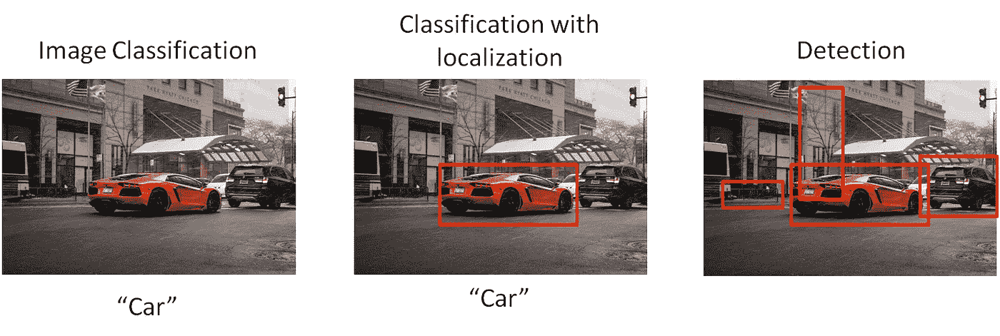

3 个术语之间的视觉比较。汽车图片由[马特·安东尼奥利·Unsplash.com](https://unsplash.com/photos/T_ZdgxzPS5k)

## **包围盒**

一个标准的分类任务将涉及一幅图像通过一个多层的 Convnet，其中的矢量特征被输入到一个 softmax 单元，例如，输出预测的类别(算法试图检测的对象类别，即汽车、树木、行人)。诸如 YOLO 的对象检测模型通过将图像分割成网格单元来工作，其中如果边界框的中心位于单元中，则每个网格单元负责预测边界框。然后，它将输出预测的类，即边界框的坐标，如下所示:

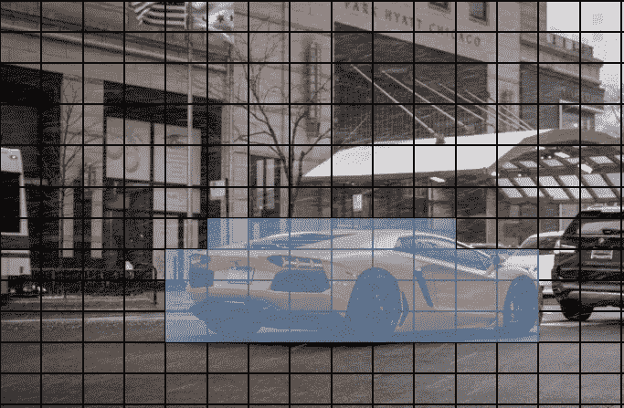

标有蓝色的单元格预测边界框的中心位于单元格中。作者图片

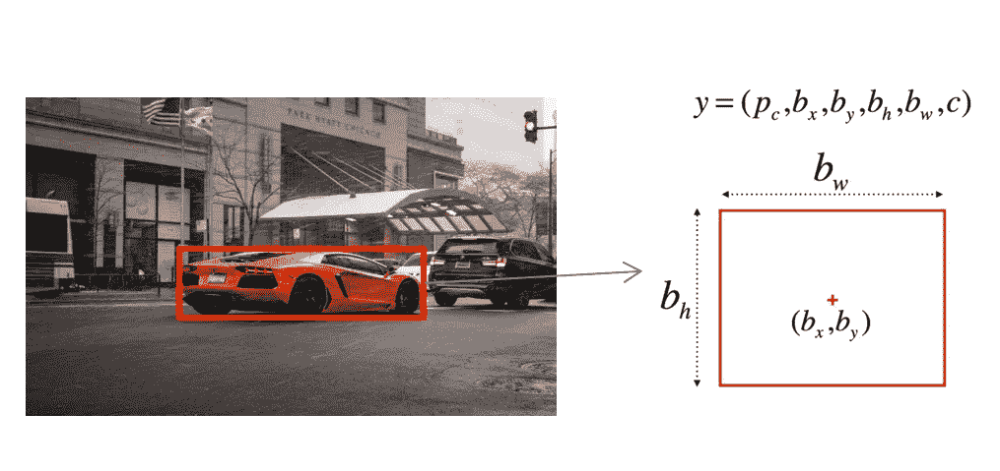

显示与边界框关联的变量的图像。作者图片

要了解更多关于卷积神经网络的信息，请查阅由 Mayank Mishra 解释的[卷积神经网络。他很好地解释了 Convnet 的工作原理](/convolutional-neural-networks-explained-9cc5188c4939)

## **并集上的交集**

当算法输出定位检测到的对象的包围盒时，如何判断算法是否运行良好？这就是并集上的交集(IoU)发挥作用的地方。通常，IoU **是两个边界框**之间重叠的度量:算法预测边界框和地面真实边界框。

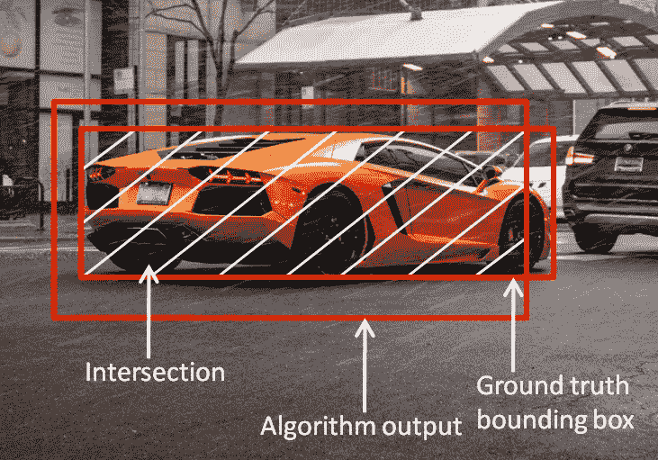

作者图片

IoU 的公式是交叉点的大小除以两个边界框的并集的大小。IoU 的阈值约为 0.5。值≥ 0.5 的借据被视为“正确”预测。

## **非最大抑制**

参考下面的边界框图像，标记为 1–33 的单元格都预测边界框的中心位于它们的单元格中。

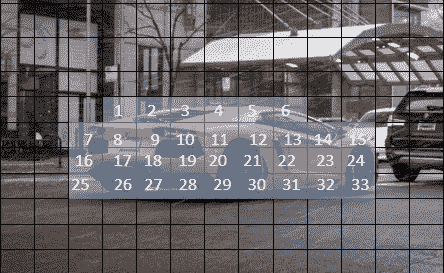

这将导致算法多次检测对象，而不是仅一次。这就是非最大值抑制的作用，它确保算法只检测每个对象一次**。如前所述，每个单元输出 y = (P𝒸，bₓ，bᵧ，b𝓌，bₕ，c)，P𝒸是存在物体的概率。非最大值抑制的作用是获取具有最高 P𝒸的边界框，丢弃任何 p𝒸≤0.6 的边界框，并“抑制”其他 IoU ≥ 0.5 的边界框。**

**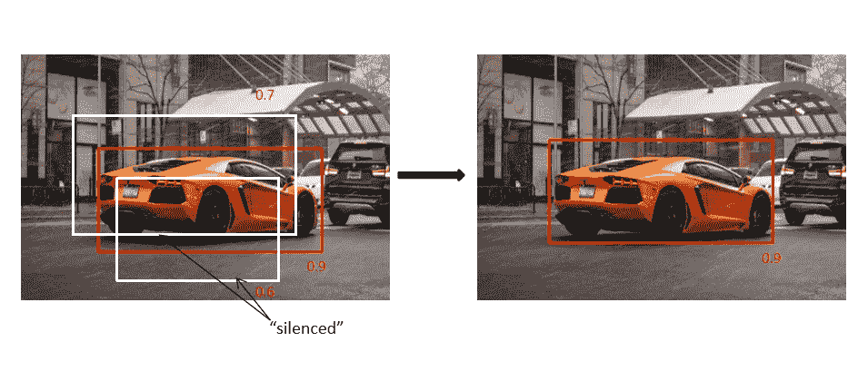**

**视觉描绘非最大抑制。作者图片**

## ****锚箱****

**如果多个对象位于同一个网格单元中会怎样？边界框会是什么样的？锚盒的想法可以用在这里。查看下图，注意人和汽车的中点如何位于网格单元内。(为了简单起见，我将图像分成 3×3 的网格)**

**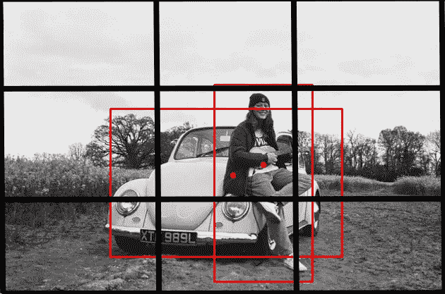**

**描述包含两个对象中点的网格单元的图像。图片由[丹学长，](https://unsplash.com/photos/HS4FvZzoREM)**

**当前单元格输出 y = (P𝒸，bₓ，bᵧ，b𝓌，bₕ，c)，单元格只能选择两个对象中的一个进行检测。但是对于锚盒(通常使用训练数据集的 k-means 分析预先定义)，成本标签 y 变成(P𝒸、bₓ、bᵧ、b𝓌、bₕ、c、P𝒸₁、bₓ₁、bᵧ₁、b、b、c、p……)。)基本上根据锚盒有多少而重复，第一输出用锚盒 1 编码，第二输出用锚盒 2 编码，依此类推。每个输出单元检测一个对象类；锚盒 1 类似于汽车，因此输出 c 将用于汽车，下一个输出 c 将用于人，因为它被编码到锚盒 2。**

**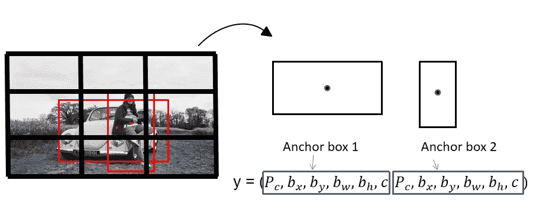**

**作者图片**

**注意，表示对象类的每个输出单元 c 都受到对象的地面真实边界框的高 IoU 的影响。**

# **使用 YOLOv5 进行掩模检测**

## **模型**

**对于这个项目，我将使用 YOLOv5 来训练一个对象检测模型。YOLO 是“你只看一次”的首字母缩写。一种流行的架构，因为:**

*   **速度(基本型号—每秒 45 帧，快速型号—每秒 155 帧，比 R-CNN 快 1000 倍)**
*   **该架构仅包括单个神经网络(可以直接针对检测性能进行端到端优化)**
*   **能够学习物体的一般表示法(图像的全局上下文提供了预测信息)**
*   **开源**

**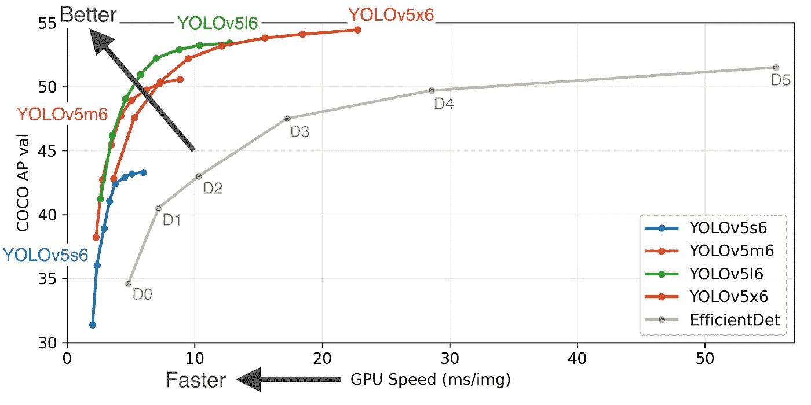**

**YOLOv5 型号与 EfficientDet 之间的比较，由 [Ultralytics](https://github.com/ultralytics/yolov5) 提供图像**

**要了解关于该模型的更多信息，请访问他们的知识库: [Ultralytics YOLOv5 Github 知识库](https://github.com/ultralytics/yolov5)。**

## **资料组**

**我在 Kaggle 上找到了这个[人脸面具检测](https://www.kaggle.com/andrewmvd/face-mask-detection)数据集，由 853 张图片组成，分为 3 类:带面具、不带面具和面具佩戴不当。每幅图像都带有一个 PASCAL VOC 格式的 XML 文件，其中包含其边界框的注释。这里有一个例子:**

**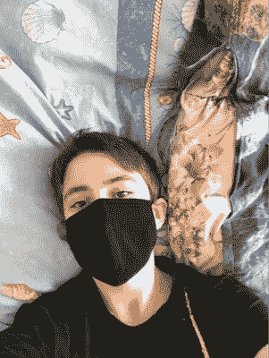**

**来自[面罩检测数据集](https://www.kaggle.com/andrewmvd/face-mask-detection)的示例图像**

```
<annotation> <folder>images</folder> <filename>maksssksksss4.png</filename> <size> <width>301</width> <height>400</height> <depth>3</depth> </size> <segmented>0</segmented> <object> <name>with_mask</name> <pose>Unspecified</pose> <truncated>0</truncated> <occluded>0</occluded> <difficult>0</difficult> <bndbox> <xmin>70</xmin> <ymin>185</ymin> <xmax>176</xmax> <ymax>321</ymax> </bndbox> </object></annotation>
```

**本项目需要的关键信息是:**

1.  **<width>和<height>:图像的尺寸，单位为像素</height></width>**
2.  **整体 <bndbox>: xmin，ymin 表示边界框左上角的位置，而 xmax，ymax 表示边界框右下角的像素</bndbox>**

## **格式化**

**在用模型训练数据之前，PASCAL VOC XML 格式的注释数据必须转换成 YOLO 格式，每个图像一个`*.txt`文件，其规格如下:(也用下面的示例图像 maksssksksss4.png 说明)**

*   **每个对象一行**
*   **每一行都是`class x_center y_center width height`格式。**
*   **框坐标必须是标准化的 xywh 格式(从 0 到 1)。如果你的盒子是以**像素**为单位，那么用图像宽度划分`x_center`和`width`，用图像高度划分`y_center`和`height`。**
*   **类别号是零索引的(从 0 开始)。**

**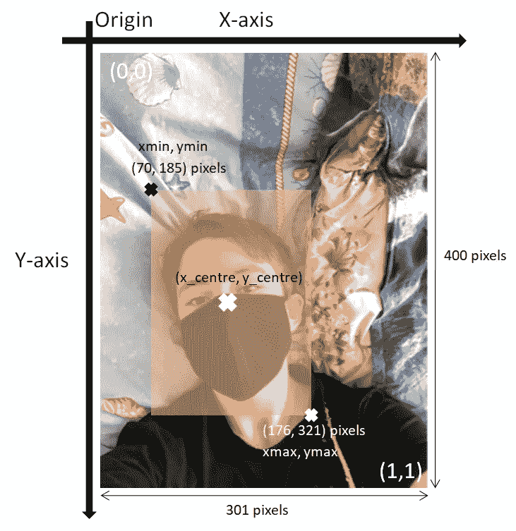**

**作者图片**

**我编写了一个函数，使用 [XML.etree 库](https://docs.python.org/3/library/xml.etree.elementtree.html)从 XML 文件中提取所需的信息，并计算 x_centre 和 y_centre。因为注释数据是以图像像素为单位的，所以我对最终值进行了归一化，以满足需求。**

**结果将是这样的:**

**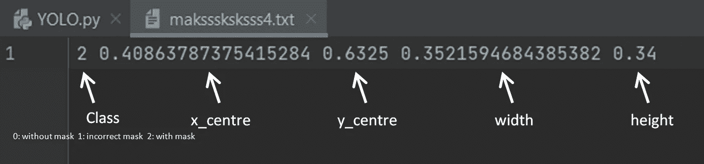**

**作者图片**

**还需要以如下所示的特定方式格式化目录，其中训练和验证图像和标签被分离到每个独立的文件夹中**

**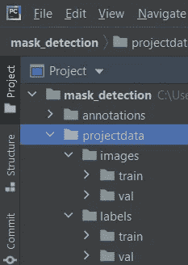**

**作者图片**

**我使用 [Pathlib 库](https://docs.python.org/3/library/pathlib.html)编写了另一个简单的函数。**

****请注意，上面提到的所有格式都可以使用** [**Roboflow**](https://roboflow.com/) **来完成，这是一个简单、代码化且没有麻烦的替代方法。用代码**手动做是我个人的偏好**

**在训练模型之前，我们需要创建一个 *projectdata。yaml* 文件，指定训练和验证图像的位置和标签数量以及我们训练数据的标签名称。该文件的结构应该如下所示:**

```
*# specify pathway which the val and training data is at
# Train/val/test sets as 1) dir: path/to/imgs, 2) file: path/to/imgs.txt, or 3) list: [path/to/imgs1, path/to/imgs2, ..]*path: ../mask_detection/projectdata
train: images/train
val: images/val

*# Classes* nc: 3
names: ['no mask', 'mask worn incorrectly', 'mask on']
```

## **训练模型**

**为了使用自定义数据集训练模型，我在本地终端中使用以下参数运行了 *train.py* :**

*   ****img:** 输入图像尺寸**
*   ****批量:**批量大小**
*   ****历元:**历元数**
*   ****数据:**到 *projectdata.yaml* 文件的路径**
*   ****cfg:** 在预先存在的模型中进行选择📁**型号****
*   ****权重:**初始权重路径，默认为 *yolov5s.pt***
*   ****缓存:**缓存图像以加快训练速度**

**我选择了最小最快的型号 yolov5s。我还使用模型的预训练权重进行迁移学习，而不是重新训练新的权重，这非常耗时，并且由于高处理能力要求，不可能在笔记本电脑上训练。我使用“1”的批量大小，并为 10 个时期训练模型。**

```
python mask_detection\yolov5\train.py --img 640 --batch 1 --epochs 10 --data projectdata.yaml
--weights yolov5s.pt --cfg mask_detection\yolov5\models\yolov5s.yaml --cache
```

**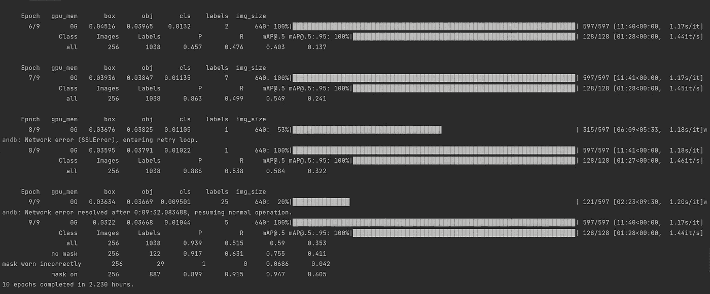**

**作者图片**

**如果所有步骤都正确完成，该命令将输出以下内容并开始训练。关注 mAP@.5，看看 model 表现如何。一旦训练开始，在“运行”文件夹下，Yolov5 训练管道在测试图像上输入地面实况和预测结果，如下所示。**

**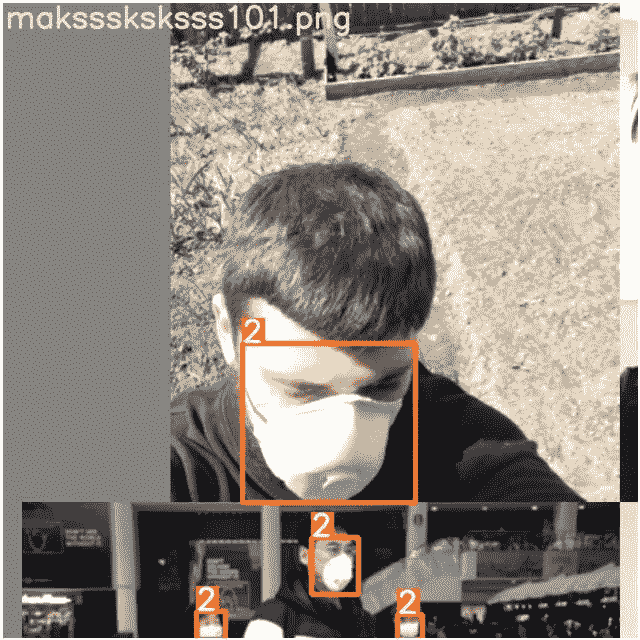**

**地面实况训练图像。作者图片**

**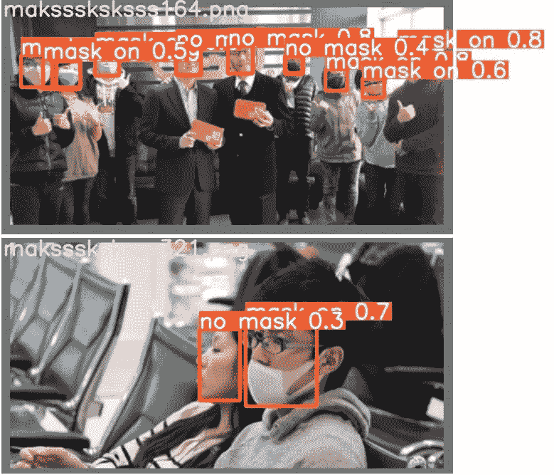**

**测试图像。作者图片**

**训练完成后，经过训练的模型将保存在您的“权重”文件夹/目录中，验证指标将记录在 Tensorboard 上。(按照建议，我选择将数据记录到 wandb 中)**

**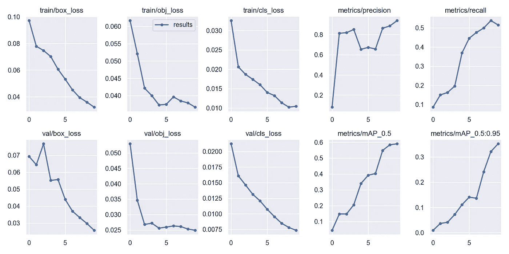**

**培训结果。作者图片**

**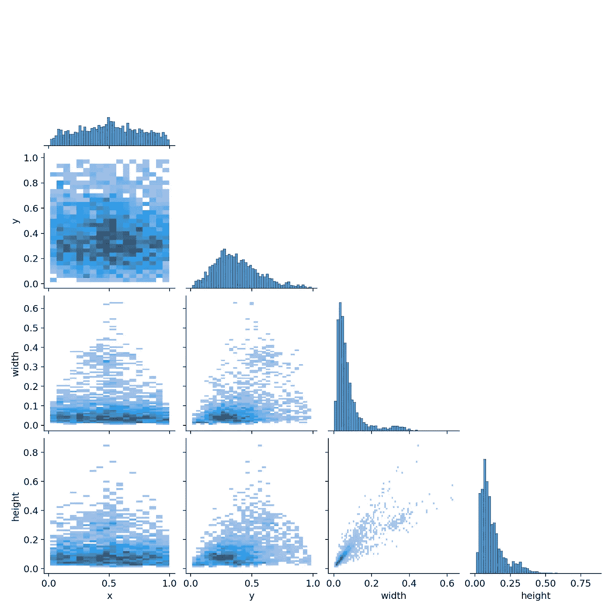**

**图像高度和宽度的相关图**

**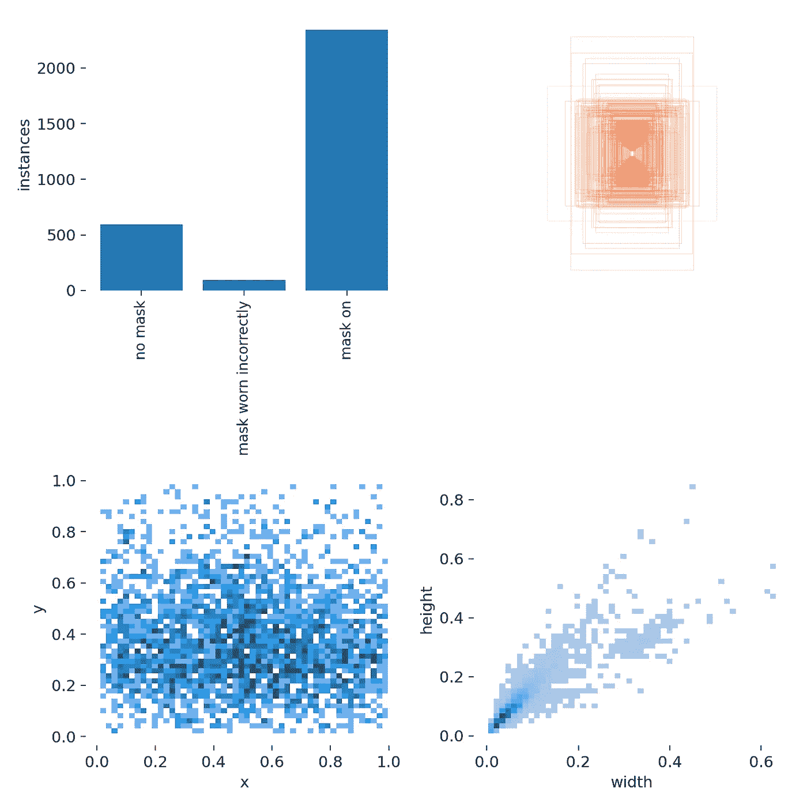**

**数据相关图。作者图片**

## **目标检测模型的评估**

**受欢迎的挑战和比赛，例如:**

*   **[帕斯卡 VOC 挑战](http://host.robots.ox.ac.uk/pascal/VOC/voc2012/htmldoc/devkit_doc.html) (Everingham 等人，2010 年)**
*   **[可可目标探测挑战赛](http://cocodataset.org/#detection-eval)(林等 2014)**
*   **[开放影像挑战赛](https://storage.googleapis.com/openimages/web/object_detection_metric.html)(库兹涅佐娃 2018)**

**所有 3 项挑战都使用平均精度(mAP)作为评估物体探测器的主要指标。地图到底是什么？首先，让我们来了解一些基本概念。**

*   ****置信度:**锚框包含分类器预测的对象的概率**
*   **I **并集上的交集(IoU):** 边界框的交集面积除以预测边界框的并集面积**
*   ****精度:**真阳性数( **TP** )除以真阳性数( **TP** ) &假阳性数( **FP** )**
*   ****召回:**真阳性的数量除以真阳性的总和( **TP** ) &假阴性( **FP** )**

**只有满足以下条件，置信度得分和 IoU 才用于确定预测检测是 **TP** 还是 **FP** (注意:任何违反后两个条件的情况都使其成为 **FP****

1.  **置信度得分>阈值(如果< threshold, detection counts as a False Negative ( **FN** ))**
2.  **预测的边界框具有比阈值更高的 IoU**
3.  **预测类与地面真实类相匹配**

**随着置信度分数的增加，回忆单调下降，而精确度可以上升和下降，但是对于这个项目，所有类别(除了不正确佩戴的面具)都增加。**

**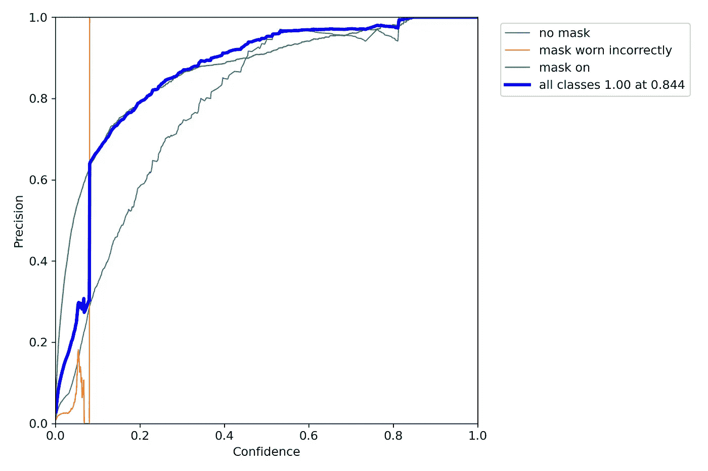****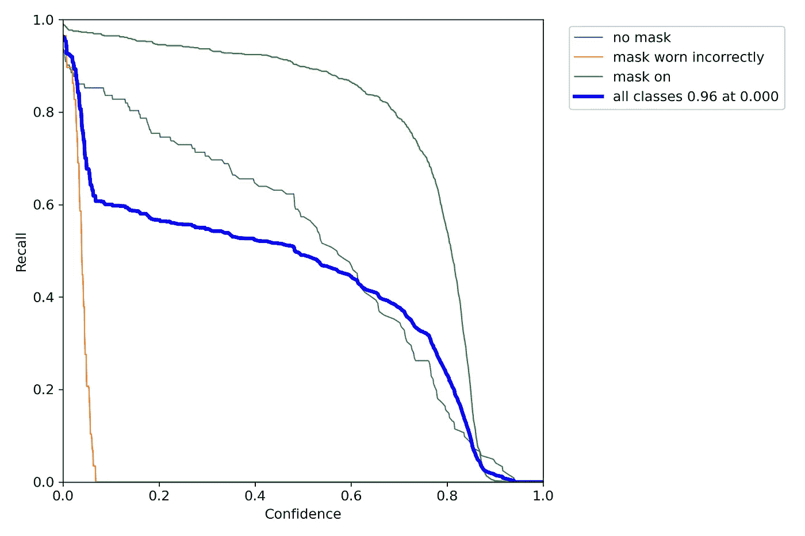****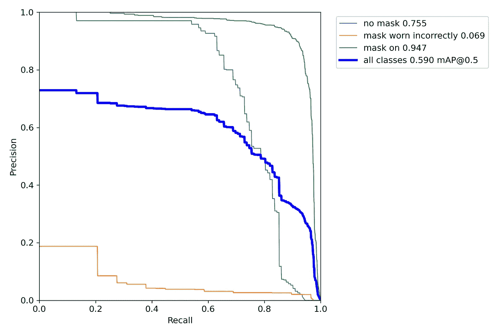**

**精确召回曲线。作者图片**

**虽然精确召回率可以用来评估目标检测器的性能，但是不容易在不同的检测器之间进行比较。为了查看整个事情进行比较，基于精度-召回曲线的**平均精度(AP)** 开始起作用。根据定义，AP 正在寻找上面精确回忆曲线下的区域。**均值平均精度(mAP)** 是 AP 的均值。**

**请注意，mAP 的定义和实现有所不同。**

> **在 PASCAL VOC 挑战中，一个对象类的 AP 是针对 0.5 的 IoU 阈值计算的。因此，贴图是所有对象类的平均值。**
> 
> **对于 COCO 对象检测挑战，该图是所有对象类别和 10 个 IoU 阈值的平均值。**

## **推理**

**既然模型已经训练好了，接下来是有趣的部分:对图像或视频进行推理！在本地终端中调用 detect.py，使用以下参数运行推理:(查看 detect.py 解析器以获得完整的参数列表)**

*   ****权重:**训练模型的权重**
*   ****来源:**输入运行推理的文件/文件夹，0 表示网络摄像头**
*   ****iou-thres** :非最大抑制的 iou 阈值，默认值:0.45**

```
python yolov5\detect.py --source vid.mp4 --weights runs\train\exp\weights\best.pt --img 640 --iou-thres 0.5
```

**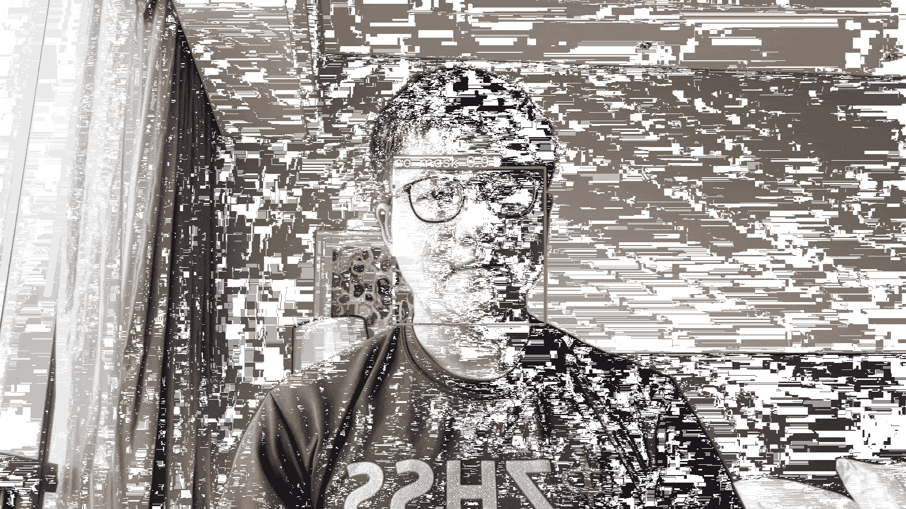**

**作者 GIF**

**如你所见，该模型能够检测到口罩的存在！**

## **结尾注释**

**这一模式远非完美，仍有改进的空间**

*   **该模型不能检测不正确佩戴的面具，这是其中一个类别。这很可能是由于数据的巨大不平衡。只有一小部分数据由不正确佩戴的面具组成。一种可能的解决方案是应用数据平衡，以便该模型将更好地识别不正确佩戴的面具。**
*   **可以使用更大的框架，例如 Yolov5x，而不是 Yolov5s，以实现更高的 mAP。但一个可能的缺点是训练如此庞大的模型需要额外的时间。**

**就这样，我的文章到此结束！这个项目对我来说真的很有趣，我喜欢学习新的和有趣的概念，尤其是在开始的时候，学习计算机视觉似乎是一项艰巨的任务，但我很高兴能够完成它！干杯！**

**LinkedIn 简介:[肖恩·雅普](https://www.linkedin.com/in/seanyckang/)**

## **参考**

**[1] [约瑟夫·雷德蒙](https://arxiv.org/search/cs?searchtype=author&query=Redmon%2C+J)，[桑托什·迪夫瓦拉](https://arxiv.org/search/cs?searchtype=author&query=Divvala%2C+S)，[罗斯·吉斯克](https://arxiv.org/search/cs?searchtype=author&query=Girshick%2C+R)，[阿里·法尔哈迪](https://arxiv.org/search/cs?searchtype=author&query=Farhadi%2C+A)，[你只看一次:统一的、实时的物体检测](https://arxiv.org/pdf/1506.02640.pdf) (2015)**

**[2]吴恩达，[卷积神经网络，深度学习。AI Coursera](https://www.coursera.org/learn/convolutional-neural-networks/home/welcome)**

**[3]由 Mark Everingham、Luc Van Gool、Christopher K. I. Williams、John Winn 和 Andrew Zisserman 提出的 PASCAL 视觉对象类(VOC)挑战**