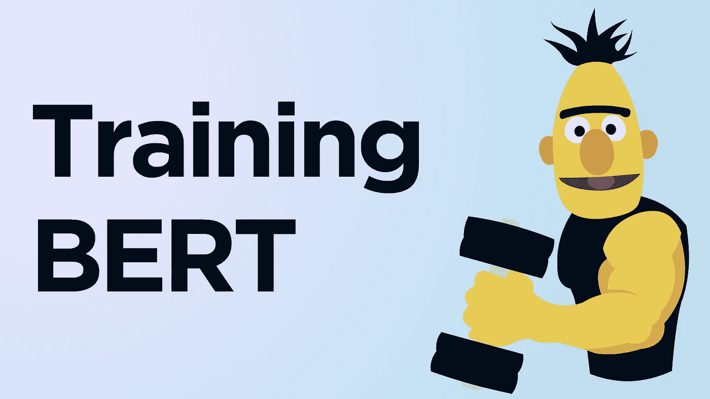
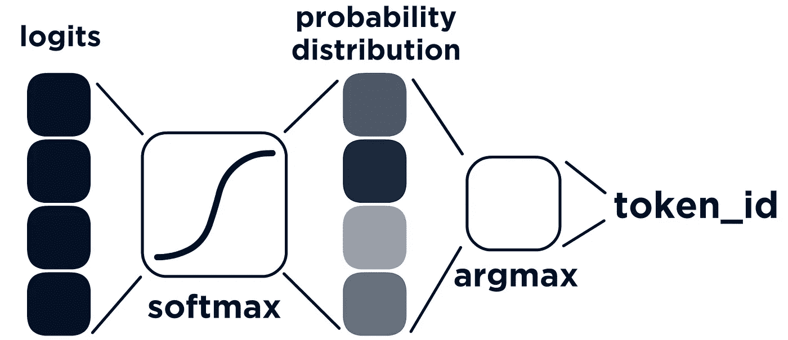

# 用 BERT 进行屏蔽语言建模

> 原文：<https://towardsdatascience.com/masked-language-modelling-with-bert-7d49793e5d2c?source=collection_archive---------0----------------------->

## 在任何数据集上微调您的模型



伯特的双向二头肌-作者图片。

B ERT，大家最喜欢的变形金刚花费 Google ~$7K 训练[1](还有谁知道 R & D 花费多少)。从那里，我们编写几行代码来使用同一个模型——全部免费。

由于两种独特的训练方法，掩蔽语言建模(MLM)和下一句预测(NSP)，BERT 在 NLP 中获得了无与伦比的成功。

在许多情况下，我们可能能够将预先训练好的 BERT 模型开箱即用，并成功地应用到我们自己的语言任务中。

但通常，我们可能需要微调模型。

MLM 是如何运作的

与 MLM 的进一步训练使我们能够微调伯特，以更好地理解语言在更具体领域的特殊用途。

现成的 BERT —非常适合一般用途。使用 MLM·伯特进行微调，非常适合特定领域的使用。

在本文中，我们将深入了解什么是 MLM，它是如何工作的，以及我们如何用它来改进我们的模型。

# 屏蔽语言建模

MLM 包括给伯特一个句子，并优化伯特内部的权重，以在另一端输出相同的句子。

所以我们输入一个句子，要求 BERT 输出同样的句子。

然而，在我们实际给 BERT 输入句子之前，我们屏蔽了一些标记。


在这幅图中，在将我们的令牌传递给 BERT 之前，我们已经屏蔽了 **lincoln** 令牌，用**【屏蔽】**替换它。

所以我们实际上是在输入一个不完整的句子，然后让伯特帮我们完成它。

## 填补空白

这是什么效果？嗯，这就像我们很多人在学校里被问到的那些问题——在那里，给定一个句子，我们必须填补空白。

```
In Autumn the ______ fall from the trees.
```

你知道答案吗？很可能你知道，你知道是因为你考虑了句子的上下文。

我们看到单词*落在*和*树上*——我们知道丢失的单词是*从树上*落下的东西。

很多东西从树上掉下来，橡子、树枝、树叶——但是我们有另一个条件，秋天*——这缩小了我们的搜索范围，秋天最有可能从树上掉下来的东西是*树叶*。*

*作为人类，我们综合运用一般的世界知识和语言理解来得出结论。对伯特来说，这个猜测将来自于大量阅读*——并且非常好地学习语言模式。**

*伯特可能不知道什么是秋天、树木和树叶，但他知道给定的语言模式和这些单词的上下文，答案很可能是树叶。*

*这个过程的结果——对伯特来说——是提高了对所用语言风格的理解。*

## *该过程*

*所以我们明白 MLM 在做什么，但这实际上是如何运作的呢？我们在代码中需要遵循的逻辑步骤是什么？*

*1。我们**标记化**我们的文本。就像我们通常使用变形金刚一样，我们从文本标记化开始。*

*通过标记化，我们将得到三个不同的张量:*

*   **输入 _ 标识**
*   **令牌类型标识**
*   **注意 _ 屏蔽**

*对于 MLM，我们不需要*token _ type _ ids*——在本例中 *attention_mask* 并不重要。*

*对我们来说， *input_ids* 张量最为重要。在这里，我们将有一个我们的文本的标记化表示——这是我们将修改前进。*

*2。创建一个 ***标签*** 张量。我们在这里训练我们的模型，所以我们需要一个*标签*张量来计算损失——并优化。*

**标签*张量就是*input _ ids*——所以我们需要做的就是复制一份。*

*3。 **屏蔽 *input_ids* 中的**令牌。既然我们已经为*标签*创建了 *input_ids* 的副本，我们就可以继续并屏蔽随机选择的令牌了。*

*BERT 论文在模型预训练期间使用 15%的概率屏蔽每个单词，并使用一些附加规则-我们将使用这种方法的简化版本，并指定每个单词被屏蔽的概率为 15%。*

*4。计算**损失**。我们通过我们的 BERT 模型处理 *input_ids* 和*label*张量，并计算它们之间的损失。*

*利用这一损失，我们通过 BERT 计算所需的梯度变化，并优化我们的模型权重。*

**

*所有 512 个标记产生一个最终的输出嵌入—**logits**——其向量长度等于模型 vocab 的大小。预测的 **token_id** 是使用 softmax 和 argmax 转换从该 logit 中提取的。*

*损失计算为每个输出“令牌”的输出概率分布与真正的独热编码标签*之间的差异。**

# *代码中的 MLM*

*好的，这些都很好，但是我们如何用代码演示 MLM 呢？*

*我们将使用拥抱脸的变形金刚和 PyTorch，以及`bert-base-uncased`模型。因此，让我们首先导入并初始化所有内容:*

*现在，我们进入每一个逻辑步骤，从以下步骤开始:*

*1。 **标记化** —标记化很简单，我们已经初始化了一个`BertTokenizer`，我们现在要做的就是标记化我们的输入`text`。*

*我们现在不担心填充/截断。我们应该注意的是前面描述的三个张量——*token _ type _ ids*和 *attention_mask* 不需要我们的任何关注——但是 *input_ids* 需要。*

*2。 **创建标签** —下一步很简单，我们需要做的就是将我们的 *input_ids* 张量克隆到一个新的*标签*张量中。我们也将把它存储在`inputs`变量中。*

*3。 **屏蔽** —现在我们需要屏蔽 *input_ids* 张量中的随机选择的记号。*

*为了创建屏蔽任何一个令牌的 15%的概率，我们可以使用`torch.rand`和每个值的条件`< 0.15`。总之，这些将产生我们的掩蔽阵列`mask_arr`。*

*现在，我们使用`mask_arr`来选择放置*掩码*令牌的位置—但是我们不想将*掩码*令牌放置在其他特殊令牌之上，例如 *CLS* 或 *SEP* 令牌(分别为 *101* 和 *102* )。*

*所以，我们需要增加一个附加条件。检查包含令牌 id*101*或 *102* 的位置。*

*现在这就是我们的屏蔽张量，为了应用它，我们将首先提取我们找到一个`True`值的索引位置，然后使用这个*选择*将这些位置的值设置为 *103* (屏蔽令牌 id)。*

*现在我们可以在上面的 *input_ids* 张量中看到由 *103* 表示的*掩码*令牌。*

*4。 **计算损失** —我们这里的最后一步与典型的模型训练过程没有什么不同。*

*有了 *input_ids* 和*标签*在我们的`inputs`字典中，我们可以将它传递给我们的`model`并返回模型损失。*

# *培养*

*很好，我们已经完成了所有的要点——但是当微调一个模型时，所有这些看起来会怎么样呢？*

*有两种方法，(1)我们使用目前为止所学的一切来实现我们自己版本的训练功能，或者(2)我们使用 HuggingFace 的`Trainer`。*

*`Trainer`显然是一种优化、易用的解决方案。我们将看看如何使用它——但首先，让我们试着自己实现它。*

## *我们的实施*

*了解了所有这些之后，如果不尝试实现我们自己的培训功能，那将是一种浪费。*

*使用 PyTorch 为 MLM 训练 BERT 的演练*

*首先，我们需要数据。因为我们只是随机屏蔽了一些标记，所以我们几乎可以使用任何文本。我们不需要有标签的或特殊的数据。*

*在这里，我们将使用*马库斯·奥勒留*的*冥想*，来源于[这里](http://classics.mit.edu/Antoninus/meditations.html)并稍加预处理([干净版](https://github.com/jamescalam/transformers/blob/main/data/text/meditations/clean.txt))。*

*首先，我们将导入/初始化并加载我们的文本数据。*

*然后我们**对**进行标记化——这一次我们截断并填充每个序列——因为我们有许多不同长度的序列。*

*现在我们克隆*输入标识*来创建我们的*标签*张量。*

*接下来是我们的屏蔽代码，这次有一点不同，原因有二:*

*   *我们的遮罩不应包括*垫*令牌(如之前的 *CLS* 和 *SEP* )。*
*   *我们有许多序列——不只是一个。*

*我们可以看到值 *103* 被分配在与在`mask_arr`张量中找到的*真值*相同的位置。*

*`inputs`张量现在准备好了——我们可以开始设置它们，以便在训练期间输入到我们的模型中。*

*在训练期间，我们将使用 PyTorch `DataLoader`来加载我们的数据。要使用它，我们需要将数据格式化成 PyTorch `Dataset`对象。*

*现在我们准备进入我们的训练循环。在开始我们的循环之前，我们需要设置三样东西:*

*   *将模型移动到 GPU/CPU (GPU 如果可用)。*
*   *激活模型训练模式。*
*   *用加权衰减优化器初始化 Adam。*

*现在我们终于设置好了—我们可以开始训练了！我们将其格式化为 PyTorch 中的典型训练循环。*

*至此，我们完成了—我们已经实现了自己的 MLM 微调脚本。*

## *运动鞋*

*切换到我们的`Trainer`实现——我们仍然需要做我们之前所做的一切，直到我们创建了我们的`dataset`——因为`Trainer`将期待这作为训练的输入。*

*我们将首先定义我们的训练参数，初始化`Trainer`——然后训练！*

*因此`Trainer`方法肯定要简单得多——它允许我们通过在初始化时简单地指定检查点和其他特性来实现它们。*

*好了，这就是我们开始用 MLM 微调模型所需要知道的一切。*

*MLM 有很多，但是概念和实现并不复杂——而且非常强大。*

*使用我们在这里学到的知识，我们可以采用 NLP 中最好的模型，并对它们进行微调以适应我们更特定于领域的语言用例——只需要未标记的文本——通常是很容易找到的数据源。*

*我希望你喜欢这篇文章！如果你有任何问题，请通过 [Twitter](https://twitter.com/jamescalam) 或在下面的评论中告诉我。如果你想要更多这样的内容，我也会在 [YouTube](https://www.youtube.com/c/jamesbriggs) 上发布。*

*感谢阅读！*

# *参考*

*[1] [训练 SOTA 人工智能模型的惊人成本](https://syncedreview.com/2019/06/27/the-staggering-cost-of-training-sota-ai-models/) (2019)，同步评论*

*[🤖带变压器的 NLP 课程](https://bit.ly/nlp-transformers)*

***所有图片均由作者提供，除非另有说明**