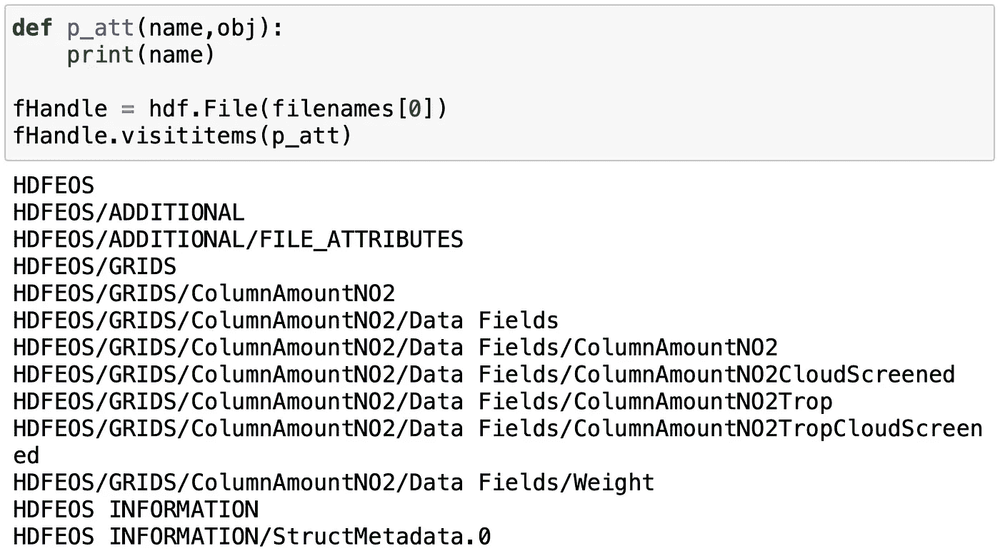
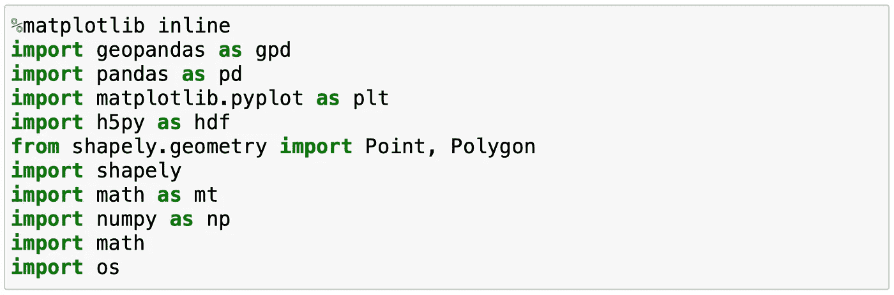
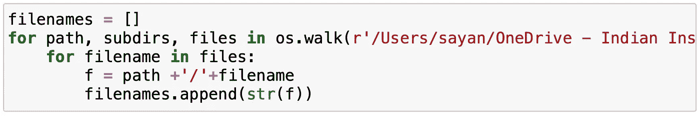
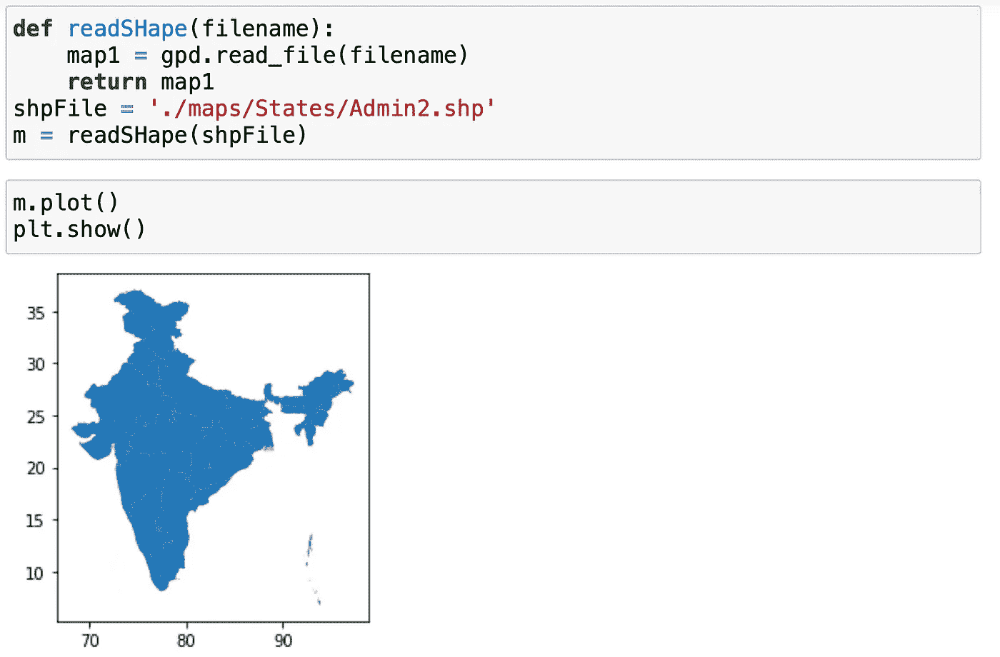
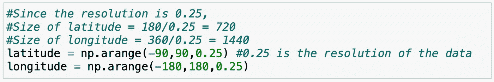
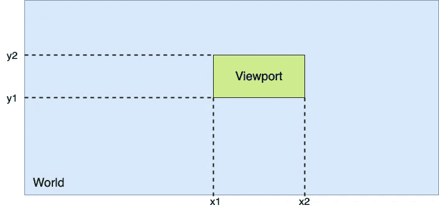
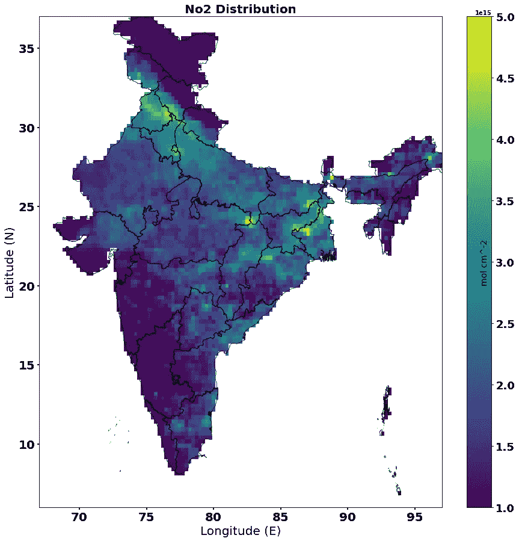

# 使用 Shapefiles 掩蔽地理空间 3 级卫星图像:基于网格的方法

> 原文：<https://towardsdatascience.com/masking-geo-spatial-level-3-satellite-images-using-shapefiles-a-grid-based-approach-c88d7a108f4a?source=collection_archive---------19----------------------->

## 如何使用相应区域的 shapefile 处理和屏蔽特定区域所需的大气三级数据


美国宇航局在 [Unsplash](https://unsplash.com?utm_source=medium&utm_medium=referral) 拍摄的照片

# 介绍

让我们先从**遥感的概念说起。**这是一项通过传感器(如卫星)收集数据的自然研究。这些传感器可以监测和收集地球不同方面的数据。其中一些包括植被数据、大气数据、海洋数据等。他们以热图或图像的形式提供数据。图像处理和屏蔽是从传感器收集的数据中提取信息所需的基本工具。本文重点介绍如何使用相应区域的 shapefile 处理和屏蔽特定区域所需的**大气 NO2** 数据。这里使用的数据是由臭氧监测仪器(OMI)收集的。数据是从 Earthdata 网站下载的，你可以从下面的链接下载数据。

[https://search.earthdata.nasa.gov/search/granules?p = c 1266136111-GES _ DISC&pg[0][v]= f&pg[0][GSK]=-start _ date&q = OMI % 20no 2&TL = 1628603996.133！3](https://search.earthdata.nasa.gov/search/granules?p=C1266136111-GES_DISC&pg[0][v]=f&pg[0][gsk]=-start_date&q=omi%20no2&tl=1628603996.133!3) ！！

# 数据描述

这里使用的数据是 OMI 卫星记录的 3 级二维网格卫星数据。数据的分辨率为(0.25 x 0.25)度网格。数据由对流层柱状**二氧化氮**气体组成。数据集的详细结构可以提取如下:



**在文件名中使用您自己的文件路径**

主数据字段位于数据集的数据字段子树下。有四个数据变量，如下所述:

> **ColumnAmountNo2:** 总的 No2 柱密度。
> 
> **columnaumntno 2 cloudscreened:**滤除云噪声后的总 NO2 柱密度。
> 
> **columnaumntno 2 drop:**对流层区域 NO2 的柱密度。
> 
> **columnaumntno 2 ropcloudscreened:**无云噪声的对流层区域 NO2 的柱密度。

在本文中，我们将使用数据变量**columnamountno 2 ropcloudscreened**。

# 工具和技术

Python 3.7 被用作提取和处理数据集的主要语言。这个版本很重要，因为另一个名为 *geopandas* 的包不能在 python 的更高版本上工作。Jupyter 笔记本用于执行脚本。数据集采用. he5 文件格式。为了从数据文件中读取和提取数据，需要一个名为 *h5py* 的专门包。所有这些都可以在 conda 环境中获得，您可以使用 Anaconda 通过给定的链接进行安装。

<https://www.anaconda.com/products/individual>  

执行代码所需的包有:



# 导入数据

为了导入数据，需要名为 *os* 的包，这是 python 中的一个内置包。它遍历给定的路径，并将文件夹中包含的所有文件名读入 python 中的一个列表。使用如下所示的路径成功检索数据集名称后，需要使用 *h5py* 包提取数据。

在提取数据时，数据需要被清理，即所有小于零的像素值需要被过滤并用 NaN 值替换。数据提取和清理一次完成，节省了一些计算开销，也减少了代码的大小。清除数据后，沿轴=0 取所有数据的平均值，得到平均数据。

#注:*根据需要取平均值。如果每天都要进行一些分析，可以跳过均值步骤，单独运行每个数据的屏蔽。*

整个过程需要分两步完成:

*   收集所有数据文件名。
*   使用 h5py 提取数据。



正在收集相关路径中的所有文件

```
def extractData(filenames):
    data = []
    for fname in filenames:
        fHandle = hdf.File(fname,'r')
        #Data extraction
        #Use any one of the data variable from data description
        dataNo2 = fHandle['HDFEOS/GRIDS/ColumnAmountNO2/Data Fields/ColumnAmountNO2TropCloudScreened'][:]
        dataNo2[dataNo2 < 0] = np.nan #cleaning 
        data.append(dataNo2)
    dataArray = np.array(data)
    mean = np.nanmean(dataArray, axis=0)
    return mean
```

这里， ***fHandle*** 内的路径是取自数据描述的路径。

# 读取形状文件

出于测试目的，使用了印度国家边界 shapefile。读取和处理形状文件*需要 geopandas* 。Geopandas 是 python 中的一个包，广泛用于地理数据处理。出于可视化的目的，使用 matplotlib。



# 创建纬度和经度列表

为了将图像数据转换成网格地理数据集，每个数据点的确切位置必须与全球坐标系统上的相应位置(纬度和经度)相关联。为了关联数据，使用数据的分辨率生成纬度和经度向量。由于 NO2 数据是世界数据，纬度的界限被设置为 **[-90，90]** ，经度的界限被设置为 **[-180，180】。**由于数据的分辨率为 0.25 度，我们创建一个间隔为 0.25 的等间距数组，并保持纬度和经度的界限。



# 从 shapefile 获取边界

为了将全局数据裁剪为 shapefile 的坐标，需要从我们正在使用的各个 shapefile 中提取纬度和经度边界。这将进一步用于在屏蔽后重新研磨数据，并将数据裁剪到所需的坐标。这可以通过用 shapefile 的边界生成另一组纬度和经度列表来完成。

一个 shapefile 可能由多个多边形组成，它需要从所有多边形中获取纬度和经度坐标。取其中的最大值和最小值将提供总 shapefile 的边界，如下所示。

```
def getBounds(shape):
    x1 = []
    y1 = []
    for i in range(len(shape)):
        if(isinstance(shape.iloc[i].geometry, shapely.geometry.polygon.Polygon)):  
            x = shape.exterior.iloc[i].coords.xy[0]
            y = shape.exterior.iloc[i].coords.xy[1]
            x1.append(min(x))
            x1.append(max(x))
            y1.append(min(y))
            y1.append(max(y))
        else:
            for poly in shape.iloc[i].geometry:
                x = poly.exterior.coords.xy[0]
                y = poly.exterior.coords.xy[1]
                x1.append(min(x))
                x1.append(max(x))
                y1.append(min(y))
                y1.append(max(y))return x1,y1def getBoundary(shape,res):
    x,y = getBounds(shape)
    my_lats = np.arange(np.min(y)-res/2, np.max(y)+res/2, res)
    my_lons = np.arange(np.min(x)-res/2, np.max(x)+res/2, res)
    return(my_lats,my_lons)
```

# 创建和裁剪地理数据框

到目前为止，我们一直使用文件中的原始数据。但是为了以后屏蔽数据，需要将这些数据转换成由地理点组成的地理数据框架。这可以使用 *geopandas* 库轻松完成。

创建数据框时，可使用 shapefiles 的纬度和经度边界裁剪数据。剪辑的概念可以用如下图所示的摄像机的概念来解释。



世界和视口框图

在我们的例子中，世界是经度从-180 到+180，纬度从-90 到+90 的实际数据。视区的坐标由 shapefile 的边界决定。

```
def createGeoData(lt,ln,mean_No,shape):
    lat = []
    lon = []
    data = []
    for i in range(len(lt)):
        for j in range(len(ln)):
            lat.append(lt[i])
            lon.append(ln[j])
            data.append(mean_No[i][j])

    Geo_Dataset = pd.DataFrame({'latitude':lat, 'longitude': lon, 'NO2':data})
    #clip data with shape file boundaries
    x1, y1 = getBoundary(shape,0.25)
    temp = Geo_Dataset[Geo_Dataset['latitude']>int(min(x1))]
    temp = temp[temp['latitude']<int(max(x1))]
    temp = temp[temp['longitude']>int(min(y1))]
    temp = temp[temp['longitude']<int(max(y1))]
    crc = {'init':'epsg:4326'}
    geometry = [Point(xy) for xy in zip(temp['longitude'], temp['latitude'])]
    geo_df = gpd.GeoDataFrame(temp,crs=crc,geometry=geometry)
    geo_df.reset_index(drop=True, inplace=True)
    return geo_df
```

# 屏蔽数据

由于数据被转换为由几何(点)组成的地理数据框，因此这些点可直接用于检查数据是否包含在 shapefile 的任何面中。这里使用了检查多边形内部点的概念。这是通过使用 shapely 库中的点和面包来执行的。shapefile 的任何一个多边形内的点保持不变，其余的点被赋予一个 NaN 值。

```
def mask(map1, geo_df):
    pol = map1.geometry
    pts = geo_df.geometry
    test = geo_df
    l,t,df = [],[],[]
    for k in range(len(pts)):
        flag = True
        for i in range(len(pol)):
            if(pol[i].contains(pts[k])):
                l.append(geo_df.latitude[k])
                t.append(geo_df.longitude[k])
                df.append(geo_df.NO2[k])
                flag = False
                break
            #end if
        #end for
        if(flag):
            l.append(np.nan)
            t.append(np.nan)
            df.append(np.nan)
        #end if
    #end for
    newdf = pd.DataFrame({'latitude':l, 'longitude': t, 'NO2':df})
    return newdf
```

# 重新划分数据

将数据转换为地理数据框时，数据被展平以便于裁剪。因此，在屏蔽数据之后，数据需要重新网格化以便可视化。

由于数据已经被裁剪，数据的形状应该等于边界纬度数组的长度乘以从 shapefile 获得的边界经度数组的长度。

# *注意:如果数据的形状与给定的条件不匹配，检查边界是否被正确检索，剪裁是否正确完成。*

可以通过以下方式创建网格并用数据填充

```
def createGrid(my_lats, my_lons,mask):
    grd = np.zeros((len(my_lats),len(my_lons)))
    print(grd.shape, mask.NO2.shape)
    k = 0
    for i in range(len(my_lats)):
        for j in range(len(my_lons)):
            grd[i][j] = mask.NO2[k]
            k = k+1
        #end for
    #end for
    return grd
```

# **可视化**

为了可视化数据，使用了 *Matplotlib* 。关于可视化没有太多要解释的😆。只需根据您的需要修改颜色栏参数。

```
def plot(grd, map1, x1,y1):
    plt.rcParams["font.weight"] = "bold"
    fig,ax = plt.subplots(figsize=(15,15))
    map1.plot(ax=ax, alpha=0.7, color='none')
    ax.set_title("No2 Distribution", fontweight='bold', size=20)
    ax.set_xlabel('Longitude (E)', fontsize = 20)
    ax.set_ylabel('Latitude (N)', fontsize = 20)
    bounds = [int(min(x1)),int(max(x1)),int(min(y1)),int(max(y1))]
    img = ax.imshow(grd,aspect='auto',interpolation='none', origin='lower', extent=bounds)
    cb = fig.colorbar(img)
    cb.ax.tick_params(labelsize=18)
    cb.set_label('mol cm^-2', labelpad=-57, size=14)
    ax.tick_params(labelsize = 20, width = 2.0)
    img.set_clim(0.1*1e16, 0.5*1e16)
    plt.show()
```

# 执行

现在让我们看看上述这些函数是如何工作的。有一个调用上述函数的序列。它在这里

```
filenames = []
for path, subdirs, files in os.walk(r'path to your own data'):
    for filename in files:
        f = path +'/'+filename
        filenames.append(str(f))mean_data = extractData(filenames)
latitude = np.arange(-90,90,0.25)
longitude = np.arange(-180,180,0.25)
m = readSHape(shpFile)
geo_df = createGeoData(latitude,longitude,mean_data,m)
msk = mask(m, geo_df)
my_lat,my_lon = getBoundary(m,0.25)
data = createGrid(my_lat,my_lon,msk)
plot(data,m, my_lon, my_lat)
```

# 结果

让我们来看看所有编码的输出😃



# 结论

如您所见，全局数据被隐藏在 shapefile 中。这些方法适用于所有地理区域或边界 shapefile。这是一个非常方便的地理空间分析工具。