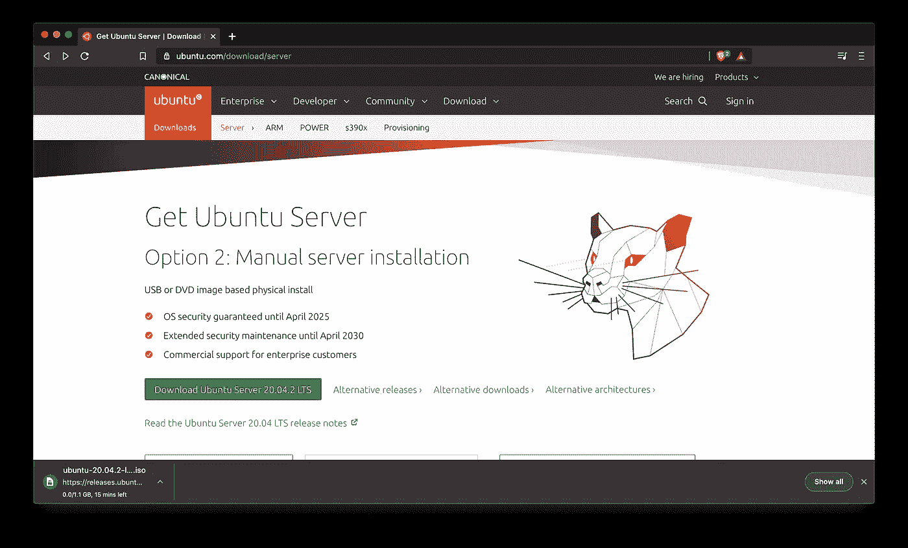

# 掌握 Apache Airflow:如何在 10 分钟内安装和设置环境

> 原文：<https://towardsdatascience.com/master-apache-airflow-how-to-install-and-setup-the-environment-in-10-minutes-61dad52d5239?source=collection_archive---------3----------------------->

## 了解如何设置和配置环境来编写您的第一个 DAG。


Solen Feyissa 在 [Unsplash](https://unsplash.com/?utm_source=unsplash&utm_medium=referral&utm_content=creditCopyText) 上拍摄的照片

Apache Airflow 是一个开源的工作流管理平台([来源](https://airflow.apache.org/)，是现代数据科学家和工程师的必备技术。

今天，您将学习如何在虚拟机上安装平台，配置它，并通过终端和 Visual Studio 代码建立 SSH 连接。

这篇文章的结构如下:

*   步骤 1:下载并安装 Ubuntu 服务器
*   步骤 2:通过终端建立 SSH 连接
*   步骤 3:安装 Apache Airflow
*   步骤 4:通过 Visual Studio 代码建立 SSH 连接
*   结论

# 步骤 1:下载并安装 Ubuntu 服务器

让我们从最简单的一步开始。我假设你已经安装了 [VirtualBox](https://www.virtualbox.org/) 。如果不是这样，请在继续之前安装它。

我们将从下载 [Ubuntu 服务器 ISO 文件](https://ubuntu.com/download/server)开始。下载大约需要 1GB，所以不会花太长时间:



图 1 — Ubuntu 服务器下载过程(图片由作者提供)

下载时，您可以配置虚拟机。转到 VirtualBox，根据下图创建一台新机器:


图 2 — VirtualBox 机器规格(图片由作者提供)

从那里，只需点击几次*下一个*，并选择合适的 RAM 和存储配置。我选择了 4GB 的内存和 25GB 的存储空间——但也可以自由分配。

完成后，您的列表上将出现一个新的虚拟机:


图 3 — VirtualBox 机器列表(图片由作者提供)

让我们在下载 ISO 的时候再做一些调整。打开新机器的*设置*并进入*网络*。在*高级*下，点击*端口转发*按钮:


图 4 —虚拟机网络设置(图片由作者提供)

我们需要转发两个端口:

1.  **Guest 8080 to Host 8250** (或者任何其他的，文档推荐 8080，但是那个在我的机器上被占用了)用于气流 UI
2.  **访客 22 到主机 2222** 进行 SSH 连接

完成后，您的窗口应该如下所示:


图 5 —虚拟机端口转发配置(图片由作者提供)

这就是所有的配置。ISO 文件现在应该已经下载好了，所以运行虚拟机并加载 ISO 文件进行安装。像平常一样安装操作系统。你需要创建一个用户——我把我的叫做*气流*。

下面是安装的截图:


图 6 — Ubuntu 服务器安装(图片由作者提供)

如果你看到类似的东西，那么你就在正确的轨道上。安装完成后，您可以重新启动虚拟机并使用您的用户登录。就这样——Ubuntu 服务器安装完毕！

# 步骤 2:通过终端建立 SSH 连接

我们现在可以从终端(或者 PuTTY，如果你在 Windows 上)建立一个 SSH 连接。

对于 macOS 和 Linux，您必须在终端中输入下面一行:

```
ssh -p 2222 airflow@localhost
```

如下图所示:


图 7 —通过终端的 SSH 连接(图片由作者提供)

请记住，*气流*表示安装时您拥有的用户名。

# 步骤 3:安装 Apache Airflow

Apache Airflow 的安装是一个多步骤的过程。整个事情都是基于 Python 的，Ubuntu Server 没有随 Python 3 一起发布。以下命令将改变这种情况:

```
sudo apt install python3-pip
```

现在您已经安装了 Python 3.8.x(或某个更新的版本)，所以您已经准备好安装 Airflow 了。下面的终端命令就可以做到这一点:

```
sudo pip3 install “apache-airflow==2.0.2” — constraint “https://raw.githubusercontent.com/apache/airflow/constraints-2.0.2/constraints-3.8.txt"
```

请记住:

*   用您想要的版本替换 *2.0.2*
*   将 *constraints-3.8.txt* 替换为您的 Python 版本。例如，如果你使用的是 Python 3.9.x，它应该是: *constraints-3.9.txt*

气流安装完毕！但这并不意味着它被配置了。您还需要初始化数据库并创建用户。以下命令为气流初始化数据库:

```
airflow db init
```

下面的代码创建用户:

```
airflow users create — username admin — firstname <your_first_name> — lastname <your_last_name> — role Admin — email <your_email>
```

完成后，您可以使用以下命令将两个 Airflow 服务器作为守护程序运行:

```
airflow webserver -D
```

就这样——Apache air flow 现在开始运行了！

要进行验证，请打开网络浏览器并转到`localhost:8250`(将 *8250* 更换为气流主机端口)。您应该会看到以下屏幕:


图 8 — Airflow 登录屏幕(图片由作者提供)

要继续，请输入一分钟前创建的数据库用户凭证，并点击*登录*。您将立即看到以下屏幕:


图 9-air flow 主屏幕(图片由作者提供)

就这样——你成功了！不要担心最初加载的大量 Dag。您可以从 web 应用程序中快速删除它们，或者指定不在气流配置中加载它们。

接下来，让我们看看如何从 Visual Studio 代码建立到虚拟机的远程 SSH 连接。

# 步骤 4:通过 Visual Studio 代码建立 SSH 连接

如果你和我一样，从主机到客户机的手动文件传输太麻烦了。幸运的是，一个免费的代码编辑器——Visual Studio Code——可以为您管理连接。

首先，安装一个名为 **Remote — SSH** 的免费插件:


图 10 —安装远程 SSH 插件(图片由作者提供)

在那里，按下左下角的蓝色小按钮，并选择*连接到主机*选项:


图 11 —连接到主机(图片由作者提供)

接下来，输入与您在终端中输入的命令相同的连接命令:


图 12 —连接命令(图片由作者提供)

Visual Studio 代码会要求您将连接配置添加到 SSH 配置列表中，因此选择第一个选项:


图 13 —保存连接信息(作者图片)

再次单击蓝色小按钮，连接到本地主机:


图 14 — SSH 本地主机连接(图片由作者提供)

一旦你这样做了，一个新的 Visual Studio 代码窗口将会弹出，你必须输入密码。这与您为 Ubuntu 服务器用户选择的密码相同:


图 15 —远程 SSH 认证(图片由作者提供)

最后，您可以点击*打开文件夹*按钮来打开远程主机上的任何目录。让我们打开`/home/airflow`文件夹:


图 16-访问 Airflow 根文件夹(作者图片)

就这样，你准备好创建你的第一个气流 DAG。确保将它们放在`dags`文件夹中(你必须先创建它)，因为那是 Airflow 试图找到它们的地方。您可以随时修改配置文件，但这超出了今天的范围。


图 17 — Airflow 根文件夹(图片由作者提供)

让我们在下一部分总结一下。

# 结论

这就是你要的——安装在虚拟机中的 Apache Airflow。你可以在本地或用 Docker 安装 Airflow，但我发现这种方法在我的职业生涯中更常见。

接下来，我们将探索如何创建和安排您的第一个 DAG，如果您想了解更多，请继续关注博客。

*喜欢这篇文章吗？成为* [*中等会员*](https://medium.com/@radecicdario/membership) *继续无限制学习。如果你使用下面的链接，我会收到你的一部分会员费，不需要你额外付费。*

[](https://medium.com/@radecicdario/membership) [## 通过我的推荐链接加入 Medium-Dario rade ci

### 作为一个媒体会员，你的会员费的一部分会给你阅读的作家，你可以完全接触到每一个故事…

medium.com](https://medium.com/@radecicdario/membership) 

# 了解更多信息

*   [我作为数据科学家卖掉我的 M1 Macbook Pro 的三大理由](/top-3-reasons-why-i-sold-my-m1-macbook-pro-as-a-data-scientist-abad1226f52a)
*   [如何用 Cron 调度 Python 脚本——你需要的唯一指南](/how-to-schedule-python-scripts-with-cron-the-only-guide-youll-ever-need-deea2df63b4e)
*   [Dask 延迟—如何轻松并行化您的 Python 代码](/dask-delayed-how-to-parallelize-your-python-code-with-ease-19382e159849)
*   [如何用 Python 创建 PDF 报告——基本指南](/how-to-create-pdf-reports-with-python-the-essential-guide-c08dd3ebf2ee)
*   [2021 年即使没有大学文凭也能成为数据科学家](/become-a-data-scientist-in-2021-even-without-a-college-degree-e43fa934e55)

# 保持联系

*   在 [Medium](https://medium.com/@radecicdario) 上关注我，了解更多类似的故事
*   注册我的[简讯](https://mailchi.mp/46a3d2989d9b/bdssubscribe)
*   在 [LinkedIn](https://www.linkedin.com/in/darioradecic/) 上连接