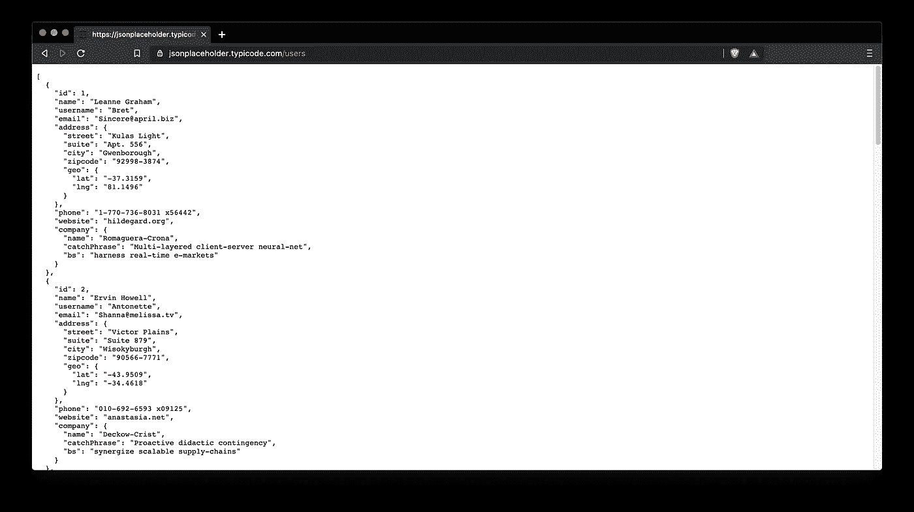
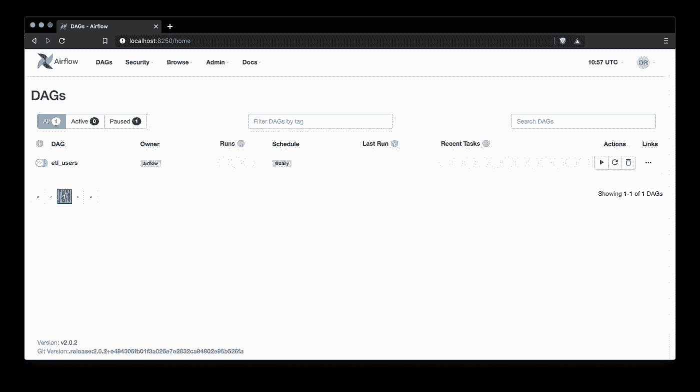
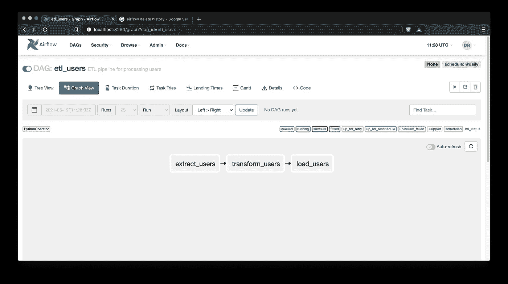
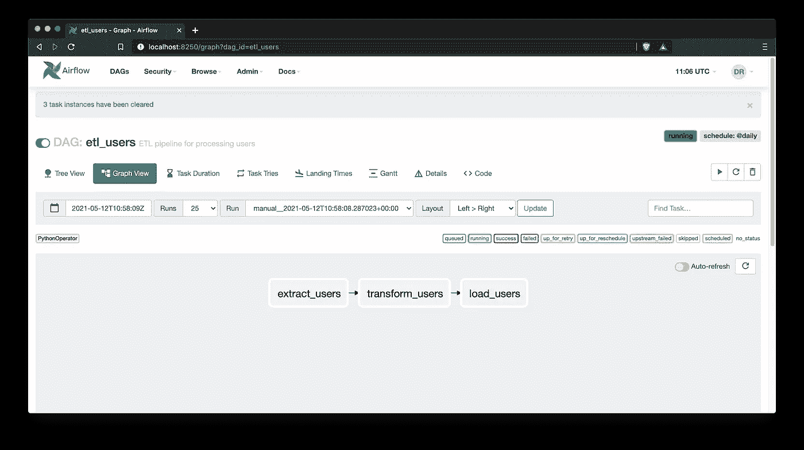
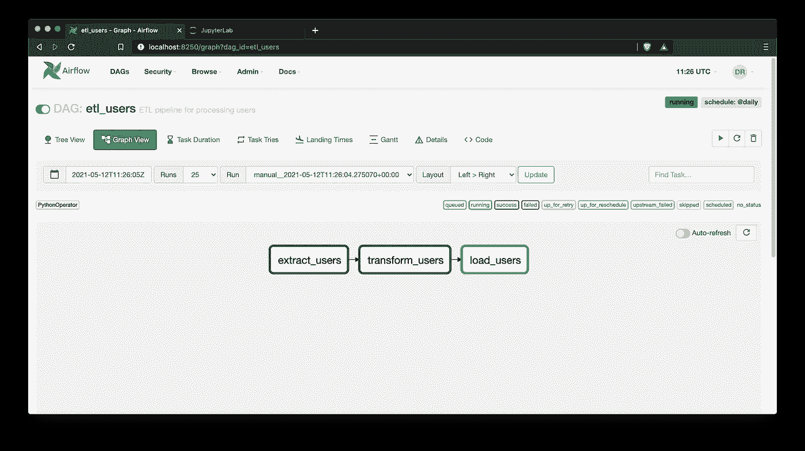
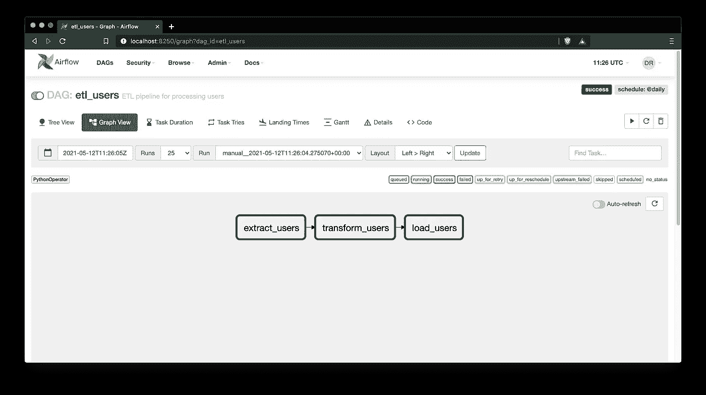
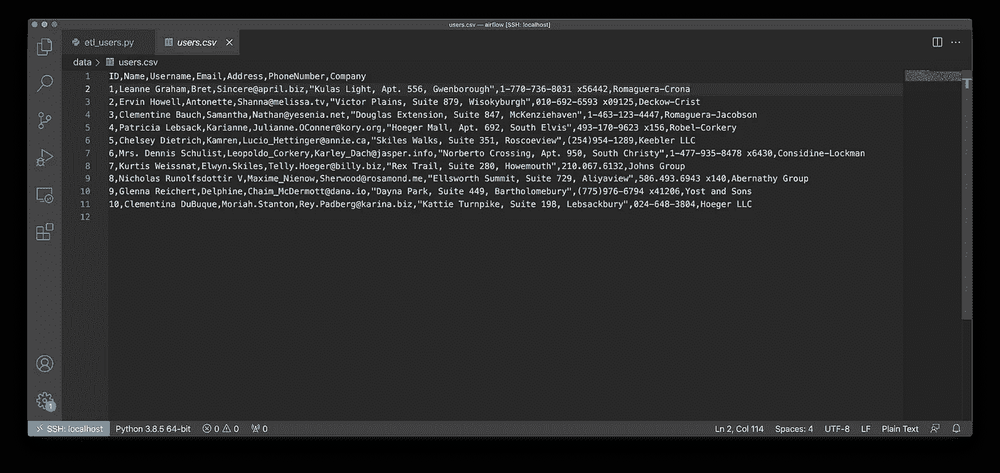

# 精通 Apache Airflow:用 Python 在几分钟内编写第一个 DAG

> 原文：<https://towardsdatascience.com/master-apache-airflow-write-your-first-dag-with-python-in-minutes-6c50b5d4aab1?source=collection_archive---------7----------------------->

## 下面是如何用 Apache Airflow 编写您的第一个 ETL 管道。

照片由[索伦·费伊萨](https://unsplash.com/@solenfeyissa?utm_source=unsplash&utm_medium=referral&utm_content=creditCopyText)在 [Unsplash](https://unsplash.com/s/photos/flow?utm_source=unsplash&utm_medium=referral&utm_content=creditCopyText) 拍摄

所以您已经配置了[气流环境](/master-apache-airflow-how-to-install-and-setup-the-environment-in-10-minutes-61dad52d5239)，但是接下来呢？你来对地方了。今天，您将一口气用 Python 编写第一个带有气流的 DAG。

如果您想了解如何设置 Apache Airflow 环境，这里有一篇适合您的文章:

 [## 掌握 Apache Airflow:如何在 10 分钟内安装和设置环境

### 了解如何设置和配置环境来编写您的第一个 DAG。

towardsdatascience.com](/master-apache-airflow-how-to-install-and-setup-the-environment-in-10-minutes-61dad52d5239) 

本文假设您已经配置了 Airflow 环境，启动了 webserver 和 scheduler，并且使用 Visual Studio 代码连接到了虚拟机。

这篇文章的结构如下:

*   问题描述
*   用于 ETL 管道的 Python 函数
*   写一个 DAG
*   测试
*   结论

# 问题描述

我们今天要做的事情相对简单——从虚拟 API 下载数据，对其进行转换，并将其保存为 CSV 格式。尽管如此，它将是一个完整的 ETL 管道。

幸运的是，网上有一个免费的虚拟 API—[JSON 占位符](https://jsonplaceholder.typicode.com/)。它包含虚假的用户数据等，这就是我们今天要用的。

数据看起来是这样的:

图 1-伪造的用户数据(作者提供的图片)

因此，从下一节开始，我们将定义几个 Python 函数来提取、转换和加载这些数据。

# 用于 ETL 管道的 Python 函数

让我们从在您的`dags`文件夹中创建一个 Python 文件开始——我将我的命名为`etl_users.py`。

任何 ETL 管道都需要实现提取、转换和加载数据的功能。

说到提取，事情很简单——我们向 API 端点发出 GET 请求，并将响应转换为 JSON 格式。我们还将做一件特定于气流的事情— XCOM 推送。这样做会将提取的结果保存到 Airflow 的数据库中，因此您可以使用它在任务之间进行通信。

这是完整的提取代码:

如果您想知道— `ti`代表*任务实例*，一个特定于气流的东西，用于标识任务。

开始变形了。这一次我们将执行 XCOM pull——从前面的函数中获取数据。然后，我们将只保留感兴趣的字段——ID、姓名、用户名、电子邮件、地址、电话号码和公司名称。最后，这个转换后的用户版本再次通过 XCOMs 推送到气流数据库:

最后，让我们来看看装货。该函数还执行 XCOM pull 来获取转换后的用户，然后将它们转换为 Pandas 数据帧，最后保存到所需的位置:

这就是我们所需要的！请记住——您可以使用`return`关键字来代替 XCOM 推送，但是我发现这种方法更加明确。

# 写一个 DAG

Apache Airflow 基于 Dag(有向无环图)的思想。这意味着我们必须为管道的各个部分指定任务，然后以某种方式安排它们。

为了简单起见，我们今天只处理基于`PythonOperator`的任务，但是值得指出的是，您可以使用更多的操作符。

第一个任务将通过使用`extract_users()`函数执行用户提取。在 Airflow 中，您可以使用`op_kwargs`参数为函数指定关键字参数。第二个任务将转换用户，最后一个任务将他们保存到一个 CSV 文件中。

最后，我们必须安排任务，这样 DAG 才能形成。你可以使用`>>`和`<<`操作符来完成，就像你马上会看到的那样。

以下是完整的 DAG 代码:

如你所见，`task_load_users`会将 CSV 文件保存到`data/`文件夹中。默认情况下不会有它，如果不手动创建它，Airflow 会抛出一个错误，所以请在继续之前创建它。

最后，整个`etl_users.py`文件应该如下所示:

如果您现在要打开 Airflow 服务器(`localhost:8250`在我的机器上，但是请检查您的 VM 端口转发)，您将会看到这样一个屏幕:

图 2-Apache air flow DAG 列表(图片由作者提供)

这意味着我们有测试所需的一切。

# 测试

首先，单击`etl_users` dag 并通过单击左上角的小开关按钮打开它:

图 3 —将 DAG 设置为活动(作者提供的图片)

您还可以在前面的图片中看到我们的 ETL 管道的简单流程——提取发生在转换之前，转换发生在加载之前。

我们已经安排 DAG 每天运行一次，但是您可以通过单击右上角的小播放按钮来手动触发它，您会立即看到 DAG 正在运行:

图 4 —手动触发 DAG(作者图片)

几乎立刻，您会在任务周围看到浅绿色或深绿色的边框。浅绿色表示任务正在运行，而它的深色兄弟表示任务已成功完成:

图 5 — DAG 正在运行(图片由作者提供)

最后，在执行完成后，您应该会看到所有任务周围有一个深绿色的边框，就像下图所示:

图 6 —成功的 DAG 执行(作者提供的图片)

不仅如此，你还可以在右上角看到“成功”的信息。

问题仍然存在— **我们如何验证 DAG 执行是否成功？**嗯，很容易。如果您还记得代码，CSV 文件应该保存在`data`文件夹中。

这是它在我的机器上的样子:

图 7 —保存的 CSV 文件(作者提供的图片)

这就是你的第一条有气流的狗。我希望这很容易理解。让我们在下一部分总结一下。

# 结论

正如您今天所看到的，Apache Airflow 对于基本的 ETL 管道实现来说非常容易。我们已经完成了最常见的`PythonOperator`，现在您知道如何在 DAG 任务中运行任何 Python 函数。

您还知道如何使用 XCOMs 在任务之间传输数据——这是 Airflow 中的一个必须知道的概念。

还有很多东西需要学习，所以如果您想了解数据库连接如何与 Airflow 一起工作，请继续关注。

*喜欢这篇文章吗？成为* [*中等会员*](https://medium.com/@radecicdario/membership) *继续无限制学习。如果你使用下面的链接，我会收到你的一部分会员费，不需要你额外付费。*

 [## 通过我的推荐链接加入 Medium-Dario rade ci

### 作为一个媒体会员，你的会员费的一部分会给你阅读的作家，你可以完全接触到每一个故事…

medium.com](https://medium.com/@radecicdario/membership) 

# 了解更多信息

*   [我作为数据科学家卖掉我的 M1 Macbook Pro 的三大理由](/top-3-reasons-why-i-sold-my-m1-macbook-pro-as-a-data-scientist-abad1226f52a)
*   [如何用 Cron 调度 Python 脚本——你需要的唯一指南](/how-to-schedule-python-scripts-with-cron-the-only-guide-youll-ever-need-deea2df63b4e)
*   [Dask 延迟——如何轻松并行化您的 Python 代码](/dask-delayed-how-to-parallelize-your-python-code-with-ease-19382e159849)
*   [如何使用 Python 创建 PDF 报告—基本指南](/how-to-create-pdf-reports-with-python-the-essential-guide-c08dd3ebf2ee)
*   [2021 年即使没有大学文凭也能成为数据科学家](/become-a-data-scientist-in-2021-even-without-a-college-degree-e43fa934e55)

# 保持联系

*   在 [Medium](https://medium.com/@radecicdario) 上关注我，了解更多类似的故事
*   注册我的[简讯](https://mailchi.mp/46a3d2989d9b/bdssubscribe)
*   在 [LinkedIn](https://www.linkedin.com/in/darioradecic/) 上连接