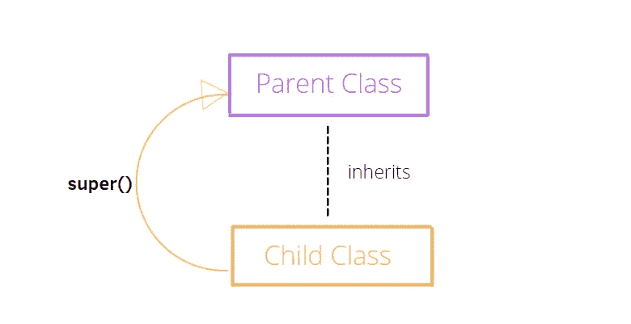
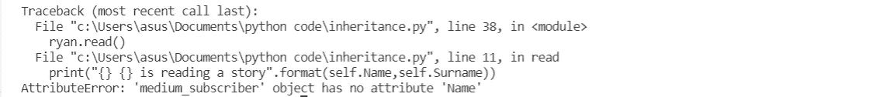

# Python 中的主类继承

> 原文：<https://towardsdatascience.com/master-class-inheritance-in-python-c46bfda63374?source=collection_archive---------4----------------------->

## 使用直观的例子理解 Python 继承

[David Wirzba](https://unsplash.com/@psalms) 在 [Unsplash](https://unsplash.com/photos/AK9ufbcsqGk) 上拍摄的照片

类和对象在 Python 中起着核心作用。每次你给一个变量赋值，你都在无意识地创建一个对象。这个对象属于一个特定的类，拥有特定的属性和方法。这些特征在[之前的文章](/explaining-python-classes-in-a-simple-way-e3742827c8b5?sk=f2644219c7a1b71bd23c302987481ed3)中有所涉及，在那篇文章中我提供了 Python 中类的快速概述。

但是 python 类不仅仅局限于这一方面，它们还具有**继承**的特征。继承的目标是重用一个已经构建好的类来创建一个新的类。通过这种方式，你不需要总是从头开始创建一个类，这个被称为**子类**的类将从另一个类**父类**继承属性和方法，这允许你减少代码行和冗余。

# 1.创建父类

作者插图

如前所述，子类基于父类。因此，第一步是创建父类。这个类将允许创建一个子类，避免编写相同的代码行。

例如，让我们定义一个`medium_user`类，它将使用`__init__`方法收集姓名、姓氏、用户名、电子邮件和布尔属性“subscriber”等信息，以检查用户是否是成员。而且有`read`、`clap`、`is_member`三种方法。

我们使用`medium_user`类创建一个对象，并执行所有的方法:

很好！我们定义了一个 medium 用户，它在 Medium 上没有任何订阅。但是在本例中，我们有一个中等会员，仍然缺少属性，比如他开始订阅的日期、会员类型和支付方式。要添加这些信息，我们需要定义子类。

# 2.创建子类

让我们构建`medium_subscriber`类，它将获得前面定义的`medium_user`类的属性和方法。为了逐步理解类继承是如何工作的，我们可以创建一个空类，简单地继承其他类的功能。

为了不添加任何属性或方法，使用了`pass`关键字。我们只指定了`medium_subscriber`类是`medium_user`类的子类。

和以前一样，我们构建了一个属于`medium_subscriber`类的新对象。如果我们尝试打印为`medium_user`类定义的属性和方法，我们肯定会注意到`medium_subscriber`继承了父类的所有功能。

# 3.使用 super()函数

在上一段中，我们只定义了一个空类，它继承了另一个类的属性和方法。但是我们想通过`__init__`构造函数方法添加属性。

`medium_subscriber`类也需要`super()`函数来继承父类的功能，否则，子类的构造函数方法**会覆盖**对父类`__init__`方法的继承。

首先，让我们在不使用 super()函数的情况下，看看它是如何工作的:

您可以观察到`medium_subscriber`类没有从`medium_user`类继承任何属性或方法。我们需要在`__init__`函数中使用`super()`函数添加一行代码。

现在，我们正确地添加了属性，而没有丢失父类的特征。首先，我们对`medium_subscriber`类说从另一个类获取属性和方法，然后，我们添加属性，比如他开始订阅的日期、成员类型和支付方式。

这个解决方案还有一个替代方案。您可以调用父级的`__init__`函数，来代替带有`super()`函数的行。是评论行，`medium_user.__init__(self,s_name,s_surname,s_username,s_email)`。通常最好使用`super()`函数来避免写入父类的名称。

# 最后的想法

这篇文章很好地总结了 Python 类中继承的概念。它提供了可重用性、可读性和冗余代码的减少。由于这些优点，它被广泛用于定义类。根据我的经验，我在使用 Pytorch 定义神经网络架构时遇到过这种情况。你可以在这里找到一个例子[，我在这里建立了一个卷积自动编码器。在这种情况下，`nn.Module`是父类，它提供了构建 autoencoder 类的所有构件，比如线性层、卷积层、激活函数等等。我希望这篇文章对你有用。感谢阅读。祝您愉快！](https://medium.com/dataseries/convolutional-autoencoder-in-pytorch-on-mnist-dataset-d65145c132ac)

你喜欢我的文章吗？ [*成为会员*](https://eugenia-anello.medium.com/membership) *每天无限获取数据科学新帖！这是一种间接的支持我的方式，不会给你带来任何额外的费用。如果您已经是会员，* [*订阅*](https://eugenia-anello.medium.com/subscribe) *每当我发布新的数据科学和 python 指南时，您都会收到电子邮件！*