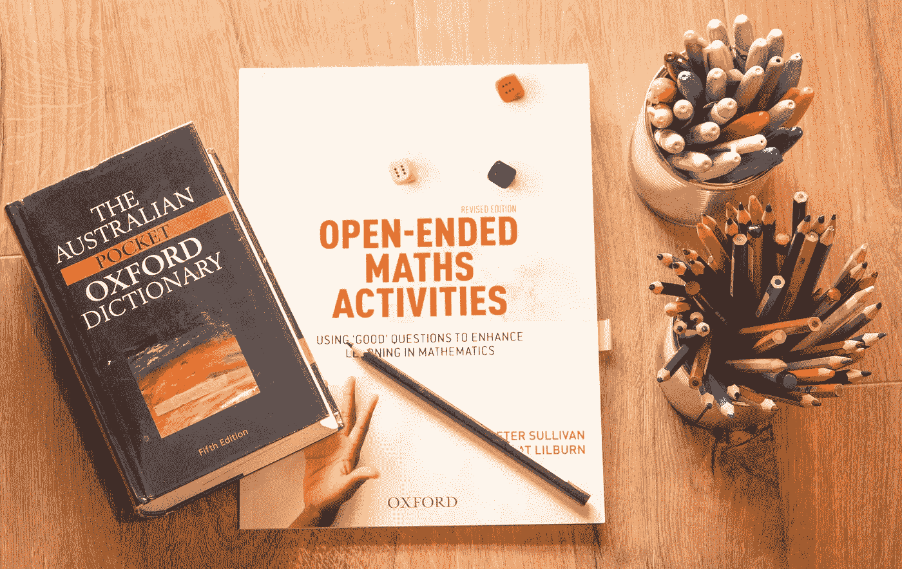

# Python 中的主数据结构字典从零到英雄，第 2 部分

> 原文：<https://towardsdatascience.com/master-data-type-dictionary-in-python-from-zero-to-hero-part-2-6513aad883de?source=collection_archive---------20----------------------->

## 数据结构和算法

## LeetCode 助你获得高薪数据科学职位



路易斯·基根在 [Unsplash](https://unsplash.com/s/photos/dictionary?utm_source=unsplash&utm_medium=referral&utm_content=creditCopyText) 上的照片

# 介绍

Python 是一种流行的脚本编程语言，它提供了各种数据结构，包括[数组](https://www.w3schools.com/python/python_arrays.asp)、[集合](https://www.w3schools.com/python/python_sets.asp)、[堆栈](/how-to-solve-python-coding-questions-using-stack-94571f31af3f?sk=82ce6f24681521226a4619d3d660dda9)、[字符串](/python-string-manipulation-for-data-scientists-in-2021-c5b9526347f4?sk=01b9defd7130d5e3f518d3503cc3bbf1)、[字典](/master-python-dictionary-for-beginners-in-2021-1cdbaa17ec45?sk=1e841ed0bc3eed23b07b80260a925938)、[堆](https://www.geeksforgeeks.org/heap-queue-or-heapq-in-python/)等。它们拥有独特的特征，服务于不同的目标。因此，我们应该选择最符合我们需求的数据类型。

像 Javascript 和其他语言一样，Python 也提供散列表来存储由散列函数生成的数据元素的索引值。因此，当键值成为值的索引或标识符时，它使得数据访问和检索更快。概括地说，我们必须遍历整个数组/列表来访问元素，这对于大型列表来说可能很耗时。

在之前的[博客文章](/master-python-dictionary-for-beginners-in-2021-1cdbaa17ec45)中，我们已经讨论了字典的基础及其应用。在今天的帖子中，我们将深入探讨这个话题，并回答 5 个由主要技术人员提出的真实面试问题。

对于我的数据科学家同事来说，如果你正在准备数据相关的面试，这是必读的。

让我们回顾一下:Python 中的字典有三个主要特征。

> *#1 字典没有排序，所以我们不能用位置来访问元素；相反，我们必须使用键值对。*
> 
> ictionary *是可变的，这允许我们更新它的元素。*
> 
> *#3 不允许重复键。*

为了从字典中检索键、值和键值对，我们分别使用以下命令:

> 字典 _1.keys()
> 
> dictionary_1.values()
> 
> dictionary_1.items()

这些命令是构建模块，在我们试图回答更复杂的面试问题时会派上用场。

# 如何参与这篇博文？

对于我所有的编程帖子，我都花了很多时间从几十个面试问题池中精心挑选问题，根据难度级别对它们进行排序，并撰写专门为数据科学家量身定制的详细答案。

如果可能的话，我建议你先按现在的顺序阅读这篇文章，然后暂停一分钟，思考你将如何处理这个问题，然后再寻找解决方案。

*完整的 Python 代码请参考我的*[*Github*](https://github.com/LeihuaYe/Python_LeetCode_Coding)*。*

# 问题 1:计算一致字符串的数量

<https://leetcode.com/problems/count-the-number-of-consistent-strings/>  

> -给你一个允许的字符串，由不同的字符和一组字符串单词组成。如果字符串中的所有字符都出现在允许的字符串中，则该字符串是一致的。
> 
> -返回数组字中一致字符串的数量。
> 
> - Input: allowed = "ab "，words = ["ad "，" bd "，" aaab "，" baa "，" badab"]
> — Output: 2
> —解释:字符串" aaab "和" baa "是一致的，因为它们只包含字符' a '和' b '

# 走过我的思考

Robinhood 在他们的面试过程中包含了这个问题。

快速翻译一下问题: ***字*** 数组中有多少字符串同时出现在 ***允许的*** 字符串中？

字符串可以包含重复的字符。例如，' ***aaab*** '应该被计数，因为两个字符( ***a*** '和' ***b*** ')都出现在 ***允许的*** 字符串中。**这是问题的断点。**我们可以迭代 ***字*** 数组中的元素，并将其转换为一个集合，不允许重复。然后，统计减少列表中有多少元素( ***新增*** )还出现在 ***允许*** 字符串的另一个循环中。

# 解决办法

```
2
```

## 外卖食品

*   一个集合在 Python 中是唯一的。它不允许重复。
*   issubset():当您试图理解两个集合之间的关系时，这很方便。
*   这里有一个常见的误解:issubset()可以用来测试两个集合之间的关系，正如大多数数据科学家所假设的那样，实际上，它可以测试一个字符串和一个集合之间的关系，如问题 1 所示。

# 问题 2:一个盒子里的最大球数，微软

<https://leetcode.com/problems/maximum-number-of-balls-in-a-box/>  

> -您在一家球厂工作，在那里您有 n 个球，编号从下限到上限(包括上限)(即 n ==上限-下限+ 1)，以及从 1 到无穷大的无限多个盒子。你在这个工厂的工作是把每个球放进盒子里，盒子上的数字等于球的数字总和。例如，球号 321 将被放入箱号 3 + 2 + 1 = 6，球号 10 将被放入箱号 1 + 0 = 1。
> -给定两个整数 lowLimit 和 highLimit，返回球数最多的盒子中的球数。
> 
> - Input: lowLimit = 1，highLimit = 10
> — Output: 2
> —说明:
> 箱号:1 2 3 4 5 6 7 8 9 10 11 …
> 球数:2 1 1 1 1 1 1 1 1 1 1 1 0 0…
> —箱号最多，有 2 个球。

# 走过我的思考

微软包括这个问题。

老实说，这没有任何意义，我花了几分钟才明白要点。快速翻译是合适的。

> 1.迭代从下限到上限的范围
> 
> 2.计算每个数字的数字总和
> 
> 3.统计每个位置出现的次数

在步骤 1 中，我们在 for 循环中迭代范围(下限，上限+1)。注意，我们必须在 highLimit 上加 1 才能包含它；否则，我们排除上界。

在步骤 2 中，我们将元素转换成字符串，并对数字进行迭代。记住，整数对象是不可迭代的，所以要转换成字符串；为了数学计算，把它变回整数。

在第 3 步中，我们创建一个新的字典来存储键-值对:为第一次出现的键-值对赋值 0，为重复出现的键-值对值加 1。

# 解决办法

```
2
```

## 外卖食品

*   整数对象是不可迭代的，我们需要把它转换成字符串来访问。
*   如果需要，将数据类型改回整数以进行数学计算。


安德烈亚斯·古尔霍恩在 [Unsplash](https://unsplash.com/s/photos/nature?utm_source=unsplash&utm_medium=referral&utm_content=creditCopyText) 上拍摄的照片

# 问题 3:相对排序数组，由亚马逊

<https://leetcode.com/problems/relative-sort-array/>  

> -给定两个数组 arr1 和 arr2，arr2 的元素是不同的，arr2 中的所有元素也在 arr1 中。
> -对 arr1 的元素进行排序，使 arr1 中项目的相对顺序与 arr2 中的相同。arr2 中没有出现的元素应该按升序放在 arr1 的末尾。
> —例一:
> —输入:arr1 = [2，3，1，3，2，4，6，7，9，2，19]，arr2 = [2，1，4，3，9，6]
> —输出:[2，2，2，1，4，3，3，9，6，7，19]

# 走过我的思考

亚马逊问这个问题。

这个问题有两个部分。

> 1.对 arr1 和 arr2 中的共享元素进行排序，并保持 arr1 中的相对顺序。
> 
> 2.按升序排列不在 arr2 中的元素。

先解决第一部分。保持 arr2 中的原始顺序相对容易，棘手的是有些元素出现不止一次。

> 怎样才能让这些重复的元素保持原来的顺序呢？
> 
> 一本字典！

以下是方法。我们对每个元素的出现次数进行计数，并将它们乘以 arr2 中的元素，这允许我们在保持原始顺序的同时对出现次数进行计数。

花一些时间来弄清楚它是可以的，因为这需要我几轮的尝试和错误。

为了解决第二部分，我们对 arr1 中没有出现在 arr2 中的元素进行分组和排序。

最后，结合第 1 部分和第 2 部分的结果，我们就完成了。

# 解决办法

```
[2, 2, 2, 1, 4, 3, 3, 9, 6, 7, 19]
```

## 外卖食品

*   理解 extend()和 append()之间的区别。
*   使用字典存储出现的值。
*   收藏。Counter()对于计数很有用。

# 问题 4:在一个数组中找到所有的重复项，脸书、亚马逊和微软

<https://leetcode.com/problems/find-all-duplicates-in-an-array/>  

> -给定一个长度为 n 的整数数组 nums，其中 nums 的所有整数都在范围[1，n]内，并且每个整数出现一次或两次，返回出现两次的所有整数的数组。
> 
> -您必须编写一个在 O(n)时间内运行的算法，并且只使用常量额外空间。
> 
> -输入:nums = [4，3，2，7，8，2，3，1]
> -输出:[2，3]

# 走过我的思考

脸书、亚马逊和微软都包括它。

有两个触发词——一次*和两次*——我们必须根据它们的出现来选择案例。此外，我们必须在 O(n)时间和恒定的额外空间内完成。**

**为了计算出现次数，我们创建了一个包含键值对的字典，并在 ***nums*** 数组上迭代它。或者，我们可以使用集合。Counter()来创建键值对。它们产生相同的结果。然后，选择值(即发生次数)等于 2 的事例。**

# **解决办法**

```
**[3, 2]**
```

## **外卖食品**

*   **了解如何使用字典存储键值对。**
*   **如何根据值的出现来选择值。**

# **问题 5: 4Sum II，亚马逊和 Adobe**

**<https://leetcode.com/problems/4sum-ii/>  

> -给定四个长度均为 n 的整数数组 nums1、nums2、nums3 和 nums4，返回元组(I，j，k，l)的数目，使得:
> 
> -0<= i, j, k, l < n
> —num S1[I]+num S2[j]+num S3[k]+num S4[l]= = 0

# 走过我的思考

亚马逊和 Adobe 都问这个问题。

简单翻译一下:我们需要从每个整数数组中挑选一个元素，形成一个总和为 0 的元组。

一种粗暴的强制方法是使用四个嵌套的 for 循环迭代数组，并检查总和是否等于 0。然而，它的时间复杂度将是 O(n⁴)并且不能通过测试运行。

让我们再检查一下这个问题，寻找更好的方法。

我们感兴趣的是元组(I，j，k，l)的个数使得`*nums1[i] + nums2[j] + nums3[k] + nums4[l] == 0*.`从另一个角度看，方程变成了`*nums1[i] + nums2[j] = — (nums3[k] + nums4[l]),*`并计算右边有多少对等于左边。

> 数数有多少对？
> 
> 听起来很熟悉。
> 
> 我们可以应用一个字典来存储键值对。

下面是代码分解。

1.  从 ***nums1*** 和 ***nums2*** 计算成对和，并将和存储在字典中。第一次为 0，如果已经存在，则递增 1。
2.  统计 ***nums3*** 和 ***nums4*** ( `*— (nums3[k] + nums4[l])*`)的成对和等于步骤 1 ( `*nums1[i] + nums2[j]*`)的负和的次数。

# 解决办法

```
2
```

## 外卖食品

*   学习如何转换所提的问题，并从不同的角度看待它。
*   用字典来计算。** 

***完整的 Python 代码请参考我的*[*Github*](https://github.com/LeihuaYe/Python_LeetCode_Coding)*。***

# **结论**

*   **熟能生巧。**
*   **在数据科学面试中破解编码问题的最佳方法是理解每一步的逻辑，然后编写代码。**
*   **字典不是独立的数据类型；它通常与其他功能相结合。**

***Medium 最近进化出了它的* [*作家伙伴计划*](https://blog.medium.com/evolving-the-partner-program-2613708f9f3c) *，支持像我这样的普通作家。如果你还不是订户，通过下面的链接注册，我会收到一部分会员费。***

**<https://leihua-ye.medium.com/membership> ** 

# **我的数据科学面试顺序:**

**</crack-data-science-interviews-five-sql-skills-for-data-scientists-cc6b32df1987>  </how-to-solve-python-coding-questions-using-stack-94571f31af3f>  </5-python-coding-questions-asked-at-faang-59e6cf5ba2a0>  

# 喜欢读这本书吗？

> 请在 [LinkedIn](https://www.linkedin.com/in/leihuaye/) 和 [Youtube](https://www.youtube.com/channel/UCBBu2nqs6iZPyNSgMjXUGPg) 上找到我。
> 
> 还有，看看我其他关于人工智能和机器学习的帖子。**