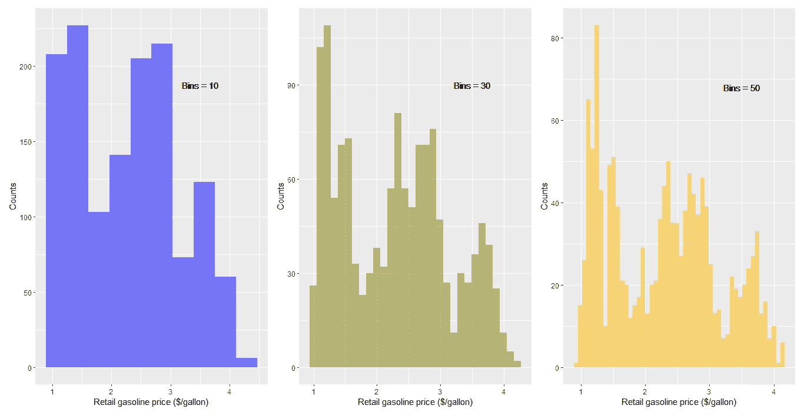
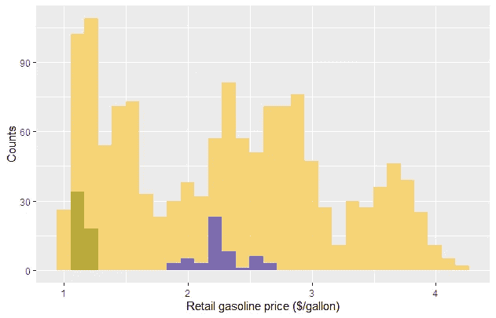
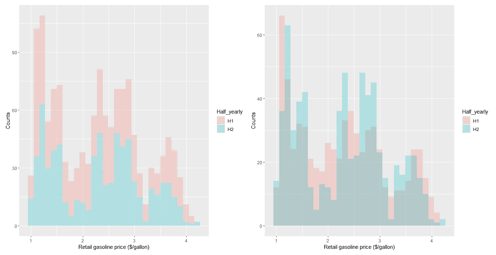
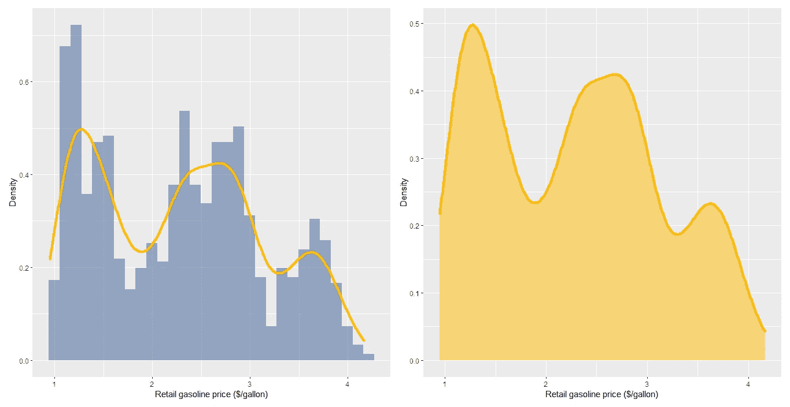
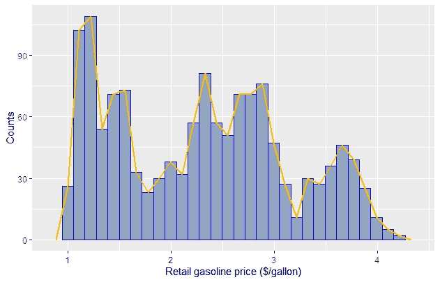
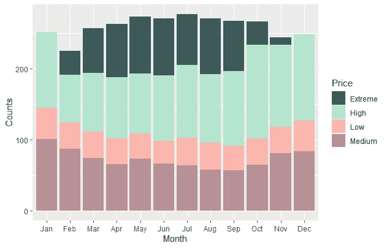
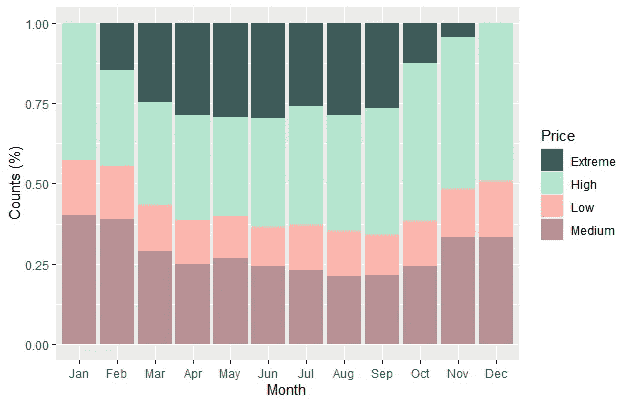
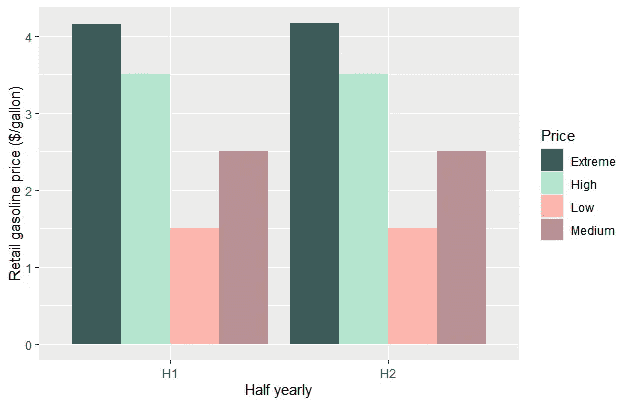
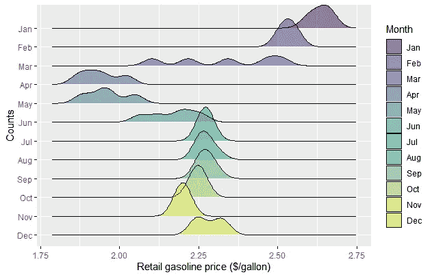

# 使用 ggplot2 实现主数据可视化:直方图、条形图和密度图

> 原文：<https://towardsdatascience.com/master-data-visualization-with-ggplot2-histograms-bar-and-density-plots-86c8290c9adc?source=collection_archive---------10----------------------->

## [动手教程](https://towardsdatascience.com/tagged/hands-on-tutorials)

## 关于何时以及如何在 R 中使用直方图、条形图和密度图的指南

卢克·切瑟在 [Unsplash](https://unsplash.com?utm_source=medium&utm_medium=referral) 上拍摄的照片

这是使用`ggplot2`包创建数据可视化系列的第二篇文章。教程列表如下:

1.  *散点图和箱线图*
2.  ***直方图、条形图和密度图***
3.  *圆形图(饼图、蜘蛛图和条形图)*
4.  *主题()*:为增加的工作流程创建您自己的主题()

在本文中，我们将介绍直方图、条形图和密度图之间的区别，何时使用它们，以及如何绘制不同的变化。

> 直方图和柱状图的主要区别在于直方图用于绘制定量变量的频率分布，而柱状图用于绘制分类变量的频率分布。

别浪费时间了，让我们开始吃吧。

# 数据和包

1995-2021 年间的每周汽油和柴油零售价格数据来自 Kaggle。数据集可以从[这里](https://www.kaggle.com/mruanova/us-gasoline-and-diesel-retail-prices-1995202)下载。出于绘图目的，仅考虑 A1 汽油价格。通过提取给定价格的年、月和周数据来创建新列。此外，零售价格被分类为低、中、高和极限，并被分配给`Price`变量。另一个创建的变量是`Half_yearly`,用于将一年分为两个半年或两个类别进行演示。

除了在本系列的[第 1 部分](/master-data-visualization-with-ggplot2-scatter-and-box-plots-2f0c14cf2b26?sk=d68131a2be91f5b698d9b1652f244bc6)中已经讨论过的套件之外，使用的其他套件有:

*:用于处理 R 中的日期和时间*

****山脊*** :用于绘制密度山脊图*

# *直方图*

*我们将使用`geom_histogram()`函数绘制直方图。直方图用于绘制连续的单个变量。基本上，直方图所做的是绘制变量在数据中出现的频率。*

*现在，让我们从绘制 1995-2021 年的汽油价格开始。因此，根据数据分布，可以调整仓。通过调整仓，我们划分 x 轴间隔大小。默认情况下，`geom_histogram()`中的`bins`值为 30。在下图中，我们绘制了 10、30 和 50 这三种不同箱子尺寸的数据。通过更改框的大小，x 轴间隔会发生变化。随着条柱数量的增加，x-间隔值不断变小，这从条柱的厚度可以明显看出。*

**

*作者图片*

*直方图的另一种变化是显示重叠。这可以通过两种方式实现。第一种是在母数据上重叠数据子集。在本例中，我们重叠了前一年的数据，并将其与 20 多年来的汽油总价格分布进行比较。这是通过在使用`subset`对数据进行子集化后向直方图添加层来实现的。假设我们想要比较 2 个不同年份的值与总分布，然后我们添加 3 层直方图。附加直方图的数据作为母数据的子集。在下图中，我们比较了 1995 年和 2020 年的价格分布。这张图清楚地显示了总量的分布情况以及汽油价格的变化，因此比较起来很容易。*

**

*作者图片*

*重叠直方图的第二种可能性是当数据集被分段时。如下例所示，通过在`geom_histogram()`中添加`position = “identity”`参数，堆叠直方图转换为重叠直方图，如下图所示。在比较这两个图时，可以看到重叠区域中计数的变化，因为之前堆叠的数据由于聚合而具有更高的计数，但是在第二个图中不是这种情况，因为数据现在彼此重叠，并且给出了半年数据如何比较的更好的图像。*

**

*默认绘图(左)，position=" identity "(右)(图片由作者提供)*

# *密度图*

*密度图表示数值变量的分布。使用`geom_density()` 功能绘制。它可以单独绘制，也可以通过添加图层叠加在直方图上。为了在直方图上重叠密度图，我们必须将`aes(y=..density..)`定义为`geom_histogram()`函数的参数。线条粗细或线条类型可由`geom_density()`函数中的以下参数控制:分别为`size`和 `linetype`。*

**

*作者图片*

# *频率图*

*像密度图一样，我们可以使用频率图。两者的区别在于，频率图连接直方图的计数，而密度图谈论分布。我们使用`geom_frequency()`功能进行绘图。*

**

*作者图片*

# *条形图*

*条形图用于比较分类数据的性能。因此，为了使给定的数据分类，我们将汽油价格分为 4 个不同的类别，即低、中、高和极端价格范围。我们使用`geom_bar()`功能进行绘图。`geom_bar()`函数中的一个关键参数是`stat=”identity”`。还有另一个有趣的论点是`position`。`position`参数告诉分类数据的条形如何排列。`position`参数的默认值将条形堆叠在一起，y 轴值是总的聚合值。当`position=fill`时，对百分比份额进行堆叠，y 轴的最大值为 1 或 100%。如果是`position=dodge`，则如`half_yearly`的数据所示，水平堆叠。*

**

*默认绘图(图片由作者提供)*

**

*位置=填充(图片由作者提供)*

**

*position =道奇(图片由作者提供)*

# *密度脊线图*

*所有图中最后也是最有趣的是密度脊线图。这些图是沿 y 轴堆叠的密度图的延伸。它们在理解随时间和空间发生的变化时提供了视觉清晰度。`geom_density_ridges()`功能来自`ggridges`包。在该图中，我们可以观察到 2020 年不同月份的汽油价格分布。*

**

*作者图片*

# *结论*

*在本文中，我们展示了直方图和条形图之间的区别，图表适用于哪种类型的变量，以及不同的变量。此外，我们还学习了如何构建以下地块:*

1.  *直方图*
2.  *密度图*
3.  *频率图*
4.  *条形图*
5.  *密度脊线图*

*我希望这很有见地，在本系列的下一篇文章中，我们将讨论圆形图:饼图、蜘蛛图和条形图。*

*如果您错过了本系列的第一篇文章，或者对更多关于数据可视化的文章感兴趣，请查看以下内容:*

* [## 使用 ggplot2 的主数据可视化:散点图和箱线图

### 使用散点图和箱线图的数据可视化指南

towardsdatascience.com](/master-data-visualization-with-ggplot2-scatter-and-box-plots-2f0c14cf2b26)  [## 使用 ggplot2 的数据可视化:值得了解的 5 个特性

### 使用 ggplot2 包提高 dataviz 效率的技巧

towardsdatascience.com](/data-visualization-using-ggplot2-5-features-worth-knowing-c0447a760335)  [## 为数据可视化创建自己的调色板——第 1 部分

### 为数据可视化创建个人调色板的全面颜色指南。

towardsdatascience.com](/creating-your-own-color-palette-for-data-visualization-part-1-84df48954845)  [## 为数据可视化创建自己的调色板——第 2 部分

### 平衡色调、色调和饱和度，以生成完美的颜色渐变。

towardsdatascience.com](/creating-your-own-color-palette-for-data-visualization-part-2-7b02ebc31c19) 

完整代码的链接是[这里是](https://github.com/amalasi2418/Blog-post/tree/master/ggplot2%20tutorial%202)。

您可以在 [LinkedIn](https://www.linkedin.com/in/abhinav-malasi/) 和 [Twitter](https://twitter.com/malasi_abhinav) 上与我联系，跟随我的数据科学和数据可视化之旅。*