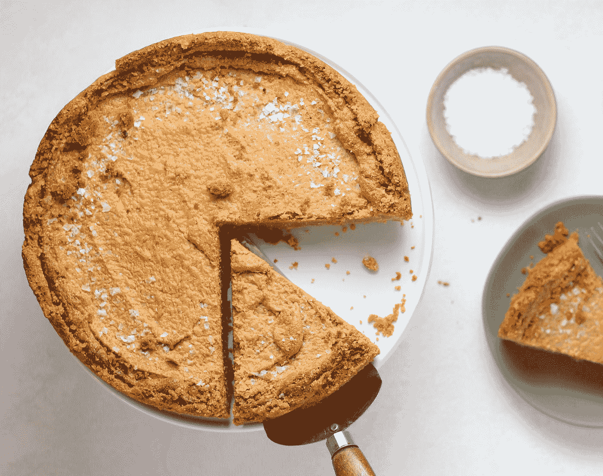
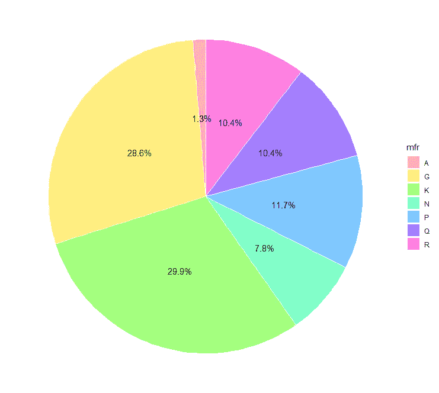
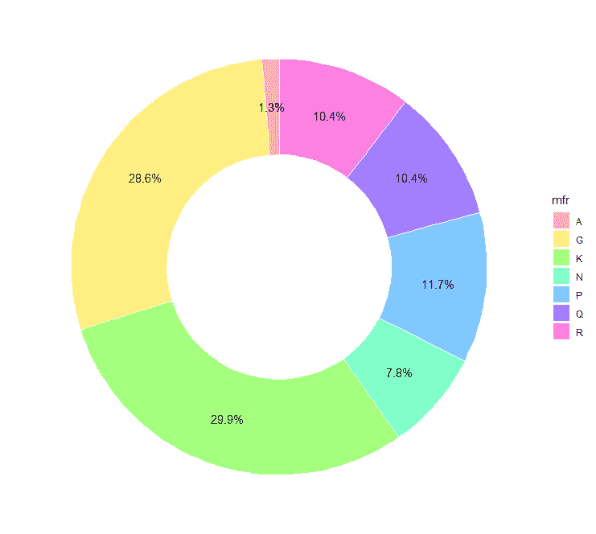
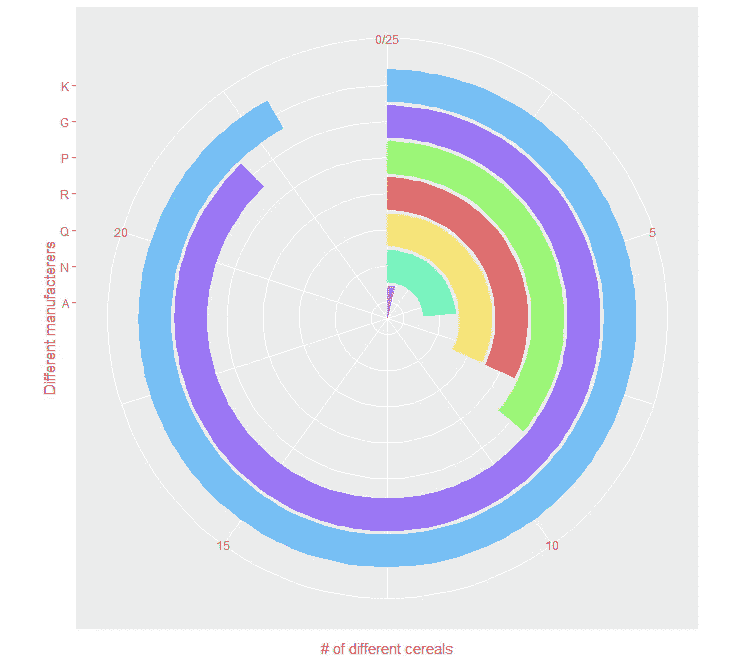
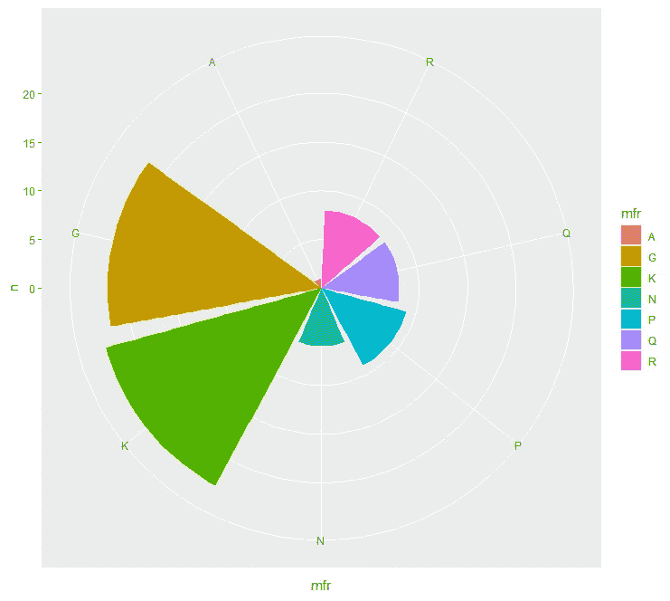
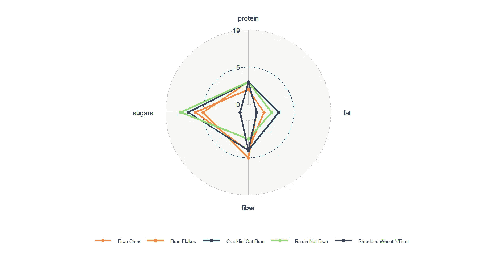

# 使用 ggplot2 实现主数据可视化:饼图、蜘蛛图和条形图

> 原文：<https://towardsdatascience.com/master-data-visualization-with-ggplot2-pie-charts-spider-plots-and-bar-plots-899a07a15827?source=collection_archive---------10----------------------->

## 关于在 R 中创建饼图、蜘蛛图和圆形条形图的指南

[谢里·西尔弗](https://unsplash.com/@sheri_silver?utm_source=medium&utm_medium=referral)在 [Unsplash](https://unsplash.com?utm_source=medium&utm_medium=referral) 上的照片

在使用 ggplot2 的数据可视化系列的第三部分中，我们将关注圆形图。教程列表如下:

1.  *散点图和箱线图*
2.  *直方图、条形图和密度图*
3.  ***圆形图(饼图、蜘蛛图和条形图)***
4.  *主题()*:为增加的工作流程创建您自己的主题()

因此，在循环可视化下，我们将介绍如何创建以下图表:

1.  饼图
2.  蜘蛛图
3.  圆形条形图

此外，我们将讨论使用这些类型的可视化的利弊。

> **权力越大，责任越大，明智地使用饼状图和蜘蛛图。**

# 数据和包

为了创建圆形图的视觉效果，我们将使用 Kaggle 的早餐[谷物数据集](https://www.kaggle.com/crawford/80-cereals)。该数据集有 16 个领域的 77 种独特的谷物类型。

我们将创建两个新变量:*manufacture*(包含不同谷物制造商的数量)和*谷类 _ 麸皮 _ 低*(卡路里值在 80 到 120 之间的选定麸皮谷类品牌的过滤营养数据)。

在本系列的第三部分，像往常一样，我们将使用广泛使用的基本包`ggplot2`和`tidyverse`。除此之外，对于绘制蜘蛛或雷达图，将使用`ggradar`包。

# 饼图

为了创建饼图，我们将使用`manufact`变量。虽然 R 中的基本绘图有`pie()`功能，但是`ggplot2`包中没有定义创建饼图的功能。为了让我们使用 ggplot2 绘制饼图，我们将使用`geom_bar()`和`coord_polar()`函数来创建圆的线段。`coord_polar()`功能将笛卡尔坐标转换到极坐标系统，这样很容易创建圆形图。在`coord_polar()`函数中，`ggplot()`美学的 x 参数被指定为`x=“ ”`，而`theta`参数被指定为`y`值。

***将条形图转换为饼图，在*** `***geom_bar()***` ***中设置*** `***stat=“identity”***` ***，并固定*** `***width=1***` ***。***

**优点**:比较少量数据点时有用。

**缺点**:难以解释大型数据集，难以描绘长期趋势

作者图片

饼图的修改导致了圆环图。可以通过控制`ggplot()`美学的 x 参数来控制甜甜圈的大小和厚度。 ***确保 x 参数的值位于 xlim 范围之间。***

作者图片

# 靶心图

为了创建圆形条形图，在`geom_bar()`功能中设置参数`stat=“identity”`。径向向外时，确保按长度递增的顺序排列钢筋。用于将条形图转换为圆形方向，在`coord_polar()`功能中设置参数`theta=“y”`。如果彩条完成了一个完整的回合，那么图表将像一个靶心，因此得名。

作者图片

# 统计图

简单地改变靶心图中的单个参数会导致鸡冠图。如果在`coord_polar()`函数中`theta=“y”`变成了`theta=“x”`,我们得到的不是赋值`theta=“y”`,而是统计图。

作者图片

# 蜘蛛图

目前，`ggplot2`包中没有创建蜘蛛图或雷达图的功能。`ggradar`包与`ggplot2`包兼容，可用于创建蜘蛛图。在 ggradar()函数中，与在 ggplot()函数中一样，可以定义美学。需要的几个重要参数是:

*values.radar* :打印圆形网格线的最小值、中间值和最大值。

*grid.min* :网格的最小值

*grid.mid* :网格的中间值

*grid.max* :网格的最大值

**优点**:如果所有变量都有相同的尺度，就容易理解了。

**缺点**:刻度单位不同时比较困难，圆形图解释困难。

作者图片

绘制所有图表的完整代码。

# 结论

因此，在本教程中，我们看到了如何创建饼图，蜘蛛图，鸡冠图，牛眼图。确定了如何通过改变`ggplot()`函数或`geom_bar()`函数中的几个参数，将饼图轻松转换为除蜘蛛图之外的其他图表类型。我们进一步讨论了使用圆形图表类型(尤其是流行的饼图和蜘蛛图)的利与弊，并看到通常不鼓励使用这些图表，而是使用易于理解和解释的替代图表。

本系列或使用`ggplot2`包的可视化的进一步阅读。

 [## 使用 ggplot2 的主数据可视化:散点图和箱线图

### 使用散点图和箱线图的数据可视化指南

towardsdatascience.com](/master-data-visualization-with-ggplot2-scatter-and-box-plots-2f0c14cf2b26)  [## 使用 ggplot2 实现主数据可视化:直方图、条形图和密度图

### 关于何时以及如何在 R 中使用直方图、条形图和密度图的指南

towardsdatascience.com](/master-data-visualization-with-ggplot2-histograms-bar-and-density-plots-86c8290c9adc)  [## 使用 ggplot2 的数据可视化:值得了解的 5 个特性

### 使用 ggplot2 包提高 dataviz 效率的技巧

towardsdatascience.com](/data-visualization-using-ggplot2-5-features-worth-knowing-c0447a760335)  [## 为数据可视化创建自己的调色板——第 1 部分

### 为数据可视化创建个人调色板的全面颜色指南。

towardsdatascience.com](/creating-your-own-color-palette-for-data-visualization-part-1-84df48954845)  [## 为数据可视化创建自己的调色板——第 2 部分

### 平衡色调、色调和饱和度，以生成完美的颜色渐变。

towardsdatascience.com](/creating-your-own-color-palette-for-data-visualization-part-2-7b02ebc31c19) 

参考

1.  [https://www.kaggle.com/crawford/80-cereals](https://www.kaggle.com/crawford/80-cereals)
2.  [https://blog . Scott logic . com/2011/09/23/a-critical-of-radar-charts . html # chart 2](https://blog.scottlogic.com/2011/09/23/a-critique-of-radar-charts.html#chart2)
3.  【https://www.data-to-viz.com/caveat/spider.html 

完整代码的链接是这里的。

您可以在 [LinkedIn](https://www.linkedin.com/in/abhinav-malasi/) 和 [Twitter](https://twitter.com/malasi_abhinav) 上与我联系，跟随我的数据科学和数据可视化之旅。