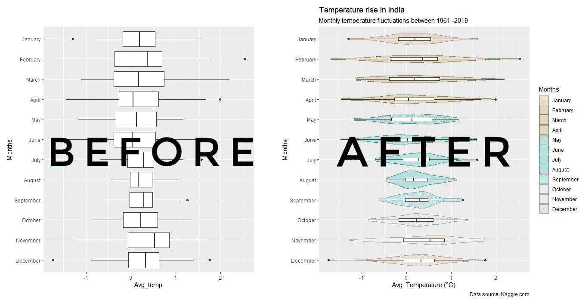
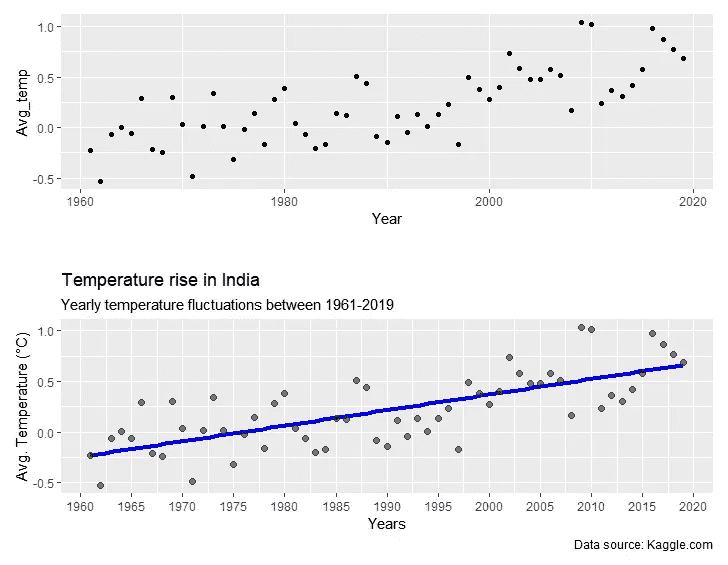
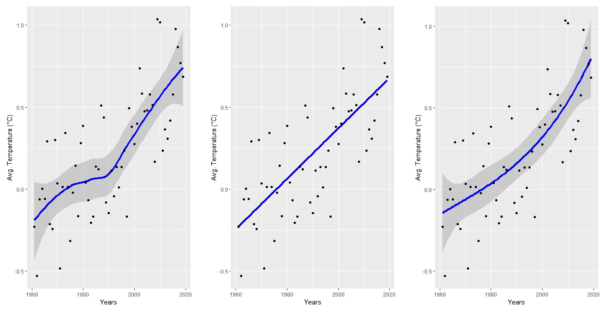
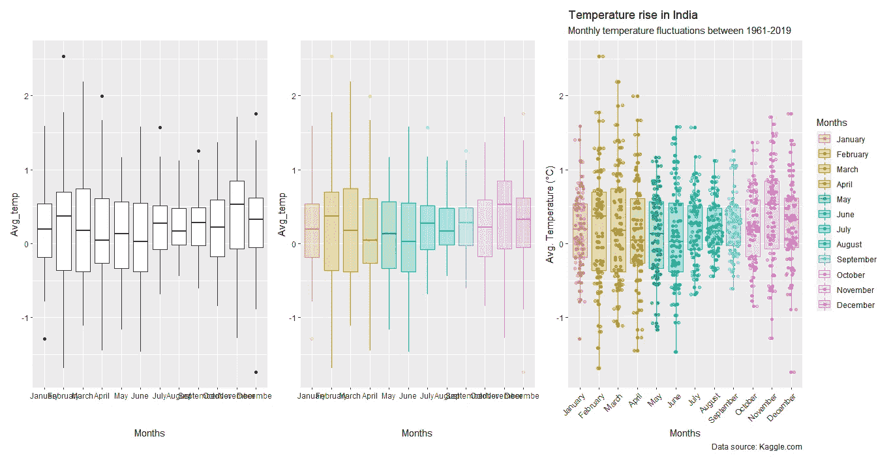
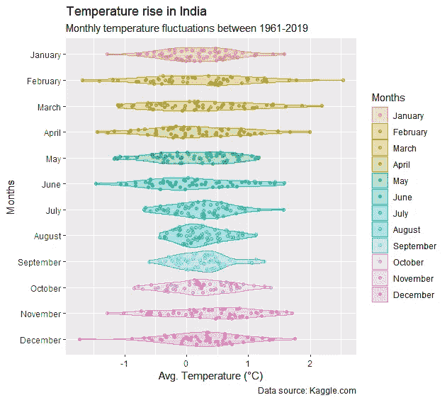
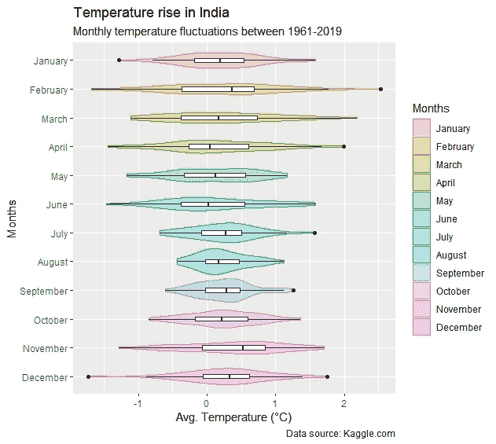

# 使用 ggplot2 的主数据可视化:散点图和箱线图

> 原文：<https://towardsdatascience.com/master-data-visualization-with-ggplot2-scatter-and-box-plots-2f0c14cf2b26?source=collection_archive---------17----------------------->

## 实践教程

## 使用散点图和箱线图的数据可视化指南

照片由 [Myriam Jessier](https://unsplash.com/@mjessier?utm_source=medium&utm_medium=referral) 在 [Unsplash](https://unsplash.com?utm_source=medium&utm_medium=referral) 上拍摄

关注仪表板或数据可视化的用户天生依赖于`ggplot2`包。它是基于图形语法绘制数据的通用软件包。其背后的想法是使用美学、比例和层次等语义来构建可视化。

这里有一个 goto 教程系列，适合那些在手头时间有限的情况下寻找快速解决方案来完善其可视化效果的人。这是一个由四部分组成的系列，讨论如何使用`ggplot2`包和其他附加包绘制不同风格的图。这些教程如下:

1.  ***散点图和箱线图***
2.  *条形图、直方图和密度图*
3.  *圆形图(饼图、蜘蛛图和条形图)*
4.  *主题()*:为增加的工作流程创建您自己的主题()

在本教程中，我们将创建散点图和箱形图。在本教程之后，你将能够做出更好的可视化效果，如下所示。

学习从默认情节创建有效的可视化(图片由作者提供)

# 数据集和包

在本教程中，我们将使用大多数国家 1961 年至 2019 年间记录的全球温度变化。数据集可以从[这里](https://www.kaggle.com/sevgisarac/temperature-change)下载。目前，我们将关注发生在印度的温度变化。

本教程使用的包有:

`tidyverse`:用于为绘图目的以正确格式获取数据集的所有操作

`ggplot2`:用于绘制数据

`ggforce`:利用数据的密度分布控制抖动的宽度

`patchwork`:将不同的地块组合成一幅图像

一旦根据要求加载了包并处理了数据，我们就可以创建我们的第一个图了。我们将从散点图开始，然后转到箱线图。

## 散点图

这是做 EDA 时最受欢迎的 goto 图之一。这些图用来显示多个变量之间的关系。在下图中，顶部的图是默认的散点图，只使用了`geom_point()`，没有任何美感或附加层。

作者图片

因此，为了增加散点图的价值，我们在轴上添加了标题、副标题、题注、标题。对上述图的进一步补充是给数据添加一条拟合线，使其更有意义。拟合提供了更多的信息，给出了趋势的概述和变量之间的相关性。我们给数据添加了一个线性拟合，显示了多年来气温上升的积极趋势。通过将所有这些特征添加到上面的散点图中，我们使它更加不言自明。

有时数据的行为更复杂，在这种情况下，线性拟合不是一个选项。对于这些类型的情况，我们可以使用默认的平滑函数或定义我们自己的函数。

下面我们可以看到三个图，左边的一个使用默认的`geom_smooth()`函数，中间的一个使用线性拟合，最右边的使用用户定义的函数。

> 默认情况下，stat_smooth 或 geom_smooth 使用黄土(如果数据点少于 1000)或 GAM(如果数据点多于 1000)函数进行拟合。

从左到右:默认平滑、线性拟合、用户定义函数(图片由作者提供)

## 箱形图

当一个实验进行了很多次，并且想要了解结果的统计意义时，箱线图是相关的。它提供了关于四分位数(25%、50%或平均值和 75%)、四分位数间、标准差和异常值的信息。

我们将`geom_boxplot()`添加到默认的`ggplot()`层。然后我们添加`geom_ jitter()`层来添加数据点，并进一步添加来自`ggforce`封装的`geom_sina()`来控制抖动的宽度。`geom_boxplot()`美学中的`col`和`fill`被定义为对月份进行颜色编码。

l 到 R:默认剧情，提升审美，增加主题(图片由作者提供)

通过增加数据点的透明度，强调数据分布，尤其是重叠的数据分布，可以进一步改善上述图。这是通过在`geom_boxplot()`中定义`alpha`实现的。`alpha`值的范围在(0，1)之间，其中 1 表示 100%透明。

使用`geom_violin()`功能可以使情节生动活泼。盒子情节的一个美学上令人愉快的变化是小提琴情节。

作者图片

如果我们比较小提琴图和盒子图，我们会看到轴旋转了两种情况。这通过`coord_flip()`功能实现。通过翻转轴，月份的顺序颠倒，为了使它回到日历中月份的自然顺序，我们使用了`scale_x_discrete(limits = rev)`。

如果我们看上面的小提琴图，我们会发现它在视觉上很吸引人，但与盒子图相比，它缺少信息。要使小提琴情节像盒子情节一样信息量大而又不失魅力，可以借助图层。这就是`ggplot2`包装的美妙之处，可以添加任意层数。因此，通过添加箱线图层，我们向 violin 图添加了四分位数、标准差和异常值的信息，如下所示。

作者图片

在`geom_boxplot()`功能中定义的`coef`变量定义了标准差臂的长度，默认值为 1.5。

# 结论

我们讨论了散点图和箱线图，并展示了如何通过添加图层和美学来大幅提高图的质量。通过增加信息含量，提高了地块的质量。添加了两种类型的信息:一种以平滑拟合的形式为图添加含义，另一种是描述性的，如添加轴标题、图标题和副标题，以及添加图形标题。

在下一篇文章中，我们将讨论条形图、直方图和密度图。

进一步阅读:

 [## 使用 ggplot2 的数据可视化:值得了解的 5 个特性

### 使用 ggplot2 包提高 dataviz 效率的技巧

towardsdatascience.com](/data-visualization-using-ggplot2-5-features-worth-knowing-c0447a760335)  [## 为数据可视化创建自己的调色板——第 1 部分

### 为数据可视化创建个人调色板的全面颜色指南。

towardsdatascience.com](/creating-your-own-color-palette-for-data-visualization-part-1-84df48954845)  [## 为数据可视化创建自己的调色板——第 2 部分

### 平衡色调、色调和饱和度，以生成完美的颜色渐变。

towardsdatascience.com](/creating-your-own-color-palette-for-data-visualization-part-2-7b02ebc31c19) 

完整代码的链接是这里的。

您可以在 [LinkedIn](https://www.linkedin.com/in/abhinav-malasi/) 和 [Twitter](https://twitter.com/malasi_abhinav) 上与我联系，跟随我的数据科学和数据可视化之旅。