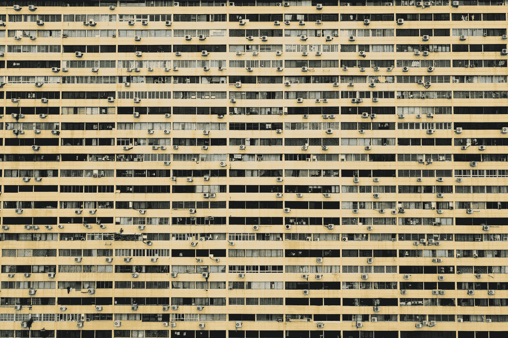

# 使用 ggplot2: theme()定制的主数据可视化

> 原文：<https://towardsdatascience.com/master-data-visualization-with-ggplot2-theme-customization-8421695d24e2?source=collection_archive---------35----------------------->

## 自定义 ggplot2 主题，为高效工作流程创建您的个性化主题模板



由 [Unsplash](https://unsplash.com?utm_source=medium&utm_medium=referral) 上的 [CHUTTERSNAP](https://unsplash.com/@chuttersnap?utm_source=medium&utm_medium=referral) 拍照

这是使用`ggplot2`包掌握数据可视化系列的最后一篇文章。教程的完整列表如下:

1.  *散点图和盒状图(* [*链接*](/master-data-visualization-with-ggplot2-scatter-and-box-plots-2f0c14cf2b26?sk=d68131a2be91f5b698d9b1652f244bc6) *)*
2.  *直方图、条形图和密度图(* [*链接*](/master-data-visualization-with-ggplot2-histograms-bar-and-density-plots-86c8290c9adc?sk=17339a5298df8451cd6d0387f83eca4a) *)*
3.  *圆形图(饼图、蜘蛛图和条形图)(* [*链接*](/master-data-visualization-with-ggplot2-pie-charts-spider-plots-and-bar-plots-899a07a15827?sk=fb8529750b14cf1fe0ea4c9023a31e6d) *)*
4.  ***主题()* : *自定义增加工作流***

对于那些经常更改默认主题设置以使其可视化效果更具吸引力的人来说，主题定制是提高工作效率的关键。`ggplot2`包使用的默认主题是`theme_gray()`。因此，在本教程中，我们将使用`theme_gray()`函数来创建我们自己的定制函数`theme_customized()`。我们将把本教程分为以下几个部分:

1.  数据集和包
2.  提取主题函数
3.  自定义主题功能
4.  覆盖某些参数


作者图片

# 数据集和包

在本教程中，我们将使用地球表面温度数据集，重点关注 1750 年至 2015 年间的全球温度变化。数据集的链接在这里是。

我们将使用`lubridate`包来创建包含年和月信息的新变量。

除了`ggplot2`、`tidyverse`和`lubridate`包，我们将使用`extrafont`包从我们的操作系统导入更多的字体到 R 中。因为我是一个 Windows 用户，所以争论将与 Windows 操作系统有关。查看使用 Apple 或 Linux 系统安装的参考。

因此，现在让我们开始定制主题，这将通过提取默认主题函数的源代码来完成。

# 提取主题函数

要获得 R 中函数的源代码，只需在 R 控制台中键入函数名，然后按 enter 键。这样，它将为您提供完整的代码。在我们的例子中，我们将使用`theme_gray()`，所以我们可以在控制台上运行`theme_gray`，我们将得到完整的源代码，如下所示。

我们将使用上述代码来创建我们的定制功能。在进一步定制之前，我们将去掉最后一个命令`ggplot_global$theme…`。

# 自定义主题

在默认主题中可以定制很多东西，但目前，我们将专注于几个关键的东西。请随意探索其他可能性。

## 字体

R 中可用的默认字体系列有 *sans* 、 *serif* 、 *mono* 和 *symbol* 。如果你想在 R 中现有的字体中添加更多的字体系列，那么可以通过`extrafont`包来实现。使用下面的代码片段将字体添加到 R 中，以便在 Windows OS 中进行自定义。

要指定你选择的字体，只需在调用函数时在函数参数中声明即可。出于演示的目的，我指定了`base_family=“Algerian”`。

```
theme_customized <- function(base_size=11, base_family = "Agerian", 
                             base_line_size = base_size/22, 
                             base_rect_size = base_size/22)
```

## 颜色；色彩；色调

也可以通过指定新颜色来覆盖默认颜色。例如，通过提供不同的`fill`值，绘图面板的背景颜色可从`white`变为不同的颜色，如下所示:

```
rect = element_rect(fill = "**white**", colour = "black", size = 0.5, linetype = 1)# replace plot panel background color to red
rect = element_rect(fill = "**red**", colour = "black", size = 0.5, linetype = 1)
```

使用`element_text()`功能中的`color`参数可以改变轴标题的字体颜色。

```
text = element_text(family = base_family, face = "plain", 
                    colour = "**black**", size = base_size, lineheight =
                    0.9, hjust = 0.5, vjust = 0.5, angle = 0, margin
                    = margin(), debug = FALSE)
```

可使用以下功能改变轴文本和刻度的颜色:

```
# axis text
axis.text = element_text(size = rel(0.8), colour = "grey30")# axis ticks
axis.ticks = element_line(colour = "grey20")
```

## 字体大小

`theme_gray()`的默认字体大小是 11，这对于某些显示媒体来说可能不合适。因此，可以通过将默认值分配给主题函数的`base_size`参数，将其更改为更理想的值。

```
theme_customized <- function(base_size=11, base_family = "Agerian", 
                             base_line_size = base_size/22, 
                             base_rect_size = base_size/22)
```

另一个需要注意的重要特性是`rel()`函数，它定义了相对于`base_size`值的相对大小。

所以，让我们自定义主题。

现在，我们知道如何在 r 中自定义主题。现在让我们通过可视化 1750 年至 2015 年期间的月平均温度变化来将其付诸实践。

那么对于当前定制的主题，让我们将`base_size`值设置为 *15，*为*阿尔及利亚*，并更改配色方案，使用 [Canva](https://www.canva.com/colors/color-palettes/facing-forward/) 的配色方案。

为了覆盖`ggplot2`的默认主题，我们将使用`theme_set()`函数，这样我们就可以实现`theme_customized()`。

```
# overriding teh default theme
theme_set(theme_customized()) 
```

现在我们可以用新的定制主题重新绘制平均温度变化。


使用(L)默认主题和(R)自定义主题绘制(图片由作者提供)

# 覆盖某些参数

为了快速改变主题，我们将使用`theme_update()`功能。假设我们想在自定义主题中使用黑色而不是灰色的面板网格，那么我们只需要覆盖`element_line()`函数的值。

```
theme_customized = theme_update(panel.grid = element_line(colour = "black"))
```


仅将面板网格颜色从灰色覆盖为黑色(图片由作者提供)

# 结论

在关于使用 ggplot2 包掌握数据可视化的最后一个教程中，我们学习了定制我们自己的主题，这无疑可以提高工作流程，特别是如果您的工作涉及为需要不同颜色主题、字体类型和大小的不同部门创建视觉效果。除了定制你的主题，我们还进一步学习了使用`set_theme()`函数覆盖默认主题。后来我们看到，要在定制主题中做一些小的改变，我们可以直接使用`theme_update()`函数来改变 ceratin 函数参数的值，而不需要重新访问整个函数。

我希望你们都喜欢这个用`ggplot2`包设计的系列。如果你错过了这个系列的任何教程，链接就贴在下面。欢迎发表评论，分享你的观点和看法。

本系列或使用`ggplot2`包的可视化的进一步阅读。

</master-data-visualization-with-ggplot2-scatter-and-box-plots-2f0c14cf2b26>  </master-data-visualization-with-ggplot2-histograms-bar-and-density-plots-86c8290c9adc>  </master-data-visualization-with-ggplot2-pie-charts-spider-plots-and-bar-plots-899a07a15827>  </data-visualization-using-ggplot2-5-features-worth-knowing-c0447a760335>  </creating-your-own-color-palette-for-data-visualization-part-1-84df48954845>  </creating-your-own-color-palette-for-data-visualization-part-2-7b02ebc31c19>  

## 参考

1.  [https://cran . r-project . org/web/packages/svglite/vignettes/fonts . html](https://cran.r-project.org/web/packages/svglite/vignettes/fonts.html)
2.  https://r-coder.com/custom-fonts-r/
3.  【https://ggplot2.tidyverse.org/reference/theme_get.html 

完整代码的链接在这里是。

您可以在 [LinkedIn](https://www.linkedin.com/in/abhinav-malasi/) 和 [Twitter](https://twitter.com/malasi_abhinav) 上与我联系，跟随我的数据科学和数据可视化之旅。