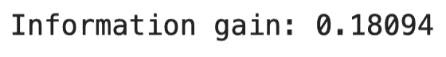

# 机器学习大师:用 Python 从头开始做决策树

> 原文：<https://towardsdatascience.com/master-machine-learning-decision-trees-from-scratch-with-python-de75b0494bcd?source=collection_archive---------7----------------------->

## 机器学习既简单又直观——这里有一个完整的从头开始的决策树指南

加里·本迪格在 [Unsplash](https://unsplash.com?utm_source=medium&utm_medium=referral) 上的照片

决策树是用于分类和回归的最直观的机器学习算法之一。阅读之后，你将知道如何完全从头开始实现一个决策树分类器。

这是许多即将开始的文章中的第五篇，所以如果你想了解更多，请继续关注这个博客。之前文章的链接位于本文末尾。

这篇文章的结构如下:

*   决策树介绍
*   决策树背后的数学
*   递归速成班
*   从头开始实施
*   模型评估
*   与 Scikit-Learn 的比较
*   结论

你可以在这里下载相应的笔记本[。](https://github.com/daradecic/BDS-articles/blob/main/013_MML_Decision_Trees.ipynb)

# 决策树介绍

决策树是一种用于回归和分类任务的非参数模型。从头开始的实现将花费您一些时间来完全理解，但是算法背后的直觉是非常简单的。

决策树仅由两个元素构成——节点和分支。我们稍后将讨论不同类型的节点。如果你决定跟随，术语**递归**不应该感觉像一门外语，因为算法是基于这个概念。几分钟后你会得到一个递归的速成课程，所以如果你对这个话题有点生疏，不要着急。

让我们先来看一个决策树的例子:

图 1 —带有节点类型的决策树表示示例(作者图片)

如您所见，有多种类型的节点:

*   **根节点** —树顶端的节点。它包含一个能最好地分割数据的特征(一个能最准确地对目标变量进行分类的单一特征)
*   **决策节点** —评估变量的节点。这些节点有指向它们和远离它们的箭头
*   **叶节点** —进行预测的最终节点

根据数据集的大小(行和列)，可能有成千上万种方式来排列节点及其条件。**那么，我们如何确定根节点呢？**

## 如何确定根节点

简而言之，我们需要检查每个输入特征如何独立地对目标变量进行分类。如果没有一个单独的特征在分类中 100%正确，我们可以认为这些特征**不纯**。

为了进一步确定哪个不纯的特征是最纯的，我们可以使用**熵**度量。我们稍后将讨论公式和计算，但是您应该记住熵值的范围是从 0(最好)到 1(最差)。

然后，具有最低熵的变量被用作根节点。

## 培训过程

为了开始训练决策树分类器，我们必须确定根节点。那部分已经讨论过了。

然后，对于每个单独的分割，计算**信息增益**度量。简而言之，它表示基于特定分割的所有熵值的平均值。我们稍后将讨论公式和计算，但请记住，增益越高，决策分割越好。

然后，该算法执行贪婪搜索-检查所有输入要素及其唯一值，计算每个组合的信息增益，并保存每个结点的最佳分割要素和阈值。

以这种方式，树被递归地构建。递归过程可能会永远继续下去，所以我们必须手动指定一些退出条件。最常见的是节点处的最大深度和最小样本。这两者都将在后面的实现中讨论。

## 预测过程

一旦构建了树，我们就可以通过递归遍历树来预测看不见的数据。我们可以根据输入数据和每个节点的学习阈值来检查遍历方向(左或右)。

一旦到达叶节点，就返回最常见的值。

这就是决策树背后的基本理论和直觉。让我们在下一节讨论算法背后的数学。

# 决策树背后的数学

决策树代表的更多的是编码挑战，而不是数学挑战。对于学习部分，你只需要实现两个公式——熵和信息增益。

先说**熵**。如前所述，它在节点级别测量分裂的纯度。其值范围从 0(纯)到 1(不纯)。

这是熵的公式:

图 2 —熵公式(图片由作者提供)

正如你所看到的，这是一个相对简单的等式，所以让我们看看它的实际应用。假设你想计算以下向量的纯度:

图片 3 —熵输入(图片由作者提供)

总而言之，零和一是具有以下计数的分类标签:

图 4 —班级分布汇总(作者提供的图片)

从这一点来看，熵的计算非常简单(四舍五入到小数点后五位):

图 5 —熵计算(图片由作者提供)

0.88 的结果表明分裂远非纯粹。接下来我们用 Python 重复一下计算。以下代码实现了`entropy(s)`公式，并在同一个向量上计算它:

结果如下图所示:

图 Python 中的熵计算(图片由作者提供)

正如您所看到的，结果是相同的，表明公式实现正确。

接下来让我们看看**信息增益**。它表示基于特定分割的所有熵值的平均值。信息增益值越高，决策分裂越好。

信息增益可通过以下公式计算:

图 7 —信息增益公式(图片由作者提供)

让我们来看一个示例分割，并计算信息增益:

图 8 —信息增益计算的分割示例(图片由作者提供)

如你所见，熵值是事先计算好的，所以我们不必在它们上面浪费时间。计算信息增益现在是一个简单的过程:

图 9 —信息增益计算(图片由作者提供)

接下来让我们用 Python 实现它。下面的代码片段实现了`information_gain()`函数，并为之前讨论的分割计算了它:

结果如下图所示:

图 10-Python 中的信息增益计算(图片由作者提供)

如您所见，这些值是匹配的。

这就是决策树背后的数学。我再重复一遍——这个算法用代码实现比用数学方法理解更具挑战性。这就是为什么你需要额外的递归入门——接下来。

# 递归速成班

许多关于决策树的实现归结为递归。本节将简要介绍递归函数，但绝不是该主题的入门指南。如果这个术语对你来说是新的，如果你想理解决策树，请研究它。

简单来说，递归函数就是调用自身的函数。我们不希望这个过程无限期地进行下去，所以函数需要一个退出条件。你会发现它写在函数的顶部。

让我们来看看最简单的例子——一个返回整数阶乘的递归函数:

结果如下图所示:

图 11-Python 中的阶乘计算(图片由作者提供)

如您所见，该函数会调用自身，直到输入的数字不是 1。这就是我们函数的退出条件。

决策树分类器中需要递归来建立额外的节点，直到满足某些退出条件。这就是为什么理解这个概念至关重要。

接下来，我们将实现分类器。这将需要大约 200 行代码(减去文档字符串和注释)，所以拥抱你自己。

# 从头开始实施

我们需要两节课:

1.  `Node`–实现决策树的单个节点
2.  `DecisionTree`–实现算法

先说`Node`类。它在这里存储关于特征、阈值、向左和向右的数据、信息增益和叶节点值的数据。所有的初始设置都是`None`。根节点和决策节点将包含除叶节点值之外的所有值，而叶节点将包含相反的值。

下面是该类的代码:

那是容易的部分。接下来让我们实现分类器。它将包含许多方法，所有这些方法都将在下面讨论:

*   `__init__()`–构造器，保存`min_samples_split`和`max_depth`的值。这些是超参数。第一个用于指定分割节点所需的最小样本数，第二个指定树的最大深度。两者都在递归函数中用作退出条件
*   `_entropy(s)`–计算输入向量的杂质`s`
*   `_information_gain(parent, left_child, right_child)`计算父节点和两个子节点之间拆分的信息增益值
*   `_best_split(X, y)`函数计算输入特征`X`和目标变量`y`的最佳分割参数。它通过迭代`X`中的每一列和每一列中的每个阈值来使用信息增益找到最佳分割
*   `_build(X, y, depth)`函数递归构建决策树，直到满足停止标准(构造函数中的超参数)
*   `fit(X, y)`函数调用`_build()`函数并将构建的树存储到构造函数中
*   `_predict(x)`函数遍历树来分类单个实例
*   `predict(X)`函数将`_predict()`函数应用于矩阵`X`中的每个实例。

这太多了——没什么好争论的。花点时间理解下面代码片段中的每一行。这是有据可查的，所以注释应该会有所帮助:

你不需要一口气理解每一行代码。给它一点时间，一行一行地检查代码，并尝试解释为什么事情会成功。一旦你理解了算法背后的基本直觉，就没那么难了。

# 模型评估

接下来让我们测试我们的分类器。我们将使用来自 Scikit-Learn 的虹膜数据集。以下代码片段加载数据集，并将其分为要素(`X`)和目标(`y`):

接下来，让我们将数据集分成训练和测试部分。以下代码片段就是这样做的，比例为 80:20:

现在让我们开始训练。下面的代码片段使用默认超参数训练模型，并对测试集进行预测:

让我们来看看生成的预测(`preds`):

图 12 —测试集上的自定义决策树预测(图片由作者提供)

现在看实际的类标签(`y_test`):

图 13 —测试集类别标签(作者图片)

如您所见，两者完全相同，表明分类器非常准确。如果你愿意，你可以进一步评估性能。下面的代码打印测试集的准确度分数:

正如所料，`1.0`的值将被打印出来。不要让这个欺骗你——虹膜数据集非常容易正确分类，特别是如果你有一个好的“随机”测试集。不过，让我们将我们的分类器与 Scikit-Learn 内置的分类器进行比较。

# 与 Scikit-Learn 的比较

我们想知道我们的模型是否好，所以让我们将它与我们知道效果很好的东西——Scikit-Learn 的`DecisionTreeClassifier`类进行比较。

您可以使用以下代码片段来导入模型类、训练模型、进行预测以及打印准确性得分:

如您所料，我们得到了完美的准确度分数`1.0`。

今天到此为止。让我们在下一部分总结一下。

# 结论

这是我写过的最具挑战性的文章之一。花了大约一周的时间才把一切都做好，并尽可能让代码易于理解。当然，你至少需要阅读几本书才能完全理解这个话题。请随意探索其他资源，因为这将进一步加深您的理解。

您现在知道如何从头开始实现决策树分类器算法。这是否意味着你应该抛弃事实上的标准机器学习库？不，一点也不。我来详细说明一下。

你能从头开始写东西并不意味着你应该这样做。尽管如此，了解算法如何工作的每个细节是一项有价值的技能，可以帮助你从其他 *fit 和预测*数据科学家中脱颖而出。

感谢您的阅读，如果您对更多从零开始的机器学习文章感兴趣，请继续关注博客。

喜欢这篇文章吗？成为 [*中等会员*](https://medium.com/@radecicdario/membership) *继续无限制学习。如果你使用下面的链接，我会收到你的一部分会员费，不需要你额外付费。*

<https://medium.com/@radecicdario/membership>  

# 了解更多信息

*   [掌握机器学习:用 Python 从头开始简单线性回归](/master-machine-learning-simple-linear-regression-from-scratch-with-python-1526487c5964)
*   [掌握机器学习:用 Python 从头开始多元线性回归](/master-machine-learning-multiple-linear-regression-from-scratch-with-python-ac716a9b78a4)
*   [掌握机器学习:用 Python 从头开始逻辑回归](/master-machine-learning-logistic-regression-from-scratch-with-python-acfe73a0a424)
*   [机器学习高手:用 Python 从零开始 K 近邻](/master-machine-learning-k-nearest-neighbors-from-scratch-with-python-5009177f523)

# 保持联系

*   在[媒体](https://medium.com/@radecicdario)上关注我，了解更多类似的故事
*   注册我的[简讯](https://mailchi.mp/46a3d2989d9b/bdssubscribe)
*   在 LinkedIn 上连接
*   查看我的[网站](https://www.betterdatascience.com/)

*原载于 2021 年 4 月 8 日 https://betterdatascience.com*<https://betterdatascience.com/mml-decision-trees/>**。**