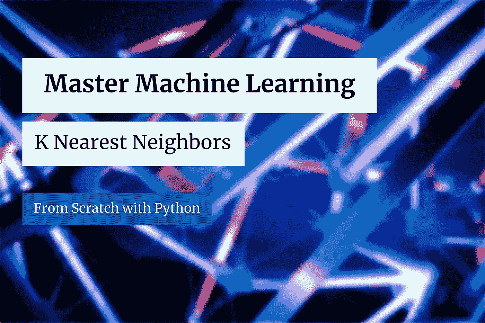
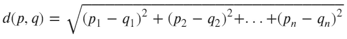
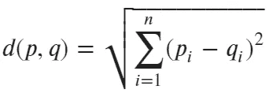
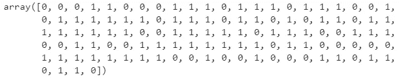
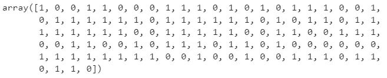
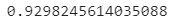
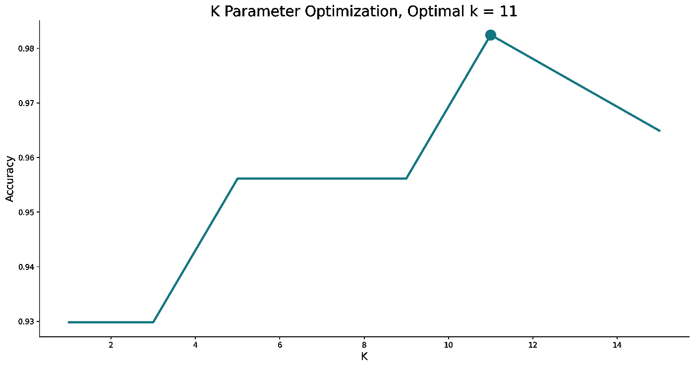

# 机器学习大师:用 Python 从头开始学习 K 个最近邻

> 原文：<https://towardsdatascience.com/master-machine-learning-k-nearest-neighbors-from-scratch-with-python-5009177f523?source=collection_archive---------24----------------------->

## 机器学习既简单又直观——这里有一个从头开始的 K 近邻完整指南。

[JJ 英](https://unsplash.com/@jjying?utm_source=unsplash&utm_medium=referral&utm_content=creditCopyText)在 [Unsplash](https://unsplash.com/?utm_source=unsplash&utm_medium=referral&utm_content=creditCopyText) 上的照片(作者修改)

k 最近邻是最简单的机器学习算法之一，如果不是最简单的话。这是一种分类算法，它基于定义数量的最近实例进行预测。

今天，您将从头开始实施和调整 K 近邻算法。这是第四篇即将发表的文章，所以如果你想了解更多，请继续关注博客。之前文章的链接位于本文末尾。

这篇文章的结构如下:

*   K 近邻介绍
*   数学落后 K 个最近邻
*   从头开始实施
*   k 优化
*   与 Scikit-Learn 的比较
*   结论

你可以在这里下载相应的笔记本[。](https://github.com/daradecic/BDS-articles/blob/main/012_MML_K_Nearest_Neighbors.ipynb)

# K 近邻介绍

如前所述，K 近邻是实现起来最简单的机器学习算法之一。其对新实例的分类基于 K 个最近实例的目标标签，其中 K 是可调超参数。

不仅如此，K 还是唯一的强制超参数。根据数据的不同，更改其值可能会导致模型性能的提高或降低。今天，您将学习如何为任何数据集找到最优 K。

该算法最奇怪的地方在于它**不需要任何学习**——只需要简单的距离计算。距离度量的选择取决于您，但最常见的是*欧几里德*和*余弦*距离。我们今天将学习欧几里得。

当谈到使用这种算法时，请记住它是基于距离的。正因为如此，在培训前对你的数据进行标准化可能是个好主意。

这就是理论的全部内容。在跳入代码之前，我们先简单谈谈背后的数学。

# 数学落后 K 个最近邻

距离的计算归结为一个简单的公式。您没有义务使用欧几里得距离，所以请记住这一点。

该距离被计算为两个向量的相应元素之间的平方差的平方根。当然，向量的大小必须相同。公式如下:

图片 1-欧几里德距离公式 v1(图片由作者提供)

该公式可以用更简洁的方式编写，如下所示:

图片 2-欧几里德距离公式 v2(图片由作者提供)

所以要记住这两个意思是一样的。

这就是你需要用 Python 实现的全部逻辑！让我们接下来做那件事。

# 从头开始实施

让我们从进口开始。我们需要 Numpy、Pandas 和 Scipy 用于逻辑，需要 Matplotlib 用于可视化:

我们现在将声明一个名为`KNN`的类，记住 Scikit-Learn API 语法。该类将具有以下方法:

*   `__init__(k)`–构造器，存储邻居数量(默认值为 3)和训练数据的值，初始设置为*无*
*   `_euclidean_distance(p, q)`–从上面执行公式
*   `fit(X, y)`–基本上什么都不做，只是将训练数据存储到构造器中
*   `predict(X)`–计算`X`中每一行与`KNN.X_train`中每一行之间的距离(调用`fit()`后可用)。然后对距离进行排序，只保留前 k 个。然后通过计算统计模式进行分类。

我们实现`fit()`方法的唯一原因是因为我们希望拥有与 Scikit-Learn 相同的 API。您可以自由地删除它，并在`predict()`方法中做任何事情。

总之，这是整个类的代码:

接下来我们来测试一下算法。我们将使用来自 Scikit-Learn 的*乳腺癌*数据集。下面的代码片段加载它，并以 80:20 的比例进行训练/测试分割:

现在让我们“训练”模型并获得预测。您可以使用下面的代码片段来实现这一点:

如果您要打印出`preds`，您会看到以下内容:

图片 3-预测类(作者图片)

下面是实际的类(`y_test`):

图 4-实际课程(作者提供的图片)

如您所见，这两个阵列非常相似，但在几个地方有所不同。一个简单的准确度将告诉我们正确分类的实例的百分比:

以下是相应的精确度:

图片 5 — KNN 模型的准确性(图片由作者提供)

93%是我们能得到的最好成绩吗？不太可能。让我们来探索如何调整 K 的值，并在一个范围内找到最佳值。

# k 优化

默认的 K 值(3)不太可能是最佳值。幸运的是，这个简单的算法很容易进行超参数优化。我们所要做的就是为一定数量的 K 值训练模型，并选择精度最高的一个。

值得一提的是，应该只测试奇数的 K 值，以避免潜在的联系。

以下代码片段针对 1 到 15 之间的每个奇数评估模型:

让我们想象一下精确度。下面的代码片段绘制了 X 轴上的 K 值和 Y 轴上的相应精度。最优的如题所示:

结果如下:

图片 6-最佳 K 值可视化(图片由作者提供)

k 值为 11 似乎最适合我们的数据集。考虑到这一点，您现在可以重新训练模型(`model = KNN(k=11)`)。

接下来让我们比较一下 Scikit-Learn 模型的性能。

# 与 Scikit-Learn 的比较

我们想知道我们的模型是否好，所以让我们将它与我们知道效果很好的东西——Scikit-Learn 的`KNeighborsClassifier`类进行比较。

您可以使用以下代码片段来导入模型类、训练模型、进行预测以及打印准确性得分:

相应的精度如下所示:

图 7-sci kit-学习模型准确性(图片由作者提供)

如您所见，Scikit-Learn 的模型表现大致相同，至少在准确性方面是如此。请记住，我们在这里没有做任何调整，这可能会使准确率达到 98%以上。

今天到此为止。让我们在下一部分总结一下。

# 结论

今天，您已经完全从头开始学习了如何用 Python 实现 K 近邻。*这是否意味着你应该抛弃事实上的标准机器学习库？没有，一点也没有。我来详细说明一下。*

你能从头开始写东西并不意味着你应该这样做。尽管如此，了解算法如何工作的每个细节是一项宝贵的技能，可以帮助你从其他 *fit 和预测*数据科学家中脱颖而出。

感谢您的阅读，如果您对更多从零开始的机器学习文章感兴趣，请继续关注博客。

*喜欢这篇文章吗？成为* [*中等会员*](https://medium.com/@radecicdario/membership) *继续无限制学习。如果你使用下面的链接，我会收到你的一部分会员费，不需要你额外付费。*

 [## 通过我的推荐链接加入 Medium-Dario rade ci

### 作为一个媒体会员，你的会员费的一部分会给你阅读的作家，你可以完全接触到每一个故事…

medium.com](https://medium.com/@radecicdario/membership) 

# 了解更多信息

*   [掌握机器学习:用 Python 从头开始简单线性回归](/master-machine-learning-simple-linear-regression-from-scratch-with-python-1526487c5964)
*   [掌握机器学习:用 Python 从头开始多元线性回归](/master-machine-learning-multiple-linear-regression-from-scratch-with-python-ac716a9b78a4)
*   [掌握机器学习:用 Python 从零开始进行逻辑回归](/master-machine-learning-logistic-regression-from-scratch-with-python-acfe73a0a424)
*   [PyTorch + SHAP =可解释的卷积神经网络](/pytorch-shap-explainable-convolutional-neural-networks-ece5f04c374f)
*   [用 Python 调优机器学习模型超参数的 3 种方法](/3-ways-to-tune-hyperparameters-of-machine-learning-models-with-python-cda64b62e0ac)

# 保持联系

*   在 [Medium](https://medium.com/@radecicdario) 上关注我，了解更多类似的故事
*   注册我的[简讯](https://mailchi.mp/46a3d2989d9b/bdssubscribe)
*   在 [LinkedIn](https://www.linkedin.com/in/darioradecic/) 上连接
*   查看我的[网站](https://www.betterdatascience.com/)

*原载于 2021 年 3 月 17 日 https://betterdatascience.com***。**