# 机器学习大师:用 Python 从头开始逻辑回归

> 原文：<https://towardsdatascience.com/master-machine-learning-logistic-regression-from-scratch-with-python-acfe73a0a424?source=collection_archive---------15----------------------->

## 机器学习既简单又直观——这是一个完整的从头开始的逻辑回归指南

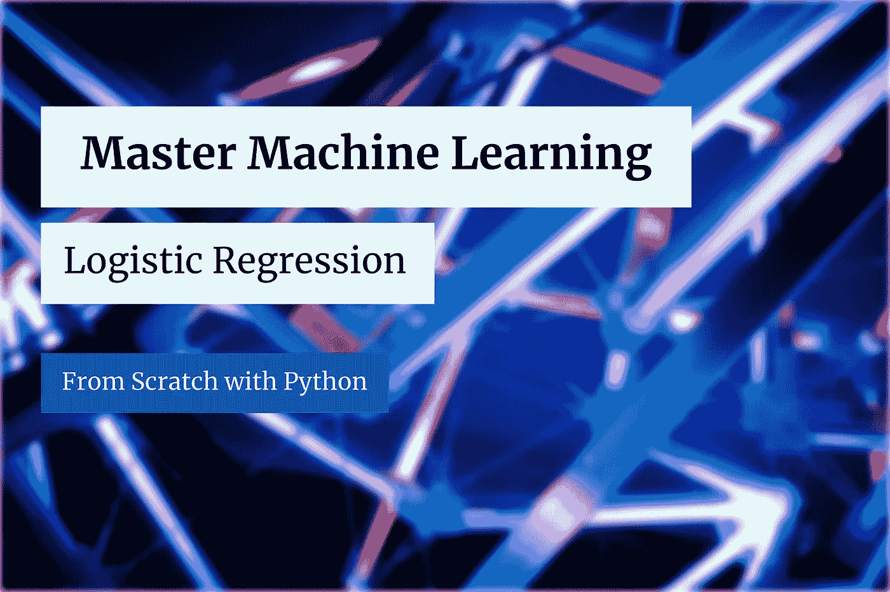

[JJ 英](https://unsplash.com/@jjying?utm_source=unsplash&utm_medium=referral&utm_content=creditCopyText)在 [Unsplash](https://unsplash.com/?utm_source=unsplash&utm_medium=referral&utm_content=creditCopyText) 上的照片(作者修改)

逻辑回归是你会遇到的最简单的分类算法。它类似于上周探讨的线性回归，但有一点不同。稍后会有更多的介绍。

今天，您将从头开始实施和调整逻辑回归算法。这是许多即将开始的文章中的第三篇，所以如果你想了解更多，请继续关注博客。之前文章的链接位于本文末尾。

这篇文章的结构如下:

*   逻辑回归介绍
*   逻辑回归背后的数学
*   二元交叉熵损失简介
*   从头开始实施
*   阈值优化
*   与 Scikit-Learn 的比较
*   结论

你可以在这里下载相应的笔记本[。](https://github.com/daradecic/BDS-articles/blob/main/011_MML_Logistic_Regression.ipynb)

# 逻辑回归介绍

逻辑回归是用于二元分类问题的基本机器学习算法。如今，它通常只用于构建基线模型。尽管如此，这仍然是一个非常好的第一个构建算法，因为它具有高度的可解释性。

在某种程度上，逻辑回归类似于线性回归。我们仍然在处理一个用于预测的直线方程。这一次，结果通过一个 *Sigmoid 激活函数*将真实值转换成概率。

概率告诉您实例属于正类的机会(例如，该客户的流失概率为 0.85)。然后，根据阈值将这些概率转化为实际类别。如果概率大于阈值，我们指定正类，反之亦然。

**阈值**值可以(也应该)根据问题和您正在优化的指标类型而改变。

我们来谈谈逻辑回归模型的**假设**[1]:

*   观察值(数据点)是独立的
*   独立变量之间几乎没有多重共线性(检查相关性并移除冗余)
*   大样本量——至少 10 个案例，每个独立变量都有最不频繁的结果。例如，如果您有五个独立变量，并且最小频率结果的预期概率为 0.1，那么您需要的最小样本量为 500 (10 * 5 / 0.1)

训练逻辑回归模型意味着计算权重和偏差的最佳系数。这些可以通过称为**梯度下降**的迭代优化过程来计算。下一节将详细介绍这一点。

# 逻辑回归背后的数学

逻辑回归背后的数学很简单。我们还在处理一个直线方程:

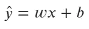

图 1-直线方程公式(图片由作者提供)

但这一次，线方程的输出通过一个 Sigmoid(逻辑)函数传递，如下式所示:

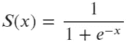

图 2-Sigmoid 函数公式(图片由作者提供)

sigmoid 函数的作用是获取任何实数值，并将其映射到一个概率值，即介于 0 和 1 之间的值。这是一个 S 形函数，您可以使用下面的代码来可视化它:

这是视觉效果:

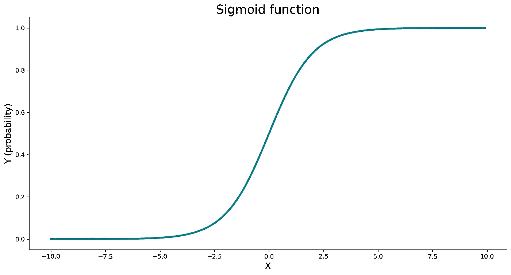

图 3-Sigmoid 函数(图片由作者提供)

sigmoid 函数返回值被解释为正类的概率。如果概率大于某个阈值(通常为 0.5)，我们就指定正类。如果概率低于阈值，我们分配负类。

与线性回归一样，我们需要优化两个参数——权重和偏差。我们需要声明**成本函数**来执行优化。遗憾的是，我们熟悉的均方误差函数无法使用。嗯，理论上可以用，但不是个好主意。

相反，我们将使用一个**二元交叉熵**函数，如下式所示:

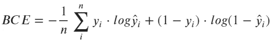

图片 4 —二元交叉熵损失公式(图片由作者提供)

如果它看起来像外语，请不要担心，我们将在下一部分解释它。

接下来，您需要在优化过程中使用这个成本函数来迭代地更新权重和偏差。为此，您必须计算与权重和偏差参数相关的二元交叉熵函数的偏导数:

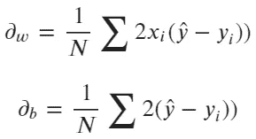

图片 5 —二元交叉熵导数(图片由作者提供)

标量可以省略，因为它没有任何区别。接下来，您必须根据更新规则更新现有权重和偏差，如以下公式所示:

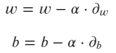

图片 6-梯度下降更新规则(图片由作者提供)

alpha 参数代表学习率。整个过程重复所需的迭代次数。

这些都是关于数学的！接下来我们来看看二元交叉熵损失函数。

# 二元交叉熵损失简介

二元交叉熵是用于评估二元分类模型的常见成本(或损失)函数。它通常被称为**日志丢失**，所以请记住这些是同义词。

这个成本函数“惩罚”错误的预测比“奖励”好的预测多得多。让我们看看它的实际效果。

## 示例 1 —为正确预测计算 BCE

假设您的模型以 90%的概率(0.9)预测了正类。这意味着该模型只有 10%的把握预测到负类。

*问题:BCE 值是多少？*

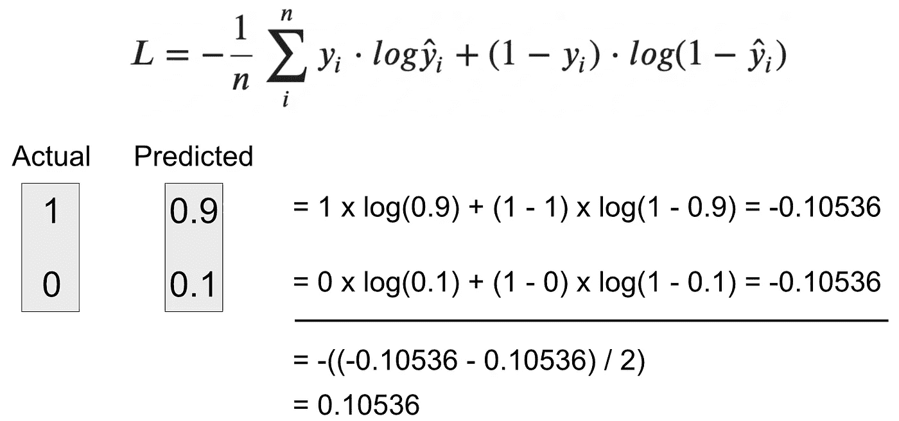

图片 7 —二元交叉熵计算—示例 1(图片由作者提供)

可以看到，BCE 值相当小，只有 0.1。这是因为模型对预测相当有信心。让我们看看如果不是这样会发生什么。

## 示例 2 —计算错误预测的 BCE

假设您的模型以 10%的概率(0.1)预测了正类。这意味着该模型有 90%的把握应该预测负类。

*问题:BCE 值是多少？*

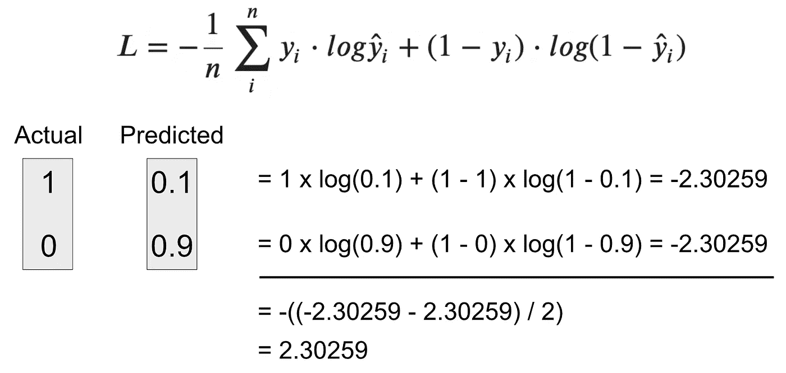

图片 8 —二元交叉熵计算—示例 2(图片由作者提供)

正如你所看到的，在这种情况下，损失是相当大的——这是 BCE 惩罚错误预测比奖励正确预测多得多的完美证明。

## Python 实现

我不太喜欢用手算数学。如果这同样适用于你，你会喜欢这一部分。以下函数在 Python 中从头开始实现 BCE:

我们需要`safe_log()`函数，因为`log(0)`等于无穷大。无论如何，如果你运行这段代码，你会发现我们的手工计算是正确的。

现在，您已经从头开始了解了实现逻辑回归算法所需的一切。让我们接下来做那件事。

# 从头开始实施

让有趣的部分开始吧！我们现在用下面的方法声明一个名为`LogisticRegression`的类:

*   `__init__(learning_rate, n_iterations)`–构造器，包含学习率和迭代次数的值，以及权重和偏差(最初设置为*无*)
*   `_sigmoid(x)`–逻辑激活功能，你知道公式
*   `_binary_cross_entropy(y, y_hat)`—我们的成本函数——我们之前已经实施过了
*   `fit(X, y)`–通过梯度下降迭代优化权重和偏差。计算完成后，结果存储在构造函数中
*   `predict_proba(X)`–使用通过 sigmoid 激活函数的线性方程计算预测概率
*   `predict(X, threshold)`–根据阈值参数计算预测类别(二进制)

如果你理解逻辑回归背后的数学，用 Python 实现应该是个问题。这可以归结为大约 70 行有文档记录的代码:

接下来我们来测试一下算法。我们将使用来自 Scikit-Learn 的*乳腺癌*数据集。下面的代码片段加载它，以 80:20 的比例进行训练/测试分割，实例化模型，拟合数据，并进行预测:

如果您想知道，以下是最佳重量值(通过`model.weights`访问):

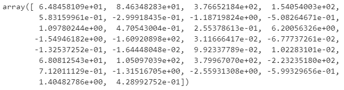

图 9 —优化的权重(图片由作者提供)

这里是最佳偏置(通过`model.bias`访问):

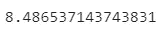

图 10 —优化的偏差(图片由作者提供)

培训部分到此结束。接下来我们来评价一下模型。

# 模型评估

这里我们保持简单，只打印准确度分数和混淆矩阵。您可以使用下面的代码片段来实现这一点:

以下是精确度值:

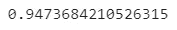

图片 11 —初始精确度(图片由作者提供)

这是混淆矩阵:

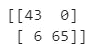

图 12 —初始混淆矩阵(图片由作者提供)

如您所见，该模型工作良好，准确率约为 95%。有六个假阴性，这意味着在六种情况下，当实际条件为“是”时，模型预测为“否”。尽管如此，比体面的结果。

让我们探索一下如何通过调整分类阈值来使结果更好。

# 阈值优化

不能保证 0.5 是每个分类问题的最佳分类阈值。幸运的是，我们可以通过改变`predict()`方法的`threshold`参数来改变阈值。

以下代码片段优化了准确性阈值，但您可以自由选择任何其他指标:

下面是阈值图表的样子:

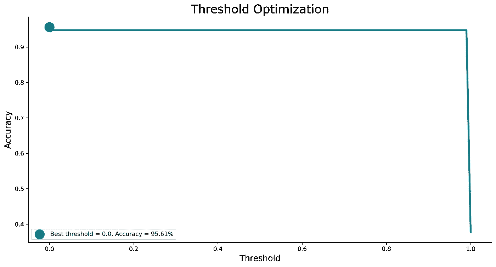

图 13 —阈值优化曲线(图片由作者提供)

最佳阈值和相应获得的精度显示在图图例中。正如您所看到的，阈值或多或少与这个数据集无关，但对于其他数据集来说可能就不是这样了。

现在，您可以根据最佳阈值快速重新训练模型:

这是新的、改进的准确度分数:

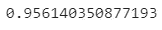

图 14 —优化的精确度(图片由作者提供)

这是混淆矩阵:

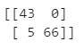

图 15 —优化的混淆矩阵(图片由作者提供)

现在，您知道了如何训练自定义分类器模型，以及如何优化分类阈值。接下来让我们将其与 Scikit-Learn 模型进行比较。

# 与 Scikit-Learn 的比较

我们想知道我们的模型是否好，所以让我们将它与我们知道的运行良好的东西——Scikit-Learn 的`LogisticRegression`类进行比较。

您可以使用以下代码片段来导入模型类、训练模型、进行预测以及打印准确性和混淆矩阵:

以下是获得的准确度分数:

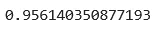

图 16—sci kit-Learn 模型的准确性(图片由作者提供)

这是混淆矩阵:

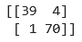

图 17 —来自 Scikit-Learn 模型的混淆矩阵(图片由作者提供)

如您所见，Scikit-Learn 的模型表现大致相同，至少在准确性方面是如此。在假阳性和假阴性之间有一些权衡，但总的来说，两种模型都表现良好。

让我们在下一部分总结一下。

# 结论

今天，您已经完全从零开始学习了如何用 Python 实现逻辑回归。这是否意味着你应该抛弃事实上的标准机器学习库？没有，一点也没有。我来详细说明一下。

你能从头开始写东西并不意味着你应该这样做。尽管如此，了解算法如何工作的每个细节是一项宝贵的技能，可以帮助你从其他 *fit 和预测*数据科学家中脱颖而出。

感谢您的阅读，如果您对更多从零开始的机器学习文章感兴趣，请继续关注博客。

*喜欢这篇文章吗？成为* [*中等会员*](https://medium.com/@radecicdario/membership) *继续无限制学习。如果你使用下面的链接，我会收到你的一部分会员费，不需要你额外付费。*

<https://medium.com/@radecicdario/membership>  

# 了解更多信息

*   [机器学习大师:用 Python 从头开始简单线性回归](/master-machine-learning-simple-linear-regression-from-scratch-with-python-1526487c5964)
*   [掌握机器学习:用 Python 从头开始多元线性回归](/master-machine-learning-multiple-linear-regression-from-scratch-with-python-ac716a9b78a4)
*   [PyTorch + SHAP =可解释的卷积神经网络](/pytorch-shap-explainable-convolutional-neural-networks-ece5f04c374f)
*   [用 Python 调优机器学习模型超参数的 3 种方法](/3-ways-to-tune-hyperparameters-of-machine-learning-models-with-python-cda64b62e0ac)
*   [Python 并行性:在几分钟内加速你的 Python 代码的基本指南](/python-parallelism-essential-guide-to-speeding-up-your-python-code-in-minutes-5ec71cbd88e1)

# 保持联系

*   关注我的[媒体](https://medium.com/@radecicdario)获取更多类似的故事
*   注册我的[简讯](https://mailchi.mp/46a3d2989d9b/bdssubscribe)
*   在 [LinkedIn](https://www.linkedin.com/in/darioradecic/) 上连接
*   查看我的[网站](https://www.betterdatascience.com/)

# 参考

[1][https://www . statistics solutions . com/assumptions-of-logistic-regression/](https://www.statisticssolutions.com/assumptions-of-logistic-regression/)

【https://betterdatascience.com】原载于 2021 年 3 月 11 日<https://betterdatascience.com/mml-logistic-regression/>**。**