# 机器学习大师:用 Python 从头开始多元线性回归

> 原文：<https://towardsdatascience.com/master-machine-learning-multiple-linear-regression-from-scratch-with-python-ac716a9b78a4?source=collection_archive---------12----------------------->

## 机器学习既简单又直观——这里有一个完整的从头开始的多元线性回归指南

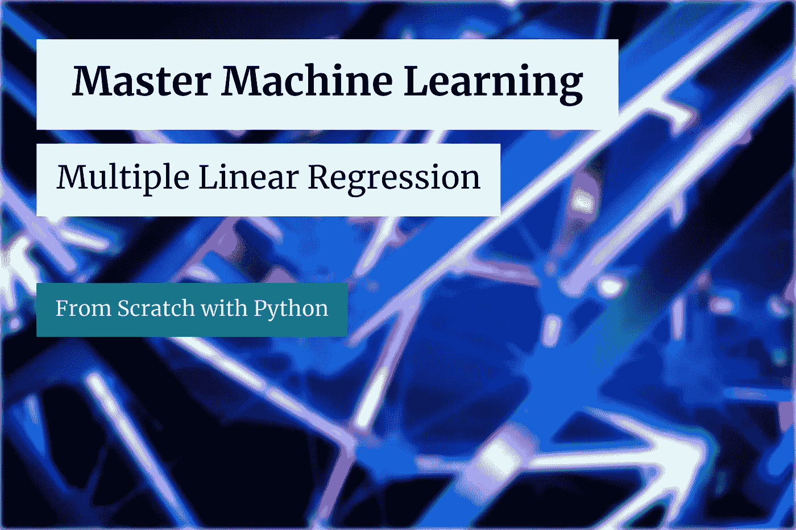

[JJ 英](https://unsplash.com/@jjying?utm_source=unsplash&utm_medium=referral&utm_content=creditCopyText)在 [Unsplash](https://unsplash.com/?utm_source=unsplash&utm_medium=referral&utm_content=creditCopyText) 上的照片(作者修改)

线性回归是你在学习机器学习时会遇到的最简单的算法。多元线性回归类似于上周介绍的简单线性回归，唯一的区别是多个斜率参数。多少？嗯，这取决于有多少输入要素——但一会儿会更详细。

今天你将亲手从头实现*多元线性回归*算法。这是许多即将到来的从头开始的文章中的第二篇，所以如果你想了解更多，请继续关注博客。

今天的文章结构如下:

*   多元线性回归简介
*   多元线性回归背后的数学
*   从头开始实施
*   与 Scikit-Learn 的比较
*   结论

你可以在这里下载相应的笔记本[。](https://github.com/daradecic/BDS-articles/blob/main/010_MML_Multiple_Linear_Regression.ipynb)

# 多元线性回归简介

多元线性回归与其简单版本的思路相同，即在给定输入数据的情况下找到最佳拟合线(超平面)。它的不同之处在于能够处理多个输入特性，而不是一个。

算法对要求相当严格。让我们列举并解释几个:

*   **线性假设** —模型假设变量之间的关系是线性的
*   **无噪声** —模型假设输入和输出变量无噪声—因此，如果可能，移除异常值
*   **无共线性**-当输入变量高度相关时，模型会过度拟合
*   **正态分布**-如果输入和输出变量呈正态分布，模型将做出更可靠的预测。如果不是这样，试着对你的变量进行一些变换，使它们看起来更正常
*   **重定标输入** —使用定标器或规格化器进行更可靠的预测

训练多元线性回归模型意味着计算线性方程公式的最佳系数。最佳系数可以通过迭代优化过程来计算，称为**梯度下降**。

该算法计算每个系数的导数，并在每次迭代中更新它们。更新的程度取决于一个参数——学习率。高学习率会导致“错过”最佳参数值，低学习率会导致缓慢的优化。

在下一节，我们将讨论算法背后的数学。

# 多元线性回归背后的数学

多元线性回归背后的数学比简单回归的数学要复杂一些，因为你不能简单地将数值代入公式。相反，我们正在处理一个迭代过程。

我们正在求解的方程大致保持不变:

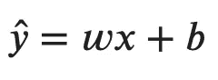

图片 1-多元线性回归公式(图片由作者提供)

我们没有一个单一的斜率β系数，而是有一个完整的β系数矩阵——表示为*权重*的 *w* 。仍然有一个截距值——表示为*偏差*的 *b* 。

我们必须声明一个成本函数才能继续。这是一个测量误差的函数，代表了我们想要最小化的东西。均方差(MSE)是线性回归最常见的成本函数:

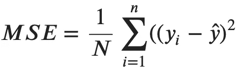

图 2——均方误差公式(图片由作者提供)

简单来说，它代表实际值( *yi* )和预测值( *y ha* t)的均方差。 *y 帽*可以展开为:

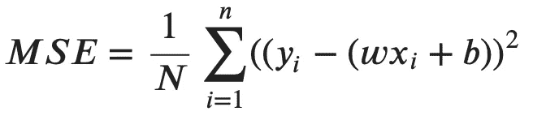

图 3 —均方误差公式(v2)(图片由作者提供)

如前所述，我们将使用梯度下降算法来寻找最佳的权重和偏差。它依赖于每个参数的偏导数计算。您可以找到与以下每个参数相关的衍生 MSE 公式:

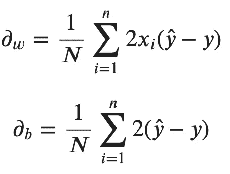

图 4——MSE 偏导数(图片由作者提供)

最后，更新过程可以总结为两个公式—每个参数一个公式。简而言之，从学习率和导数计算的乘积中减去旧的权重(或偏差)值:

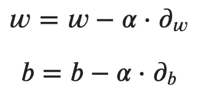

图 5-多元线性回归的更新规则(图片由作者提供)

alpha 参数代表学习率。

整个过程重复所需的迭代次数。让我们通过用 Python 实现一个从头开始的解决方案来看看这在实践中是如何工作的。

# 从头开始实施

让我们从库导入开始。现在您只需要 Numpy 和 Matplotlib。这些修改是可选的，只是为了让视觉效果看起来更好一点:

开始运算。让我们用下面的方法声明一个名为`LinearRegression`的类:

*   `__init__()`–构造器，包含学习率和迭代次数的值，以及权重和偏差(最初设置为*无*)。我们还将创建一个空列表来跟踪每个迭代中的损失。
*   `_mean_squared_error(y, y_hat)`–“私有”方法，用作我们的成本函数。
*   `fit(X, y)`–通过梯度下降迭代优化权重和偏差。计算完成后，结果存储在构造函数中。我们也在这里记录损失。
*   `predict(X)`–使用直线方程进行预测。

如果您理解这个简单算法背后的数学原理，用 Python 实现就很容易了。以下是该类的完整代码片段:

接下来我们来测试一下算法。我们将使用来自 Scikit-Learn 的糖尿病数据集。以下代码片段加载数据集，并将其拆分为要素和目标数组:

下一步是将数据集分成训练和测试子集，并训练模型。您可以使用以下代码片段来实现这一点:

以下是“最佳”权重矩阵的样子:

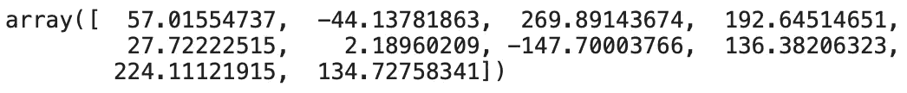

图 6 —优化的权重矩阵(图片由作者提供)

这是我们偏置项的最佳值:

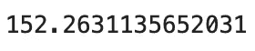

图 7 —优化的偏置项(图片由作者提供)

这就是全部了！您已经成功地对模型进行了 10000 次迭代训练，并获得了一组非常好的参数。让我们通过标绘损失来看看他们有多好:

理想情况下，我们应该看到一条从高损耗值开始并迅速下降到接近零的线:

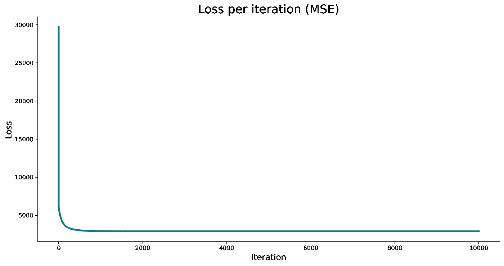

图 8 —每次迭代的损失(作者提供的图片)

它看起来很有前景，但我们如何知道损失是否足够低，以产生一个良好的质量模型？我们不能，至少不能直接。我们在损失方面能做的最好的事情是用不同的学习率训练几个模型，并比较损失曲线。下面的代码片段就是这样做的:

结果如下所示:

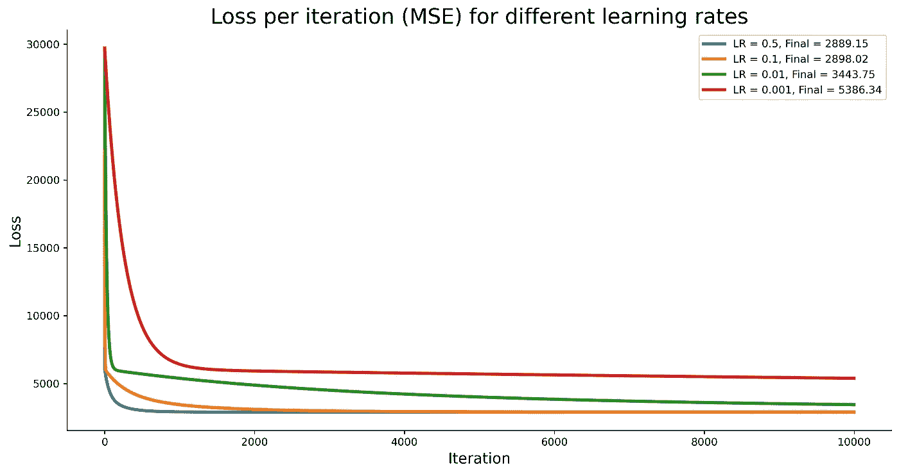

图 9 —不同学习率的损失比较(图片由作者提供)

对于我们的数据来说，0.5 的学习率似乎是最好的。您可以重新训练模型以适应以下代码片段:

这是测试集上相应的 MSE 值:

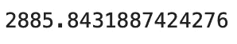

图 10 —测试集的均方误差(图片由作者提供)

从头开始构建、训练、评估和调整多元线性回归模型是多么容易！让我们将其与 Scikit-Learn 中的一个`LinearRegression`类进行比较，看看是否有任何严重的差异。

# 与 Scikit-Learn 的比较

我们想知道我们的模型是否好，所以让我们将它与我们知道的运行良好的东西——Scikit-Learn 的`LinearRegression`类进行比较。

您可以使用以下代码片段来导入模型类、训练模型、进行预测，并打印测试集的均方误差值:

以下是相应的 MSE 值:

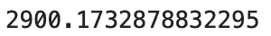

图 11—sci kit-Learn 模型的均方误差(图片由作者提供)

如您所见，我们调整后的模型优于 Scikit-Learn 的默认模型，但差异并不显著。模型质量—检查。

让我们在下一部分总结一下。

# 结论

今天，您已经完全从零开始学习了如何用 Python 实现多元线性回归算法。这是否意味着你应该抛弃事实上的标准机器学习库？没有，一点也没有。我来详细说明一下。

你能从头开始写东西并不意味着你应该这样做。尽管如此，了解算法如何工作的每个细节是一项宝贵的技能，可以帮助你从其他 *fit 和预测*数据科学家中脱颖而出。

感谢您的阅读，如果您对更多从零开始的机器学习文章感兴趣，请继续关注博客。

*喜欢这篇文章吗？成为* [*中等会员*](https://medium.com/@radecicdario/membership) *继续无限制学习。如果你使用下面的链接，我会收到你的一部分会员费，不需要你额外付费。*

 [## 通过我的推荐链接加入 Medium-Dario rade ci

### 作为一个媒体会员，你的会员费的一部分会给你阅读的作家，你可以完全接触到每一个故事…

medium.com](https://medium.com/@radecicdario/membership) 

# 了解更多信息

*   [新的 M1 macbook 对数据科学有好处吗？让我们来看看](/are-the-new-m1-macbooks-any-good-for-data-science-lets-find-out-e61a01e8cad1)
*   [PyTorch + SHAP =可解释的卷积神经网络](/pytorch-shap-explainable-convolutional-neural-networks-ece5f04c374f)
*   [用 Python 调优机器学习模型超参数的 3 种方法](/3-ways-to-tune-hyperparameters-of-machine-learning-models-with-python-cda64b62e0ac)
*   [Python 并行性:几分钟内加速 Python 代码的基本指南](/python-parallelism-essential-guide-to-speeding-up-your-python-code-in-minutes-5ec71cbd88e1)
*   Python 中的并发性:如何用线程加速你的代码

# 保持联系

*   关注我的[媒体](https://medium.com/@radecicdario)获取更多类似的故事
*   注册我的[简讯](https://mailchi.mp/46a3d2989d9b/bdssubscribe)
*   在 [LinkedIn](https://www.linkedin.com/in/darioradecic/) 上连接
*   查看我的网站

*原载于 2021 年 3 月 1 日 https://betterdatascience.com***。**