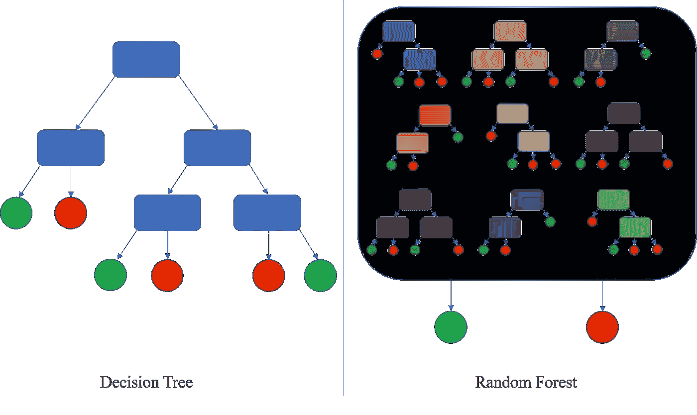
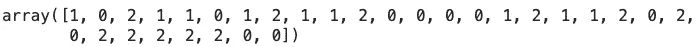
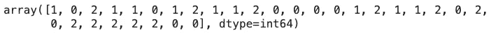

# 机器学习大师:用 Python 从零开始的随机森林

> 原文：<https://towardsdatascience.com/master-machine-learning-random-forest-from-scratch-with-python-3efdd51b6d7a?source=collection_archive---------12----------------------->

## 机器学习既简单又直观——这里有一个关于随机森林的从头开始的完整指南

迪伦·莱格在 [Unsplash](https://unsplash.com/s/photos/tree?utm_source=unsplash&utm_medium=referral&utm_content=creditCopyText) 上的照片

我们已经知道一个单独的决策树可以出奇的好。用单棵树建造森林的想法似乎是自然的下一步。

今天，您将学习随机森林分类器是如何工作的，并从头开始用 Python 实现它。这是许多即将开始的文章中的第六篇，所以如果你想了解更多，请继续关注博客。之前文章的链接位于本文末尾。

这篇文章的结构如下:

*   随机森林简介
*   随机森林背后的数学
*   从头开始实施
*   模型评估
*   与 Scikit-Learn 的比较
*   结论

你可以在这里下载相应的笔记本[。](https://github.com/daradecic/BDS-articles/blob/main/014_MML_Random_Forests.ipynb)

# 随机森林简介

就像决策树一样，随机森林是一种用于回归和分类任务的非参数模型。如果你理解了[之前关于决策树](/master-machine-learning-decision-trees-from-scratch-with-python-de75b0494bcd)的文章，那么理解这篇文章就没有问题了。

不用说，那篇文章也是这篇文章的先决条件，原因很明显。

整个随机森林算法是建立在弱学习器(决策树)之上的，给你一个用树做森林的类比。术语“随机”表示每个决策树都是用随机的数据子集构建的。

这是一张对比决策树和随机森林的绝佳图片:

图 1——决策树 vs .随机森林(来源:[https://commons . wikimedia . org/wiki/File:Decision _ Tree _ vs . _ Random _ forest . png)](https://commons.wikimedia.org/wiki/File:Decision_Tree_vs._Random_Forest.png))

就这么简单。

随机森林算法基于**打包**方法。它代表了一种结合学习模型以提高性能(更高的准确性或一些其他指标)的概念。

简而言之:

*   N 个子集由原始数据集组成
*   从子集中构建决策树
*   对每个经过训练的树进行预测，最终预测作为多数投票返回

这里有一个图表来说明这些观点:

图片 2 —随机森林图(来源:[https://commons . wikimedia . org/wiki/File:Random _ forest _ diagram _ complete . png)](https://commons.wikimedia.org/wiki/File:Random_forest_diagram_complete.png))

接下来让我们回顾一下算法背后的数学。

# 随机森林背后的数学

好消息——今天没有数学！

随机森林背后的数学原理与决策树相同。你只需要实现两个公式——熵和信息增益。

如果这些听起来像外语，请参考[上一篇文章](/master-machine-learning-decision-trees-from-scratch-with-python-de75b0494bcd)。这两个概念在那里都有详细的讨论。

本文的其余部分假设您熟悉决策树的内部工作原理，因为从头开始构建算法需要用到决策树。

# 从头开始实施

这次我们需要三节课:

1.  `Node` -实现决策树的单个节点
2.  `DecisionTree` -实现单个决策树
3.  `RandomForest` -实现我们的集成算法

前两个类与前一篇文章中的相同，所以如果您已经编写了它们，请随意跳过。

先说`Node`级。它在这里存储关于特征、阈值、向左和向右的数据、信息增益和叶节点值的数据。所有的初始设置都是`None`。根节点和决策节点将包含除叶节点值之外的所有值，而叶节点将包含相反的值。

下面是该类的代码(与库导入一起):

接下来让我们实现决策树分类器。它将包含许多方法，所有这些方法都将在下面讨论:

*   `__init__()` -构造函数，保存`min_samples_split`和`max_depth`的值。这些是超参数。第一个用于指定分割节点所需的最小样本数，第二个指定树的最大深度。两者都在递归函数中用作退出条件
*   `_entropy(s)` -计算输入向量的杂质`s`
*   `_information_gain(parent, left_child, right_child)`计算父节点和两个子节点之间拆分的信息增益值
*   `_best_split(X, y)`函数计算输入特征`X`和目标变量`y`的最佳分割参数。它通过迭代`X`中的每一列和每一列中的每个阈值来使用信息增益找到最佳分割
*   `_build(X, y, depth)`函数递归构建决策树，直到满足停止标准(构造函数中的超参数)
*   `fit(X, y)`函数调用`_build()`函数并将构建的树存储到构造函数中
*   `_predict(x)`函数遍历树来分类单个实例
*   `predict(X)`函数将`_predict()`函数应用于矩阵`X`中的每个实例。

是的，这是很多，但你应该已经觉得很舒服了。下面是单个决策树的代码片段:

最后，让我们建造森林。该类建立在单个决策树之上，具有以下方法:

*   `__init__()` -构造函数，保存森林中树的数量、最小样本分割和最大深度的超参数值。一旦模型被训练，它还将保存单独训练的决策树
*   `_sample(X, y)`函数将引导取样应用于输入特征和输入目标
*   `fit(X, y)`函数训练分类器模型
*   `predict(X)`函数使用单个决策树进行预测，然后对最终预测应用多数投票

就代码而言，这是一个比决策树简单得多的类。以下是完整的片段:

您可能无法一次完全理解所有内容，但如果您理解决策树，这不会是太大的挑战。

接下来让我们训练和评估我们的模型。

# 模型评估

接下来让我们测试我们的分类器。我们将使用来自 Scikit-Learn 的虹膜数据集。以下代码片段加载数据集并将其分为要素(`X`)和目标(`y`):

接下来，让我们将数据集分成训练和测试部分。以下代码片段就是这样做的，比例为 80:20:

现在让我们开始训练。下面的代码片段使用默认超参数训练模型，并对测试集进行预测:

让我们来看看生成的预测(`preds`):

图 3 —测试集上的自定义随机森林预测(图片由作者提供)

现在看看实际的类标签(`y_test`):

图 4 —测试集类别标签(作者图片)

如您所见，两者完全相同，表明分类器非常准确。如果你愿意，你可以进一步评估性能。下面的代码打印测试集的准确度分数:

如果您要运行上面的代码，`1.0`的值将被打印出来，表示一个完美的分类器。虹膜数据集非常容易正确分类，所以不要让这个欺骗了你。

让我们将我们的分类器与 Scikit 内置的分类器进行比较。

# 与 Scikit-Learn 的比较

我们想知道我们的模型是否好，所以让我们将它与我们知道效果很好的东西——Scikit-Learn 的`RandomForestClassifier`类进行比较。

您可以使用以下代码片段来导入模型类、训练模型、进行预测以及打印准确性得分:

如您所料，我们得到了 1.0 的完美准确度分数。

今天到此为止。让我们在下一部分总结一下。

# 结论

现在你知道了——如何从树木中建造一片森林。这比你想象的要容易，特别是如果你考虑到随机森林是当今性能最好的机器学习算法之一。

您现在知道如何从头开始实现决策树分类器算法。*这是否意味着你应该抛弃事实上的标准机器学习库？没有，一点也没有。我来详细说明一下。*

你能从头开始写东西并不意味着你应该这样做。尽管如此，了解算法如何工作的每个细节是一项宝贵的技能，可以帮助你从其他 *fit 和预测*数据科学家中脱颖而出。

感谢您的阅读，如果您对更多从零开始的机器学习文章感兴趣，请继续关注博客。

*喜欢这篇文章吗？成为* [*中等会员*](https://medium.com/@radecicdario/membership) *继续无限制学习。如果你使用下面的链接，我会收到你的一部分会员费，不需要你额外付费。*

 [## 通过我的推荐链接加入 Medium-Dario rade ci

### 作为一个媒体会员，你的会员费的一部分会给你阅读的作家，你可以完全接触到每一个故事…

medium.com](https://medium.com/@radecicdario/membership) 

# 了解更多信息

*   [掌握机器学习:用 Python 从头开始简单线性回归](/master-machine-learning-simple-linear-regression-from-scratch-with-python-1526487c5964)
*   [掌握机器学习:用 Python 从头开始多元线性回归](/master-machine-learning-multiple-linear-regression-from-scratch-with-python-ac716a9b78a4)
*   [机器学习大师:用 Python 从头开始逻辑回归](/master-machine-learning-logistic-regression-from-scratch-with-python-acfe73a0a424)
*   [机器学习高手:用 Python 从零开始 K 近邻](/master-machine-learning-k-nearest-neighbors-from-scratch-with-python-5009177f523)
*   [机器学习大师:用 Python 从头开始做决策树](/master-machine-learning-decision-trees-from-scratch-with-python-de75b0494bcd)

# 保持联系

*   关注我在[媒体](https://medium.com/@radecicdario)上的更多类似的故事
*   注册我的[简讯](https://mailchi.mp/46a3d2989d9b/bdssubscribe)
*   在 [LinkedIn](https://www.linkedin.com/in/darioradecic/) 上连接
*   查看我的[网站](https://www.betterdatascience.com/)

*原载于 2021 年 4 月 14 日 https://betterdatascience.com***。**