# 机器学习大师:用 Python 从头开始简单线性回归

> 原文：<https://towardsdatascience.com/master-machine-learning-simple-linear-regression-from-scratch-with-python-1526487c5964?source=collection_archive---------20----------------------->

## 机器学习既简单又直观——这是简单线性回归的从头开始的完整指南

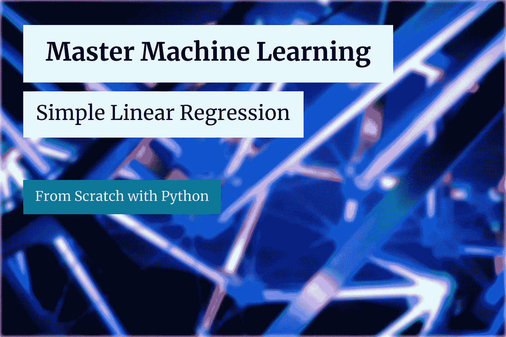

[JJ 英](https://unsplash.com/@jjying?utm_source=unsplash&utm_medium=referral&utm_content=creditCopyText)在 [Unsplash](https://unsplash.com/?utm_source=unsplash&utm_medium=referral&utm_content=creditCopyText) 上的照片(作者修改)

线性回归是你在学习机器学习时会遇到的最简单的算法。如果我们讨论的是*简单线性回归*，你只需要找到两个参数的值——斜率和截距——但是稍后会有更多的内容。

今天，您将亲手从头开始实现*简单线性回归*算法。这是许多即将到来的从头开始文章的第一篇，所以如果你想了解更多，请继续关注博客。

今天的文章结构如下:

*   简单线性回归简介
*   简单线性回归背后的数学
*   从头开始实施
*   与 Scikit-Learn 的比较
*   结论

这里可以下载相应的笔记本[。](https://github.com/daradecic/BDS-articles/blob/main/009_MML_Simple_Linear_Regression.ipynb)

# 简单线性回归简介

顾名思义，简单线性回归简单。这是许多入门机器学习中使用的算法，但它不需要任何“学习”。这就像在公式中插入几个值一样简单——下一节将详细介绍。

一般来说，线性回归用于预测连续变量，如股票价格、重量等。

线性回归是一种线性算法，意味着输入变量(输入的内容)和输出变量(预测)之间的线性关系是假定的。如果数据集中的关系不是线性的，这并不是世界末日，因为有很多转换方法。

存在几种类型的线性回归模型:

*   **简单线性回归** —有一个输入变量和一个输出变量。比如用身高来预测体重。
*   **多元线性回归** —有多个输入变量和一个输出变量。例如，使用身高、体脂和身体质量指数来预测体重。

今天我们将处理简单的线性回归。关于多元线性回归的文章将于下周发表，如果你想了解更多，请继续关注博客。

线性回归很少被用作解决复杂机器学习问题的首选算法。相反，它被用作基线模型——这是更复杂的算法必须超越的一点。

算法对要求也相当严格。让我们列举并解释几个:

*   **线性假设** —模型假设变量之间的关系是线性的
*   **无噪声** —模型假设输入和输出变量没有噪声——因此如果可能的话移除异常值
*   **无共线性**-当输入变量高度相关时，模型会过度拟合
*   **正态分布**-如果输入和输出变量呈正态分布，模型将做出更可靠的预测。如果不是这样，试着对你的变量进行一些变换，使它们看起来更正常
*   **重定标输入** —使用定标器或规格化器进行更可靠的预测

现在，您已经了解了这个简单算法背后的足够多的理论。让我们在实现之前先看看数学。

# 简单线性回归背后的数学

本质上，简单的线性回归归结为求解几个方程。你只需要解直线方程，如下图所示:

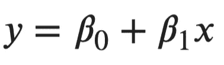

图 1-直线方程公式(图片由作者提供)

如你所见，我们需要以某种方式计算贝塔系数。x 代表输入数据，所以这是您已经掌握的东西。

必须首先计算β1 系数。它代表直线的斜率，可通过以下公式获得:

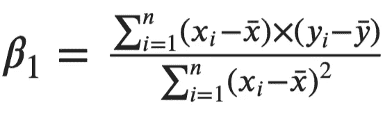

图 2-线方程中的β1 系数(图片由作者提供)

*Xi* 代表输入特征的当前值，顶部有一条横杠的 *X* 代表整个变量的平均值。对于 *Y* 来说也是如此，但是我们现在看的是目标变量。

接下来，我们有β0 系数。可以用下面的公式计算:

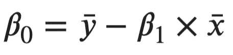

图 3-线方程中的β0 系数(图片由作者提供)

这就是简单线性回归的全部内容！一旦计算出系数值，你就可以代入 X 的数值，得到预测值。就这么简单。

接下来让我们看看 Python 的实现。

# 从头开始实施

让我们从库导入开始。现在您只需要 Numpy 和 Matplotlib。这些修改是可选的，只是为了让视觉效果看起来更好一点:

现在来看算法实现。让我们用下面的方法声明一个名为`SimpleLinearRegression`的类:

*   `__init__()`–构造函数，包含 Beta 0 和 Beta 1 系数的值。这些最初被设置为`None`
*   `fit(X, y)`–根据输入的`X`和`y`参数计算β0 和β1 系数。计算完成后，结果存储在构造函数中
*   `predict(X)`–使用直线方程进行预测。如果事先没有调用`fit()`方法，它会抛出一个错误。

如果您理解这个简单算法背后的数学原理，用 Python 实现就很容易了。以下是该类的完整代码片段:

接下来，让我们创建一些**虚拟数据**。我们将 300 个数据点作为输入变量，300 个正态分布值作为目标变量。目标变量以输入变量为中心，标准偏差为 20。

您可以使用以下代码片段来创建和可视化数据集:

数据集的可视化如下图所示:

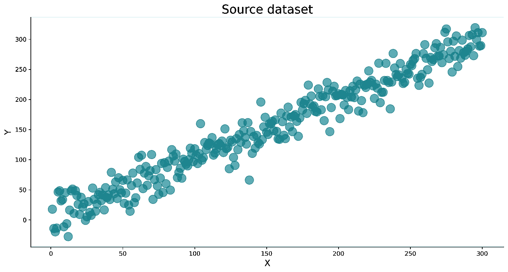

图片 4-源数据集(作者提供的图片)

接下来，让我们**将数据集**分成训练和测试子集。您可以使用 Scikit 中的`train_test_split()`功能——了解如何使用:

最后，让我们制作一个`SimpleLinearRegression`类的实例，拟合训练数据，并在测试集上进行预测。下面的代码片段就是这样做的，并且还打印 Beta 0 和 Beta 1 系数的值:

系数值显示如下:

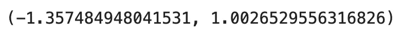

图 5-β0 和β1 系数值(图片由作者提供)

这就是你的线方程公式。接下来，我们需要一种**评估模型**的方法。在此之前，让我们快速看一下`preds`和`y_test`变量的样子。

下面是`preds`变量中的内容:

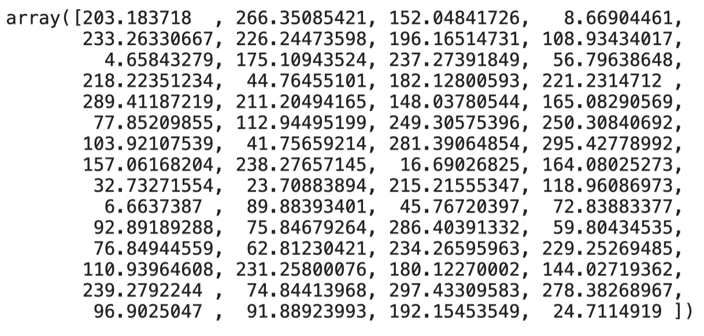

图片 6-简单线性回归模型的预测(图片由作者提供)

下面是实际测试数据的样子:

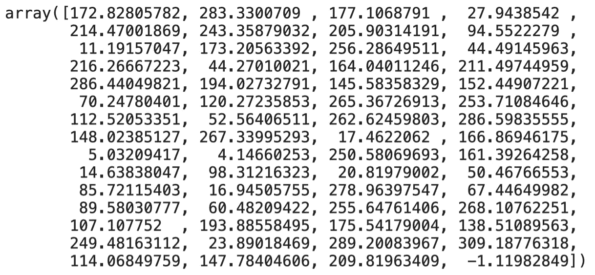

图 7 —测试集中的实际值(作者提供的图片)

不完全相同，当然，但总体上很相似。对于更定量的评估指标，我们将使用 RMSE(均方根误差)。下面是如何用 Python 计算它的值:

平均误差显示如下:

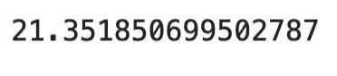

图 8 —测试集的均方根误差(图片由作者提供)

如你所见，我们的模型平均误差在 20 个单位左右。这是由于在声明数据集时引入了差异，因此我们无法进一步改进模型。

如果您想要可视化**最佳拟合线**，您必须在整个数据集上重新训练模型并绘制预测。您可以使用以下代码片段来实现这一点:

它看起来是这样的:

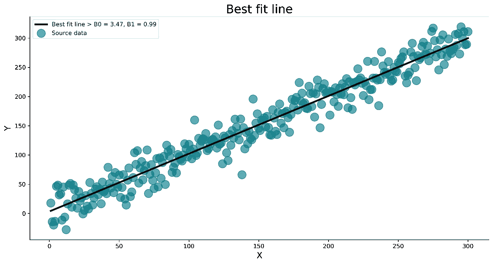

图片 9-整个数据集上的最佳拟合线(图片由作者提供)

这就是简单线性回归模型的全部内容。让我们将其与 Scikit-Learn 中的一个`LinearRegression`类进行比较，看看是否有任何严重的差异。

# 与 Scikit-Learn 的比较

我们想知道我们的模型是否好，所以让我们将它与我们知道效果很好的东西——Scikit-Learn 的`LinearRegression`类进行比较。

您可以使用以下代码片段来导入类、训练模型、进行预测以及打印 Beta 0 和 Beta 1 系数的值:

系数值显示如下:

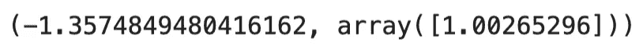

图 10—sci kit-Learn 模型的β0 和β1 系数(图片由作者提供)

如你所见，系数几乎相同！接下来，让我们检查 RMSE 值:

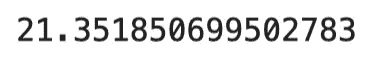

图 11—sci kit-Learn 模型的均方根误差(图片由作者提供)

再次，几乎一模一样！模型质量—检查。

让我们在下一部分总结一下。

# 结论

今天，您已经完全从零开始学习了如何用 Python 实现简单的线性回归算法。

*这是否意味着你应该抛弃事实上的标准机器学习库？没有，一点也没有。我来详细说明一下。*

你能从头开始写东西并不意味着你应该这样做。尽管如此，了解算法如何工作的每个细节是一项宝贵的技能，可以帮助你从其他 *fit 和预测*数据科学家中脱颖而出。

感谢您的阅读，如果您对更多从零开始的机器学习文章感兴趣，请继续关注博客。

*喜欢这篇文章吗？成为* [*中等会员*](https://medium.com/@radecicdario/membership) *继续无限制学习。如果你使用下面的链接，我会收到你的一部分会员费，不需要你额外付费。*

<https://medium.com/@radecicdario/membership>  

# 了解更多信息

*   新的 M1 macbook 对数据科学有好处吗？让我们来看看
*   [PyTorch + SHAP =可解释的卷积神经网络](/pytorch-shap-explainable-convolutional-neural-networks-ece5f04c374f)
*   [用 Python 调优机器学习模型超参数的 3 种方法](/3-ways-to-tune-hyperparameters-of-machine-learning-models-with-python-cda64b62e0ac)
*   [Python 并行性:在几分钟内加速你的 Python 代码的基本指南](/python-parallelism-essential-guide-to-speeding-up-your-python-code-in-minutes-5ec71cbd88e1)
*   [Python 中的并发性:如何用线程加速你的代码](/concurrency-in-python-how-to-speed-up-your-code-with-threads-bb89d67c1bc9)

# 保持联系

*   关注我在[媒体](https://medium.com/@radecicdario)上的更多类似的故事
*   注册我的[简讯](https://mailchi.mp/46a3d2989d9b/bdssubscribe)
*   在 [LinkedIn](https://www.linkedin.com/in/darioradecic/) 上连接
*   查看我的[网站](https://www.betterdatascience.com/)

*原载于 2021 年 2 月 22 日 https://betterdatascience.com*<https://betterdatascience.com/mml-simple-linear-regression/>**。**