# 主位置编码:第一部分

> 原文：<https://towardsdatascience.com/master-positional-encoding-part-i-63c05d90a0c3?source=collection_archive---------1----------------------->

## [实践教程](https://towardsdatascience.com/tagged/hands-on-tutorials)

## 我们提出了驱动变压器的固定位置编码的“推导”,帮助您获得完整的直观理解。

[谢栋豪](https://unsplash.com/@teckhonc?utm_source=medium&utm_medium=referral)在 [Unsplash](https://unsplash.com?utm_source=medium&utm_medium=referral) 上的照片

这是关于位置编码的两个帖子的第一部分(更新:第二部分现在可用[这里](/master-positional-encoding-part-ii-1cfc4d3e7375)！ *)* :

*   **第一部分:**固定正弦位置编码的直觉和“推导”。
*   **第二部分:**我们如何，以及*应该如何*将位置信息实际注入注意力模型(或任何其他可能需要位置嵌入的模型)。这主要关注相对编码。

据我所知，这里有一些关于位置编码被视为流形的独到见解。但是，世界很大，所以我怀疑我是第一个注意到这一点的人；如果有人知道好的链接，请告诉我！

# 第一部分:固定正弦位置编码

## 介绍

想象一下，你终于成功地理解了变形金刚。您已经绘制了那些将关键字映射到查询的花哨的彩色矩阵，并使自己确信了 logits 张量的含义。你甚至更进一步，弄清楚了多头注意力是如何工作的，钦佩一点张量整形所能提供的聪明和效率。您已经学习了如何通过直接修改 logits 来屏蔽输入序列，以及如何优雅地将序列从编码器传输到解码器。你对自己非常满意，扑通一声坐在沙发上，抬起脚，吃了一大块巧克力曲奇……不，是两块巧克力曲奇。你值得。

满足于新发现的知识，您最终转向嵌入层。“这很简单，”你暗自思忖，“自从《后街男孩》回归以来，我一直在将单词转化为向量。”当您将目光转向模型架构图的底部时，一些不熟悉的东西吸引了您的目光。**位置编码**层。你立刻停止吃你的饼干，面包屑掉在地板上，因为你突然记起来了。*位置信息不会显示在任何地方。*

不要惊慌，你继续往下读，希望能找到一个简单的解决方案。相反，你得到的只是几个句子，告诉你一些固定的正弦函数和方向，当提到通常的嵌入层“…两者可以相加。”疯狂地翻来翻去，你意识到没有别的了。以前上过一次物理课，你知道刚刚发生了什么。你已经被“它很繁琐”了。

位置编码基本上是注意力模型的“琐碎”部分。许多可怕的 2-3 个单词短语中的一个，如“没关系”或“没关系”，其意图绝对与你所说的相反。它的*不是*好，它的*是*重要，位置编码是*不是*琐碎。

现在，我们都承认这种情况，让我们实际进入什么是位置编码。我们将采用物理学家的方法来“推导”答案。为如何完成我们的任务想出一些简单的理论/猜测，然后慢慢地改进它们，直到我们得到最能满足我们需要的编码。我们将把在哪里以及如何弹出位置编码层推迟到第二部分。现在，我们只是试图找出如何给一个序列一些位置意义。

## 离散位置编码

这其中最困难的部分可能就是试图描述我们到底要做什么。**如果这一小节没有太大意义，直接跳到下一小节就可以了。**理论上，我们有以下目标:

> 位置编码是序列中项目的位置或“位置”的有限维表示。给定某个序列 A = [a_0，…，a_{n-1}]，位置编码一定是某种类型的张量，我们可以把它提供给一个模型，告诉它某个值 a_i 在序列 A 中的位置。

诚然，这是含糊的；这是因为“供给模型”行也是模糊的。为了解决这个问题，让我们假设我们想要训练一个模型来完成以下任务:

> 给定一个长度为 T 的序列 A，输出另一个长度为 T 的序列 A ’,其中每个索引的输出是其邻居的加权和。

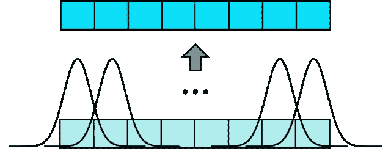

来源:现作者。底层是我们的输入编码向量。叠加的高斯图显示了我们输入的“模型”,产生了同样大小的输出向量。每个深蓝色方块是其浅色对应物的加权高斯平均值。

这种模式毫无意义。我重复一遍。这种模式毫无意义。这只是给我们一个例子的概念，你可以用一种方式，把位置编码输入到神经网络中。

我们正在寻找一个位置编码张量，而不是位置编码网络。这意味着我们的位置编码张量应该代表每个索引处的位置，我们的网络将负责对其进行任何操作。

这种编码将具有与序列长度相同的维数，序列长度可能很长。此外，序列长度甚至不是一个固定的量。将可变长度的向量输入模型是一个大问题。我们假设有一个最大值叫做 **max_position** ，对于这个最大值，我们的模型不能处理任何更长的序列。对于我们所有的解决方案，我们将编码固定为这么长，并根据输入的需要进行截断。

希望通过一个例子，一切都会变得清晰。

## 猜测 1:数数就好。

让我们从我们可能创建的最简单的位置编码开始。我们只是数数！我们映射每个元素 *a_i* → *i，*产生以下编码:

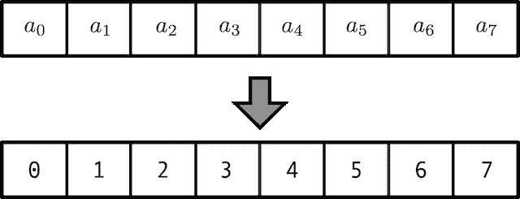

来源:现作者。序列长度= 8。我们简单地创建一个位置编码，其中每个条目都是它的索引号。

非常简单，我们刚刚创建了一个新的向量，其中每个条目都是它的索引号。这是**绝对位置编码*。*** 序列中的每个位置都由它相对于全局坐标原点的位置来标记，假定是当前序列的开始。我们将继续使用绝对编码，因为它们可以用来派生**相对编码**。

现在我们来批判一下。我们最初的猜测是错误的:这些数字的规模是巨大的。如果我们有一个由 500 个记号组成的序列，我们的向量最终会是 500。一般来说，神经网络喜欢它们的权重在零附近徘徊，并且通常正负平衡。如果没有，你会让自己暴露在各种各样的问题面前，比如爆炸性的梯度和不稳定的训练。

## 猜测 2:正常化“只是数一数”的猜测

这似乎是一个显而易见的解决方案→只需将所有值除以最大的整数，这样所有的值都在[0，1]中。这将提供:

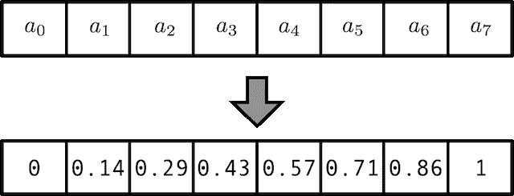

来源:现作者。我们通过除以 sequence_length(这里是 8)来规范化每个条目。

但是哦不！我们引入了另一个问题。我们不能再处理任意长度的序列。这是因为每个条目都除以序列长度。比如说 0.8 的位置编码值对于长度为 5 的序列的意义与对于长度为 20 的序列的意义完全不同。(对于长度 5，0.8=4/5 意味着它将是第 4 个元素。对于序列长度 20，0.8=16/20 意味着 0.8 代表第 16 个元素！).**简单的标准化对可变序列长度无效**。

我们需要做的是找到一种不使用大于 1 的数字来计数的方法。这是一个很大的线索，你也许能猜出答案。

使用二进制数。

## 猜测三:数数就好！但是用二进制代替十进制

我们可以用二进制形式 100011 来表示第 35 个元素，而不是写 35。爽，一切小于一。但是，在兴奋之余，我们忘记了无论我们使用二进制还是十进制，数字 35 都是一样的；总是只有 35。我们没有获得任何东西…相反，我们实际上需要做两件事:1)将我们的整数转换为二进制，2)将我们的标量转换为向量。

哇，向量的标量？那是什么意思？这意味着我们的位置编码*向量*现在变成了位置编码*矩阵*。每个数字都有自己的**二进制向量**，而不仅仅是一个整数。这是一个相当大的概念转变，但是通过增加维度，我们既可以保留任意长的序列，同时也可以将数字限制在范围[0，1]内！我们的编码现在看起来像这样:

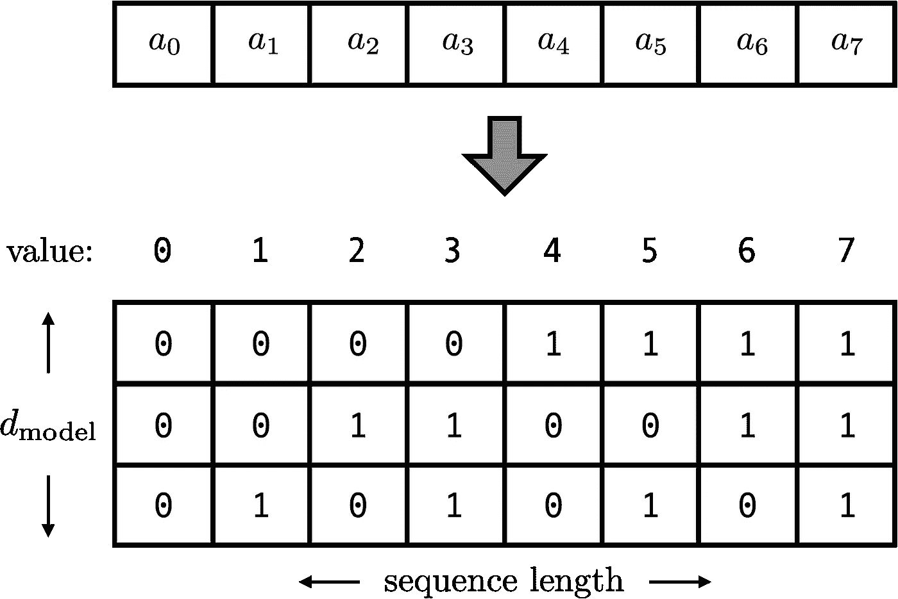

来源:现作者。位置编码的矩阵版本。每个二进制向量的条目代表一个二进制标量。例如，索引 5 保存二进制的 100，即值 4。

我们有一些自由。我们可以选择这个新的嵌入空间的维数，这个空间包含我们喜欢的任何二进制向量。这个维度唯一能做的就是告诉我们我们的序列可以有多大，准确的说是 2^dim。为了简单起见，让我们选择它等于 *d_model，*我们的模型将使用的嵌入维度。为了确保我们理解向量表示，第 35 个位置将被表示为二进制向量

35 ← → [0, …, 0, 1, 0, 0, 0, 1, 1]

分析时间。我们目前的猜测有哪些问题？

1.  我们还没有完全正常化。记住，我们希望事情的正面和负面大致相等。这很容易解决:只需通过 f(x) = 2x-1 重新调整[0，1]-->[-1，1]即可。
2.  我们的二元向量来自一个离散函数，而不是一个连续函数的离散化。

后一点很微妙，它与使用一个*向量*来表示一个*标量*位置有关。让我们比较两种编码，它们试图测量从 0 →3 的距离。第一个编码非常简单:只使用 x 轴维度，并将位置放在那里，用变量 x in [0，3]表示

连续编码:[x，0]

现在让我们将其与二进制矢量离散编码进行比较。由于这是离散的，我们只能表示 4 个位置:0、1、2 和 3。这些给出了 4 点:

二进制向量编码:[0，0]，[0，1]，[1，0]，[1，1]

任何时候我们离散一些东西，我们倾向于相信这些东西可以被**插值，**意味着我们可以通过连接这些点来构造一个连续的函数。看看我们两种编码的两种插值:

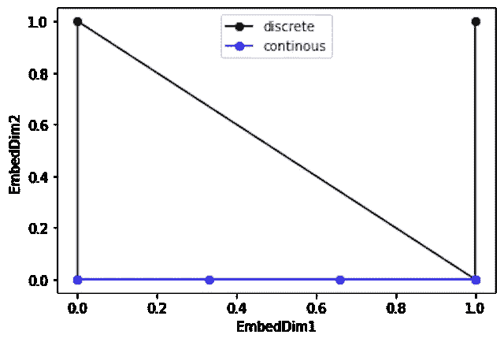

来源:现作者。显示位置流的空间曲线。离散曲线(黑色)从(0，0)->(1，0)->(0，1)->(1，1)开始，比平滑连续曲线(蓝色)更加参差不齐。

你可以看到连续编码曲线是平滑的，很容易估计中间位置。对于二元向量来说…那东西很乱。这将导致我们的下一个提示:**找到一种方法，使二进制向量成为连续事物的离散化。**

因此，对于图片，我们想要一个功能，以一种看起来自然的平滑方式连接这些点。对于任何学过几何的人来说，我们真正做的是寻找一个嵌入流形。

是的，如果你使用位置编码，你可以听起来超级花哨，告诉人们你在使用流形。用人类的术语来说，这意味着我们在 *d_model* 嵌入空间中寻找一条曲线，当你沿着这条曲线行走时，你的“位置”会以连续的方式慢慢增加。做好这一点，我们就可以进行下一个猜测了。

## 猜测 4:使用一个*连续的*二进制向量

为了使我们的二元向量连续，我们需要一个函数来插值一个来回的循环 0 →1 →0 →1 →0…等等。你说周期？是时候引入触发函数了。让我们用一个正弦函数。此外，正弦函数存在于[-1，1]上，所以它也是正常的，这是一个额外的好处！

这是你现在应该有的形象/类比。位置编码矩阵中的每个矩阵条目代表一个类似于立体声系统的“刻度盘”。通常你的拨号盘可能会做一些类似于调节音乐音量的事情(音量类似于位置)。像普通的转盘一样，我们在编码矩阵中使用的隐喻转盘可以连续地从关(0)转到开(1)。为了获得精确的音量(位置)，我们使用一系列不同灵敏度的刻度盘(矢量)。第一个拨号盘会稍微调节音量，也许是 1 个单位，一个几乎听不见的差别。第二个会更强大，调节音量 2 个单位。第三个将调整 4 个单位，第四个将调整 8 个单位，依此类推。

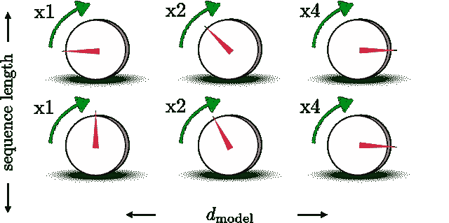

来源:现作者。序列(列)中的每个位置都由位置嵌入向量(行)表示，该向量可以被可视化为一组刻度盘的设置。表盘是描绘矩阵的元素。随着尺寸的增加，刻度盘变得更加灵敏，并且位置增加得更多。

通过这种方式，你可以在大范围内得到精确的音量*，因为拨号盘的强度呈指数增长。我们可以建造 8 个同样精确的小表盘(2⁸=256，如果你想知道为什么是 8 个表盘)，而不是建造一个包含 512 个声音等级的大表盘。超级高效哈！*

***符号警告:我们相对于上一节转置了位置编码矩阵。我们现在有 dim M = (sequence_length，d_model)，这是通常的写法。***

*我们现在希望正弦函数在正确的时刻进行一次旋转。对于第一个条目，每当我们在序列中移动一步时，它应该从 0 →1 移动回来。这意味着第一次拨号需要π/2 的频率，第二次拨号需要π/4 的频率，第三次拨号需要π/8 的频率，等等…*

*我们现在有了第一个原型位置编码张量。它由一个用 M 表示的**矩阵组成，其中矩阵的 y 轴是序列(0，1，…，n-1)中的离散位置 *x_i* ，x 轴是向量嵌入维数。矩阵 **M** 的元素由下式给出:***

*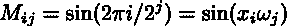*

*这里，ω是拨号频率，其相对于嵌入维度单调递减。x_i 是给出序列位置的整数。*

*现在让我们比较一下我们的连续离散化编码和传统的离散化编码。*

*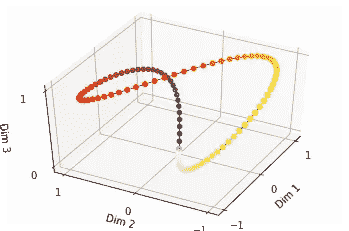*

*来源:现作者。颜色表示该坐标代表的绝对位置。对于维度 1、2 和 3，频率分别为 omega=pi/2、pi/4、pi/8。*

*看，都是连续的和多向的。*

*分析时间。我们已经非常接近最终答案了。有两件事我们仍然想解决。*

*首先，有一个不连续的问题。上面的图是我们想要的平滑曲线。然而，它也是一条封闭曲线。考虑从位置 *n* 移动到 *n+1。*这是曲线中从黄色过渡到棕色的部分。通过构造，位置 *n+1* 相当于位置 1。这是必要的，使我们的曲线连续，但这也不是我们想要的！ *n+1* 和 1 应该相隔很远，而不是靠在一起。对于学习过有限傅立叶变换的人来说，这个问题应该很熟悉。只有一半的频率是唯一的。*

*为了解决这个问题，我们观察到我们没有理由*必须*让我们的嵌入向量与一个二进制向量对齐。事实上，频率(omega_0，omega_1，…，omega_d_model)可以是任何东西，只要它们是*单调增加的，*这仅仅意味着它们增加，并且仅仅增加。我们可以降低所有的频率，这样我们就可以远离边界。*

*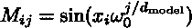*

*慢速拨号版本。omega_0 是最小频率。检查边缘情况:j=0 给出最大频率，j=d_model 给出最小频率。*

*原作者为此选择了 1/10，000 的最低频率。然后，他们通过 omega_min^{range(d)/d}指数增加频率，以达到单调性标准。为什么选择一万？我真的不知道，我猜试错法使这个作品最好。*

*第二个问题与其说是问题，不如说是缺点。没有简单的运算可以让我们在一个位置向量上加减 5 个位置单位。这种被称为转换的操作将允许我们将索引 *i* 的位置编码向量写成索引 *j* 的向量的函数。*

*为什么这是一个非常值得拥有的财产？想象一下，我们有一个网络正在试图翻译句子“我要吃饭了。”“is/am/are”+“去”+“动词”组合是一种很常见的语法结构，有固定的位置结构。“going”总是在索引 1 处结束，“to”在索引 2 处结束，依此类推。在这种情况下，在翻译“动词”时，我们可能希望网络学会注意出现在“我将要”之前的名词“我”。“我”位于“动词”左边 4 个位置单位。由于我们的注意力层使用线性转换来形成键、查询和值，所以如果我们有位置编码就好了，这样线性转换可以将位置向量向左平移 4 个单位，从而与“动词”的位置向量对齐。然后，查询和关键字将完美匹配。*

*总之，我们想看看是否可以修改我们的编码，以便它可以通过线性变换进行翻译。*

## *最后一个猜测，第五:使用正弦和余弦来简化翻译。*

*数学看起来有点复杂，但并不复杂。我们只需要记住符号。首先，让我们总结一下当前的位置编码矩阵*

*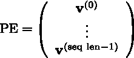*

*行向量 **v** 是在单个位置 *x* 评估的正弦向量，但是具有变化的频率*

*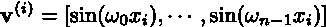*

*每个行向量表示单个离散位置的位置编码向量。位置编码矩阵 **PE，**是这些向量中的向量，因此它是(seq_len，n)维矩阵(seq_len 是序列长度)。我们现在想要找到一个线性变换 **T(dx)** 使得下面的等式成立:*

*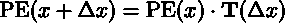*

*我们将如何做到这一点？首先，请注意，由于 **PE** 的所有元素都是正弦，因此位置 *x* 实际上是*角度*。从三角学中，我们知道任何移动触发函数的自变量的运算 T 一定是某种旋转。旋转可以通过对(余弦，正弦)对应用线性变换来应用。使用旋转矩阵的标准结果，我们可以利用下面的[恒等式](https://en.wikipedia.org/wiki/Rotation_matrix):*

**

*建立一个循环。*

> *注意，这个公式让线性运算符从左边起作用。在我们的网络中，线性变换通常从右边应用，正如我们到目前为止所展示的。从概念上来说，做左边的运算更容易，所以我们将把答案写在这里，但请记住，您需要对 **T** 进行转置，以将其应用于我们当前的 **PE** 矩阵。*

*为了构建一个支持通过线性操作符进行翻译的编码，我们做了以下工作。使用余弦而不是正弦创建重复的编码矩阵。现在，构建一个新的位置编码矩阵，如下所示:在余弦和正弦矩阵之间交替，弹出第一列并将其附加到最终的 **PE** 矩阵。这相当于用[cos(…) sin(…)]对替换每个 sin(…)。在我们新的 **PE** 矩阵中，行向量如下所示:*

*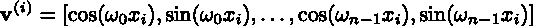*

*我们现在通过使用一组块对角线性变换来构建完整的线性变换。每个块将具有不同的矩阵，因为块作用的频率是不同的。例如，为了将频率为ω_ k 的第 *k* 个刻度盘平移 dx 个单位，我们将需要δ=ω_ k * dx 的总角度偏移。 **T** 矩阵现在可以写成:*

*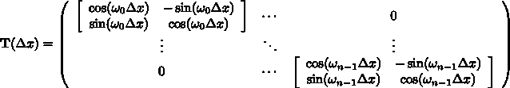*

*如果取这个的转置，可以直接插入到我们之前的 PE(x+dx)=PE(x)*T 方程中，从而通过构造证明平移矩阵的存在！*

*这几乎囊括了一切。现在让我们看看我们的 PE 矩阵实际上是什么样子。*

*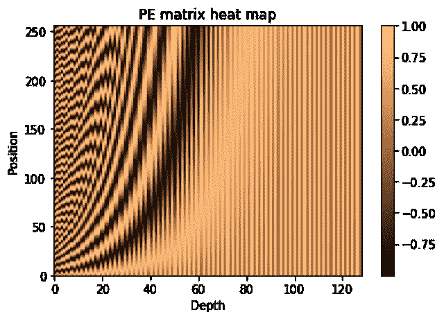*

*来源:现作者。*

*下面是如何解读上面的 PE 矩阵热图。*

1.  ***大部分 PE 矩阵不需要进行编码。**图中较暗的部分表示表盘已经“打开”，这意味着该区域的正弦和余弦值分别远离初始值 0 和 1。这表示有多少嵌入空间用于存储位置信息。正如你看到的黑色曲线一样，沿着深度激活一个刻度盘变得更加困难(黑色曲线看起来像 e^x).*
2.  ***较大深度的垂直线变化小于较低深度的损失。**选择一个固定的深度，然后向上移动，注意颜色如何变浅→变暗→变亮……这个周期的频率*随着深度的增加而降低*，这表明我们之前的直觉，深度越大的刻度盘越灵敏。*

## *最终答案。不再猜测*

*至此，我们已经完成了所有需要做的事情，让我们总结一下:*

1.  *位置编码由矩阵表示。对于序列长度 T 和模型深度 D，这将是一个(T，D)张量。*
2.  *“位置”只是序列中的索引。*
3.  *PE 矩阵的每一行都是表示与行索引相关联的离散值的插值位置的向量*
4.  *行向量是正弦和余弦的交替序列，其频率按照几何级数递减*
5.  *存在一个矩阵乘法，可以移动我们想要的任何行向量的位置。*

*这里有两种创建位置编码矩阵的方法:一种在 numpy 中，另一种只使用张量流操作符。因为位置编码矩阵可以与使用它的层同时初始化，所以这个公式没有多大用处。但是和张量一起工作是很好的练习。*

*理解代码的几个注意事项。首先，我们利用 numpy 广播通过位置和频率的外积来创建 PE 矩阵角度。第二，我们使用下标将正弦和余弦直接应用于角度矩阵的切片，这是一个很好的技巧。*

## *额外财产*

*还有一个我们希望位置编码满足的附加属性，它与位置编码在实际注意力模型中的使用方式有关。注意力是基于这样一个事实，即与序列中每个位置相关的每个嵌入都有一些代表性的关键字或查询。通过执行点积 query_i@key_j，这些键和查询允许我们快速确定当前位置是否应该“参加”另一个位置。如果点积很大，则意味着在 *j* 的键与在 *i* 的查询相匹配。为了使用位置编码向量，我们希望彼此靠近的位置返回大的键查询点积，而远离的位置返回小的键查询点积。请看下图:*

*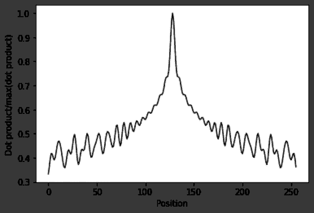*

*来源:现作者。我们显示了参数 d_embed=128，max_position=256 的 PE 矩阵的向量 v^{(128)}与所有其他位置向量的点积。点积由最大值归一化。*

*该图示出了表示第 128 个位置的特定位置编码矢量与每隔一个位置编码矢量之间的点积。请注意，在没有事先计划的情况下，我们得到的正是我们想要的。当 v^{(128)}与其自身比较时，点积是最大的，并且随着我们远离而稳步减小。一个不错的额外功能！*

*其原因可以追溯到正弦和余弦的正交性。随着我们越来越远，位置编码向量之间的频率不再相关，并且已知随机正弦和余弦之和趋于零。*

# *结论*

*谢谢你坚持到最后。像学术界的所有事情一样，解释得最少的事情往往是最难的。很讽刺，但是很好。*

*我们了解到，位置编码是一种将序列中对象的位置转换为神经网络(或其他模型)可以理解和使用的信息的方法。首先尝试一种简单的方法，我们只给出与位置相对应的模型整数，我们知道这很糟糕，原因有很多:数字可能太大，没有明显的方法来插入这些信息，它不能很好地扩展到不同长度的序列。*

*接下来我们做了一系列的猜测，就像物理学家试图提出一个可行的理论一样。通过不断调整和改变我们的猜测，以纳入更多的期望特征，我们最终降落在正弦位置编码矩阵。矩阵使用向量来表示序列位置。它可以适当缩放，允许翻译，并且容易处理不同的序列长度。*

*实现背后的细节和直觉将(希望)在以后的文章中探讨。例如，在那篇文章中，我们提出了类似于“为什么我们只是在常规序列嵌入中添加位置编码？”在这里，似乎一个体面的未经证实的答案是，PE 矩阵稀疏。只使用了很小一部分，所以看起来这个模型更像是把加法看成一个连接，把嵌入的一部分留给位置，其余的留给标记。*

# *参考*

1.  *你所需要的只是关注。 *arXiv 预印本 arXiv:1706.03762* (2017)。*