# 主位置编码:第二部分

> 原文：<https://towardsdatascience.com/master-positional-encoding-part-ii-1cfc4d3e7375?source=collection_archive---------4----------------------->

## 我们升级到相对位置，提出一个双向相对编码，并讨论让模型为你学习这一切的利弊


肖恩·斯特拉顿在 [Unsplash](https://unsplash.com?utm_source=medium&utm_medium=referral) 上拍摄的照片

这是两部分系列“主位置编码”的第二部分如果你想知道更多关于位置编码的直觉和基础知识，请看我的第一篇[文章](/master-positional-encoding-part-i-63c05d90a0c3)。

第一篇文章讨论了固定正弦**绝对**位置编码的含义，而本文将重点讨论**相对**位置编码。我们也将讨论使用可学习的位置编码的利与弊。在这个过程中，我给出了一个基于 Transformer-XL 架构实现双向相对位置编码的建议。我还没有找到任何人讨论这一点，所以请插话，如果你能透露一些关于是否有人追求这一点。

如果有一个 TL。这篇文章的要点是:

> 您应该将位置编码信息直接放入 logits 中。

这是提纲。随意跳到你感兴趣的内容！：

第一节(导言):

*   为什么要研究相对编码？
*   模型如何考虑相对编码？

第二部分(计算材料):

*   给定一个绝对位置编码，如何建立一个相对位置编码。
*   构造相对位置编码的 O(n)算法。
*   上述算法的代码，以及如何双向化它。

第三部分(可学习的编码):

*   为什么应该将位置信息直接注入 logits。
*   可学习编码和固定编码的优缺点。
*   逻辑的嵌入位置相关分解。

# 第一节(导言):

## 日常语言中的位置

快速测验。您将如何回答以下问题:

最近的银行在哪里？

1.  剧院旁边。
2.  在第一大街和主街的拐角处。
3.  在纬度:41.559599，经度:2.431680。

解决方案:所有选项都是正确的！这是因为在现实中，*某物在哪里的精确答案并不是一个定义明确的问题。你不可能用三个词足够精确地回答这个问题，把地球上的每个人都带到完全相同的位置。然而，取决于你在和谁说话(室友、同事、新闻主播)，他们可能真的找到了银行。*

## 上下文位置与可计算位置

有两个主要原因可以解释为什么“剧院旁边”是一个可以接受的回答。首先，

> 《剧院旁边》描述了一个**的相对位置**。

如果我们知道剧院的位置，我们可以通过“+”剧院旁边的**计算出**来到达一个新的位置。当然，这似乎是合理的，但是我们怎么知道剧院的位置呢？我们刚才不是说定位不明确吗？正确。这就引出了我们的第二点:

> 每一个回应都携带着背景信息，包括对话中双方的当前位置。

当我回答“剧院旁边”时，暗示提问的人知道我在哪里。这是**上下文信息**。反过来，提问者也有自己的上下文信息。在日常语言中，我们默认计算位置**相对于**我们自己的位置。这赋予位置一个明确的含义:**位置总是相对的。**

既然我们试图建造理解人类逻辑的机器，我们就必须以某种方式向它们灌输对位置的理解。让我们解决以下问题:

我们给一个模型一些段落，并要求它计算银行的位置。假设我们给它一句话:

“这里的**银行**离**不远**。**它**就是旁边的**那个**剧场****

如果你只保留粗体字，你听起来会像一个穴居人，但你可能会找出银行在哪里。一台机器不需要符合社会期望，所以它可以自由地说穴居人。我们可以想象机器执行以下计算:

1.  在哈希表中查找`Location["here"]=0`。记住，人们使用相对位置编码，所以机器已经知道“这里”的位置是零。
2.  在散列表中查找操作`Operation["next to"]=lambda x: x+1`，它只是将距离 1 添加到任意位置。
3.  在哈希表中查找`Location["next to"]=street_pos`。
4.  计算`Location["bank"] = Operation["next to"](Location["theater"]["here"])`。

第四步是关键部分。其他的都不难学，。它们只是哈希表值。事实上，你可以把这些硬编码到一个模型中，然后就到此为止。然而，第 4 步需要逻辑，这是很难硬编码的。在进入这个问题之前，让我们用前面粗体定义的术语总结一下我们所看到的。

第一句——“银行离这里不远”——是**上下文信息**。在`Location["theater"]`哈希表中**“**剧院”的所有可能值中，它告诉我们具体使用位于“这里”的那个。

句子 2——“它(银行)在剧院旁边”——是提问者听到的实际回答。它包含将“银行”的位置与“剧院”的位置相关联的**相对位置信息**。

如果这是一个递归神经网络(RNN)，我们可以认为初始隐藏状态提供了**上下文信息**，而实际的 RNN *计算*相对位置信息。这就是为什么有状态模型更擅长提取长期依赖关系。

## 从抽象位置到序列中的实际位置

到目前为止，我们一直在用分配给抽象事物的数字来讨论位置，比如银行、剧院或你自己。这有助于让我们明白，在生活中，我们只关心相对位置。

我们现在将根据序列中的位置来讨论位置。在我们思维实验的第 4 步中，我们的模型必须弄清楚如何将一堆数字放在一起计算位置[“银行”]。**语法**可以被认为是一组(通常是不完整和不一致的)规则，这些规则被设计成获取一串单词，并根据它们在序列中的位置赋予它们一个含义。例如，以这个句子为例:

“我活着就是为了吃饭。”

这表达了说话者对食物的喜爱。如果他们不能吃东西，他们就会死(我想这不仅仅是夸张的事实，也是字面上的……)。语法告诉我们，动词“吃”是生活的目的。所以，你可以想象一个学习“当你看到结构‘动词’+‘to’时，位置索引[‘动词’]+2 处的词描述了动词的目的”的模型。

的确，让我们把这两个动词调换一下来写:

“我吃饭是为了活着。”

我们现在得到了相反的意思！说话者暗示他/她不喜欢食物，只是为了继续生活而吃东西。但是，这还是符合我们学过的语法模型！index['吃']+2 = index['活']还是管用的，活在这里就是吃的目的。

这个模特扮演了人类。它获取自己的位置(index['eat'])并将其视为“绝对零度”位置。然后它说，“嘿，我只关心在我前面两步的东西”，在这种情况下是 index[‘live’]。该模型只需要**相对位置**进行计算。

在我们之前的[文章](/master-positional-encoding-part-i-63c05d90a0c3)中，我们花了很多时间来创建**绝对位置编码**。然而，正如我们刚刚讨论的，我们真的只需要*相对*位置。使用绝对位置来描述事物总是可能的，正如我们的纬度和经度响应所示，但通常这比我们需要的信息更多，并且在内部我们可能只是找到一种方法来将其转换为相对的东西。

从**绝对位置编码**开始的原因是，它们可以非常容易地转换成**相对位置编码**。现在让我们进入一些相关的数学问题。

# 第二部分(计算材料):

## *相对化你的绝对编码:一个简单的入门例子*

让我们从一个简单的例子开始，感受一下正在发生的事情。考虑具有以下绝对位置编码向量(字母 A 代表绝对)的 1D 序列

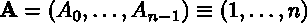

如果我问你任意两点 *A_i* 和 *A_j* 之间的位置是什么，用距离函数 *d(A_i，A_j)* 表示，答案应该很明显: *d(A_i，A_j) = |A_i-A_j| = |i-j|。*我们的挑战不是*计算*的相对位置，而是*表示*我们计算的相对位置。既然有 *n* 种可能的位置，那么就有 *n* 种可能的位置配对 *A_i* 和 *A_j* 。这表明我们的相对编码应该是一个(n，n)矩阵。用矩阵 **R** 表示相对编码(R 表示相对)。然后，我们可以通过根据公式填写 **R** 的条目来说明所有可能的相对位置

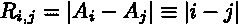

记住，当一个字母不是粗体时，它只代表一个标量值，所以这是 n 个条目中每一个的等式。实际的矩阵现在看起来像这样

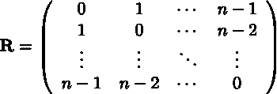

请注意对角线上的零，这表示索引相对于自身的位置为零。这个特殊的矩阵就是所谓的[循环矩阵](https://en.wikipedia.org/wiki/Circulant_matrix)，它是一类更一般的矩阵[托普利兹矩阵](https://en.wikipedia.org/wiki/Toeplitz_matrix)的特例。如果我们放松对称条件 A *_i-A_j=A_j-A_i* ，下对角线将是负的，因此矩阵将只有托普利兹矩阵。当每条对角线都不变时，你会得到一个托普利兹矩阵。主对角线全是 0，下一条全是 1，下一条全是 2，依此类推。得到一个 Toeplitz 矩阵是非常可取的，因为它将大大简化计算。

我们注意到在整个(n，n)矩阵中，只有 *n* 个唯一值。这些是(0，1，…，n-1)。因此，矩阵表示是高度冗余的。我们还注意到，这些唯一值*完全由绝对编码向量 **A** 的条目表示，加上值 0。因此，我们假设我们应该能够仅通过操作矩阵 **A** 来确定 **R** ，这表明我们可以在 O(n)计算中形成 **R** 而不是 O(n)。这都取决于我们的矩阵 **R** 确实是托普利兹矩阵这一事实。然而，请注意，如果序列值不是等间距的，例如我们有类似 *A = (1，2，5，6，9，…，n)* 的东西。那么我们就不会发现一个托普利兹矩阵(计算一条对角线来说服自己，像 A_3-A_2！= A_2-A_1)。*

这表明，如果我们想要一个 Toeplitz 相对编码矩阵(我们肯定会这样做)，我们的绝对位置编码向量必须满足两个条件之一。第一个是它的所有值都是等间距的，就像我们这个简单的例子一样。但是，从第一部分我们知道，我们的绝对位置将不是简单的整数，而是一些复杂的 d_model 维向量。满足第一个条件是行不通的。第二个条件是要求绝对位置编码向量的每一项实际代表**固定相对位置**。

好吧，我知道这可能没有任何意义，所以考虑这个解释。假设世界上有三个位置，称为 X、Y 和 z。我们假设它们是等距的，不管这意味着什么，并且是连续的，但是我们不能实际测量它们的绝对位置。我们能测量的，是某个距离函数的输出 *d(X，Y) = NUMBER* 。我们可能会发现类似于 *d(X，Y) = 2，d(X，Z) = 6，d(Y，Z)=2，*以及其余的 0。这个距离函数唯一需要做的就是吐出 d(x，x)=0，d(x，y)=d(y，X)，并保证如果(X-Y) > (Z-T)，那么 d(X，Y) > d(Z，T)。换句话说，为了成功地描述位置编码，我们只需要指定序列中每个元素的相对位置，称之为|i-j|，然后计算一个固定值 R(|i-j|)，向读取该值的任何人发出信号，告诉他们 *i，j* 有多近。在这个例子中，如果我们输入 R(|i-j|)=6，我们的模型知道 6 意味着 2 的分离！

所有这些都是可以简洁地写在一个方程定义中的东西:

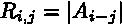

> 这是我们定义相对位置编码的等式。

我们所做的就是将|i-j|移动到 **A** 的索引中。这是一个微小的变化，但它带来了更大的观念变化。我们在这一小节中提到的最后一件事是，相对位置编码矩阵的秩大于绝对位置编码向量的秩。这是一个普遍的特征。**相对编码总是比绝对编码大一级。对于 1D 的情况，这意味着我们得到一个向量和一个矩阵。除此之外，我们得到一个秩- *k* 张量和一个秩- *(k+1)* 张量。我们现在已经穷尽了玩具示例的用处，所以让我们转到现实生活中的位置编码**

## 固定正弦相对位置张量

在制作工具之前，了解它的用途通常是有帮助的。在这种情况下，我们来考虑一下注意力模型。我们之所以需要位置编码，是为了让注意力机制知道项目在它所关注的序列中的位置。注意力由矩阵 **logits** 的矩阵 **M** 表示，其中条目 M_{ij}给出了索引 *i* 处的给定查询与索引 *j* 处的关键字匹配的对数概率。请注意，logits 矩阵的维数是(seq_len，seq_len)。这些恰恰是 **R** 的尺寸，有道理。逻辑学家在一个位置和另一个位置比较事物。因此，对我们来说，将位置信息直接注入到模型的逻辑中是有意义的，这也是我们的目标。我们将这些位置逻辑称为— **位置逻辑。**

我们采用注意力模型的语言，考虑两个序列:查询，其索引是 **R** 的行索引，以及键，其索引是 **R** 的列索引。M_{ij} = q_i 点 k_j。不失一般性，我们还可以假设查询的长度小于或等于关键字的长度。

在我们的起始案例中，我们需要一个固定的绝对位置编码。为此，我们使用本系列第一部分的[中详细讨论的相同的固定正弦编码。这是一个形状为(query_len，d_model)的矩阵 **A** ，可以表示为向量列表 **A** = ( **a** _0，…, **a** _{n-1})，其中 **a** _i 是 **A** 的第 *i* 行，维度为 d_model。这样写的话，我们看到与我们简单的起始示例的唯一区别是 **A** 的所有元素现在都是粗体的(意味着向量)。这将*暗示*我们也可以立即读出 **R** 的矩阵形式:](/master-positional-encoding-part-i-63c05d90a0c3)

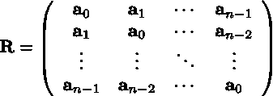

只有当查询长度 m 等于键长度 n 时才成立！

然而，这只有在查询长度(我们用 *n、*表示)等于键长度 *m* 时才成立。此时，您可能会问，“为什么查询长度不等于键长度？我就不能用填充物来处理这种情况吗？”通过例子来回答这个问题，当实现[转换器 XL](https://arxiv.org/abs/1901.02860) 时，就会出现这种情况，其中查看比当前查询长度更早的“内存”状态。有两个选项可以用来比较不同长度的查询和键:

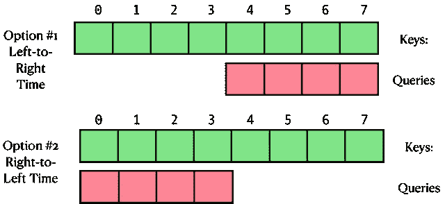

来源:现作者。整数表示序列位置。

第一个选项从左向右移动时间，并将两个序列的结束位置对齐。它确保红色查询只能访问它之前的绿色键(加上对重叠部分的屏蔽)。同样，第二个选项将序列的起点排成一行，并假设时间从右向左移动。

注意，如果我们要扩展查询长度以匹配密钥长度，我们将检索一个(n *，* n) 维矩阵，其形式由前面的等式正确给出。这两个选项实际上都是这个大矩阵的*子集*。在第一个选项中，我们计算完整的(n，n)矩阵，然后移除第一个 *n-m* 行，留下一个(m，n)矩阵。第二个选项的计算方式类似，只是删除最后的 *n-m* 列。我们现在假设我们正在处理一个(n，n)矩阵，然后根据所需的时间方向进行必要的截断。

我们将展示张量 **R** 如何通过张量**A**I**1**_ j =**R**T18 _ { I，0} 的一系列左移和右移在 O(n)运算中进行计算，其中的索引旨在帮助您理解张量结构。它只是一个独特矩阵 **A** 的一堆重复。该算法相当于下面的简单示例:找到一个执行以下操作的操作:

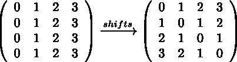

使用右移，我们可以正确地得到右上对角线

我将通过零索引引用行号。我们注意到，如果我们将第一行右移 1，第二行右移 2，第三行右移 3，那么我们可以正确地再现右上角的对角线。现在假设我们翻转所有的位置 *i →-i.* 这相当于左右翻转左矩阵。

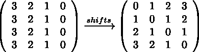

使用左移，我们可以正确地得到右上对角线

然后我们可以执行相反的过程；将第二行左移 1，第一行左移 2，然后第零行左移 3，我们将正确地再现左下角的对角线。将这两个操作结合起来，屏蔽掉各自不正确的部分，就可以成功地构造出我们的张量 **R！**

在编写这个算法之前，让我们讨论一下它是在计算什么。左下对角线部分恰好由索引为 *j≤i.* 的所有元素组成。换句话说，左下对角线代表所有关键字-查询对，其中查询涉及在*更早*时间出现的关键字。右上对角线由所有相反的部分组成，其中查询在*之后的*时间参与关键字。希望这有助于补充我们之前讨论时间流的图表。

对于许多神经网络，我们不仅忽略右上对角线，而且主动屏蔽那些值。对于注意力模型，这种限制被称为**屏蔽注意力**，并与**解码器**转换器相关联。一个解码的句子不能关注它还没有解码的未来值，所以这应该是有意义的。

如果我们正在实现一个解码器，Transformer-XL 就是这样，那么我们只需要计算左下角的对角线位置逻辑；右上角的组件是垃圾，无论如何都会被屏蔽。然而，他们的论文没有考虑双向的想法。因为我们知道如何计算左右方向的相对位置，所以创建一个双向变压器 XL 不会太难。

> 我写这篇文章的动机之一，是提出在注意力模型中使用固定的双向相对位置编码的可能性。

计算所有条目的相对位置逻辑也不太难，从而让查询关注过去、现在和未来的键。双向变压器非常有用，BERT 就是一个著名的例子，我很想知道使用双向*固定*、相对位置编码是否会提高性能。如果有读者知道，请发帖评论！我把重点放在*固定的*上，因为正如我们将看到的，你可以很容易地合并学到的双向相对编码，这是人们已经试验过的东西。

## 计算位置逻辑:模型检查和设置

如果我们能首先描述我们到底在计算什么，计算位置逻辑就容易多了。我们首先用绝对位置编码写出对普通注意力层的所有贡献，然后检查哪些贡献需要“相对化”。我们将使用下面的符号

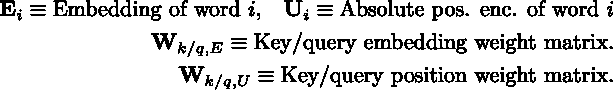

W 权重是将我们的嵌入/位置转换成键/查询的常用权重。通常，我们得到嵌入 E 和位置编码 U，然后将它们相加作为输入。我们现在发现注意力逻辑 **M:**

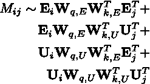

粗体表示嵌入维度 d_model。I 和 j 代表位置尺寸。

我们使用类似的符号“~”，因为有一个 sqrt(d_model)的规范化因子与当前的讨论无关。每行上的术语描述了模型可以学习的各种类型的相关性。我们将在下一节对此进行更多的讨论。现在，我们只要求矩阵元素 M_{ij}只依赖于位置信息 U_{i-j} = R_{i，j}。这就像只是替换 U_j → U_{i-j}那么简单。

接下来，我们观察到第 2 行和第 3 行有些多余。我们保留第 2 行，并使用它来确定 E 和 U 之间的局部相关性。然后，我们修改第 3 行，以使用一个共享的(在所有键中，也就是沿着每行重复的)向量 **u** _i，而不是 **U** _i **W** _{q，U}。这具有维护一个**全局上下文向量**的效果，指示嵌入是如何与位置相关联的，给定所有我们在过去已经看到的。你可以把这看作是被允许学习谈话主题的模型。如果与金钱相关的单词最近出现了很多，那么这篇文章可以指导模型将单词“bank”解释为与金融机构而不是河岸相关。

最后一行包含位置-位置相关性。正常情况下，如果这些是学习的参数，我们希望它们只是复制我们已经提供的固定位置编码。这个术语的更好的用法是把它类似于第 3 行来处理。我们替换 v_i 而不是 **U** _i **W** _{q，U}，它具有**全局位置向量**的作用，跟踪我们的全局位置。在这些替换之后，我们有:

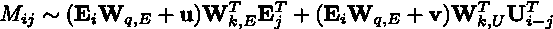

第二项是我们现在要计算的。

## 代码和算法

算法和之前一样。只是现在，我们有了一个具体的东西来看待。为了我们的目的，我们可以把在 **U** 左边的所有东西组合成一个矩阵 **q_i** ，这样我们想要计算的项是**q**_ I**u**_{i-j}^t.我们从左移开始。首先在图表中显示算法，然后尝试解释它会更容易

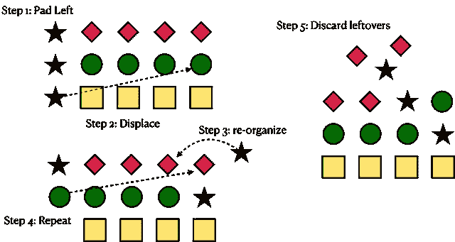

我觉得用形状代替数字会很有趣。黑色的星星代表填充。它们在数值上相当于 0。最终，我们希望将倒数第二行左移一位，倒数第三行左移两位，以此类推。我们从一个贪婪的选择开始。取出左下角的 pad 令牌，并将其移动到倒数第二行。这通过强制该行中的所有其他项左移一位来自动实现左移。然而，这反过来移动第二行到最后一行的第一个元素(一个黑色的星星)无处可去，也迫使一个绿色的圆圈也移动，因为它现在在矩阵的范围之外。因此，我们现在必须将一颗黑色星星和一个绿色圆圈移到红色菱形行上。这反过来取代了红色钻石，留下三块无处可去！但是，我们注意到矩阵的其余部分现在被适当地左移了。如果我们能摆脱那些讨厌的剩余形状就好了…

我们可以。也很容易。您只需要将矩阵调整为 3 列，并删除第一行。完成了。如果你把它重新塑造成合适的形状，所有的东西都会向左移动。下面，我们假设一个形状为(N，T，Q，K)的输入张量。算法步骤如下:

**如果时间从左到右增加:**

1.  颠倒位置。这可以通过`tf.reverse(U, [2])`或矩阵`np.flipud(U)`来完成。
2.  执行点积 **q** _i **U** _j^t.
3.  用一列 1 填充结果。对于一个形状为(N，T，Q，K)的张量，这意味着在第四个也是最后一个维度 K 上的左填充。
4.  重塑成大小(N，T，K+1，Q)。
5.  删除第一行。
6.  重塑成 shape (N，T，Q，K)的最终答案。

**如果时间从右向左增加:**

1.  不要颠倒位置。如果键长度大于查询长度，则删除 u 的最后一行(klen-qlen ),按照步骤 2 执行点积。
2.  右填充第四个也是最后一个位置。执行相同的整形
3.  请改为截断最后一行。
4.  如果 U 最初被截断，则留下与删除的行一样多的填充列。重塑为最终答案。

**如果时间是双向的:**

1.  通过取 1 的(klen，klen)矩阵的上下对角线来计算掩码。
2.  分别计算左侧和右侧的 logits，然后结合掩码。

下面我们用 NumPy 表示代码。在很大程度上，这可以通过替换 np →tf 直接转化为 TensorFlow，但我们认为这样会更清晰，以避免处理批处理和多头注意力维度的复杂性。np.triu 和 np.tril 会转换成 tf.linalg.band_part。

我添加了一些额外的测试，以便您可以确认这确实正确地计算了位置逻辑。当我在我的机器上运行代码时，我得到了输出

```
Correct answer:
 [[ 5.18 -2.58  1.54 -2.58  5.18]
 [ 0.18 -2.39  0.91 -1\.    0.91]
 [-4.05  3.41  1.86 -0.6  -4.53]]
Shifted algorithm:
 [[ 5.18 -2.58  1.54 -2.58  5.18]
 [ 0.18 -2.39  0.91 -1\.    0.91]
 [-4.05  3.41  1.86 -0.6  -4.53]]
Match? True
```

# 第三部分(可学习的编码和比较):

## 习得嵌入

到目前为止，(几乎)我们所做的一切都涉及用户定义的固定位置编码(我说几乎是因为我们在第二节中添加了那些全局上下文/位置向量，它们是学习参数)。这很好。如果我们能够获得良好的性能，这比让模型自己学习这些参数更快、更稳定。然而，如果有一件事深度学习不断提醒我们；电脑可能做得更好。

卷积在图像处理中已经使用了很长时间，然而，当构建计算机视觉网络时，我们让计算机决定它将构建哪种卷积。在实践中，这种方式要好得多。那么为什么不在这里采用同样的方法呢？为什么不让计算机学习自己的位置编码呢？在本节中，我们将沿着这些思路讨论一些方法。

我们的起点是以前的普通变压器注意逻辑方程，为了方便起见，我们在这里重复


粗体表示嵌入维度 d_model。I 和 j 代表位置尺寸。

虽然这 4 个术语是作为将位置编码 **U** 添加到嵌入向量 **E，**的结果而得到的，但是我们决不会以这种方式构造逻辑。相反，这给了我们一个对 logit 矩阵的贡献类型的线索。主要有三种类型

1.  嵌入-嵌入相关性。由第 1 行给出。
2.  嵌入位置相关性。由第 2 行和第 3 行给出。
3.  位置-位置相关性。由第 4 行给出。

嵌入-嵌入相关性是注意力的基础。我们显然不会摆脱他们，所以没有什么好说的了。

嵌入位置相关性表明一些单词是否与绝对键/查询位置匹配。根据推理，我们不会认为那是真的。如果我说你好，它不应该因为今天是 2 月 2 日还是 7 月 18 日而改变意思。相反，我们通常根据单词的相对位置来指定词义。这暗示我们可能想要用一些更“相对”友好的东西来替换这些术语。同样，我们已经展示了如何使用固定的相对编码来升级它们，但是这里我们考虑添加可学习的参数。

最后，在最后一行，我们有位置与位置的相关性。希望一个模型能学会复制一些像我们手动处理的托普利兹矩阵一样的东西。这表明模型正在学习有意义的位置。

让我们首先处理嵌入位置相关性。确定这些相关性是否相关的最简单的方法就是直接测量它们。在[、【柯】、狄鹤&、](https://arxiv.org/abs/2006.15595)的论文中，他们分析了一个预训练的 BERT 模型的学习矩阵相关性，并分割绘制了由此产生的学习相关性。他们找到了下面的图表，

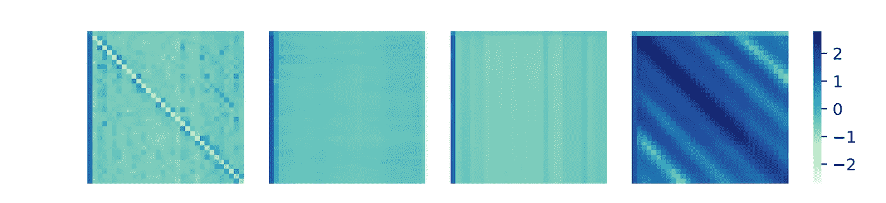

来源:[郭林柯，狄鹤&2020](https://arxiv.org/abs/2006.15595)。从左到右:E-E，E-U，U-E，U-U 相关性。

证实了我们的直觉，我们可能会放弃绝对的位置嵌入相关性。

> 顺便提一下，我们注意到这个结论是基于键和查询大小相同的假设得出的。在像 Transformer-XL 这样的环境中，可能存在能够在网络中传播的**全局**位置或环境信息。在这种情况下，放弃这些贡献可能是不明智的。

这些评论让我们对可学的位置编码有了第一个猜测。我们首先决定通过位置逻辑将我们的位置编码直接注入网络**。然后，我们为这些逻辑选择以下形式:**

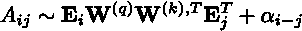

正如所建议的，我们删除了位置嵌入的东西，把位置-位置部分变成了可以学习的东西。这种表示是将位置编码扩展到逻辑的最早尝试之一，并在 Shaw 等人的论文[中提出。艾尔。(2018)](https://arxiv.org/abs/1803.02155) 。这和只是盲目地向逻辑中添加一个可学习的矩阵有一个细微的区别。我们将位置逻辑的形式限制为托普利兹，这里用α表示。因此，我们通过绑定权重，有效地将可用参数减半。这确保了模型必须对称地对待位置；距离 d(x，y)必须等于 d(y，x)。[肖等人的实际模型。艾尔。(2018)](https://arxiv.org/pdf/1803.02155.pdf) 实现稍微复杂一点，但大体思路就是这样。

与我们的固定位置编码方法相比，这种方法在处理长序列时不够灵活。由于位置逻辑是学习的参数，它们不能在模型训练后调整，并且在训练后以它们的大小为上限。作者认识到了这个问题，并提出要解决这个问题，他们实现了位置裁剪。超过一定距离后，相对位置被限制为 *k* 的最大值。

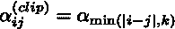

这种说法是，在足够长的长度上，知道某个东西只是“很远”就足够了，而不是大数字之间的精确差异。为了改进 Shaw 模型，我们希望以某种方式纳入更通用的位置编码，这可能允许全局信息的传播。此外，尽管我们在本文中一直在说，绝对编码可能有一些用处。例如，基于字符的语言模型可能希望大写字母与序列的开头高度相关。然而，这只是有限序列长度的假象。对于像 Reformer 这样具有大序列的模型，这一点变得无关紧要。

我们可以采用另一种方法，在保留所有位置编码 logit 术语和保留带有绑定权重的受限类之间进行折衷。在柯、狄和等人的论文中，他们提出使用逻辑推理

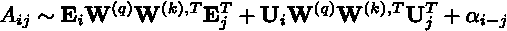

正如他们所显示的，最后两个术语没有重叠的表达能力。这为模型提供了更大的代表性。例如，模型可以学习使用绝对嵌入来确定偏移，然后使用相对嵌入来微调位置。

可学习的位置编码优于固定编码的一个优点是可以灵活地处理数据中的非顺序插入。例如，考虑 BERT 培训目标。我们留出特殊记号[CLS]和[分离]，分别表示句子的意义和分离。后者有明确的位置含义，但前者没有。一个习得的位置编码可以通过“解开”CLS 令牌来处理这个问题。柯等人。艾尔。(2020)通过将[CLS]令牌移动到第 0 个连续槽，并给它自己的共享参数θ，来处理这种特殊情况。该参数对于所有其他令牌都是相同的，表示[CLS]令牌与所有其他令牌同样“远”。否则，将会有一种偏向，即学习给予早期序列标记更大的权重[CLS]。

# 结论

在本文中，我们经历了绝对位置编码的逻辑升级:相对编码。从一些日常语言的简单例子开始，我们激发了在处理顺序数据的模型中使用相对编码的需求。

我们证明了只要网络有一组可靠的序列中两点之间的距离值，它就可以用它来计算相对位置。这允许我们通过回收我们已经来之不易的关于绝对位置编码的知识来构建 Toeplitz 相对编码张量。此外，由于我们编码的特殊 Toeplitz 属性，我们能够找到一种在 O(n)时间内计算相对位置的方法。我们给出了这样做的代码，还讨论了右移序列和双向相对编码的扩展。

最后，我们比较了我们的固定正弦编码和使用学习参数。固定编码的优点是速度快、序列长度灵活，以及内置可靠的量化位置模型。内置编码还能够利用具有不同键查询大小的模型。它们也可以调整成混合形式，其中一些可学习的参数被留出用于存储全局上下文和位置信息。相比之下，学习参数模型具有简单的表示，并且可以自由地让模型决定如何比较序列。可学习参数的一个独特优势是处理非顺序信息，如没有/不应该有明确位置的特殊标记。这些可以通过解开权重，并为非顺序令牌保留特殊的可学习参数来处理。

谢谢你坚持到现在。一如既往，随时评论或联系我任何问题或意见！

# 参考

1.  你所需要的只是关注。 *arXiv 预印本 arXiv:1706.03762* (2017)。
2.  肖、彼得、雅各布·乌兹科雷特和阿希什·瓦斯瓦尼。"自我关注与相对位置表征." *arXiv 预印本 arXiv:1803.02155* (2018)。
3.  戴，子航等，《变形金刚-xl:超越定长语境的注意语言模型》 *arXiv 预印本 arXiv:1901.02860* (2019)。
4.  柯、、狄鹤和。"重新思考语言预训练中的位置编码." *arXiv 预印本 arXiv:2006.15595* (2020)。
5.  用统一的文本到文本转换器探索迁移学习的极限。 *arXiv 预印本 arXiv:1910.10683* (2019)。