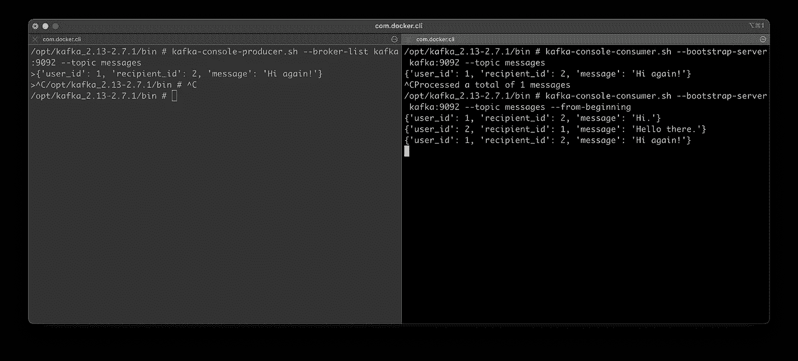

# 在 5 分钟内掌握卡夫卡外壳——主题、生产者和消费者解释

> 原文：<https://towardsdatascience.com/master-the-kafka-shell-in-5-minutes-topics-producers-and-consumers-explained-442a15f1dac1?source=collection_archive---------22----------------------->

## 通过这篇实践文章和视频，学习 Kafka 控制台生产商和消费者的基础知识


来自 [Pexels](https://www.pexels.com/photo/green-and-white-line-illustration-225769/?utm_content=attributionCopyText&utm_medium=referral&utm_source=pexels) 的 [Markus Spiske](https://www.pexels.com/@markusspiske?utm_content=attributionCopyText&utm_medium=referral&utm_source=pexels) 摄影

在大数据的世界里，可靠的流媒体平台是必不可少的。这就是卡夫卡出现的地方。您已经用 Docker 安装并配置了它。如果不是这样，请在继续之前阅读[这篇文章](https://betterdatascience.com/how-to-install-apache-kafka-using-docker-the-easy-way/)或观看[这段视频](https://youtu.be/4xFZ_iTZLTs)。

今天，你将了解所有关于 Kafka 的话题，游戏机生产商和消费者。您将掌握 Kafka shell，到本文结束时，您将为更高级的示例做好准备，例如在 Python 中使用 Kafka。

最棒的是，视频指南再次可用:

今天的文章包括以下内容:

*   《坚果壳》中的卡夫卡主题
*   Kafka 游戏机生产商
*   Kafka 控制台消费者
*   总结和后续步骤

# 《坚果壳》中的卡夫卡主题

首先打开一个新的终端窗口并连接到 Kafka shell。您应该已经运行了 Zookeeper 和 Kafka 容器，如果不是这样，请启动它们:

```
docker exec -it kafka /bin/sh
```

以下是您应该看到的内容:


图 1——打开卡夫卡的外壳(图片由作者提供)

导航到 Kafka bin 文件夹，因为所有 Kafka shell 脚本都位于该文件夹中。

```
cd /opt/kafka_<version>/bin
ls
```

以下是您应该看到的所有脚本:


图 2 —卡夫卡 bin 文件夹(图片由作者提供)

## 创建主题

接下来，让我们创建一个话题来玩。下面的命令将创建一个名为`dummy_topic`的主题。复制因子和分区设置为 1，因为这是一个虚拟环境:

```
kafka-topics.sh --create --zookeeper zookeeper:2181 --replication-factor 1 --partitions 1 --topic dummy_topic
```

您将看到以下输出打印到控制台，表明主题已成功创建:


图 3——创造一个卡夫卡主题(作者图片)

## 列出 Kafka 主题

让我们通过列出所有 Kafka 主题来验证主题是否创建成功。您可以使用以下命令来完成此操作:

```
kafka-topics.sh --list --zookeeper zookeeper:2181
```

该命令需要几秒钟的时间来执行，但是一旦完成，您将会看到下列主题:


图 4 —列出卡夫卡的主题(作者图片)

## 获取卡夫卡主题的详细信息

以下命令用于收集某个主题的信息，如分区计数、复制因子和附加配置。它叫做`--describe`，下面是你如何使用它。自从一分钟前创建这个主题以来，您已经对它了如指掌:

```
kafka-topics.sh --describe --zookeeper zookeeper:2181 --topic dummy_topic
```

这是它打印出来的内容:


图 5——获取关于卡夫卡主题的信息(作者图片)

## 删除卡夫卡主题

最后，让我们看看如何删除主题。该命令与前一个命令相同；唯一的区别是`--delete`参数而不是`--describe`:

```
kafka-topics.sh --delete --zookeeper zookeeper:2181 --topic dummy_topic
```

下面是您应该看到的输出:


图 6 —删除一个卡夫卡主题(作者图片)

删除一个主题需要几秒钟的时间，但是一旦完成，您可以列出所有要验证的主题。

这就是你现在应该知道的关于 Kafka 主题命令的全部内容。接下来，我们来看看卡夫卡主机生产商。

# Kafka 游戏机生产商

这是我们钻研好东西的地方。首先，您将创建一个名为 Messages 的新主题，它将模拟多个用户之间的聊天。您已经知道了创建主题的命令:

```
kafka-topics.sh --create --zookeeper zookeeper:2181 --replication-factor 1 --partitions 1 --topic messages
```

以下是输出结果:


图 7 —为存储消息创建新主题(作者图片)

现在你将离开`kafka-topics.sh`文件，转而使用`kafka-console-producer.sh`。这里唯一的新属性是 broker list，您将使用它来指定 Kafka 的位置。如果你已经一步一步地跟随前面的视频，你的 Kafka 位于端口 9092。最后，您需要指定想要为其生成消息的主题。

以下是完整的命令:

```
kafka-console-producer.sh --broker-list kafka:9092 --topic messages
```

接下来您将看到内部外壳打开。您不必遵循任何消息约定，但是我将输入两个格式为 JSON 的消息。您将获得用户 ID、收件人 ID 和邮件本身。完成后，按 CTRL+C 关闭生成器外壳:


图 8——用卡夫卡创作信息(作者图片)

所以到目前为止，什么都没有发生，但是我保证消息被成功地生成了。你需要了解 Kafka 游戏机的消费者来验证这一说法。

# Kafka 控制台消费者

消费者和生产者最好同时运行，所以打开一个新的终端标签，连接到同一个 Kafka 容器:

```
docker exec -it kafka /bin/sh
cd /opt/kafka_<version>/bin
```

在左侧选项卡上，您可以再次启动 Kafka 生产者，在右侧选项卡上，您可以启动消费者。您必须使用带有`--bootstrap-server`参数的`kafka-console-consumer.sh`文件来消费发送到特定主题的消息。

简而言之，您应该打开两个终端窗口——一个(左)用于生产者，另一个(右)用于消费者。使用以下命令启动它们:

制片人(左):

```
kafka-console-producer.sh --broker-list kafka:9092 --topic messages
```

消费者(右):

```
kafka-console-consumer.sh --bootstrap-server kafka:9092 --topic messages
```

正如您所看到的，一旦您启动了消费程序，什么都不会发生:


图片 9——开始卡夫卡式的消费者和生产者(图片由作者提供)

这是因为默认情况下，消费者不会列出旧消息，而是只显示新消息。让我们通过向生产者输入另一条消息来验证这一点:


图 10 —生产和消费新信息(作者图片)

现在，该消息立即显示在“消费者”选项卡中。这是你需要记住游戏机消费者的事情。如果你想看到这些信息，你需要让它们一直开着。

但是如果你想列出一个特定主题的所有生成的消息呢？事实证明你也能做到。您可以关闭生成器，因为您不再需要它了。

要列出特定主题中的所有消息，可以重用前面的消费者命令。但是您必须添加一个参数来指定您想要列出所有消息。方法如下:

```
kafka-console-consumer.sh --bootstrap-server kafka:9092 --topic messages --from-beginning
```

以下是输出结果:



图 11 —消费 Kafka 主题中的所有消息(作者图片)

如您所见，这三条消息都显示在消费者控制台中。

# 总结和后续步骤

这是卡夫卡背后的基本思想。您将消息发送到一个中心位置，并将它们分布到各个主题中，然后编写消费者代码来处理这些消息。

如果您的 shell 命令在某处失败，请参考[视频](https://www.youtube.com/watch?v=FlAlz8guJeM)，因为该视频更容易理解。

在下一篇文章中，您将看到如何用 Python 编写实际的生产者和消费者代码，所以如果您想了解 Kafka 的更多信息，请继续关注。

*喜欢这篇文章吗？成为* [*中等会员*](https://medium.com/@radecicdario/membership) *继续无限制学习。如果你使用下面的链接，我会收到你的一部分会员费，不需要你额外付费。*

[](https://medium.com/@radecicdario/membership) [## 通过我的推荐链接加入 Medium-Dario rade ci

### 作为一个媒体会员，你的会员费的一部分会给你阅读的作家，你可以完全接触到每一个故事…

medium.com](https://medium.com/@radecicdario/membership) 

# 保持联系

*   在[媒体](https://medium.com/@radecicdario)上关注我，了解更多类似的故事
*   注册我的[简讯](https://mailchi.mp/46a3d2989d9b/bdssubscribe)
*   在 [LinkedIn](https://www.linkedin.com/in/darioradecic/) 上连接

*原载于 2021 年 9 月 25 日 https://betterdatascience.com**T21*[。](https://betterdatascience.com/master-the-kafka-shell-in-5-minutes-topics-producers-and-consumers-explained/)