# 用 10 个步骤掌握一项功能:熊猫小组

> 原文：<https://towardsdatascience.com/mastering-a-function-in-10-steps-pandas-groupby-54a438e9ea93?source=collection_archive---------22----------------------->

## 数据分析中最常执行的操作之一。


托尔加·乌尔坎在 [Unsplash](https://unsplash.com/s/photos/perfect?utm_source=unsplash&utm_medium=referral&utm_content=creditCopyText) 上拍摄的照片

Pandas 可以说是数据科学生态系统中最受欢迎的 Python 库。它提供了许多功能来有效地执行数据分析和操作任务。

数据分析中最常用的 Pandas 函数之一是 groupby 函数。它允许根据一列或一组列中的不同值对数据点(即行)进行分组。

生成组后，您可以轻松地将聚合函数应用于数字列。考虑一个数据集，它包含一家公司雇员的性别信息和工资。

为了计算不同性别的平均工资，我们可以根据性别列对行进行分组，然后对工资列应用 mean 函数。

在本文中，我们将通过 10 个步骤来学习 groupby 函数的细节。连续步骤包含建立在前一步骤基础上的示例。

让我们从导入熊猫开始，并使用虚构的数据创建一个数据框。

```
import pandas as pddf = pd.DataFrame({
   "names": ["John", "Jane", "Ashley", "Allen", "Betty"],
   "gender": ["Male", "Female", "Female", "Male", "Female"],
   "height": [182, 176, 174, 178, 172],
   "education": ["BS", "BS", "BA", "BA", "BS"],
   "salary": [65000, 72000, 74000, 68000, 80000]
})df
```

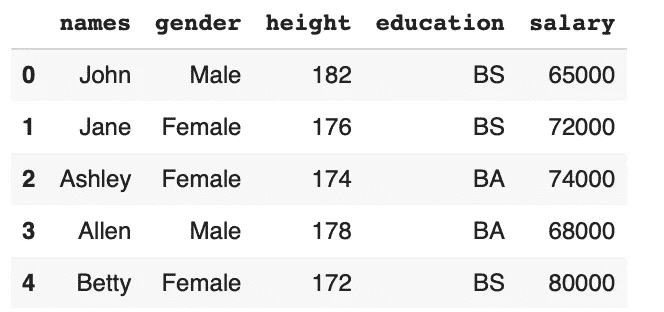

(图片由作者提供)

## 第一步

第一步是一个非常基本的例子。我们根据性别创建分组，并应用均值函数。

```
df.groupby("gender").mean()
```

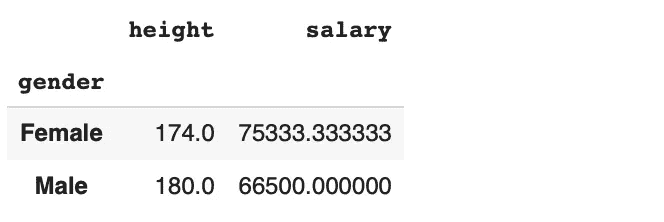

(图片由作者提供)

因为我们没有指定数字列，Pandas 计算每个数字列的平均值。

## 第二步

在某些情况下，我们只想对特定的列应用聚合函数。一种方法是在应用 groupby 函数之前筛选列。

```
df[["gender","salary"]].groupby("gender").mean()
```

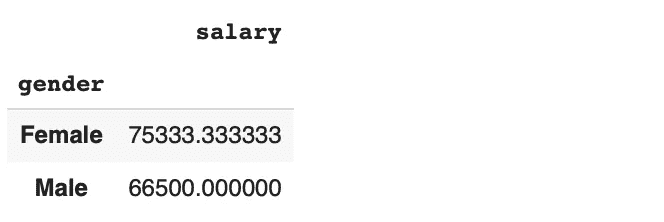

(图片由作者提供)

## 第三步

我们在第二步中所做的并不是最优的方法。典型的真实数据集包含几列，我们可能需要对许多列而不是所有列计算聚合。

在这种情况下，过滤列是一项单调乏味的任务。比较好的方法是使用熊猫的 NamedAgg 功能。

```
df.groupby("gender").agg(
   avg_salary = pd.NamedAgg("salary","mean")
)
```

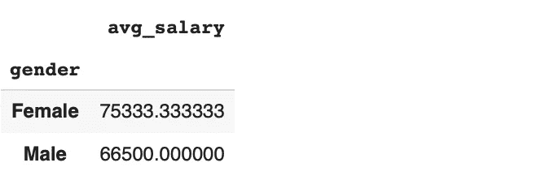

(图片由作者提供)

我们只需要指定列名和聚合函数。使用 NamedAgg 函数的另一个优点是，我们可以为聚合值指定一个名称。它肯定比使用原来的列名更清晰、信息量更大。

## 第四步

甚至还有比第三步更简单的方法。语法如下:

```
df.groupby("gender").agg(avg_salary=("salary","mean"))
```

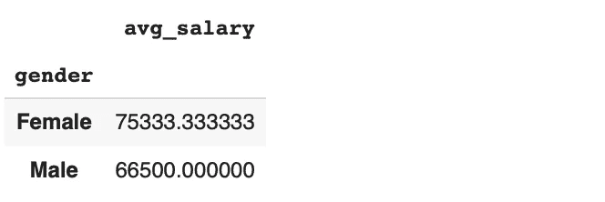

(图片由作者提供)

我总是使用这种方法，因为它需要最少的打字量😊。

## 第五步

一旦生成了组，我们就可以根据需要计算任意多的聚合。例如，下面的代码查找每个性别的平均工资和平均身高。

```
df.groupby("gender").agg(
   median_salary=("salary","median"),
   avg_height=("height","mean")
)
```

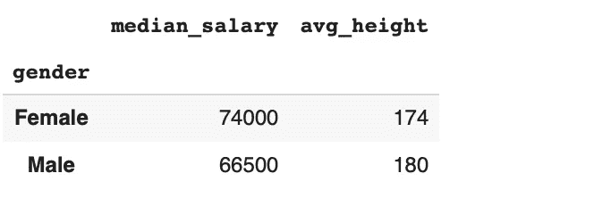

(图片由作者提供)

## 第六步

至此，组显示为数据框的索引。在某些情况下，最好将它们作为数据框中的一列。我们可以通过使用 as_index 参数来实现这一点。

```
df.groupby("gender", as_index=False).agg(
   median_salary=("salary","median"),
   avg_height=("height","mean")
)
```

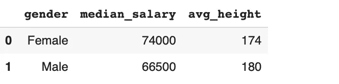

(图片由作者提供)

这种方式更好，尤其是当我们有几个组的时候。

## 第七步

就像我们可以在多个列上计算聚合一样，我们也可以基于多个列创建组。如果我们将两列传递给 groupby 函数，它将根据每列中不同值的组合创建组。

```
df.groupby(["gender","education"], as_index=False).agg(
   median_salary=("salary","median"),
   avg_height=("height","mean")
)
```

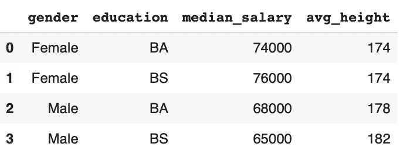

(图片由作者提供)

确保在列表中传递列名。否则，您将得到一个错误。

## 第八步

这在我们的例子中是不必要的，但是当我们有几个组时，我们可能希望根据聚合值对组进行排序。假设我们有 100 列，需要找到平均工资最高的前 3 组。在这种情况下，对结果进行排序就成了一项必要的操作。

sort_values 函数可以与 groupby 函数一起使用，如下所示:

```
df.groupby(["gender","education"], as_index=False).agg(
   median_salary=("salary","median"),
   avg_height=("height","mean")
).sort_values(by="median_salary", ascending=False)
```

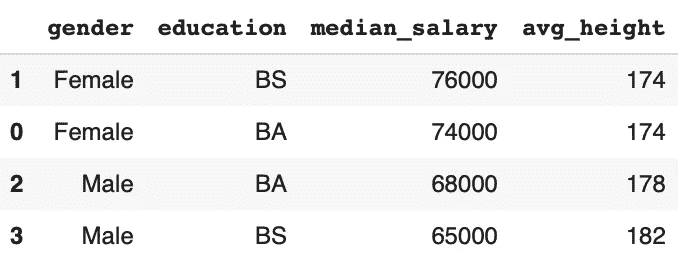

(图片由作者提供)

默认情况下，行按升序排序。我们可以用升序参数来改变它。

## 第九步

我们的数据框不包含任何缺失值。然而，现实生活中的数据集可能会有一些。如果用于分组的列中缺少值，默认情况下会删除这些行。

让我们首先将数据框中的一个值更新为缺失。

```
df.iloc[4,1] = Nonedf
```

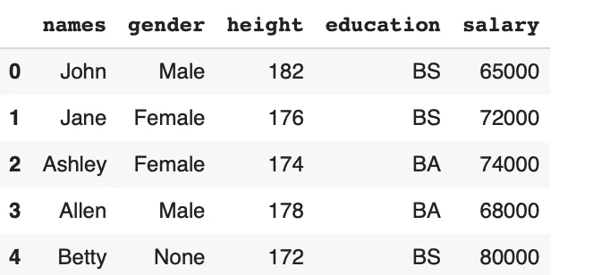

(图片由作者提供)

```
df.groupby("gender").agg(avg_salary=("salary","mean"))
```

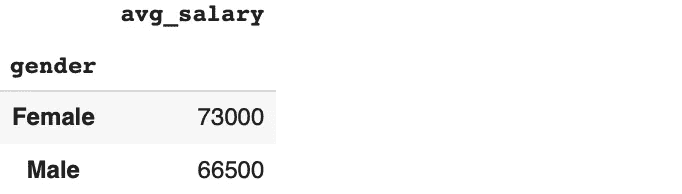

(图片由作者提供)

如您所见，性别列中缺少的值(None)被忽略。然而，在许多情况下，将缺失值考虑在内是很重要的。我们可以将 dropna 参数设置为 False，以便在结果中包含缺失的值。

```
df.groupby("gender", dropna=False).agg(avg_salary=("salary","mean"))
```

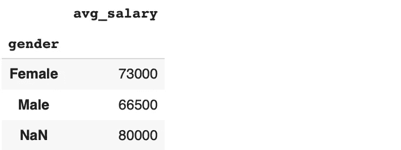

(图片由作者提供)

## 第十步

我们已经在步骤 5 中看到了如何计算多个聚合。此操作的另一个方法是将一个聚合列表传递给 agg 函数。

```
df.groupby("gender", dropna=False).agg(["mean","count"])
```

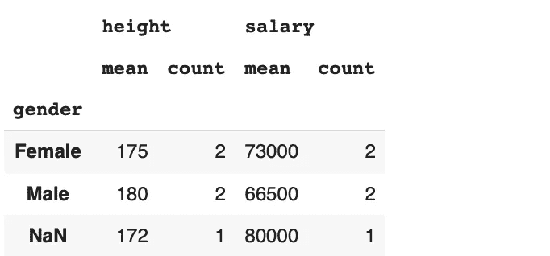

(图片由作者提供)

## 结论

groupby 是一个广泛用于数据分析的函数。我们几乎涵盖了你需要了解的一切。还有一些关于使用 groupby 函数的详细信息，但是您很少需要使用它们。

感谢您的阅读。如果您有任何反馈，请告诉我。