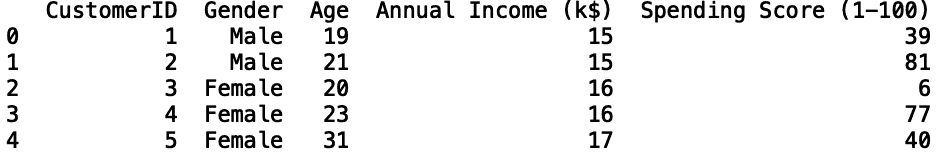
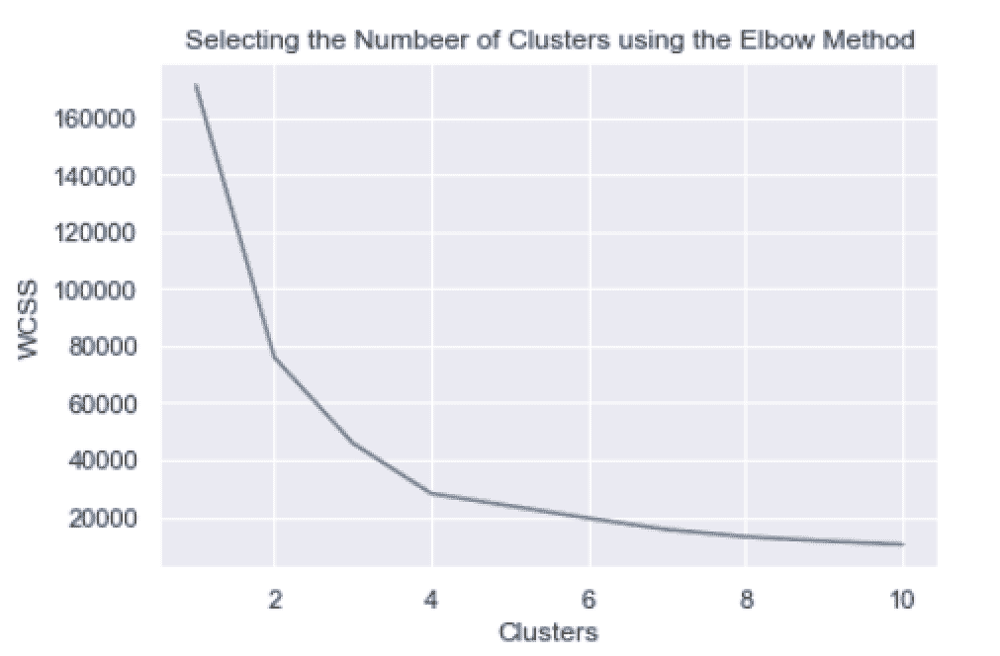
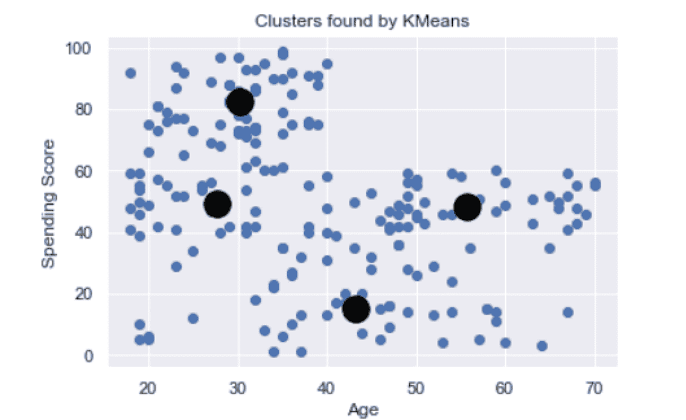
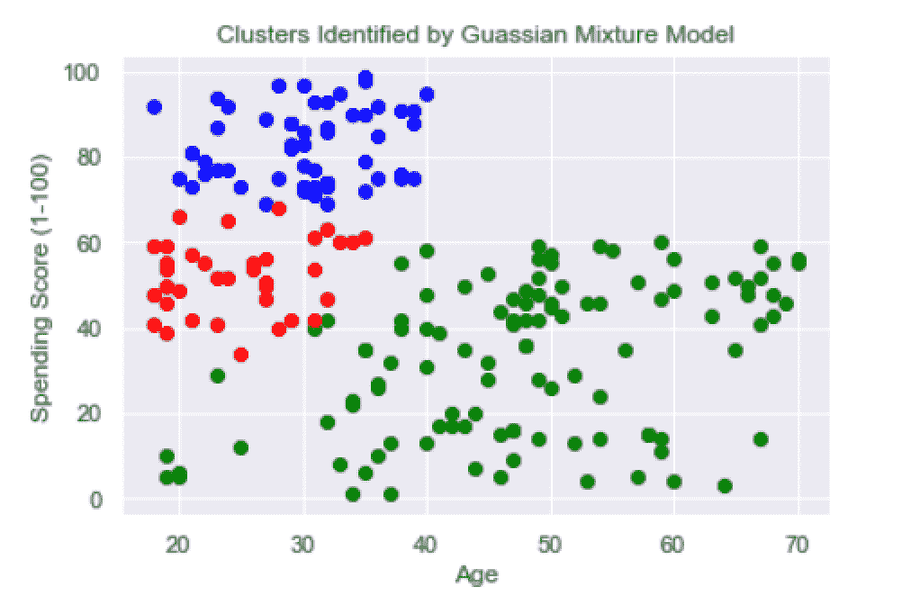
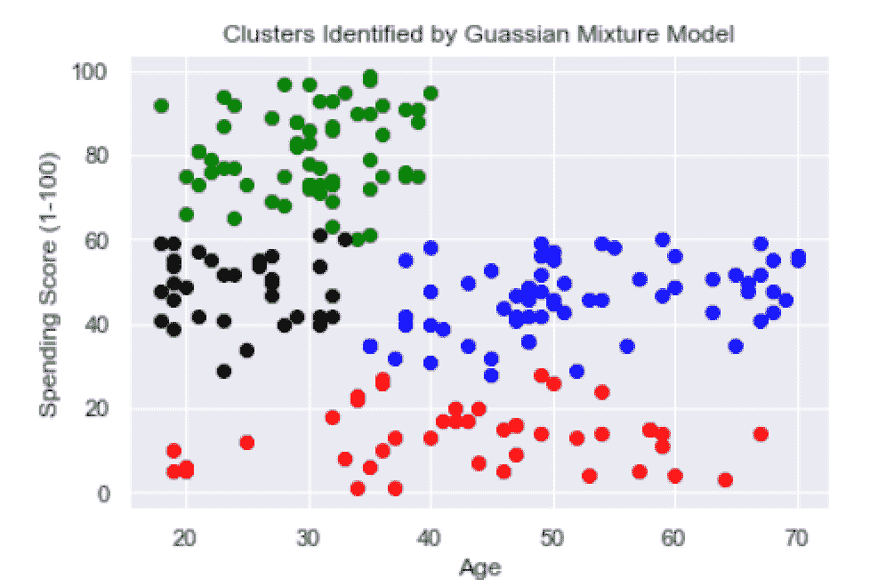
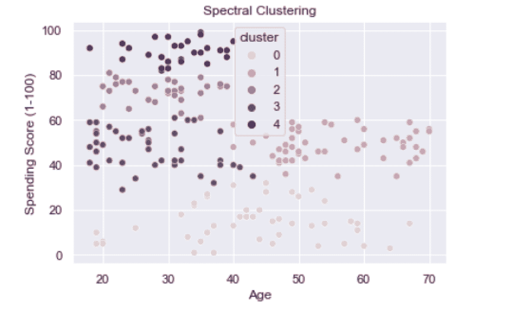

# 掌握 Python 中的聚类方法

> 原文：<https://towardsdatascience.com/mastering-clustering-methods-in-python-1cbb48054fc0?source=collection_archive---------21----------------------->

## 用于聚类分析的有用 Python 包


照片由[像素](https://www.pexels.com/photo/close-up-photography-of-yellow-green-red-and-brown-plastic-cones-on-white-lined-surface-163064/)上的 [Pixabay](https://www.pexels.com/@pixabay) 拍摄

聚类是根据共同特征分离数据不同部分的过程。包括零售、金融和医疗保健在内的不同行业使用聚类技术来完成各种分析任务。在零售业，聚类有助于识别不同的消费者群体，从而使公司能够根据消费者人口统计数据制作有针对性的广告，而这些数据可能过于复杂，无法进行人工检查。在金融领域，聚类可以检测不同形式的非法市场活动，如订单欺骗，交易者欺骗性地下大订单，迫使其他交易者购买或出售资产。在医疗保健领域，聚类方法已被用于计算患者成本模式、早发性神经障碍和癌症基因表达。

Python 为执行聚类分析提供了许多有用的工具。最佳工具的使用取决于手头的问题和可用数据的类型。Python 提供了三种广泛使用的技术:K 均值聚类、高斯混合模型和谱聚类。对于相对低维的任务(最多几十个输入)，如识别不同的消费者群体，K-means 聚类是一个很好的选择。对于更复杂的任务，如非法市场活动检测，更强大和灵活的模型，如高斯混合模型将更适合。最后，对于可能有数千个输入的高维问题，谱聚类是最佳选择。

除了选择适合问题的聚类算法之外，您还需要有一种方法来评估这些聚类算法的性能。通常，距中心的平均类内距离用于评估模型性能。具体来说，每个观察值到聚类中心(质心)的平均距离用于度量聚类的紧密度。这是有意义的，因为好的聚类算法应该生成紧密打包在一起的数据组。聚类中的数据点彼此越接近，算法的结果就越好。根据使用的聚类数绘制的聚类内距离和是评估性能的常用方法。

出于我们的目的，我们将对[商场客户细分](https://www.kaggle.com/vjchoudhary7/customer-segmentation-tutorial-in-python)数据进行客户细分分析。

**读入数据**

让我们从将数据读入熊猫数据框开始:

```
import pandas as pddf = pd.read_csv(“Mall_Customers.csv”)print(df.head())
```



作者图片

我们看到我们的数据非常简单。它包含一个包含客户 id、性别、年龄、收入的列，以及一个指定支出分数(从 1 到 100)的列。我们的聚类练习的目标是生成独特的客户群，其中该客户群的每个成员彼此之间比其他客户群的成员更相似。

## **K-均值聚类**

K-means 聚类是一种无监督的机器学习，这意味着该算法只训练输入，不训练输出。它通过查找最接近的不同数据组(即聚类)来工作。具体来说，它将数据划分到聚类中，其中每个点都属于均值最接近该数据点的聚类。

让我们从 Scikit-learn 中的 clusters 模块导入 KMeans 类:

```
from sklearn.clusters import KMeans
```

接下来，让我们定义将用于 KMeans 聚类算法的输入。让我们用年龄和消费评分:

```
X = df[[‘Age’, ‘Spending Score (1–100)’]].copy()
```

我们需要做的下一件事是确定我们将使用的集群数量。我们将使用肘方法，该方法绘制了类内平方和(WCSS)与类数量的关系。我们需要定义一个包含 KMeans 类实例的 for 循环。这个 for 循环将迭代从 1 到 10 的簇号。我们还将初始化一个用于追加 WCSS 值的列表:

```
for i in range(1, 11): kmeans = KMeans(n_clusters=i, random_state=0) kmeans.fit(X)
```

然后，我们将 WCSS 值添加到列表中。我们通过 KMeans 对象的惯性属性来访问这些值:

```
for i in range(1, 11): kmeans = KMeans(n_clusters=i, random_state=0) kmeans.fit(X) wcss.append(kmeans.intertia_)
```

最后，我们可以画出 WCSS 和星团数量的关系图。首先，让我们导入 [Matplotlib 和 Seaborn](https://builtin.com/data-science/data-visualization-tutorial) ，这将允许我们创建和格式化数据可视化:

```
import matplotlib.pyplot as pltimport seaborn as sns
```

让我们使用 Seaborn 来设计这些图的样式:

```
sns.set()
```

然后绘制 WCSS 与聚类图:

```
plt.plot(range(1, 11), wcss)
```

接下来，添加一个标题:

```
plt.title(‘Selecting the Number of Clusters using the Elbow Method’)
```

最后，标记轴:

```
plt.xlabel(‘Clusters’)plt.ylabel(‘WCSS’)plt.show()
```



作者图片

从该图中，我们可以看到 4 是最佳的集群数量，因为这是曲线“肘”出现的地方。



作者图片

我们可以看到 KMeans 发现了四个集群，它们是这样分解的:

1.  消费水平适中的年轻顾客
2.  消费得分高的年轻顾客
3.  消费分数较低的中年客户
4.  消费得分适中的高级客户

这种类型的信息对于希望锁定特定消费者群体的零售公司非常有用。例如，如果大多数高消费分数的人都比较年轻，公司可以通过广告和促销来瞄准年轻的消费者群体。

## **高斯混合模型(GMM)**

该模型假设可以使用高斯分布对聚类进行建模。高斯分布，非正式地称为钟形曲线，是描述许多重要事情的函数，如人口高度、体重，甚至智商(IQ)。这些模型非常有用，因为高斯分布具有明确定义的属性，如均值、方差和协方差。平均值就是一个聚类中某个输入的平均值。方差测量单个输入值的波动。协方差是一个统计矩阵，描述了输入之间的相互关系(特别是它们如何一起变化)。总的来说，这些参数允许 GMM 算法灵活地识别复杂形状的聚类。例如，K-means 通常识别球形簇，而 GMM 可以更一般地识别不同形状的簇。这使得 GMM 在实践中比 K-means 更稳健。

让我们从 Scikit-learn 导入 GMM 包开始:

```
from sklearn.mixture import GaussianMixture
```

接下来，让我们初始化 GaussianMixture 类的一个实例。让我们从考虑三个集群开始，并使模型适合我们的输入(在这种情况下，年龄和支出分数):

```
from sklearn.mixture import GaussianMixturen_clusters = 3gmm_model = GaussianMixture(n_components=n_clusters)gmm_model.fit(X)
```

现在，让我们生成聚类标签，并将结果和我们的输入一起存储在一个新的数据框中:

```
cluster_labels = gmm_model.predict(X)X = pd.DataFrame(X)X[‘cluster’] = cluster_labels
```

接下来，让我们绘制一个 for 循环中的每个集群:

```
for k in range(0,n_clusters): data = X[X[“cluster”]==k] plt.scatter(data[“Age”],data[“Spending Score (1–100)”],c=color[k])
```

最后，格式化出图:

```
plt.title(“Clusters Identified by Guassian Mixture Model”)plt.ylabel(“Spending Score (1–100)”)plt.xlabel(“Age”)plt.show()
```



作者图片

红色和蓝色的集群看起来相对清晰。蓝色聚类是具有高消费分数的年轻客户，红色聚类是具有中等消费分数的年轻客户。绿色聚类的定义不太明确，因为它跨越所有年龄层，并且都有低到中等的支出分数。

现在，让我们尝试四个集群:

```
…n_clusters = 4gmm_model = GaussianMixture(n_components=n_clusters)…
```



作者图片

尽管四个集群显示出轻微的改善，但是红色和蓝色的集群在年龄和花费分值方面仍然相当宽泛。让我们尝试五个集群:


作者图片

五个集群在这里似乎是合适的。它们可以描述如下:

1.  消费得分高的年轻客户(绿色)
2.  消费得分适中的年轻客户(黑色)
3.  低消费分数的年轻至中年客户(蓝色)
4.  消费得分较低的中年至老年客户(黄色)
5.  中等支出分数的中年至老年客户(红色)

高斯混合模型通常比 K-均值聚类更加健壮和灵活。这也是因为 GMM 能捕捉复杂的聚类形状，而 K-means 不能。这使得 GMM 能够准确地识别比 K-means 识别的球形簇更复杂的簇。对于中等大小和复杂性的数据集，GMM 是一种理想的方法，因为它能够更好地捕获具有复杂形状的数据集中的聚类。

## **光谱聚类**

谱聚类是对高维且通常复杂的数据进行聚类分析的常用方法。它的工作原理是对输入进行降维，并在降维后的空间中生成聚类。由于我们的数据不包含很多输入，这主要是为了说明的目的，但是将这种方法应用于更复杂和更大的数据集应该很简单。

让我们从 Scikit-learn 中的 cluster 模块导入 SpectralClustering 类开始:

```
from sklearn.cluster import SpectralClustering
```

接下来，让我们用五个集群定义我们的 SpectralClustering 类实例:

```
spectral_cluster_model= SpectralClustering(n_clusters=5,random_state=25,n_neighbors=8,affinity=’nearest_neighbors’)
```

接下来，让我们为输入定义模型对象，并将结果存储在同一个数据框中:

```
X[‘cluster’] = spectral_cluster_model.fit_predict(X[[‘Age’, ‘Spending Score (1–100)’]])
```

最后，让我们绘制我们的集群:

```
fig, ax = plt.subplots()sns.scatterplot(x=’Age’, y=’Spending Score (1–100)’, data=X, hue=’cluster’, ax=ax)ax.set(title=’Spectral Clustering’)
```



作者图片

我们看到集群 1、2、3 和 4 非常明显，而集群 0 似乎非常宽泛。总的来说，我们在聚类组中看到一些与我们在克曼和 GMM 中看到的相同的模式，尽管以前的方法给出了更好的聚类之间的分离。同样，谱聚类更适合于涉及更大数据集(成百上千个输入和数百万行)的问题。

这篇文章的代码可以在 GitHub 上找到。

## **结论**

虽然我们只在客户细分的背景下考虑了聚类分析，但聚类分析在很大程度上适用于各种行业。我们讨论的聚类方法已经被用来解决各种各样的问题。KMeans 聚类已用于识别易受感染的患者群体。高斯混合模型已被用于检测非法市场活动，如欺骗交易，泵和转储，以及报价填充。谱聚类方法已被用于解决复杂的医疗保健问题，如用于医疗保健知识发现的医学术语分组。

不管是什么行业，任何现代组织或公司都可以从他们的数据中发现重要的集群。Python 提供了许多易于实现的工具，用于在所有数据复杂性级别执行聚类分析。此外，对于任何数据科学家来说，充分了解在给定数据复杂性的情况下哪些方法最有效是一项非常宝贵的技能。我们所涵盖的内容为开始学习如何执行聚类分析的数据科学家提供了坚实的基础。

如果你有兴趣学习 python 编程的基础知识、Pandas 的数据操作以及 python 中的机器学习，请查看[*Python for Data Science and Machine Learning:Python 编程、Pandas 和 sci kit-初学者学习教程*](https://www.amazon.com/dp/B08N38XW2Q/ref=sr_1_1?dchild=1&keywords=sadrach+python&qid=1604966500&s=books&sr=1-1) *。我希望你觉得这篇文章有用/有趣。*

***本帖原载于*** [***内置博客***](https://builtin.com/data-science) ***。原片可以在这里找到***[](https://builtin.com/data-science/data-clustering-python)****。****