# 掌握 Python 中的数据可视化

> 原文：<https://towardsdatascience.com/mastering-data-visualization-in-python-7d52e9f24c5c?source=collection_archive---------37----------------------->

## 使用 Seaborn 和 Matplotlib 进行数据探索


照片由[卢卡斯](https://www.pexels.com/@goumbik)在[像素](https://www.pexels.com/photo/person-writing-on-notebook-669615/)上拍摄

数据可视化对于许多分析任务都很重要，包括数据汇总、探索性数据分析和模型输出分析。与他人交流你的发现的最简单的方法之一是通过良好的可视化。幸运的是，Python 提供了许多库，为从数据中获得洞察力提供了有用的工具。其中最著名的是 Matplotlib，它使用户能够生成可视化效果，如直方图、散点图、条形图、饼图等等。

Seaborn 是构建在 Matplotlib 之上的另一个有用的可视化库。它提供的数据可视化通常更加美观，在统计上更加复杂。对于任何数据科学家或数据分析师来说，充分了解如何使用这两个库都是至关重要的，因为它们都提供了可视化数据的简单方法。

# **Matplotlib**

**使用 Matplotlib 生成直方图**

Matplotlib 提供了许多现成的工具，用于快速轻松地进行数据可视化。例如，当分析一个新的数据集时，研究人员通常对一组列的值的分布感兴趣。一种方法是通过直方图。直方图是通过基于设定范围选择值并将每组值放入容器或桶中而生成的分布的近似值。使用 Matplotlib 可以直接将分布可视化为直方图。

出于我们的目的，我们将使用 FIFA19 数据集，您可以在这里找到。

首先，我们需要导入 Pandas 库，这是一个 Python 库，用于统计分析和数据争论等数据任务:

```
import pandas as pd
```

接下来，我们需要从 Matplotlib 库中导入 pyplot 模块。习惯上将其作为 plt 导入:

```
import matplotlib.pyplot as plt
```

现在，让我们将数据读入熊猫数据帧。我们将在 Pandas 中使用 set_option()方法放宽对显示列和行的限制:

```
df = pd.read_csv("fifa19.csv")
pd.set_option('display.max_columns', None)
pd.set_option('display.max_rows', None)
```

让我们使用 head()方法显示前五行数据:

```
print(df.head())
```

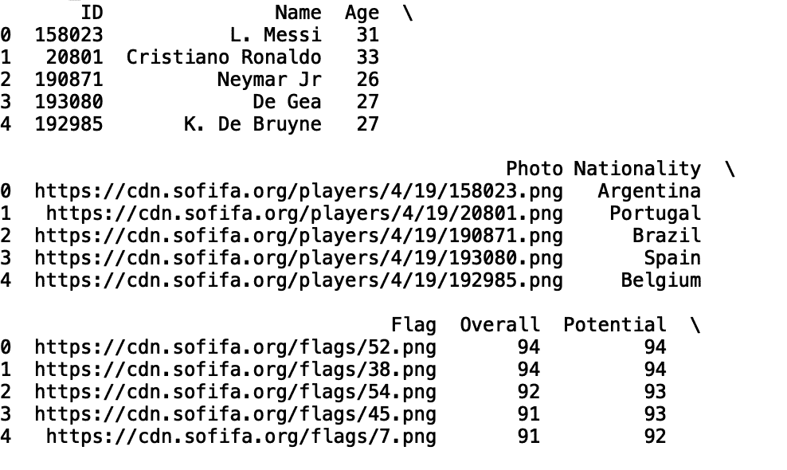

作者截图

我们可以通过调用 plt 对象上的 hist()方法并在数据框中传递选定的列来为任何数字列生成直方图。让我们为“总体”列执行此操作，该列对应于总体玩家评级:

```
plt.hist(df['Overall'])
```

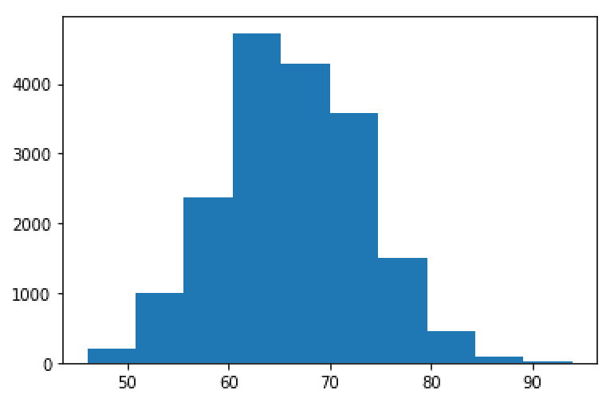

作者截图

我们还可以分别使用 xlabel()、ylabel()和 title()方法标记绘图的 x 轴、y 轴和标题:

```
plt.xlabel('Overall')
plt.ylabel('Frequency')
plt.title('Histogram of Overall Rating')
plt.show()
```

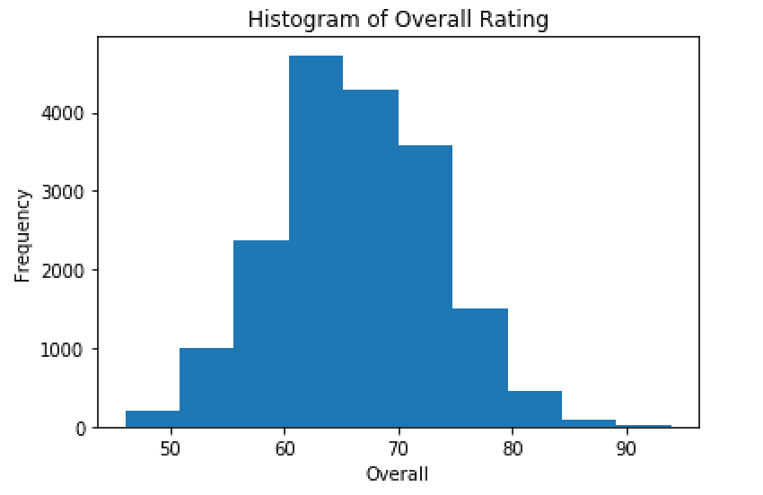

作者截图

这种可视化是了解数据中的值是如何分布的，以及轻松查看哪些值出现频率最高和最低的好方法。

**使用 Matplotlib 生成散点图**

散点图是一种有用的数据可视化工具，有助于识别变量相关性。例如，如果我们有兴趣了解工资和玩家总体评分之间是否存在正相关关系，(例如，如果玩家的工资增加，他的评分是否也会上升？)我们可以利用散点图可视化来获得洞察力。

在生成工资与总体评分的散点图之前，让我们将工资列从字符串转换为浮点数字列。为此，我们将创建一个名为 wage_euro 的新列:

```
df['wage_euro'] = df['Wage'].str.strip('€')
df['wage_euro'] = df['wage_euro'].str.strip('K')
df['wage_euro'] = df['wage_euro'].astype(float)*1000.0
```

现在，让我们显示我们的新列 wage_euro 和总体列:

```
print(df[['Overall', 'wage_euro']].head())
```

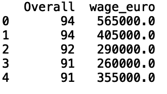

作者截图

要在 Matplotlib 中生成散点图，我们只需在 plt 对象上使用 scatter()方法。让我们也标记轴，并给我们的图一个标题:

```
plt.scatter(df['Overall'], df['wage_euro'])
plt.title('Overall vs. Wage')
plt.ylabel('Wage')
plt.xlabel('Overall')
plt.show()
```

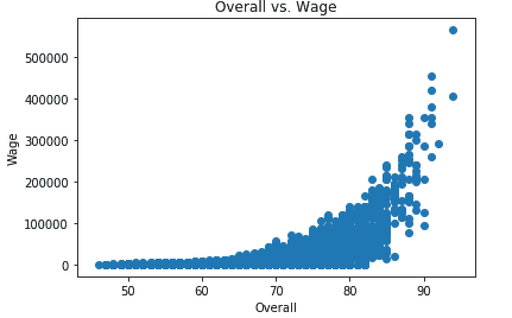

作者截图

**用 Matplotlib 生成条形图**

条形图是分析数据类别的另一个有用的可视化工具。例如，如果我们想查看 FIFA19 数据集中最常见的国籍，我们可以使用条形图。为了可视化分类列，我们首先应该对值进行计数。我们可以使用集合模块中的 counter 方法为分类列中的每个类别生成一个计数值字典。让我们为国籍列这样做:

```
from collections import Counter
print(Counter(df[‘Nationality’]))
```

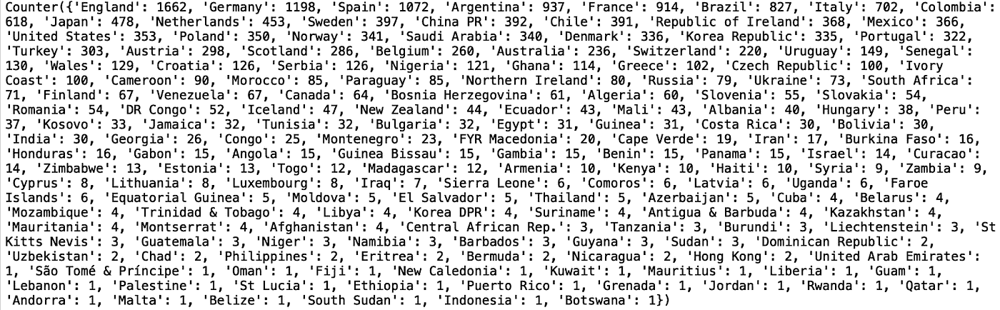

作者截图

我们可以用最常用的方法过滤这个字典。我们来看十个最常见的国籍值(注意:也可以使用 least_common 方法分析不常见的国籍值):

```
print(dict(Counter(df[‘Nationality’]).most_common(10)))
```

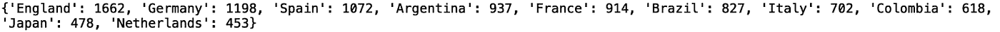

作者截图

最后，为了生成十个最常见的国籍值的条形图，我们简单地调用 plt 对象上的 bar 方法，并传入字典的键和值:

```
nationality_dict = dict(Counter(df['Nationality']).most_common(10))
plt.bar(nationality_dict.keys(), nationality_dict.values())
plt.xlabel('Nationality')
plt.ylabel('Frequency')
plt.title('Bar Plot of Ten Most Common Nationalities')
plt.show()
```

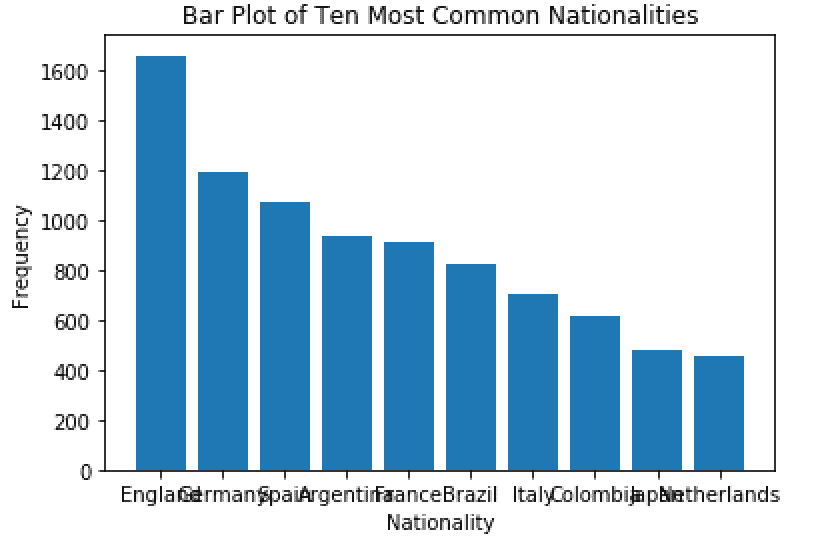

作者截图

正如您所看到的，x 轴上的值是重叠的，这使得它们很难看到。我们可以使用“xticks()”方法来旋转这些值:

```
plt.xticks(rotation=90)
```

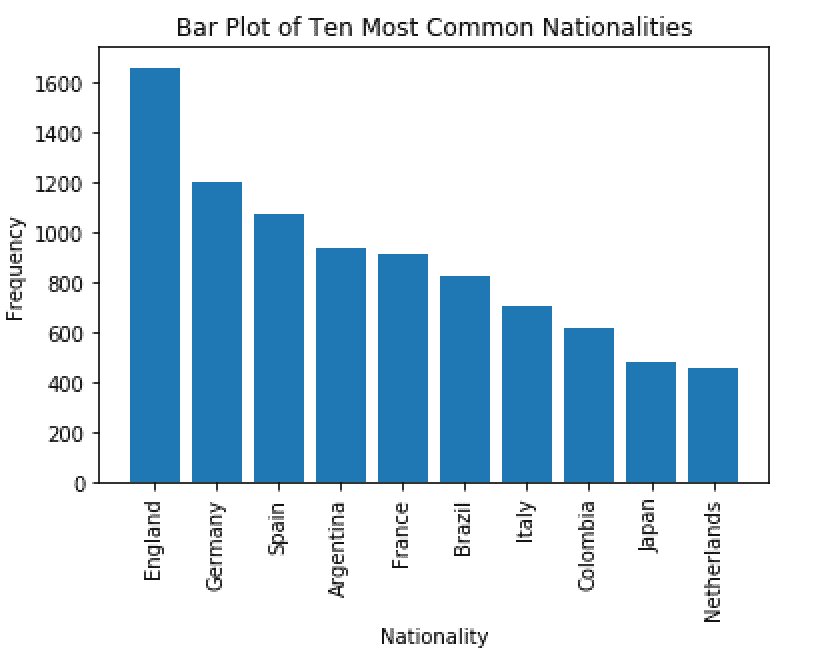

作者截图

**用 Matplotlib 生成饼图**

饼图是直观显示数据比例的有用方法。比如在这个数据集中，我们可以用一个饼状图来形象化的展示英格兰、德国和西班牙球员的比例。

为此，让我们创建包含英格兰、西班牙和德国的新列，并为所有其他国家创建一个标记为“其他”的列:

```
df.loc[df.Nationality =='England',  'Nationality2'] = 'England'
df.loc[df.Nationality =='Spain',  'Nationality2'] = 'Spain'
df.loc[df.Nationality =='Germany',  'Nationality2'] = 'Germany'
df.loc[~df.Nationality.isin(['England', 'German', 'Spain']),  'Nationality2'] = 'Other'
```

接下来，让我们创建一个字典，其中包含每一项的比例值:

```
prop = dict(Counter(df['Nationality2']))
for key, values in prop.items():
    prop[key] = (values)/len(df)*100
    print(prop)
```

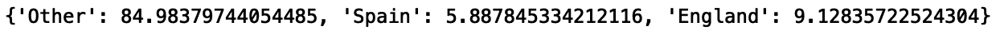

作者截图

我们可以使用我们的字典和 Matplotlib 中的 pie 方法创建一个饼图:

```
fig1, ax1 = plt.subplots()
ax1.pie(prop.values(), labels=prop.keys(), autopct=’%1.1f%%’,shadow=True, startangle=90)
ax1.axis(‘equal’) 
plt.show()
```

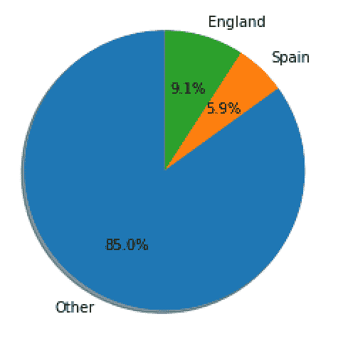

作者截图

正如我们所看到的，所有这些方法都为我们提供了多种强大的方式来可视化数据中类别的比例。

# **使用 Seaborn 进行数据可视化**

**格式化 Matplotlib 图**

Seaborn 是一个构建在 Matplotlib 之上的库，支持更复杂的可视化和美观的绘图格式。一旦您掌握了 Matplotlib，您可能想要迁移到 Seaborn 进行更复杂的可视化。

例如，简单地使用 Seaborn set()方法可以极大地改善 Matplotlib 图的外观。让我们来看看。

首先，将 Seaborn 作为 sns 导入，并重新格式化我们生成的所有图形。在脚本的顶部，编写以下代码并重新运行:

```
import seaborn as sns
sns.set()
```

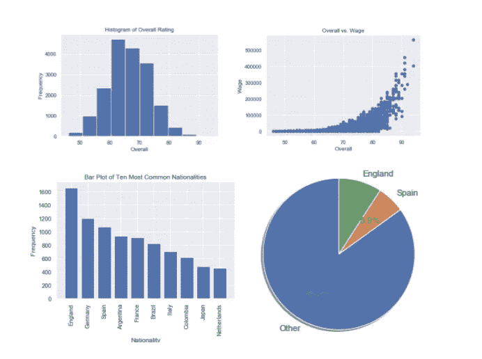

作者截图

**用 Seaborn 生成直方图**

我们还可以使用 Seaborn 生成与在 Matplotlib 中相同的可视化效果。

为了重新生成整个列的直方图，我们对 Seaborn 对象使用 distplot 方法:

```
sns.distplot(df['Overall'])
```

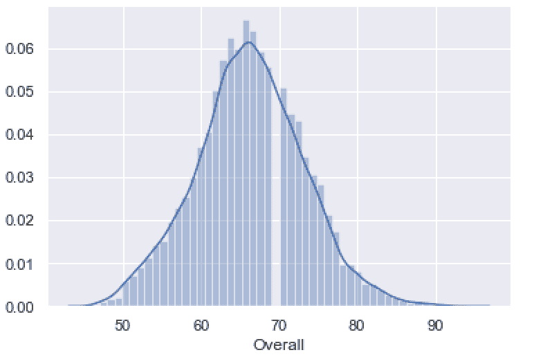

作者截图

我们可以重用 plt 对象来进行额外的轴格式化和标题设置:

```
plt.xlabel(‘Overall’)
plt.ylabel(‘Frequency’)
plt.title(‘Histogram of Overall Rating’)
plt.show()
```

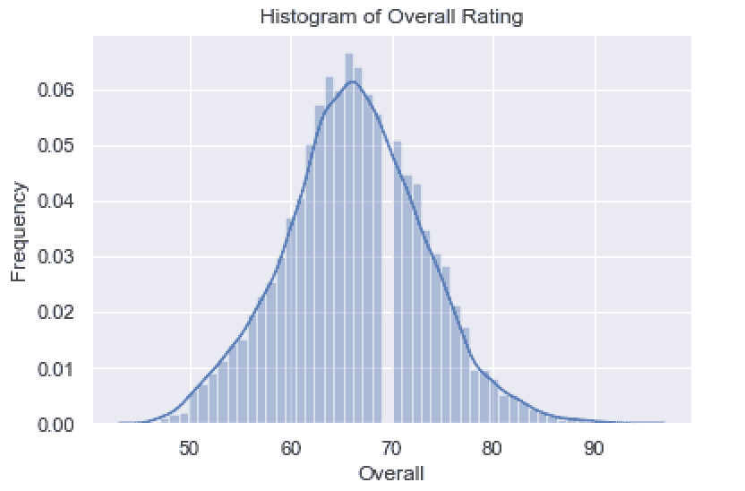

作者截图

正如我们所看到的，这个图看起来比 Matplotlib 图更吸引人。

**用 Seaborn 生成散点图**

Seaborn 还使得散点图的生成变得简单明了。让我们重新创建之前的散点图:

```
sns.scatterplot(df['Overall'], df['wage_euro'])
plt.title('Overall vs. Wage')
plt.ylabel('Wage')
plt.xlabel('Overall')
plt.show()
```

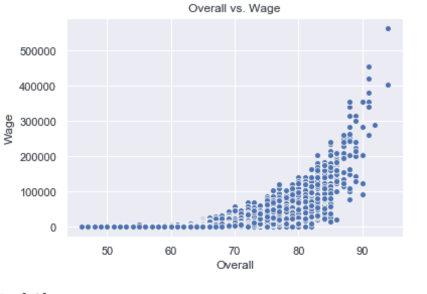

作者截图

**使用 Seaborn 生成热图**

Seaborn 还以制作相关热图而闻名，这种热图可用于确定变量相关性。要生成一个，首先我们需要计算一组数字列之间的相关性。让我们对年龄、整体、工资欧元和技能变动进行分析:

```
corr = df[['Overall', 'Age', 'wage_euro', 'Skill Moves']].corr()
sns.heatmap(corr, annot=True)
plt.title('Heatmap of Overall, Age, wage_euro, and Skill Moves')
plt.show()
```

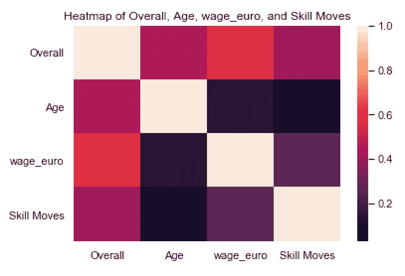

作者截图

我们还可以将 annot for annotate 设置为 true 来查看相关值:

```
sns.heatmap(corr, annot=True)
```

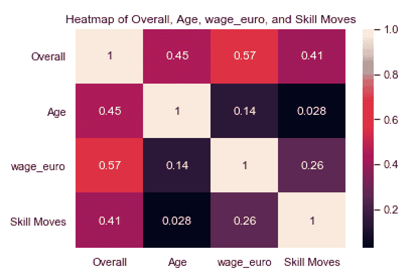

作者截图

**用 Seaborn 生成 Pairs 图**

我将讨论的最后一个 Seaborn 工具是 pairplot 方法。这允许您为一组数字特征生成分布矩阵和散点图。让我们从年龄、整体和潜力方面来看:

```
data = df[[‘Overall’, ‘Age’, ‘Potential’,]]
sns.pairplot(data)
plt.show()
```

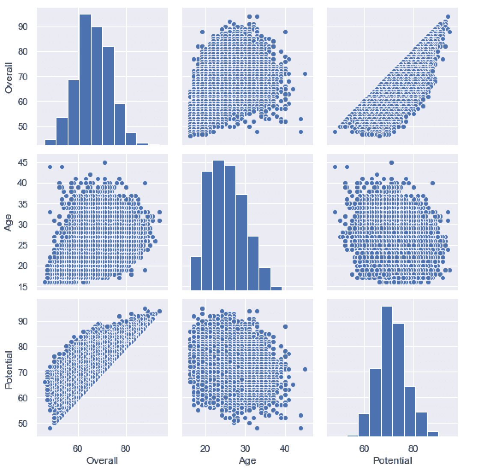

作者截图

正如您所看到的，这是一种通过散点图直观显示数值分布和变量之间关系的快速简便的方法。

# **结论**

总的来说，Seaborn 和 Matplotlib 对于任何数据科学家来说都是有价值的工具。Matplotlib 使标记、标题和格式化图形变得简单，这对有效的数据通信很重要。此外，它还提供了许多可视化数据的基本工具，包括直方图、散点图、饼图和条形图。

Seaborn 是一个需要了解的重要库，因为它有漂亮的视觉效果和广泛的统计工具。就像我们在这篇文章中展示的那样，在 Seaborn 中生成的图，即使它们传达了相同的信息，也比在 Matplotlib 中生成的图漂亮得多。此外，Seaborn 提供的工具允许更复杂的分析和可视化。虽然我只讨论了如何使用 Seaborn 生成热图和成对图，但它也可以用于生成更复杂的视觉效果，如变量的密度图、带置信区间的线图、聚类图等等。

Matplotlib 和 Seaborn 是 Python 中使用最广泛的两个可视化库。它们都允许您快速执行数据可视化，以获得统计见解和用数据讲述故事。虽然这两个库的使用案例有很大的重叠，但了解这两个库可以让数据科学家生成漂亮的视觉效果，讲述关于正在分析的数据的有影响力的故事。

如果你有兴趣学习 python 编程的基础知识、Pandas 的数据操作以及 python 中的机器学习，请查看[*Python for Data Science and Machine Learning:Python 编程、Pandas 和 sci kit-初学者学习教程*](https://www.amazon.com/dp/B08N38XW2Q/ref=sr_1_1?dchild=1&keywords=sadrach+python&qid=1604966500&s=books&sr=1-1) *。我希望你觉得这篇文章有用/有趣。*

***本帖原载于*** [***内置博客***](https://builtin.com/machine-learning) ***。原片可以在这里找到***[](https://builtin.com/machine-learning/scikit-learn-guide)****。****