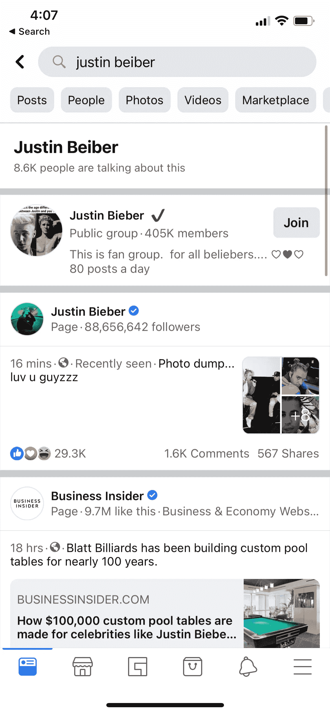

# 掌握 Facebooks 指标变化数据科学面试问题第 1/2 部分

> 原文：<https://towardsdatascience.com/mastering-facebooks-metric-change-data-science-interview-question-a093426d3bbf?source=collection_archive---------9----------------------->

## 闯入 FAANG 的数据科学面试准备系列

上周介绍了一个 [*回答数据科学度量变化面试问题*](/answering-the-data-science-metric-change-interview-question-the-ultimate-guide-5e18d62d0dc6) *的指南。*但是这个指南不仅仅是一个*假设*面试的框架。这正是我在脸书大学第一轮数据科学面试中获胜所用的**框架。**

所以这周，我想把理论付诸实践。我上了 [Glassdoor](https://www.glassdoor.com/Interview/Facebook-Data-Scientist-Interview-Questions-EI_IE40772.0,8_KO9,23.htm) (正如一个人所做的那样)，围绕一个度量变化提出了最近的数据科学面试问题(截至本文撰写之日)。**在本文中，我将带您了解如何将指标变化框架应用于脸书的数据科学面试问题。**

# 您会注意到，点击脸书活动搜索结果的用户百分比每周都增加了 10%。你会如何调查？

【来源:[玻璃门](https://www.glassdoor.com/Interview/Facebook-Data-Scientist-Interview-Questions-EI_IE40772.0,8_KO9,23.htm)

# **一、澄清**

> 什么都不要假设，如果事情不是绝对明显的，那就问。

你会注意到，点击了关于脸书事件的搜索结果**的*的用户的**百分比同比增加了 10%。你会如何调查？*****

> *****受访者*****

***所以澄清一下:***

*   ******搜索结果*** 是指当用户在脸书的搜索栏中搜索某样东西时？这些搜索结果可以是不同的类别，比如脸书事件、页面或群组？***

****

***截图来自作者手机***

*   **当我们查看点击关于脸书事件 的 ***搜索结果*** ***的 ***用户的百分比时，我们的意思是:在进行搜索并看到搜索结果列表的用户中，点击围绕**脸书事件**(而不是群组、页面等)**的结果的用户的比例是多少？**因此，如果 100 个用户搜索一个术语，其中 50 人点击了与脸书事件相关的结果，那么用户百分比将是 50%？********
*   *而*用户百分比周环比 10%的增长意味着，如果上周 100 个用户搜索一个词，其中 50 个点击了脸书事件相关的结果，那么本周 200 个用户可能搜索了一个词，但 110 个点击了脸书事件相关的结果？所以现在用户的百分比是 55%(即比上周增加了 10%)。**
*   **最后，鉴于这一点，**我们的目标是**试图找出是什么导致了这种增长？**

> ****面试官****

**以上都是肯定的。**

> ****提示****

*   **重要的是不仅要澄清问题，还要重申目标。**

# ****二。假设****

> ****受访者****

**在我深入研究尖峰信号的来源之前，我想概述几个高层次的假设*。广义地说，原因可能是内部的，也可能是外部的。***

***潜在的**内部**原因可能包括我们最近对排名算法进行的更新，以在搜索结果列表的顶部显示事件。或者，在我们的日志记录中甚至可能有一个错误，这意味着我们没有正确地捕获我们的点击计数，因此可能没有事件相关点击的实际增加。***

***潜在的**外部**原因可能包括重大事件，如节日季节，导致用户对事件相关的搜索结果表现出更大的兴趣。***

***为了测试这些高层次的假设，并揭示其他潜在的原因，我想在我要探索的数据中浏览一下。这听起来合理吗？***

> *****面试官*****

***是的。***

> *****提示*****

*   ***使用假设这个词。把它当成你的工作来使用。因为如果你面试成功了，就真的会成功。***
*   ***不断寻求反馈。**这是对话，不是独白**。如果你不定期停下来和面试官交流，你会:***

1.  ***不知道你是否正朝着正确的方向前进，或者是否有**你可能错过的东西**和***
2.  ***你可能会失去面试官的注意力和兴趣(他们也是人)***

# *****III。诊断*****

> *****受访者*****

***我要考虑的第一个数据点是 ***时间*** 的作用。***

**我会检查是否:**

*   **这种每周 10%的增长确实意味着人们对事件的兴趣越来越大。在过去的几周里，周与周之间有什么变化(例如，我们的**趋势**如何)？如果前一周我们看到了 20%的增长，那么本周的数字可能实际上表明了兴趣的下降。**
*   **我还想检查一下*的增长是否均匀地分布在一周中，或者它是否是一天中大量点击的结果。如果是后者，这可能表明我们的日志系统中有一个 bug，或者当天发生了一个大事件。***
*   *****季节性**起作用吗？去年这个时候发生了什么？例如，如果学校放假，学生进入暑假模式，那么我们实际上可能会看到学生对寻找事情做的活动越来越感兴趣。在这种情况下，我们很可能会在去年的这个时候看到类似的峰值。***

> *****面试官*****

***有道理。你还会看什么？***

> *****受访者*****

***接下来，我想看看这 10%的增长是如何分解的:***

*   ***这种变化**是集中在特定区域**还是在全球范围内均匀分布？例如，我们正慢慢走出疫情，一些城市已经开始重新开放。在这种情况下，对事件的兴趣上升可能只集中在那些城市。***
*   ***我们的其他**产品或服务**中有类似的增长吗？如果人们对活动的兴趣上升，我们会看到 Instagram 或脸书故事的类似增长吗，因为参加这些活动的用户会有更多的内容可以发布？***
*   ***这种增长是否在**移动设备和**桌面设备之间平均分布？如果我们认为我们的日志中有一个错误，或者我们对我们的排名系统进行了更改，这将是非常有用的。错误或更新通常发生在特定的操作系统上。因此，如果我们看到变化不成比例地偏向 macOS、windows、iOS 或 android 中的一个，那么它可能会证实我们最初的假设，即变化是由内部原因驱动的。***
*   ***其他搜索结果类别，如组和页面，是如何受到影响的？如果用户点击事件的百分比在上升，那么我们显然是在从这些其他类别中分食**参与度。有没有一个特定的类别是我们从中分食的，或者它是平均分布的？例如，是否只有以前点击组(而不是页面)的用户现在才点击事件？这可能表明我们对搜索结果中的群组排名进行了更改。我们降低它的排名了吗？还是不小心完全去掉了？*****
*   ***我想了解的其他几个**细分市场**是该指标在以下方面的变化:***

*****—事件类型:**增加的兴趣是否集中在某一类事件上？喜欢音乐？在这种情况下，它可能为节日前后的早期假设提供证据。***

*****—用户统计:**兴趣的增加是否主要来自在校的年轻用户(为学生暑假前后的早期假设提供证据)？***

> *****面试官*****

*   ***假设我们按照你之前的建议对我们的排名算法进行了更新，现在为了支持事件而降低了组的排名。***

> *****提示*****

*   ***注意，我 ***不仅说了*** ***我想看什么数据，还说了为什么我认为它会有用*** 。弥合这一差距是关键。想象一下，如果你只是重复[框架](/answering-the-data-science-metric-change-interview-question-the-ultimate-guide-5e18d62d0dc6)而不考虑**如何独特地应用于被问的问题。**然后，当面试官问你‘嗯，这很有意思，你为什么会关注移动和桌面之间的爆发……’的时候，你无法回答他，你就可以认为面试结束了(开个玩笑，算是吧)。***
*   **我没有提出行业和竞争对手的影响，尽管它在[框架](/answering-the-data-science-metric-change-interview-question-the-ultimate-guide-5e18d62d0dc6)中，因为我认为它不适用于这个场景。 [**框架**](/answering-the-data-science-metric-change-interview-question-the-ultimate-guide-5e18d62d0dc6) **是指南，不是药方**。由你来决定什么是相关的。你是怎么做到的？实践(我知道)。**

# **三。解决**

> ****受访者****

**有意思。看起来我们有意决定增加事件的可见性，10%的增长是其结果。 ***我们为什么要做出这样的改变？*****

> ****面试官****

**你认为我们为什么要做出这样的改变？**

> ****提示****

*   **如果面试官没有结束面试，即使你认为你已经‘回答’了这个问题，那么**深入挖掘**。公平的警告:他们很可能会把你的问题转给你。**
*   **《五个为什么》是一个很好的参考，可以让你更深入地挖掘。**

> ****受访者****

**我的假设是，我们改变了排名算法，因为我们想鼓励人们去参加活动。因此，我认为接下来我们要考虑的两件事是:**

1.  ****我们成功了吗？仅仅因为人们点击搜索结果中的活动，就意味着他们正在参加这些活动吗？****
2.  **如果我们成功了，考虑到我们正在从群组和页面等其他产品中分食，**这种变化是好是坏**。**

> ****面试官****

**有道理。如果我们成功了，你会怎么做？你说的好是什么意思？**

> **小费**

**在这个[框架](/answering-the-data-science-metric-change-interview-question-the-ultimate-guide-5e18d62d0dc6)中，我介绍了在您诊断出指标可能发生变化的原因后，可能采取的后续步骤。虽然我写的是“变化”，但大部分都与公制*下降有关。*但是如果度量实际上*增加了，*那么你会怎么做？**

# **到目前为止我们学到了什么**

1.  **数学家阿尔弗雷德·科济布斯基(Alfred Korzybski)在 1931 年首次引入了短语[*‘地图不是实际的领土’*](http://esgs.free.fr/uk/art/sands-sup3.pdf)*。快进到 90 年后，世界上最大的科技公司每天都在处理这一问题。**指标是有形的、可操作的，是模糊的、定性目标的*代理*。这意味着，通常情况下，指标并不完美。即使当指标朝着我们希望的方向发展时，我们也需要验证这是否直接转化为实现我们制定的最初目标。这就是识别和分析**支持指标**的地方。*****
2.  **如果我们确实发现这个指标事实上代表了我们的目标，那么确定这些目标是否是好的目标就很重要了。这意味着退一步，变得有点元，并确定什么是**好**的意思。最好的方法是将这些目标与最初的使命宣言联系起来，并问**‘这些目标与公司最初的使命一致吗？’****

**在下一篇文章中，我们将更深入地探讨(1)和(2)的策略，并与我们的 ghost 面试官一起完成我们对用户对脸书事件相关搜索结果越来越感兴趣这一谜团的调查。**

# **未完待续。**

****

**授权 Hani Azam 使用 Adobe Stock 提供的图片**

**这是更大的 [**数据科学面试备考系列**](https://azamhani95.medium.com/) 的一部分。在每篇文章中，我都会围绕**机器学习、&商业意识、统计&概率和 SQL 深入面试问题。****

**我还将分享我的个人经历，包括我如何进入数据科学的**，我的工资**和**我如何管理我的财务，以及我最喜欢的学习和灵感资源。您可以通过在[媒体](https://medium.com/@azamhani95)上关注**我来了解最新消息。**

**如果你想联系我，你可以在 LinkedIn 上找到我，或者直接发邮件给我。**