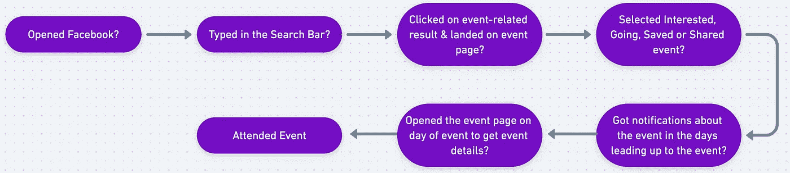
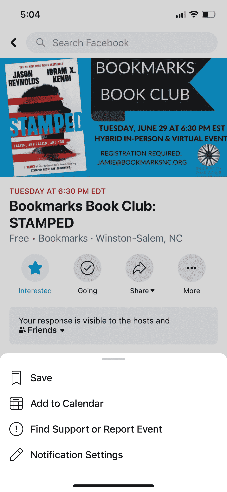

# 掌握 Facebooks 指标变化数据科学面试问题第 2/2 部分

> 原文：<https://towardsdatascience.com/mastering-facebooks-metric-change-data-science-interview-question-part-2-2-8bf61df63828?source=collection_archive---------26----------------------->

## 闯入 FAANG 的数据科学面试准备系列

上一次[时间](/mastering-facebooks-metric-change-data-science-interview-question-a093426d3bbf)，我们正在解决脸书大学提出的以下数据科学面试问题:

# 您会注意到，点击脸书活动搜索结果的用户百分比每周增加了 10%。你会如何调查？

【来源:[玻璃门](https://www.glassdoor.com/Interview/Facebook-Data-Scientist-Interview-Questions-EI_IE40772.0,8_KO9,23.htm)

我们 [**得出结论，搜索结果的排序算法已经改变**](/mastering-facebooks-metric-change-data-science-interview-question-a093426d3bbf) 为有利于事件的分组排序。结果，点击事件的用户百分比每周增加了 10%。

我们假设脸书有意改变排名算法，以鼓励更多用户参加活动。这给我们留下了两个问题，我们今天将讨论这两个问题:

1.  仅仅因为*点击*事件的人数增加，**这是否意味着实际*参加*这些事件的人数也增加了？**
2.  如果更多的人参加活动，这是一件好事吗？尤其是如果这是以牺牲他们与其他脸书产品的互动为代价的话，比如参加团体活动？因为记住…

> 时间是有限的，如果人们在一件事情上做得越多，他们在另一件事情上做得就越少。

# 1.我们如何判断是否有更多的人去参加活动？

并非所有在事件相关搜索结果上点击的用户*实际上都可能*参加*该事件。事实上，我们可能永远无法 100%确定用户是否参加了活动。然而，我们*可以*做出一个有根据的猜测，一些用户是否比其他人更有可能参加。*

用户旅程制作于[异想天开](https://whimsical.com/)

考虑上面的用户之旅以及您自己在脸书活动中的经历。考虑到这两点，我们可以做出*假设*用户越是*参与*某个事件，(也就是说，他们在上面的用户旅程中“是”的兔子洞越往下走)*就越有可能*参加*那个事件。*

我们可以通过以下几个方面来衡量用户参与活动的程度:

作者手机截图

**事件发生前**

1.  用户是否在活动页面点击了“感兴趣”、“去”、“分享”或“添加到日历”?
2.  用户在活动页面上发帖了吗？
3.  用户是否与事件相关的通知进行了交互？
4.  用户是否购买了活动的门票？

**活动期间**

1.  在事件发生时，我们是否看到用户在事件发生的同一位置(假设我们可以访问他们的位置数据)？
2.  活动时，用户是否经常去活动页面？例如，检查事件地址和其他细节。
3.  用户是否在活动期间发布了很多故事？

**事后**

1.  用户是否张贴了照片并标记了举办活动的地点？
2.  用户在活动页面上发帖了吗？例如，感谢活动主持人。
3.  活动页面有没有贴照片，给用户贴标签？

*这些问题的答案可以帮助我们更有信心地确定用户是否真的参加了活动。*

一种复杂的(也是更精确的)方法是对其中一些问题的答案进行加权组合。但是为了简单起见，让我们假设一个用户在一个事件页面上点击感兴趣是他们是否参加那个事件**的最接近的代理。**我们可以比较算法改变前后点击对某个事件感兴趣的用户数量。**如果后者大于前者，则可能表明由于算法改变，参加事件的用户数量增加。**

> 💡**提示**:保持简单。面试官想知道，如果有必要，你可以潜得更深。这就是他们必然会问你的后续问题的目的。但是在他们催促你之前，保持简单明了。

# 2.如果更多的人去参加活动，这是一件好事吗？

首先，*好*到底是什么意思？答案在于**公司的使命**。一个公司的[使命](https://en.wikipedia.org/wiki/Mission_statement)解释了它为什么存在，它的总体目标是什么。

> 公司的“使命”也是他们用来指导“好”的含义(对他们而言)的东西。

脸书的使命是给予人们建设社区的力量，让世界更加紧密。但是这是相当模糊的。如果越来越多的人参加活动，这是否意味着世界上更多的人走得更近了？也许吧。在拉近人与人之间的距离方面，活动比其他功能(如群组)更有效吗？也许吧。

我们如何才能使这一点更加具体？更*可测*？**度量标准。**

我将在以后的文章中详细阐述度量标准。但现在你需要知道的是:

指标的存在是为了量化(或*测量*)朝着更大目标的进展(以*具体的*方式)。

您可以使用**功能级别的指标，**比如点击事件相关搜索结果的用户数量。您还可以拥有 aggregate，**公司级指标。**这些可以是:

*   使用你的产品的总人数，例如使用脸书的总人数(不仅仅是点击事件)。
*   返回到你的产品的总人数*(也称为用户保持率)。*
*   人们在你的产品上花了多少时间。

**公司可以使用这些指标来跟踪其实现使命的进度。**取上面列表中的第一个指标，即使用该产品的总人数。如果脸书相信它的平台让世界更加紧密，那么越多的人使用脸书，世界上就有越多的人更加紧密。

因此，**要确定更多的用户参加活动是否是一件好事*我们需要(1)一个使命和(2)一个指标。***

**使命。给予人们建设社区和拉近世界距离的力量。**

**公制。让我们来看看用户保留率，即返回脸书的用户数量。**

**结局。如果参加活动的用户比不参加活动的用户更频繁地回到脸书，那么这种变化是好的。如果保留率下降，也就是说，参加活动的用户不再回到脸书，那么这种变化是不好的。**

> 💡提示:你可以选择任何度量标准。对于这个例子，我选择了用户保留。但是只要你能证明你选择背后的决定是正确的，就没有“正确”或“错误”的答案。

# 下一步？

**如果变化是好的**，这表明用户留存率与活动出席率相关。在这种情况下，我们可能要考虑其他方式来影响用户参加活动。

**如果变化是不好的，**这表明事件的出席似乎会阻碍用户返回脸书。在这种情况下，我们可能要重新评估改变搜索结果排名算法的决定。

> 💡**提示**:在实际操作中，比上面的三行答案要复杂。但是在面试中，面试官通常只是想知道你是否能够表现出主动性，并提出下一步措施。记住，结束面试回答的最好方式是(1)总结所说的内容,( 2)建议接下来的步骤。

# 到目前为止我们学到了什么

我们被要求调查指标值增加的原因。

1.  我们研究了热带框架以确定变化的来源。
2.  一旦我们理解了度量标准为什么会改变，我们就需要理解这种改变意味着什么。
3.  然后，我们决定这个暗示是好是坏。
4.  最后，我们提出了*可操作的*后续步骤。

**最后的想法。你的面试不一定会这样。即使是完全相同的问题。如果你得到了这个问题，你**不想开始逐字背诵这篇文章。记住，这是一个 ***导*** 。以此为起点，但要记住****面试是你和面试官之间的对话。**你想在一个高层次上展示你的想法，周期性地停顿，问你的面试官他们是怎么想的，他们是否想让你进一步阐述这个想法*或者*改变路线。采纳他们的反馈，并据此设计你的答案。你能行的。******

授权 Hani Azam 使用 Adobe Stock 提供的图片

这是更大的 [**数据科学面试备考系列**](https://azamhani95.medium.com/) 的一部分。在每篇文章中，我都让*深入*围绕**机器学习、产品&商业意识、统计&概率和 SQL 的面试问题。**

我还将分享我的个人经历，包括我如何进入数据科学的**，我的工资**和**我如何管理我的财务，以及我最喜欢的学习和灵感资源。你可以在[媒体](https://medium.com/@azamhani95)上关注**我，了解最新动态。

如果你想联系我，你可以在 LinkedIn 上找到我，直接发邮件给我。