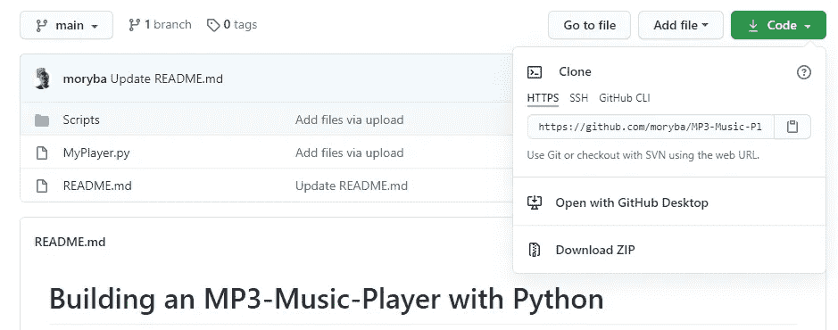
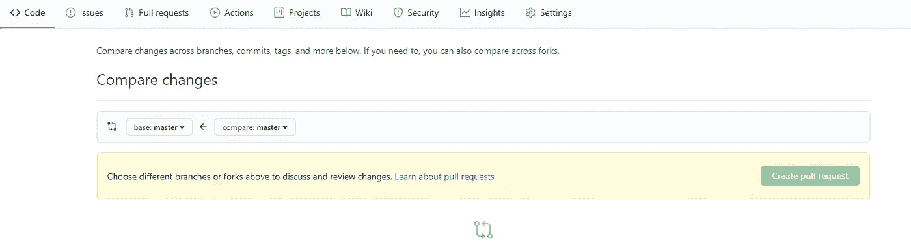
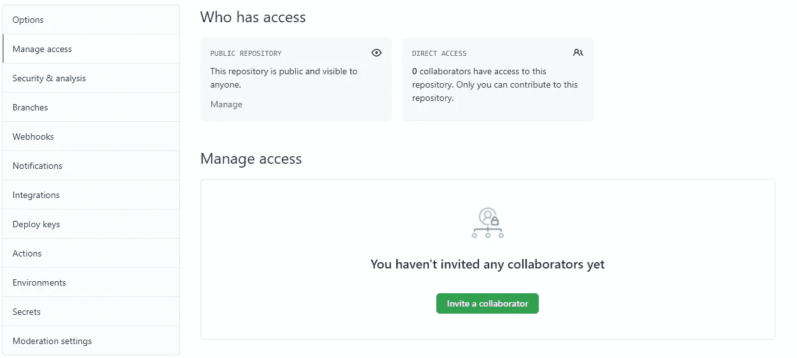

# 开始掌握 Git 命令& Git 背后的逻辑

> 原文：<https://towardsdatascience.com/mastering-git-commands-the-logic-behind-git-ad3fbcc6fb33?source=collection_archive---------13----------------------->

## 数据专业人员指南


克林特·帕特森在 [Unsplash](https://unsplash.com/s/photos/teamwork?utm_source=unsplash&utm_medium=referral&utm_content=creditCopyText) 上拍摄的照片

## 介绍

一组数据科学家和数据工程师同时开发同一个程序，或者在不同的环境中部署不同版本的程序是很常见的。因此，拥有一些工具来跟踪源代码、配置文件或时间文档中的变化是很有用的。允许我们这样做的工具是版本控制系统。最著名和最常用的版本控制系统是 Git。

Git 的主要方面是，每次您进行更改时，Git 都会拍摄所有文件此刻的样子，并存储对该快照的引用。

版本控制系统可以是集中式的，也可以是分布式的。这意味着团队的所有成员都连接到主服务器，并且所有成员都通过该服务器进行协作。无论如何，如果中央服务器崩溃了，你就不能在分布式版本控制系统中协作。

使用 Git，您可以在本地计算机上拥有所有存储库的历史记录，这使您可以即时访问所有的更改。这意味着更好的性能。

Git 非常容易安装。要安装它，你必须去[这里](https://git-scm.com/downloads)，并按照指示。

在这篇文章中你会看到以下论点:

*   如何配置 Git
*   Git repo init &第一个 Git 命令
*   Git 远程存储库和 SSH 连接
*   分支机构管理和拉动式请求
*   合并冲突和 Git 历史管理
*   Git Stash，Git Reflog & Git Clone

## 第一部分:如何配置 Git

安装 Git 后，第一步是打开 Git Bash，告诉它你是谁。但是在开始配置 Git 之前，您必须知道 Git 允许我们在三个不同的级别上设置配置:

*   系统→应用于您计算机上的所有用户及其所有存储库
*   全局→应用于当前用户计算机上的所有存储库
*   本地→仅当前存储库

现在，我们打开 git，用下面的命令说出我们是谁:

```
$ git config --global user.name “Moryba Kouate”$ git config --global user.email “my.email@example.com”
```

要将 notepad 设置为 Git 中的默认文本编辑器，您可以轻松地输入:

```
$ git config --global core.editor “notepad”
```

## 第二部分:Git repo init &第一个 Git 命令

在这一部分中，您将看到如何创建一个本地存储库并进行第一次提交。创建存储库有两种方法。第一种方法是在本地创建它，第二种方法是克隆现有的存储库。但是现在，我们将只看到如何在本地创建一个存储库。

假设您想要跟踪一些文件中的更改。第一步是初始化存储库。

```
$ git init
```

你现在会在括号中看到“主”这个词。主人是主要的分支。请记住，每个分支都包含快照的历史记录。

我们要提交的文件所在的区域称为临时区域。在这个区域，我们可以添加一个或多个文件。下面的命令添加一些文件或所有文件。

要添加一些文件:

```
$ git add test.py README.md
```

要添加所有文件:

```
$ git add .
```

如果要添加所有文件，例如扩展名为 py 的文件，可以使用以下命令。

```
$ git add *.py
```

为了检查您所在的分支上的存储库的状态，以及是否有要提交的状态更改，我们必须键入 git status 命令。我个人比较喜欢下面的短状态。

```
$ git status -s
```

要清除 Git Bash 控制台，您可以同时按下 **Ctrl + L** 。

如果我不想再跟踪特定文件的更改，也不想从本地存储库中删除它，我可以使用下面的命令:

```
$ git rm --cached .name_of_file
```

上述命令将文件从临时区域中删除，但将文件保留在本地区域中。无论如何，如果您想从临时区域中删除特定目录中的所有文件，您必须使用下面的命令。

```
$ git rm -r cached myfolder/
```

要在存储库中创建新文件，可以使用以下命令:

```
$ touch .gitignore
```

您可以使用以下命令从 Git Bash 控制台编辑该文件:

```
$ nano .gitignore
```

然后，例如，你可以在文件中写入。gitignore 忽略所有。bin 文件夹中的 txt 扩展名。

```
*.class
bin/
```

您可以使用 commit 命令为您的更改命名。之后，Git 将为您的更改创建一个快照。

```
$ git commit -m "changes done"
```

要检查所有更改和提交完成的历史记录，可以使用以下命令:

```
$ git log
```

假设我们忘记了修改一个文件，我们需要更改提交的名称。在这种情况下，我们必须使用这个命令:

```
$ git commit --amend
```

然后你会看到打开编辑器，你可以修改和保存它。

## 第三部分:Git 远程存储库和 SSH 连接

当我们作为一个数据专业人员团队工作时，我们需要一个托管在互联网上的、全天候可用的公共存储库。GitHub 是最著名的远程仓库之一。另外两个有趣的存储库是由 Atlassian 和 GitLab 支持的 Bitbucket。对于这一部分，我想你已经有一个 GitHub 帐户。如果你没有 GitHub 档案，请到[这里](https://github.com/join?source=login)注册。

例如，如果我想连接到我的一个 GitHub 库，我可以很容易地数字 git remote 并添加我的库的路径。

下面是我的 GitHub 库的截图，以及在哪里可以看到正确的复制路径。



```
$ git remote add origin https://github.com/your_name/your_app.git
```

因此，您可以使用以下命令推送本地文件:

```
$ git push origin -u master
```

作为数据专业人员团队的一员，您将多次使用协议来访问其他计算机。使用 SSH，您可以轻松地登录到远程计算机，并在该计算机上执行任何命令或任何您希望的更改。SSH 的目标是使计算机之间的连接更加安全。事实上，在两台计算机之间建立连接需要一个远程计算机的公钥和一个本地计算机的私钥。

所以首先要做的是生成 SSH 密钥。生成密钥最简单的方法是打开 Git Gui，进入**帮助>显示 SSH** 密钥，然后点击**生成密钥**。生成密钥后，您可以继续 GitHub 设置并选择选项 **SSH 和 GPG 密钥**。在这里，您可以创建一个新的 SSH，在这里您可以粘贴之前通过 Git Gui 获得的内容。现在，我们可以使用以下命令将 SSH 路径粘贴到我们的远程存储库中:

```
$ git remote set-url origin git@github.com:name/application.git
```

## **第四部分:分行管理&拉式请求**

在这一部分，我们将看到如何创建新的分支，我们还会看到一些命令，如特定分支的 git 日志，git 检验 git 开关和 git 分支。我们将看到如何在本地和远程存储库中删除分支。

现在，想象一下，作为一名数据工程师，你的任务是实现一个程序。第一步是用下面的命令检查本地分支。

```
$ git branch
```

相反，要查看所有本地和远程分支，我将使用以下命令:

```
$ git branch -a
```

要创建一个分支，我可以使用:

```
$ git branch BA0003
```

无论如何，有一个命令可以同时创建和更改分支。我将使用下面的命令，其中 **checkout** 命令用于更改分支，而选项 **-b** 表示我想要更改并创建一个新分支。

```
$ git checkout -b BA0003
```

现在在括号里，你不会再看到 master，而是(BA0003)。请记住，您可以使用命令 cd 来更改路径。

```
$ cd base
```

要在您的目录中有一个列表，我们可以使用:

```
$ ls -l
```

在查看日志之前，使用命令 **git add 传输暂存区中的文件是很重要的。**然后我们可以用我们在上一部分看到的命令创建一个提交。现在，要查看特定分支的日志，我们可以轻松地键入:

```
$ git log BA0003
```

通过键入您在提交中看到的第一个单词和数字，可以导航到特定的提交，并切换到特定的提交。例如，如果我有下面的提交 fee 9 E3 b 6 dfaf 02 e F5 f 0 b 12 c 939 cc 9082487 f 2578，我将键入:

```
$ git checkout fee9
```

导航到提交是有用的，因为有时我们可能需要调查一个缺陷。所以我们想知道一个代码之前是如何工作的，并执行这个代码。

要删除分支，您必须使用以下命令:

```
$ git branch -d BA0003
```

如果您想切换到主分支，您可以轻松地键入:

```
$ git switch master
```

现在是时候看看什么是拉请求了。拉式请求是向项目提交贡献的一种方法。换句话说，您可以从一个分支提取更改以更新另一个分支，通过提交提取请求，您可以要求其他数据专业人员检查您的更改并将它们提取到另一个分支。

正如我之前向您展示的那样，在您推送您在远程存储库(GitHub)中完成的修改之后。您可以转到“拉取请求”部分，创建一个新的拉取请求，如下所示。



然后就可以看到审核人的变化了。显然，您必须在 GitHub 上为您想要共享的存储库添加您的合作者。下面是您可以在 GitHub 上邀请合作者的页面截图。



另一个有用的命令是 **git fetch** ,它帮助我们从远程存储库中获取所有更改，并将其放入本地存储库中。

但是，如果我想将远程更改合并到我的本地分支中，我需要键入:

```
$ git merge
```

## 第五部分:合并冲突和 Git 历史管理

什么是合并冲突？合并冲突是当 Git 无法自动解决两次提交之间的代码差异时发生的特定事件。事实上，有可能多个开发人员试图编辑相同的内容，Git 不知道哪个版本的代码是最新的，也就是正确的版本。要解决这种问题，您可以在 Git Bash 上打开该文件，并手动更改它以克服冲突。

历史管理的一些重要 Git 命令是 git rebase 和 git reset。 **Git Rebase** 允许我们替换我们想要的分支。要了解更多细节和 Git rebase 的实际例子，我建议你访问这个[链接](https://git-scm.com/book/en/v2/Git-Branching-Rebasing)。

对于所关心的 **Git 重置**，当你想要撤销更改时，你需要它。例如，您创建了一个不再需要的快照。正如您在前面的部分中看到的，当您想要从工作树传递到临时区域时，您需要使用 Git Add。然后，要设置历史中的更改，您需要 Git Commit。因此，如果您想遵循相反的过程，从历史记录转到临时区域，您需要键入:

```
$ git reset --soft
```

但是如果你想在 Staging Area 之前走，那么要在你的工作树中看到这个情况你需要使用:

```
$ git reset --mixed
```

因此，如果您已经在暂存区中添加了文件，现在如果您键入 **git status** ，您将会注意到您在暂存区中添加的文件现在位于工作目录中。

然后，如果您需要在所有操作的开始清理您的工作目录，您将键入:

```
$ git reset --hard
```

## 第六部分:Git Stash、Git Reflog 和 Git Clone

想象一下，你需要立即开始一项新的任务，并让上一个你还没有完成的任务。所以解决方法是保存你当前的任务，以便以后再回来。在这种情况下，命令是:

```
$ git stash
```

然后你可以使用 **Git Switch-** 来切换你当前的任务，转到你的新任务。

因此 stash 可以作为您的更改的临时存储，并列出您可以使用的所有已保存的任务:

```
$ git stash list
```

使用下面的命令，您可以弹出最近的更改。这个概念使人想起计算机编程中的后进先出法。如果你想了解更多关于后进先出的思想，你可以阅读我的关于 Python 中的数据结构算法的文章。

要清除一个特定的存储，你可以在应用 git stash list 后很容易地获取你找到的引用。该命令将是:

```
$ git stash drop stash@{0}
```

要清除所有的隐藏，您只需编写以下命令:

```
$ git stash clear
```

可能会丢失一些提交，您希望恢复其中的一些。要解决这个问题，我们可以使用 **git reflog。**该命令为我们提供了在区域主分支上进行的每个提交、每个研究操作的相关信息。要查看所有细节，一个好的做法是使用:

```
$ git log -g
```

因此，在您确定丢失的更改后，您可以简单地使用下面的命令来恢复提交。

```
$ git branch name_of_branch e57d
```

您已经注意到，我给出了一个新的名称，并在名称后添加了提交代码。请记住，reflog 中的信息存储 90 天。

无论如何，如果你想看到 1 小时以来的参考日志，你可以简单地数字:

```
$ git reflog --since="1-hour"
```

最后一个有用的 git 命令是 Git Clone。使用此命令，您可以克隆远程存储库。所以你需要去你的 GitHub 库并选择 HTTPS 或者 SSH。之后，打开你的 Git Bash 和 digit:

```
$ git clone git@github.com:name/application.git
```

太好了！您已经克隆了远程存储库。

## 结论

现在您已经很好地理解了 Git 是如何工作的，以及为什么对于一个数据专业人员来说了解它是如此重要。然而，我认为深入吸收这些概念的最有效的方法是与你的一些朋友一起做一个项目，并尝试开发一个复杂的程序。这样，您将面临许多问题，这些问题将推动您以最有效的方式使用 Git 命令，并提高您对 Git 在开发过程中的真正效用的理解。

感谢你阅读这篇文章。您还可以通过其他方式与我保持联系并关注我的工作:

*   订阅我的时事通讯。
*   也可以通过我的电报群 [*数据科学初学者*](https://t.me/DataScienceForBeginners) 联系。