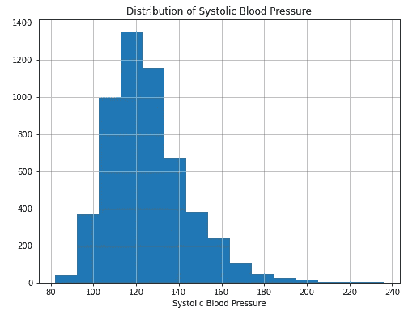
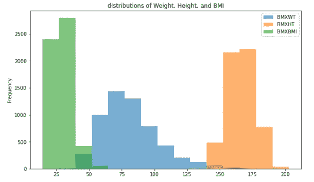
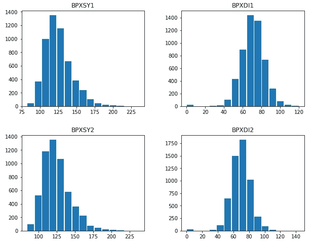
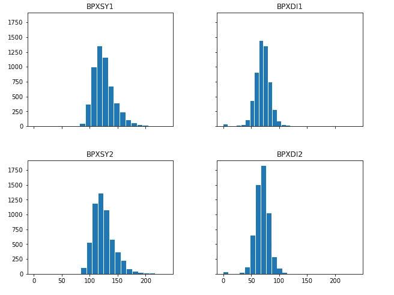
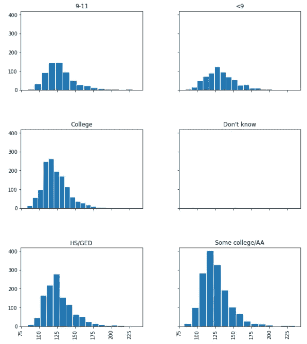
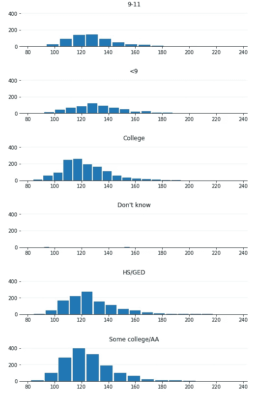

# 在 Matplotlib 中掌握直方图

> 原文：<https://towardsdatascience.com/mastering-histograms-in-matplotlib-6cf5ed084d48?source=collection_archive---------35----------------------->


安迪·霍尔在 [Unsplash](https://unsplash.com?utm_source=medium&utm_medium=referral) 上的照片

## 制作直方图的细节

直方图是最受欢迎的图表之一。理解连续变量的总体分布是很有用的。所以，几乎在任何数据分析或探索性数据分析，或机器学习项目中，你都会从一些直方图开始。在本文中，我将解释如何在 Matplotlib 中制作直方图。像往常一样，我将从一个图中最简单的直方图开始，慢慢走向一些更有趣的直方图。

> 我将使用公开可用的 NHANES 数据集。[请看这里的发布说明。](https://wwwn.cdc.gov/nchs/nhanes/continuousnhanes/releasenotes.aspx?BeginYear=2015)

[请随意从这里下载数据集](https://github.com/rashida048/Datasets/blob/master/nhanes_2015_2016.csv)。

我们潜水吧。

首先，导入必要的包并制作数据框架:

```
import pandas as pd
import matplotlib.pyplot as pltdf = pd.read_csv("nhanes_2015_2016.csv")
df.head()
```

数据集相当大！这些是数据集中的列:

```
df.columns
```

输出:

```
Index(['SEQN', 'ALQ101', 'ALQ110', 'ALQ130', 'SMQ020', 'RIAGENDR', 'RIDAGEYR', 'RIDRETH1', 'DMDCITZN', 'DMDEDUC2', 'DMDMARTL', 'DMDHHSIZ', 'WTINT2YR', 'SDMVPSU', 'SDMVSTRA', 'INDFMPIR', 'BPXSY1', 'BPXDI1', 'BPXSY2', 'BPXDI2', 'BMXWT', 'BMXHT', 'BMXBMI', 'BMXLEG', 'BMXARML', 'BMXARMC', 'BMXWAIST', 'HIQ210'], dtype='object')
```

列名看起来很难理解。但是我将解释我将在本文中使用的列的含义。

## 一个简单的直方图

这是最简单的直方图。收缩压的分布:

```
df['BPXSY1'].hist(bins = 15, figsize=(8, 6))
plt.xlabel("Systolic Blood Pressure")
plt.title("Distribution of Systolic Blood Pressure")
plt.show()
```



一个非常简单的直方图，显示了轻微的右偏分布。

但是在处理大型数据集时，在一个图中进行多次分布通常非常有用。下一张图将显示体重、身高和身体质量指数的分布:

```
df[['BMXWT', 'BMXHT', 'BMXBMI']].plot.hist(bins = 15, figsize=(10,6), alpha = 0.6)
plt.show()
```



幸运的是，在这个图中，三个分布有非常不同的范围。所以，不会有太多的重叠。但是如果有太多的重叠发生，最好将两个图分开。就像如果我们在同一个图中绘制两个收缩压和两个舒张压，它们会重叠太多，很难理解它们。在这些情况下，最好在单独的支线剧情中进行分配:

```
df[['BPXSY1', 'BPXDI1', 'BPXSY2', 'BPXDI2']].hist(
    bins=15,
    figsize=(10, 8),
    grid = False,
    rwidth = 0.9,
)
plt.show()
```



当所有四个血压计并排放置时，会更加有趣和有用。因为你可以比较它们。如果我们能把它们放在同一个尺度上，尤其是当我们需要比较它们的时候，那就更有用了。这里我们用相同的 x 轴和 y 轴限制来放置它们:

```
df[['BPXSY1', 'BPXDI1', 'BPXSY2', 'BPXDI2']].hist(
    bins=15,
    figsize=(12, 6),
    grid = False,
    rwidth = 0.9,
    sharex = True,
    sharey = True
)
plt.show()
```



同样的四个变量，但看起来不同。原因是它们的规模相同。所以，几乎都缩水了。一些在 x 方向收缩，一些在 y 方向收缩。

在上面两张图中，不同的变量有不同的分布。但是如果我想根据一个分类变量的不同类别只绘制一个连续变量呢？

我们有一个分类变量“DM deduct 2 ”,它代表人口的教育水平。我想画出每个教育水平的收缩压分布图。

但是在这个数据集中，教育水平用数字表示。

```
df['DMDEDUC2'].unique()
```

输出:

```
array([ 5.,  3.,  4.,  2., nan,  1.,  9.])
```

我首先将它们替换为一些有意义的字符串值，如下所示:

```
df["DMDEDUC2x"] = df.DMDEDUC2.replace({1: "<9", 2: "9-11", 3: "HS/GED", 4: "Some college/AA", 5: "College", 7: "Refused", 9: "Don't know"})
```

让我们绘制每个教育水平的收缩压直方图:

```
df.hist(column = "BPXSY1",
        by = "DMDEDUC2x",
        bins = 15,
        figsize=(10, 12),
        grid = False,
        rwidth = 0.9,
        sharex = True,
        sharey = True
       )plt.show()
```



在这里！有时，每个直方图有一个单独的行可能会很有趣。让我们看看它是什么样子的:

```
ax = df.hist(column = "BPXSY1",
        by = "DMDEDUC2x",
        bins = 15,
        figsize=(8, 18),
        grid = False,
        rwidth = 0.9,
        sharex = True,
        sharey = True,
        layout=(6, 1)
       )for x in ax:
    #Removing the left, right and top lines of the box of each plot
    x.spines['right'].set_visible(False)
    x.spines['left'].set_visible(False)
    x.spines['top'].set_visible(False)

    #Adding the x-ticks on each plot
    x.tick_params(axis="both", labelbottom = 'on')
    x.tick_params(axis='x', rotation = 0)

    plt.ylim(0, 300)

    vals = x.get_yticks()

    #Getting the grey horizontal grids in each plot
    for v in vals:
        x.axhline(y = v, linestyle="solid", color = 'gray', alpha = 0.1)

#Adding some space between each plot
plt.subplots_adjust(hspace=0.8)
plt.show()
```



这些是今天所有的直方图。

## 结论

这些都是 Matplotlib 中直方图的绘图。希望这是一个有用的教程，你将能够在你的项目中使用这些类型的图。

这里有一个 youtube 视频，一步一步地解释了相同类型的情节

## 更多阅读

</how-to-present-the-relationships-amongst-multiple-variables-in-python-70f1b5693f5>  </zooming-in-and-zooming-out-in-matplotlib-to-better-understand-the-data-b4a5f5b4107d>  </developing-a-convolutional-neural-network-model-using-the-unlabeled-image-files-directly-from-the-124180b8f21f>  </an-overview-of-data-analysis-with-the-tidyverse-library-in-r-e94c151bf7d1> 