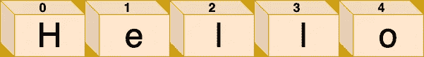
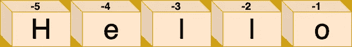

# 掌握 Python 中的索引和切片

> 原文：<https://towardsdatascience.com/mastering-indexing-and-slicing-in-python-443e23457125?source=collection_archive---------4----------------------->

## 深入研究有序集合的索引和切片


照片由[岩田良治](https://unsplash.com/@ryoji__iwata)在[unsplash.com](https://unsplash.com/photos/5siQcvSxCP8)拍摄

在 Python 中，像字符串或列表这样的有序序列的元素可以通过它们的索引被单独访问。这可以通过提供我们希望从序列中提取的元素的数字索引来实现。此外，Python 支持切片，这是一个让我们提取原始序列对象的子集的特性。

在本文中，我们将探讨索引和切片是如何工作的，以及如何使用它们来编写更简洁、更 Pythonic 化的代码。

# 索引

像大多数编程语言一样，Python 偏移量从位置 0 开始，到位置 N-1 结束，其中 N 被定义为序列的总长度。例如，字符串`Hello`的总长度等于 5，每个单独的字符可以通过索引 0 到 4 来访问，如下图所示:



Python 中的索引

现在，您可以通过编程方式访问字符串中的单个字符，方法是提供您希望获取的相应偏移量，并用方括号括起来:

```
>>> my_string = 'Hello'
>>> print(my_string[0])
'H'
>>> print(my_string[2])
'l'
>>> print(my_string[3])
'l'
```

同样重要的是要知道，当你试图访问一个大于序列长度(减 1)的偏移量时，Python 会抛出一个`IndexError`通知你所请求的偏移量超出了范围:

```
>>> my_string[5]
Traceback (most recent call last):
  File "<input>", line 1, in <module>
IndexError: string index out of range
```

还可以通过提供一个负索引**来访问一个元素，该负索引**基本上对应于从序列右侧开始的索引。通过偏移量 **-1** 可以访问最后一项，通过偏移量 **-2** 可以访问倒数第二项，以此类推



Python 中的负偏移

从技术上讲，当使用负偏移量时，Python 会将该偏移量添加到序列的长度中，以便推断出准确的位置。例如，假设我们想使用负偏移量从字符串`my_string = 'Hello’`中提取字符`e`。现在，表达式`my_string[-4]`实质上将被翻译成`my_string[len(my_string) — 4]`，它相当于最终给出我们想要的输出的`my_string[5 — 4]`和`my_string[1]`:

```
>>> my_string[-4]
'e'
```

# 限幅

切片是索引的一种形式，它允许我们推断原始序列的整个(子)部分，而不仅仅是单个项目。要在 Python 中对一个序列执行切片，您需要提供两个由冒号分隔的偏移量，尽管在某些情况下，您可以只定义两个偏移量中的一个，甚至不定义任何偏移量(下面将详细讨论这些情况)。

第一个偏移量表示起点，且包含起点，而第二个偏移量表示终点，但与起点偏移量不同，**它不包含终点**。

```
my_string[start:end]
```

因此，当执行切片时，Python 将返回一个新的对象，包括从较低索引开始直到比较高索引小一的位置的所有元素。例如，考虑一个用例，我们需要获取字符串的前两个元素:

```
>>> my_string[0:2]
'He'
```

正如我已经提到的，提供显式偏移量并不是强制性的。当省略起始偏移量时，其值将默认为 0。另一方面，当没有提供结束偏移量时，其默认值将等于序列的长度。实际上有三种不同的场景，如下所示:

```
my_string[0:]   # Omit ending offset
my_string[:-1]  # Omit starting offset
my_string[:]    # Omit both starting and ending offsets
```

## 省略结束偏移

第一个符号通常在我们想要删除前导文本时很有用。假设我们想得到字符串中除第一个字符以外的所有字符。我们可以通过使用下面的符号来做到这一点

```
>>> my_string = 'Hello'
>>> my_string[1:]
'ello'
```

正如我们已经提到的，当结束偏移量被省略时，将使用序列的长度来代替:

```
>>> my_string[1:] == my_string[1:len(my_string)]
True
```

## 省略起始偏移量

假设我们现在需要字符串中除第一个字符以外的所有字符。在这种情况下，省略起始偏移将达到目的:

```
>>> my_string = 'Hello'
>>> my_string[:-1]
'Hell'
```

假设下限被跳过，其值将默认为 0:

```
>>> my_string[:-1] == my_string[0:-1]
True
```

## 省略两个偏移

Python 中的切片符号允许我们省略起始和结束偏移量。

```
>>> my_string = 'Hello'
>>> my_string[:] == my_string[0:len(my_string)]
True
```

假设当下限和上限被忽略时，将分别默认为`0`和`len(sequence)`，您可能想知道这是否有任何帮助或用途。这是一种快速复制对象的方法，如下图所示

```
>>> my_string = 'Hello'
>>> my_string_copy = my_string[:]
```

请注意，当这种切片技术将产生一个不同的对象，将被分配到不同的内存位置。这对不可变的对象类型(如字符串)没有任何影响，但是在处理可变的对象类型(如列表)时，意识到这一点是非常重要的。关于这方面的更多细节，你可以参考我的文章[Python 中的动态类型](https://medium.com/p/dynamic-typing-in-python-307f7c22b24e)，它讨论了对象是如何被创建和(正确地)复制的。

## 扩展切片

Python 中的切片表达式带有一个可选的第三个索引，当指定时，它被用作一个**步骤**。显然，当忽略步长值时，它默认为 1，这意味着不会跳过所请求的序列子部分中的任何元素。符号如下所示

```
[start:end:step]
```

例如，假设我们有一个包含字母表中字母的字符串，我们希望从中提取位置 1 和 19 之间的所有其他项目:

```
>>> import string
>>> my_string = string.ascii_lowercase # 'abcdefg...'
>>> my_string[1:20:2]
'bdfhjlnprt'
```

这种符号可以用来代替列表理解。例如，假设我们想要获取一个列表中所有具有偶数索引的元素。实现这一点的列表理解应该是

```
>>> my_list = [100, 400, 34, 179, 0, 89, 121]
>>> [value for index, value in enumerate(my_list) if index % 2 == 0]
[100, 34, 0, 121]
```

在这种情况下，切片符号可以使我们的代码更简单，可读性更好:

```
>>> my_list = [100, 400, 34, 179, 0, 89, 121]
>>> my_list[::2]
[100, 34, 0, 121]
```

像开始和结束偏移一样，步长索引可以是负数。从技术上讲，当我们想要颠倒有序序列中元素的顺序时，这是很有用的

```
>>> my_string = 'Hello'
>>> my_string[::-1]
'olleH'
```

换句话说，当应用负步进指数时，开始和结束偏移的效果是相反的。为了说明这一点，让我们跳到另一个例子，我们实际上定义了所有三种可能的偏移。

```
>>> import string
>>> my_string = string.ascii_lowercase # 'abcdefg...'
>>> my_string[20:10:-1]
'utsrqponml'
```

在上面的例子中，我们从索引 11 到 20 以相反的顺序创建了一个新的字符串。

# 结论

在本文中，我们探索了 Python 中索引和切片的工作原理。这两种符号在大多数 Python 应用程序中广泛使用，因此您需要确保理解它们是如何工作的。下面我们重温一下我们已经讨论过的要点——也可以随意将其用作备忘单。

## **分度**

*   第一项从偏移量`0`开始
*   最后一项结束于偏移量`len(my_sequence) — 1`
*   负指数表示计数将反向开始。本质上，它被添加到序列的长度中。例如，`my_string[-1]`翻译成`my_string[len(my_string) — 1]`

## **切片**

*   起始索引(下限)是包含性的
*   结束索引(上限)是非包含性的
*   当起始索引被省略时，它默认为 0
*   当省略结束索引时，它默认为序列的长度
*   当起始和结束索引都被省略时，原始对象的副本被创建— `my_string[:]`
*   第三个索引表示步骤
*   省略步骤索引时，默认为 1(即不跳过任何元素)
*   负的步长指数有助于我们创建相反的序列(例如`my_string[::-1]`