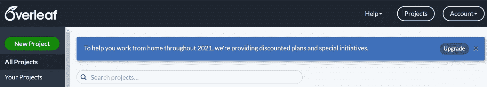
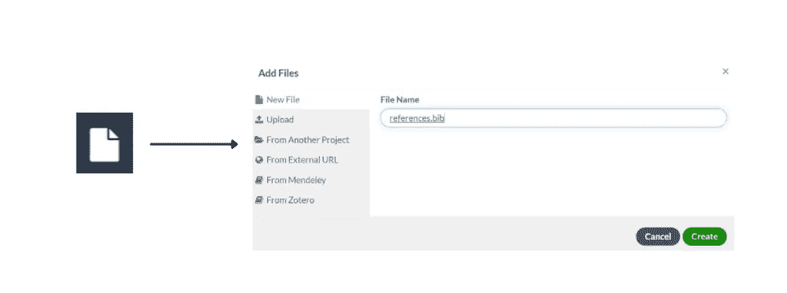

# 控制背面的乳胶

> 原文：<https://towardsdatascience.com/mastering-latex-on-overleaf-71a72d513363?source=collection_archive---------11----------------------->

## 作为一名数据科学家，这是评估你工作的一项重要技能


作者图片

自从我开始了我的数据科学之路，我一直在使用 LaTex 完成我遇到的每一项任务，比如大学的项目组、论文、幻灯片、研究论文和简历。当我发现它的时候，我在想“没有它我怎么可能活到现在”？

与谷歌文档或微软 Word 不同，文档的结构保持固定和有序。起初，这似乎很难，因为你需要为每种类型的元素指定许多关键字，如标题、部分、表格、图像，但经过一些努力后，你不会后悔。

良好的自我展示对于脱颖而出至关重要。为什么对于其他边缘方面，比如书面文档，不应该是一样的呢？！对我来说，乳胶就像热巧克力中的鲜奶油。这是给热巧克力增添美味的附加物。没有它，就不一样了。

在这篇文章中，我将展示使用 latex 创建专业外观的文档时需要了解的基础知识。此外，我将帮助你开始使用一个很棒的 latex 在线工具，叫做**背页**，来编写 LaTex 文档。

# 目录:

1.  介绍
2.  [启动新项目](#9afa)
3.  [选择 LaTex 编译器](#ba31)
4.  [主文档](#340e)
5.  [数学表达式](#1857)
6.  [包含图像](#17c8)
7.  [创建表格](#6e37)
8.  [参考书目](#3c11)

# 1.介绍

背页是一个提供许多好处的书写工具。首先，它允许在浏览器上编写 latex 文档，而无需安装任何软件/软件包[1]。

默认情况下，背页上创建的文档是私人的，但也可以通过私人邀请或链接**共享**。当在项目组中工作时，这真的很有效率。它还允许在文档中添加注释。要找到所有评论，您必须点击**查看**图标。此外，还有一个聊天图标，可以向群组的其他成员发送消息，而不是使用其他独立的应用程序。

您可以使用**历史**图标跟踪文档的更改。免费版显示了项目最近 24 小时的变化。如果你想要旧的改变，你应该升级你的计划到背面。另一个优点是它允许通过查看 LaTeX **日志**容易地发现错误。

# 2.开始一个新项目



作者图片

要在背页的[上创建 LaTex 文档，您需要登录网站，然后点击左上角的绿色按钮启动一个新项目。创建项目有两种方式:](https://www.overleaf.com/)

*   从**开始**:你可以做到，但是我不会建议，因为有很多代码要写。
*   使用网站上已有的**模板**制作任何类型的文档。这样，你只需要修改一下。
*   **复制您过去创建的项目**。

# 3.选择 LaTex 编译器


作者图片

教程中通常会跳过这一步。但是有一次我遇到了一个错误，阻塞了我所有的项目，这是因为默认情况下错误的编译器 pdfLaTex。要更改编译器，需要点击项目左上角的黑色**菜单图标**。一旦你选择了它，你可以改变**设置**“编译器”的第一个选项。例如，如果您有一个 XeLaTex 文件，您必须将 pdfLaTex 编译器替换到 XeLaTex 编译器中。

在浏览菜单时，您还会注意到它还提供了其他用户特定的设置，如界面主题、字体大小、字体系列。还有可能打开文档，统计字数，用 Github 和 Dropbox 同步项目。

# 4.主文档

当您创建一个项目或获取一个模板时，您总是需要一个文件。tex，而 while 包含了 LaTex 文档中最重要的构件。因此，它也可以被称为**主文件**。下面，我展示了一个在主文件中使用了一些关键字的例子:

```
\documentclass[12pt]{article}
\usepackage[T1]{fontenc}
\title{example}
\author{Eugenia Anello}
\date{October 2021}\begin{document}\maketitle\section{Introduction}\subsection{Theory}\end{document}
```


作者图片

我们可以观察到，文档的大部分内容主要由两个标签组成，`\begin{document}`和`\end{document}`。

在这两个标签之前，还有一些相关的标签需要考虑。第一个是`\documentclass[12pt]{article}`，它指定了字体大小(12pt)和类别(文章)。

另一个重要的标签是`\usepackage[T1]{fontenc}`，它是文档的 T1 字体编码。这两个标签可以根据您创建的文档类型进行更改。此外，为了添加标题、作者和日期，分别有标签`\title{example}`、`\author{Eugenia Anello}`和`\date{October 2021}`

有两种方法可以包含这些部分:

*   正如您在示例中注意到的，您直接使用标签`\section{Introduction}`来包含主文档中的所有内容
*   在大型文档中，使用唯一的 LaTex 文档可能是无效的。最好把它分成不同的模块，与章节相对应。在这种情况下，最好使用标签`\input{filename}`，用文件名. tex 添加每章的内容。

# 5.数学表达式

与 Google Docs 和 Microsoft Word 不同，LaTex 文档提供了一种高效的方式来编写数学方程。建议下载这个 [pdf](https://www.caam.rice.edu/~heinken/latex/symbols.pdf) ，对查 LaTeX 数学符号列表有用。

数学表达式有两种编写模式: ***内嵌*数学模式**编写属于段落的公式， ***显示*数学模式**指定不属于段落的公式。

有三种类型的分隔符可用于 ***内联*数学模式。下面我展示了三个使用不同分隔符的例子:**

*   `\(**...**\)`
*   `$**...**$`
*   `\begin{math}**...**\end{math}`

我通常更喜欢使用$$分隔符，因为它更容易书写。

***显示*数学模式**包括三种建立数学公式的方式:

*   `\[**...**\]`
*   `\begin{displaymath}**...**\end{displaymath}`
*   `\begin{equation}**...**\end{equation}`

这些分隔符通常用于非常复杂的数学公式。

让我们展示四个例子来更好地记忆我之前展示的语法:

```
$P(A|B)=\frac{P(B|A)P(A)}{P(B)}$\[P(A,B,C,...,H)=\frac{i}{Z}\prod_{i=1}^{N}\phi_i(X_1...X_k)\]\[\tilde{J}(\theta,X,y)=J(\theta,X,y)+\frac{\lambda}{2}||w||^2_2\]\begin{equation}
\tilde{J}(\theta,X,y)=J(\theta,X,y)+\lambda||h||_1=J(\theta,X,y)+\lambda\sum_i |h_i|
\end{equation}
```


作者图片

我们可以看到 ***内联*数学模式**表达式没有任何空格，而显示**数学模式**表达式总是居中。特别是，标签`\begin{equation}**...**\end{equation}`对于列举等式非常有用。

此外，还有特定的标签来书写符号，`\frac{num}{den}`用于分数，`\sum`用于总和，`\prod`用于乘积以及许多其他符号。

# 6.包括图像


作者图片

要在文档中包含图像，需要使用左上角的图标将它们上传到项目中，如图所示。也可以导入您过去创建的另一个项目中使用的图像。下面我展示了一个在文档中包含图像的语法示例:

```
\documentclass[12pt]{article}
\usepackage[T1]{fontenc}
\title{example}
\author{Eugenia Anello}
\date{October 2021}\usepackage{graphicx}
\begin{document}\maketitle\section{Introduction}The t-SNE visualization is showed in figure \ref{tsne}:\begin{figure}[htp]
    \centering
    \includegraphics[scale=0.4]{vae6tsne.png}
    \caption{t-SNE}
    \label{tsne}
\end{figure}\end{document}
```


作者图片

`\usepackage{graphics}`需要包含包含与 LaTex 文档中的图像相关的命令的包。

为了显示图像，需要两个外部标签`\begin{figure}`和`\end{figure}`。`\caption{t-SNE}`用于添加图片的标题，而`\label{tsne}`用于指定标签以引用图片中的段落。

这是一个最简单的例子，但是你可能需要在你的报告中包含多个图片。例如，让我们并排插入两幅图像:

```
\documentclass[12pt]{article}
\usepackage[T1]{fontenc}
\title{example}
\author{Eugenia Anello}
\date{October 2021}\usepackage{graphicx}
\usepackage{url}
%\usepackage{hyperref}
**\usepackage{subfig}**
\begin{document}\maketitle\section{Introduction}The examples of visualizations are given in Figure \ref{fig:visualiz}\begin{figure}[!htbp]
\centering
  **\subfloat[visualization of the latent space] {\includegraphics[width=0.47\textwidth]{vae6ls.png}}**
  \hspace{0.2cm}
  **\subfloat[t-SNE visualization]{\includegraphics[width=0.47\textwidth]{vae6tsne.png}}**
    \caption{Visualizations}
    \label{fig:visualiz}
\end{figure}\end{document}
```


为了在一个图形中包含两个图，我们需要添加`subfig`包，这使我们能够使用`\subfloat[]{}`。要添加每个图像，我们必须指定`\subfloat`，并将宽度固定为`\textwidth`值的 0.47 倍。请注意，您需要确保宽度之和小于 1，否则每行都有一张图片。在两个地块之间，我使用`\hspace{0.2cm}`包含了一个 0.2 cm 的水平空白。

# 7.创建表格

表格是我将在本文中讨论的最后一个元素。像图片一样，它需要两个外部标签。但是这次没有要导入的包，它们是`\begin{table}`和`\end{table}`。下面有两个例子:

```
The CNN architecture is showed in Table \ref{len}:\begin{table}[!htbp]
\centering
\begin{tabular}{lrr}
Layers & Output Shape & Kernel Size \\
conv2d & 40 $\times$ 98 $\times$ 8 & 3 $\times$ 3 \\
conv2d & 16 $\times$ 45 $\times$ 16 & 5 $\times$ 5 \\
dense & 120 & - \\
dense & 84 & - \\
dense & 36 & - \\
\end{tabular}
\label{len}
\caption{CNN architecture}
\end{table}
```


作者图片

我们可以添加指定 **|** 的垂直线和使用\hline:

```
The CNN architecture is showed in Table \ref{len}:\begin{table}[!htbp]
\centering
\begin{tabular}{**|**l**|**r**|**r**|**} **\hline**
Layers & Output Shape & Kernel Size \\ **\hline**
conv2d & 40 $\times$ 98 $\times$ 8 & 3 $\times$ 3 \\ **\hline**
conv2d & 16 $\times$ 45 $\times$ 16 & 5 $\times$ 5 \\ **\hline**
dense & 120 & - \\ **\hline**
dense & 84 & - \\ **\hline**
dense & 36 & - \\ **\hline**
\end{tabular}
\label{len}
\caption{CNN architecture}
\end{table}
```


作者图片

有一些关键词需要观察:

*   `\begin{tabular}{|l|l|l|}`告诉我们有三个 **l** eft 对齐的列，由垂直空格分隔。
*   `\hline`在表格顶部和底部插入一条水平线。
*   `cell1 & cell2 & cell3 \\`是用于指定每行有三个单元格的语法

由于创建表格的语法非常长，我更喜欢使用网站，在网站上手动创建表格，就像在 Microsoft Word 中一样，它返回 LaTex 代码来创建表格。该网站名为**表格生成器**，这里的链接是。

# 8.文献学



作者图片

要在文档末尾添加参考书目，您需要创建一个新文件。选择左上角的图标。你可以随意调用文件，比如“references.bib”。

让我们看一个参考文献的快速例子。包含参考书目的 bib:

```
[@article](http://twitter.com/article){b1,
 title = {Growing opportunities in the Internet of Things},
  author = { Fredrik, Dahlqvist and Mark Patel, Alexander Rajko and Jonathan, Shulman},
 year = {2019},
 month = {Jun.},
 journal = {McKinsey$\&$Company}
}[@book](http://twitter.com/book){b2,
 title = {Industry 4.0 - What Is It?},
 author = {Núbia, Gabriela and Pereira, Carvalho and Edson, Walmir Cazarini},
 publisher = {Book publisher},
 edition = {1st},
 month = {March},
 year = {2019}
}[@misc](http://twitter.com/misc){b3,
author = {IBM},
title = {How Industry 4.0 technologies are changing manufacturing},
howpublished={\url{[https://www.ibm.com/topics/industry-4-0](https://www.ibm.com/topics/industry-4-0)}}}
```

正如你所注意到的，每个参考书目条目总是以@开头，并且根据你想要引用的资源而变化。有三种主要类型的条目:

*   **文章**为文章
*   **书籍**为书籍
*   **misc** 对于引用网页非常有用

注意:在。需要添加`\usepackage{url}`或`\usepackage{hyperref}`的 tex 文件。下面我展示了 file.tex:

```
\documentclass[12pt]{article}
\usepackage[T1]{fontenc}
\title{example}
\author{Eugenia Anello}
\date{October 2021}**\usepackage{url}
%\usepackage{hyperref}**\begin{document}\maketitle\section{Introduction}
The term ”Industry 4.0” refers to a new phase in the Industrial Revolution,emphasizing the latest technological innovations and allows to make the productionfaster and customized **\cite{b1}\cite{b2}\cite{b3}**.**\bibliography{references}**
**\bibliographystyle{ieeetr}**\end{document}
```


您可以观察到:

*   我们添加了`\usepackage{url}`，同时我们使用%对行`\usepackage{hyperref}`进行了评论，因为 url 包足以引用网站
*   我们用`\cite{...}`来引用条目
*   `\bibliography{...}`和`\bibliographystyle{...}`需要在最后指定。`\bibliography{...}`必须知道引用在哪里，而`\bibliographystyle{...}`指定引用样式。

# 最终想法:

我希望这个总结对你开始使用 LaTex 和背页工具有所帮助。它们真的可以用于任何目的:知道如何利用它们会有所不同。肯定有很多细节我没有谈到，但大多数话题都涉及到了。如果你想探索背面更多的潜力，你可以查看这个[文档](https://www.overleaf.com/learn)。做得很好，真的很详细。感谢阅读！祝你有愉快的一天。

你喜欢我的文章吗？ [*成为*](https://eugenia-anello.medium.com/membership) *会员，每天无限获取数据科学新帖！这是一种间接的支持我的方式，不会给你带来任何额外的费用。如果您已经是会员，* [*订阅*](https://eugenia-anello.medium.com/subscribe) *每当我发布新的数据科学和 python 指南时，您都可以收到电子邮件！*