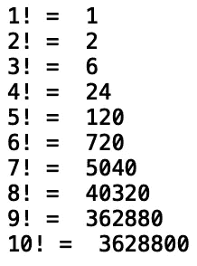
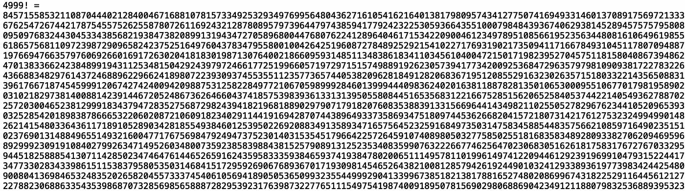

# 掌握 Python 中的记忆化

> 原文：<https://towardsdatascience.com/mastering-memoization-in-python-dcdd8b435189?source=collection_archive---------10----------------------->

## 理解 Python 中的函数缓存


由 [Kaboompics 拍摄的照片。在](https://www.pexels.com/@kaboompics)[像素上的](https://www.pexels.com/photo/old-photos-in-the-wooden-box-5842/)

记忆化是一种用于存储先前函数调用结果以加速未来计算的方法。如果使用相同的参数进行重复的函数调用，我们可以存储以前的值，而不是重复不必要的计算。这大大加快了计算速度。在这篇文章中，我们将使用记忆来寻找阶乘。

我们开始吧！

首先，让我们定义一个递归函数，我们可以用它来显示第一个阶乘，直到 *n* 。如果你对递归不熟悉，可以看看这篇文章:[*Python 中的递归*](/recursion-in-python-b026d7dde906) *。*

提醒一下，阶乘是为整数 n 定义的，因此它是该整数和它下面所有整数的乘积。例如

1! = 1,

2! = 2*1= 2

3! = 3*2*1 = 6

诸如此类。我们可以将递归函数定义如下:

```
def factorial(input_value):
    if input_value < 2: 
        return 1
    elif input_value >= 2:
        return input_value * factorial(input_value-1)
```

这里我们指定了基本情况，即如果输入值小于 2，则返回 1。如果输入值大于或等于 2，则返回递归函数调用，取整数值和先前整数值的乘积。

现在，让我们打印前 10 个阶乘:

```
for i in range(1, 11):
     print(f"{i}! = ", factorial(i))
```



这似乎运行良好。现在，让我们尝试显示前 5000 个术语:

```
for i in range(1, 5000):
     print(f"{i}! = ", factorial(i))
```

这将返回以下错误，这是 python 对堆栈溢出(内存不足)的防范措施:


发生这种情况是因为每次后续计算我们都在做重复的工作。

考虑递归函数如何计算每一项:

1! = 1,

2! = 2*1= 2

3! = 3*2! = 6

4! =4*3! = 24

注意，为 4！我们在重复 3 的计算！第二。。如果我们有办法在计算时记住/存储这些值，我们就会避免重复计算。这就形成了记忆法的动机。

现在让我们浏览一下实现记忆化方法的步骤。为了继续，让我们初始化一个字典:

```
factorial_dict = {}
```

接下来，我们将定义记忆函数。首先，我们检查输入是否小于 2，如果小于 2，则返回 1:

```
def factorial_memo(input_value):
    if input_value < 2: 
        return 1
```

接下来，我们检查输入值是否在字典中。如果不是，我们将阶乘值存储在字典中，并返回输入键的值:

```
def factorial_memo(input_value):
    ...
    if input_value not in factorial_dict:
        factorial_dict[input_value] = input_value * factorial_memo(input_value-1)
    return factorial_dict[input_value]
```

完整的功能是:

```
def factorial_memo(input_value):
    if input_value < 2: 
        return 1
    if input_value not in factorial_dict:
        factorial_dict[input_value] = input_value * factorial_memo(input_value-1)
    return factorial_dict[input_value]
```

现在，让我们尝试显示高达 5000 的阶乘！我们的新功能:

```
for i in range(1, 5000):
     print(f"{i}! = ", factorial_memo(i))
```

而且我们看到计算达到 4999！成功(输出被截断):



有一种更简单的方法可以用更少的代码实现记忆化。让我们考虑一下我们最初的递归函数:

```
def factorial(input_value):
    if input_value < 2: 
        return 1
    elif input_value >= 2:
        return input_value * factorial(input_value-1)
```

我们可以从“functools”模块导入一个名为“lru_cache”的装饰器，它允许我们缓存我们的值。该名称代表“最近最少使用的缓存”。使用这个装饰器，我们可以获得与‘factorial _ memo’方法相同的性能:

```
from functools import lru_cache
[@lru_cache](http://twitter.com/lru_cache)(maxsize = 1000)
def factorial(input_value):
    if input_value < 2: 
        return 1
    elif input_value >= 2:
        return input_value * factorial(input_value-1)

for i in range(1, 5000):
     print(f"{i}! = ", factorial(i))
```


我们看到我们实现了相似的性能。我就讲到这里，但是我鼓励你自己去研究代码。

# 结论

总之，在这篇文章中，我们讨论了 python 中的记忆方法。首先，我们展示了在计算了许多阶乘项之后，递归函数的简单实现是如何变得非常慢的。然后，我们定义了一个新方法，在这个方法中，我们将过去计算的值存储在一个字典中。这导致了计算的显著加速。然后我们讨论了“lru_cache”装饰器，它允许我们用更少的代码实现与“factorial_memo”方法相似的性能。如果你有兴趣了解更多关于记忆化的知识，我鼓励你去看看[苏格拉底的 YouTube 教程](https://www.youtube.com/watch?v=Qk0zUZW-U_M&t=302s)。我希望你觉得这篇文章有用/有趣。这篇文章中的代码可以在 [GitHub](https://github.com/spierre91/medium_code/blob/master/data_structures_and_algorithms/memo_factorial.py) 上找到。感谢您的阅读！