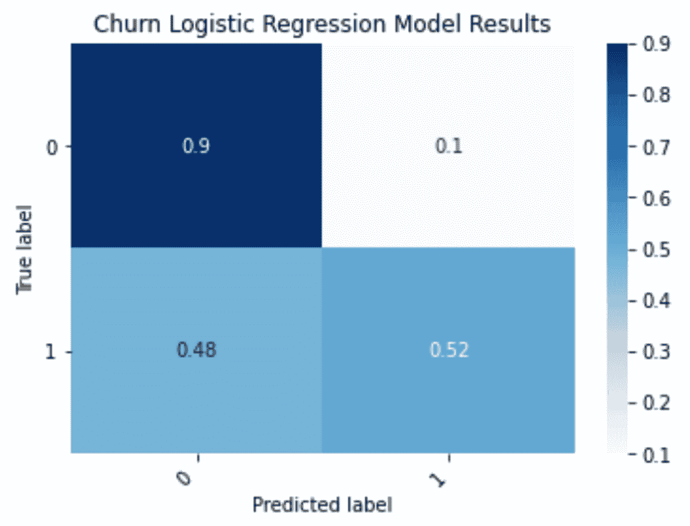
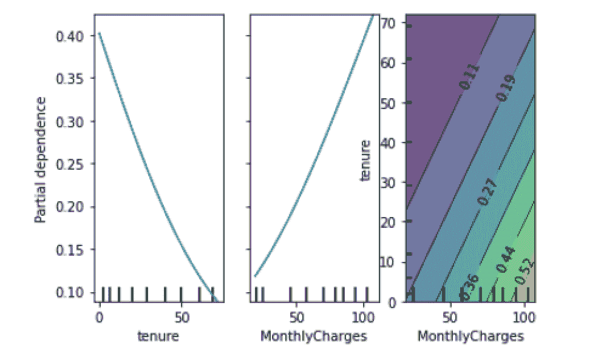
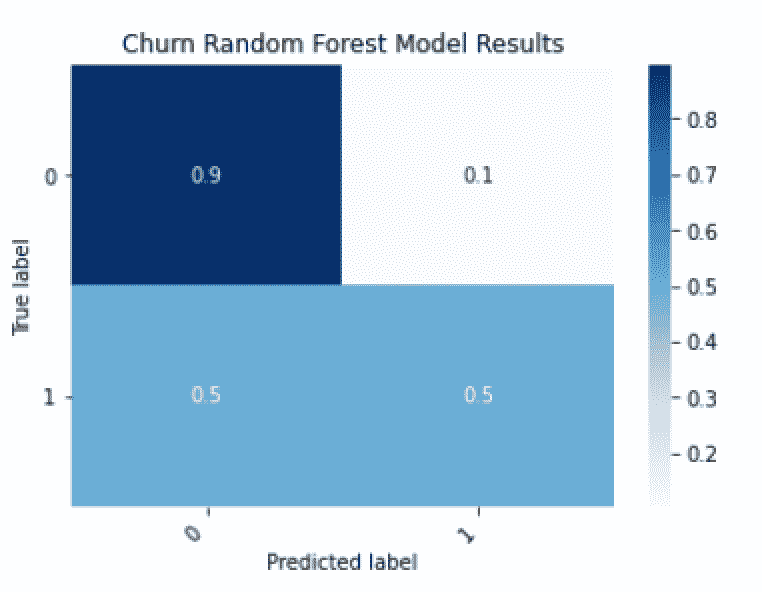
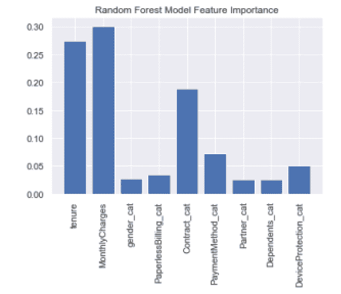
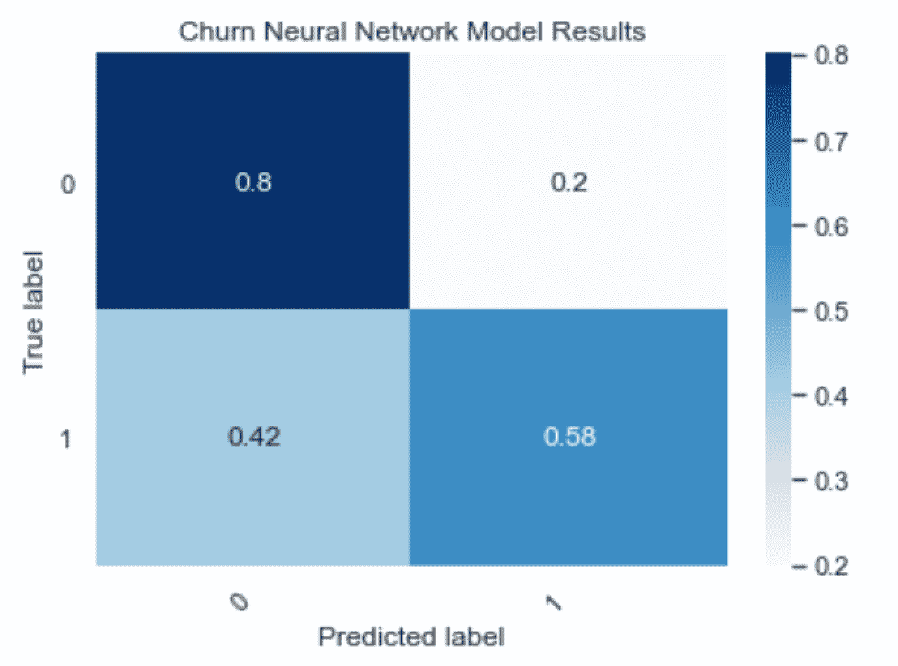
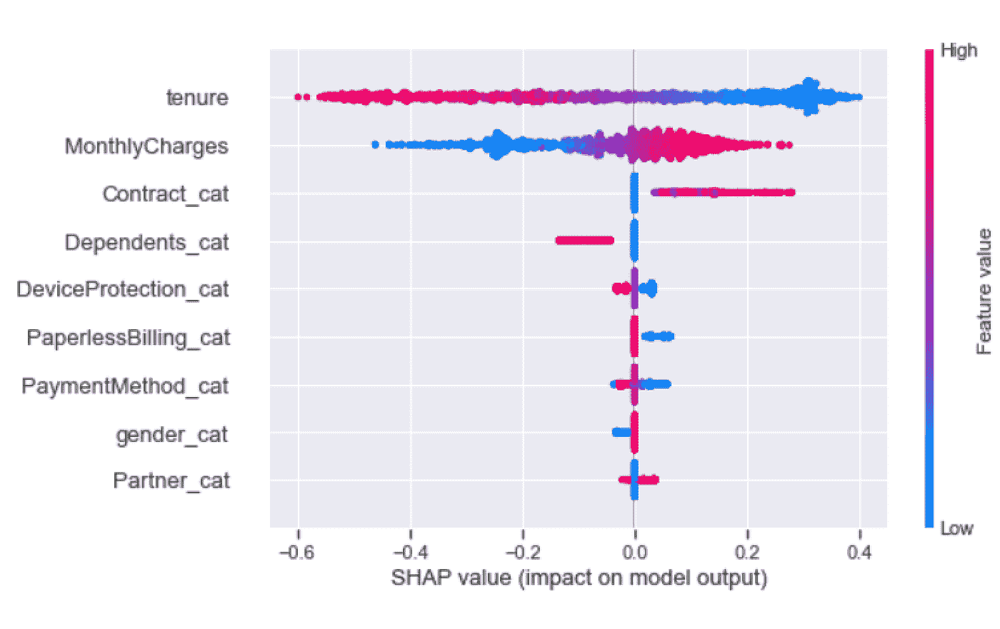
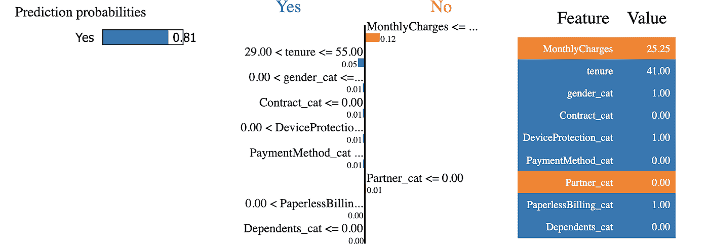

# 掌握 Python 中的模型可解释性

> 原文：<https://towardsdatascience.com/mastering-model-explainability-in-python-4e578206e000?source=collection_archive---------28----------------------->

## 解释模型特征重要性


照片由[卢卡斯](https://www.pexels.com/@goumbik)在[像素](https://www.pexels.com/photo/person-holding-blue-and-clear-ballpoint-pen-590022/)上拍摄

对于数据科学家来说，解释机器学习模型的一个关键部分是理解哪些因素会影响预测。为了在决策过程中有效地使用机器学习，公司需要知道哪些因素是最重要的。例如，如果一家公司想预测客户流失的可能性，他们可能也想知道究竟是什么驱使客户离开公司。在本例中，该模型可能表明，购买很少打折产品的客户更有可能停止购买。有了这些知识，公司可以在未来做出更明智的定价决策。在高层次上，这些见解可以帮助公司留住客户更长时间，并保持利润。

幸运的是，Python 提供了许多包，可以帮助解释机器学习模型中使用的功能。部分相关图是可视化特征和模型预测之间关系的一种有用方法。我们可以将这些图解释为作为输入特征函数的平均模型预测。随机森林，也是一种机器学习算法，使用户能够获得量化各种特征在确定模型预测中的重要性的分数。因为模型可解释性以一种直接的方式内置于 Python 包中，所以许多公司广泛使用随机森林。对于像深度神经网络这样的更多黑盒模型，像局部可解释模型不可知解释(LIME)和沙普利加法解释(SHAP)这样的方法是有用的。这些方法通常用于预测难以解释的机器学习模型。

当数据科学家对这些技术有了很好的理解，他们就可以从不同的角度处理模型可解释性的问题。部分相关性图是一种很好的方法，可以很容易地将特征/预测关系可视化。随机森林有助于根据不同要素在决定结果中的重要程度对其进行排序。莱姆和 SHAP 确定复杂模型中的特征重要性，其中直接解释模型预测是不可行的，例如具有数百或数千个特征的深度学习模型，这些特征与输出具有复杂的非线性关系。了解这些方法中的每一种都可以帮助数据科学家接近机器学习模型变量的模型可解释性，无论它们是简单还是复杂。

我们将讨论如何应用这些方法并解释分类模型的预测。具体来说，我们将考虑逻辑回归模型、随机森林模型以及深度神经网络的模型可解释性任务。我们将使用虚构的电信客户流失数据，此处[提供了这些数据](https://www.kaggle.com/blastchar/telco-customer-churn)。

## **将电信数据读入熊猫数据帧**

首先，让我们将电信客户流失数据读入 Pandas 数据框架。首先，让我们导入熊猫库:

```
import pandas as pd
```

让我们使用 Pandas read_csv()方法将数据读入数据帧:

```
df = pd.read_csv(“telco_churn.csv”)
```

让我们显示前五行数据:

```
print(df.head())
```


作者图片

## **建模数据准备**

我们将构建的每个模型都将性别、任期、月费、无纸账单、合同、支付方式、合作伙伴、家属和设备保护作为输入。我们的预测目标将是客户流失。首先，我们需要通过将分类输入转换成机器可读的分数来为训练做准备。

让我们看看将性别转换成分类代码的例子。首先，我们使用 Pandas astype 方法创建一个名为 gender_cat 的新列，其类别类型为:

```
df[‘gender_cat’] = df[‘gender’].astype(‘category’)
```

接下来，我们使用 Pandas cat.codes 属性提取分类代码:

```
df[‘gender_cat’] = df[‘gender_cat’].cat.codes
```

然后，我们对剩余的分类特征重复这一过程:

```
df[‘PaperlessBilling_cat’] = df[‘PaperlessBilling’].astype(‘category’)df[‘PaperlessBilling_cat’] = df[‘PaperlessBilling_cat’].cat.codesdf[‘Contract_cat’] = df[‘Contract’].astype(‘category’)df[‘Contract_cat’] = df[‘Contract_cat’].cat.codesdf[‘PaymentMethod_cat’] = df[‘PaymentMethod’].astype(‘category’)df[‘PaymentMethod_cat’] = df[‘PaymentMethod_cat’].cat.codesdf[‘Partner_cat’] = df[‘Partner’].astype(‘category’)df[‘Partner_cat’] = df[‘Partner_cat’].cat.codesdf[‘Dependents_cat’] = df[‘Dependents’].astype(‘category’)df[‘Dependents_cat’] = df[‘Dependents_cat’].cat.codesdf[‘DeviceProtection_cat’] = df[‘DeviceProtection’].astype(‘category’)df[‘DeviceProtection_cat’] = df[‘DeviceProtection_cat’].cat.codes
```

让我们还创建一个新列，将 churn 列中的 Yes/No 值映射到二进制整数(零和一)。在“流失分数”列中，当流失为“是”时，流失标签为 1，当流失为“否”时，流失标签为零:

```
import numpy as npdf[‘churn_score’] = np.where(df[‘churn’]==’Yes’, 1, 0)
```

接下来，让我们将输入存储在名为 X 的变量中，将输出存储在名为 y 的变量中:

```
X = df[[ ‘tenure’, ‘MonthlyCharges’, ‘gender_cat’, ‘PaperlessBilling_cat’,‘Contract_cat’,’PaymentMethod_cat’, ‘Partner_cat’, ‘Dependents_cat’, ‘DeviceProtection_cat’ ]]y = df[‘churn_score’]
```

接下来，让我们使用 scikit-learn 中 model_selection 模块中的 train _ test _ spliit 方法来拆分用于训练和测试的数据:

```
from sklearn.model_selection import train_test_splitX_train, X_test, y_train, y_test = train_test_split(X, y, test_size=0.33, random_state=42)
```

接下来，让我们从 scikit-learn 导入 LogisticRegression 模型，并使该模型适合我们的训练数据:

```
lr_model = LogisticRegression()lr_model.fit(X_train, y_train)
```

让我们进行预测:

```
y_pred = lr_model.predict(X_test)
```

为了了解我们的模型的表现，我们将生成一个混淆矩阵:

```
from sklearn.metrics import confusion_matrixconmat = confusion_matrix(y_test, y_pred)val = np.mat(conmat)classnames = list(set(y_train))df_cm = pd.DataFrame(val, index=classnames, columns=classnames,)df_cm = df_cm.astype(‘float’) / df_cm.sum(axis=1)[:, np.newaxis]import matplotlib.pyplot as pltimport seaborn as snsplt.figure()heatmap = sns.heatmap(df_cm, annot=True, cmap=”Blues”)heatmap.yaxis.set_ticklabels(heatmap.yaxis.get_ticklabels(), rotation=0, ha=’right’)heatmap.xaxis.set_ticklabels(heatmap.xaxis.get_ticklabels(), rotation=45, ha=’right’)plt.ylabel(‘True label’)plt.xlabel(‘Predicted label’)plt.title(‘Churn Logistic Regression Model Results’)plt.show()
```



作者图片

我们可以看到，逻辑回归模型在预测将与公司合作的客户方面做得非常好，找到了 90%的真正负面因素。它在预测将要离开的顾客方面也做得相当不错，发现了 52%的真实信息。

## **逻辑回归模型的部分相关图**

现在，让我们用部分相关图来解释这个模型。

```
from sklearn.inspection import plot_partial_dependencefeatures = [0, 1, (1, 0)]plot_partial_dependence(lr_model, X_train, features, target=1)
```



作者图片

我们发现，随着任期的延长，客户离开的可能性会降低。这种模式是有道理的，因为拥有更长任期的客户可能不太可能离开。

此外，客户离开的概率随着月费的增加而增加，这也是直观的。我们还可以看到租用期与月费的密度图。浅绿色/黄色表示密度较高。由此我们可以看出，大量每月充电器费用较高的客户也是相对较新的客户。在这个例子中，该公司可以利用这种洞察力来锁定每月交易和折扣费用较高的新客户，以努力留住他们。

## **随机森林特征重要性**

接下来，我们将构建一个随机森林模型，并显示其特征重要性图。让我们从 Scikit-learn 中的 ensemble 模块导入随机森林包，根据我们的训练数据构建我们的模型，并根据对测试集做出的预测生成混淆矩阵:

```
conmat = confusion_matrix(y_test, y_pred_rf)val = np.mat(conmat)classnames = list(set(y_train))df_cm_rf = pd.DataFrame(val, index=classnames, columns=classnames,)df_cm_rf = df_cm_rf.astype(‘float’) / df_cm.sum(axis=1)[:, np.newaxis]import matplotlib.pyplot as pltimport seaborn as snsplt.figure()heatmap = sns.heatmap(df_cm, annot=True, cmap=”Blues”)heatmap.yaxis.set_ticklabels(heatmap.yaxis.get_ticklabels(), rotation=0, ha=’right’)heatmap.xaxis.set_ticklabels(heatmap.xaxis.get_ticklabels(), rotation=45, ha=’right’)plt.ylabel(‘True label’)plt.xlabel(‘Predicted label’)plt.title(‘Churn Random Forest Model Results’)plt.show()
```



作者图片

然后，我们可以显示一个带有特性重要性值的条形图:

```
features = [‘tenure’, ‘MonthlyCharges’, ‘gender_cat’, ‘PaperlessBilling_cat’,‘Contract_cat’,’PaymentMethod_cat’, ‘Partner_cat’, ‘Dependents_cat’, ‘DeviceProtection_cat’ ]print(rf_model.feature_importances_)feature_df = pd.DataFrame({‘Importance’:rf_model.feature_importances_, ‘Features’: features })sns.set()plt.bar(feature_df[‘Features’], feature_df[‘Importance’])plt.xticks(rotation=90)plt.title(‘Random Forest Model Feature Importance’)plt.show()
```



作者图片

这里我们看到，促使客户离开的最重要因素是任期、月费和合同类型。结合部分相关图使用随机森林的特征重要性是一种强大的技术。你不仅知道哪些因素是最重要的，还知道这些因素与结果的关系。我们以终身职位为例。从随机森林特征的重要性我们看到，保有权是最重要的特征。从部分相关图中，我们看到任期和客户离开的概率之间存在负线性关系。这意味着客户在公司呆的时间越长，他们离开的可能性就越小。

## **莱姆和 SHAP 为神经网络模型**

当处理像深度神经网络这样更复杂的黑盒模型时，我们需要转向模型可解释性的替代方法。这是因为，与逻辑回归模型中可用的系数或随机森林等基于树的模型的内置特征重要性不同，神经网络等复杂模型不提供对特征重要性的任何直接解释。莱姆和 SHAP 是解释复杂模型最常用的方法。

让我们建立一个人工神经网络分类模型。从模型构建开始，让我们从 Keras 导入顺序和密集方法:

```
from tensorflow.keras.models import Sequentialfrom tensorflow.keras.layers import Dense
```

接下来，让我们初始化顺序方法:

```
model = Sequential()
```

让我们向模型对象中添加两个包含八个节点的层。我们需要使用输入要素的数量来指定输入形状。在第二层中，我们指定了一个激活函数，它代表了神经元放电的过程。这里，我们使用整流线性单元(ReLu)激活函数:

```
model.add(Dense(8, input_shape = (len(features),)))model.add(Dense(8, activation=’relu’))
```

然后，我们添加带有一个节点的输出层，并编译我们的模型:

```
model.add(Dense(1, activation=’sigmoid’))model.compile(optimizer=’adam’, loss=’binary_crossentropy’, metrics=[‘accuracy’])
```

一旦我们的模型被编译，我们就使我们的模型适合我们的训练数据:

```
model.fit(X_train, y_train, epochs = 1)
```

然后，我们可以根据测试数据进行预测:

```
y_pred = [round(float(x)) for x in model.predict(X_test)]
```

并生成混淆矩阵:

```
conmat = confusion_matrix(y_test, y_pred_nn)val = np.mat(conmat)classnames = list(set(y_train))df_cm_nn = pd.DataFrame(val, index=classnames, columns=classnames,)df_cm_nn = df_cm_nn.astype(‘float’) / df_cm_nn.sum(axis=1)[:, np.newaxis]plt.figure()heatmap = sns.heatmap(df_cm_nn, annot=True, cmap=”Blues”)heatmap.yaxis.set_ticklabels(heatmap.yaxis.get_ticklabels(), rotation=0, ha=’right’)heatmap.xaxis.set_ticklabels(heatmap.xaxis.get_ticklabels(), rotation=45, ha=’right’)plt.ylabel(‘True label’)plt.xlabel(‘Predicted label’)plt.title(‘Churn Neural Network Model Results’)plt.show()
```



作者图片

现在，让我们用 SHAP 来解释我们的神经网络模型:

```
import shapf = lambda x: model.predict(x)med = X_train.median().values.reshape((1,X_train.shape[1]))explainer = shap.Explainer(f, med)shap_values = explainer(X_test.iloc[0:1000,:])shap.plots.beeswarm(shap_values)
```



作者图片

正如我们从随机森林模型使用权中看到的，月度费用和合同是解释结果的三个主要特征。

LIME 是对复杂模型的特征重要性进行可视化的另一个选项。LIME 的计算速度通常比 SHAP 快，因此如果需要快速生成结果，LIME 是更好的选择。在实践中，SHAP 将比 LIME 更准确地解释特征，因为它在数学上更严格。由于这个原因，SHAP 计算量更大，如果你有足够的时间和计算资源，它是一个不错的选择。

让我们用石灰来解释我们的神经网络预测:

```
import limefrom lime import lime_tabularexplainer = lime_tabular.LimeTabularExplainer(training_data=np.array(X_train),feature_names=X_train.columns,class_names=[‘Yes’, ‘No’],mode=’classification’)exp = explainer.explain_instance(data_row=X_test.iloc[1], predict_fn=model.predict, labels=(0,))exp.show_in_notebook(show_table=True)
```



作者图片

正如我们所料，我们发现月费和租期的影响最大。这篇文章的代码可以在 GitHub 上找到。

## **结论**

根据所解决的问题，这些方法中的一种或多种可能是解释模型预测的好选择。如果您要处理相对较少的输入要素和较小的数据集，使用逻辑回归和部分相关图就足够了。如果您正在处理中等数量的输入要素和中等大小的数据集，随机森林是一个很好的选择，因为它很可能优于逻辑回归和神经网络。如果您正在处理具有数百万行和数千个输入要素的数千兆字节的数据，神经网络将是更好的选择。从那里，根据可用的计算资源，你可以与莱姆或 SHAP 合作来解释神经网络预测。如果时间有限，石灰是更好的选择，虽然不太准确。如果你有足够的时间和资源，SHAP 是更好的选择。

虽然我们看了一个简单的例子，用一个相对小而干净的数据集来留住客户，但是有多种类型的数据可以在很大程度上影响哪种方法是合适的。例如，对于一个小问题，如给定一小组产品特征作为输入，预测产品的成功，逻辑回归和部分依赖图就足够了。当处理更标准的行业问题时，如客户保留或甚至预测信用违约，特征的数量通常是适中的(少于数百个),数据的大小也是适中的，因此基于树的模型如随机森林及其特征重要性更合适。此外，医疗保健中的许多问题，如使用 EHR 数据预测医院再入院，涉及数百个(有时数千个)输入特征的训练模型。在这种情况下，用莱姆或 SHAP 解释的神经网络更合适。对于各行各业的数据科学家来说，知道何时使用给定数据类型的特定模型和可解释方法是一项无价的技能。

如果你有兴趣学习 python 编程的基础知识、Pandas 的数据操作以及 python 中的机器学习，请查看[*Python for Data Science and Machine Learning:Python 编程、Pandas 和 sci kit-初学者学习教程*](https://www.amazon.com/dp/B08N38XW2Q/ref=sr_1_1?dchild=1&keywords=sadrach+python&qid=1604966500&s=books&sr=1-1) *。我希望你觉得这篇文章有用/有趣。*

***本帖原载于*** [***内置博客***](https://builtin.com/machine-learning) ***。原片可以在这里找到***[](https://builtin.com/machine-learning/model-explainability-python)****。****