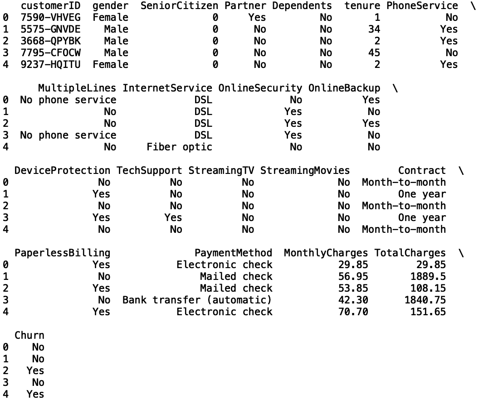
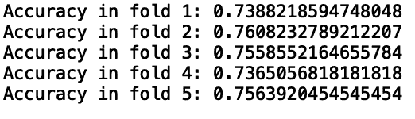
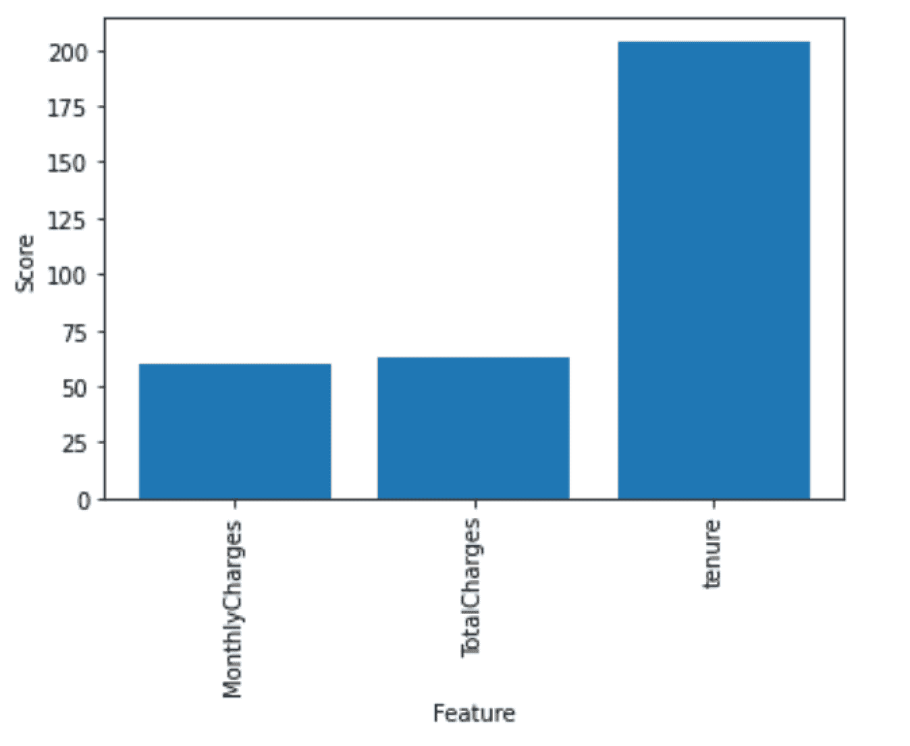
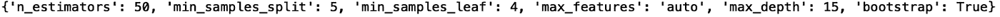

# 掌握 Python 中的模型选择

> 原文：<https://towardsdatascience.com/mastering-model-selection-in-python-7dc2f8fcf57c?source=collection_archive---------30----------------------->

## 了解模型测试、特性选择和模型调整


照片由[卢卡斯](https://www.pexels.com/@goumbik)在[像素](https://www.pexels.com/photo/person-writing-on-notebook-669615/)上拍摄

建立稳定、准确和可解释的机器学习模型是许多行业公司的重要任务。随着基础训练数据的更新，机器学习模型预测必须在时间上保持稳定。由于不可预见的事件导致的数据的剧烈变化会导致模型性能的显著恶化。模型超参数调整可以帮助对机器学习模型进行必要的更改，这些模型考虑了数据随时间的统计变化。了解测试模型的各种方法也很重要，这取决于您拥有的数据量以及模型预测的稳定性。此外，最有用的模型使用可操作和可解释的输入或特征。鉴于此，很好地理解如何选择最佳特性是很重要的。最佳特性的选择通常是通过领域专家来完成的。还有其他的特征选择方法，结合领域专业知识，可以帮助构建精确的模型，用于产生可操作的见解。强大的模型测试、特征选择和模型调整知识，以及领域专业知识，可以帮助公司从机器学习模型预测中获得最大收益。

模型测试是模型建立的一个非常重要的部分。如果操作正确，它可以确保你的模型稳定，不会过度拟合。三种最广为人知的模型测试方法是随机训练/测试分割、K 折交叉验证和留一交叉验证。随机训练测试分割是最简单的，其中从数据中抽取随机样本来组成测试数据集，而剩余的数据用于训练。K-fold 交叉验证随机将数据分成 K 个“部分”(称为折叠)，其中一个折叠用于测试，其余折叠用于测试。方法是在每个折叠上迭代，直到所有数据都用于训练和测试模型。然后对褶皱上的性能进行平均。最后，leave one out 类似于 K-folds，但它使用单个数据点进行测试，其余数据用于训练。它迭代每个数据点，直到所有数据都用于测试和训练。根据你的数据大小和你希望最小化偏差的程度，你可能更喜欢一种方法而不是另一种，我们将在后面讨论。

特征选择是模型构建的一个非常重要的部分，因为它直接影响模型的性能和模型的可解释性。最简单的特征选择方法是手动特征选择，这在理想情况下由领域专家指导，您选择不同的特征集，直到您对验证集的性能满意为止(通常您有一个与验证集分离的支持测试集，您在模型开发结束时对其进行一次测试，以避免过度拟合)。还有其他方法，比如 SelectKBest，可以自动完成这个过程，我们也将讨论这些方法。如果您的数据有许多列，手动选择要素可能会成为一项繁琐的任务，则这些选项特别有用。过滤输入集的大小有助于使模型预测更易于解释，从而使预测更具可操作性。

最后，超参数调整也是模型构建的一个非常重要的部分。虽然大多数机器学习包都带有默认参数，通常可以提供不错的性能，但通常需要额外的调整来构建非常准确的模型。这可以手动完成，通过选择不同的参数值并在样本验证中测试模型(对训练数据)，直到您对性能满意为止。还有一些 python 包，允许您在超参数空间中搜索大多数算法，并选择提供最佳性能的参数。

我们将讨论如何应用这些方法来测试、调整和选择用于分类任务的机器学习模型。具体来说，我们将考虑预测客户流失的任务，其中流失被定义为客户离开公司的事件。我们将使用公开的虚构电信客户流失数据，这些数据可在[这里](https://www.kaggle.com/blastchar/telco-customer-churn)获得。

**读取和显示电信数据**

首先，让我们导入 pandas 库，并将电信数据读入 pandas 数据框:

```
import pandas as pddf = pd.read_csv(“telco.csv”)print(df.head())
```



**为训练和测试拆分数据的方法**

**随机训练测试分割**

我们将讨论的第一种测试方法是随机训练测试分割。让我们建立一个简单的模型，将客户任期和每月费用作为输入，并预测客户是否会流失。在这里，我们的投入将是任期和月费，我们的产出将是流失。首先，让我们使用 numpy 包中的 np.where()方法将流失值转换为机器可读的二进制整数:

```
import numpy as npdf[‘Churn_binary’] = np.where(df[‘Churn’] == ‘Yes’, 1, 0)
```

现在让我们从 scikit-learn 中的模型选择模块导入 train_test_split 方法:

```
from sklearn.model_selection import train_test_split
```

正如在[文档](https://scikit-learn.org/stable/modules/generated/sklearn.model_selection.train_test_split.html)中所解释的，train_test_split 方法将数据分成随机的训练和测试子集。为了执行分割，我们首先根据分别称为 X 和 y 的变量来定义输入和输出:

```
X = df[[‘tenure’, ‘MonthlyCharges’]]y = df[‘churn’]
```

接下来，我们将这些变量传递给 train_test_split 方法。该方法返回训练输入和测试输入以及训练输出和测试输出的随机子集。在 python 中，当方法或函数返回多个值时，它们通常是元组。我们需要对返回元组进行解包，并将正确的值存储在我们的训练和测试变量中:

```
X_train, X_test, y_train, y_test = train_test_split(X, y)
```

我们还可以指定一个名为 random_state 的参数。这是一个随机参数，控制如何随机分割数据。如果我们给它一个整数值，我们确保在每次运行时都复制相同的分割:

```
X_train, X_test, y_train, y_test = train_test_split(X, y, random_state =42)
```

然后，使用您的训练和测试子集来训练和测试模型是很简单的。例如，要训练随机森林:

```
from sklearn.ensemble import RandomForestClassifiermodel = RandomForestClassifier()model.fit(X_train, y_train)y_pred = model.predict(X_test)
```

然后，您可以使用 y_test 和 y_pred 来评估模型的性能。要考虑的一件重要事情是你是否有时间相关的数据。如果是这种情况，您不应该执行随机分割，而是按日期分割您的数据。如果使用随机拆分，您将在训练集中包含未来的数据，并且您的预测将会有偏差。

在实践中，随机训练测试拆分对于生成一个保留验证集非常有用，您可以在完成功能选择和模型调整后使用该验证集进行一次测试。这确保了你的模型不会过度拟合，并减少了你的模型高度偏差的机会。

**K 倍交叉验证**

K 折叠交叉验证是将数据分成整数“K”个部分，并将一部分用于测试，其余部分用于训练的过程。这是反复进行的，直到所有数据都用于训练和测试。交叉验证方法的文档可以在[这里](https://scikit-learn.org/stable/modules/cross_validation.html)找到。

为了实现 K 折叠，我们从 scikit-learn 中的模型选择模块导入 K 折叠:

```
from sklearn.model_selection import KFold
folds = KFold(n_splits=5)
folds.get_n_splits(X)for train_index, test_index in folds.split(X):
    X_train, X_test, y_train, y_test = X.iloc[train_index],     X.iloc[test_index], y.iloc[train_index], y.iloc[test_index]
    model = RandomForestClassifier()
    model.fit(X_train, y_train)
    y_pred = model.predict(X_test)
    fold+=1
    print(f”Accurac in fold {fold}:”, accuracy_score(y_pred, y_test))
```



在 for 循环中，您可以在不同的折叠上训练和测试您的模型。这里我们只使用了 5 次折叠，但是你可以改变 KFold 方法中的 n_splits 参数。使用的折叠越多，模型输出中的偏差就越小。这允许您通过诸如方差之类的度量来分析模型性能的稳定性。这通常也用于模型调优和特性选择等任务，我们稍后将对此进行介绍。理想情况下，您需要性能差异最小的最精确模型。低性能差异意味着模型更稳定，因此更可靠。

**留一交叉验证**

去掉一个类似于 K 折叠，但是不是使用随机采样的子集进行训练和测试，而是使用单个数据点进行测试，而其余的用于训练。这也是反复进行的，直到所有数据都用于训练和测试:

```
loo = LeaveOneOut()
for train_index, test_index in loo.split(X):
    X_train, X_test, y_train, y_test = X.iloc[train_index], X.iloc[test_index], y.iloc[train_index], y.iloc[test_index]
```

这通常用于较小的数据集。根据我的经验，我发现这对于小的不平衡数据集很有用。值得注意的是，由于您正在训练您的模型 *n* 次，其中 *n* 是数据的大小，这对于大型数据集可能是计算密集型的。

**建模的特征选择方法**

除了通常通过探索性数据分析和使用领域专业知识完成的手动要素选择之外，还有用于要素选择的有用 python 包。这里我们将讨论 SelectKBest 方法。SelectKBest 的文档可在[这里](https://scikit-learn.org/stable/modules/generated/sklearn.feature_selection.SelectKBest.html)找到。首先让我们导入必要的包:

从 sklearn.feature_selection 导入选择测试，f_classif

将 matplotlib.pyplot 作为 plt 导入

我们将选择按月收费，任期和总费用。首先，我们需要清理 TotalCharges 列:

```
df[‘TotalCharges’] = df[‘TotalCharges’].replace(‘ ‘, np.nan)df[‘TotalCharges’].fillna(0, inplace = True)df[‘TotalCharges’] = df[‘TotalCharges’].astype(float)
```

我们应该在训练集上选择特征，这样我们就不会偏向我们的模型。让我们重新定义我们的输入和输出:

```
X = df[[‘tenure’, ‘MonthlyCharges’, ‘TotalCharges’]]y = df[‘Churn’]
```

现在，让我们执行随机训练/测试分割:

```
X_train, X_test, y_train, y_test = train_test_split(X, y, random_state= 42)
```

接下来让我们定义我们的选择器对象。我们将传入我们的特性和输出:

```
numerical_predictors = [“MonthlyCharges”, “TotalCharges”, “tenure” ]numerical_selector = SelectKBest(f_classif, k=3)numerical_selector.fit(X_train[numerical_predictors], y_train)
```

现在，我们可以为我们的功能绘制分数。我们通过对每个特征的 p 值取负对数来为每个特征生成分数:

```
num_scores = -np.log10(numerical_selector.pvalues_)plt.bar(range(len(numerical_predictors)), num_scores)plt.xticks(range(len(numerical_predictors)), numerical_predictors, rotation=’vertical’)plt.show()
```



我们可以看到任期得分最高，这是有道理的。直觉上，与公司相处时间越长的客户流失的可能性就越小。我想强调的是，在实践中，特征选择应该在训练数据上进行。此外，为了提高所选特征的可靠性，您可以运行 K-fold 交叉验证，取每个特征的平均分数，并将结果用于特征选择。

**超参数调谐**

除了模型测试和特征选择之外，模型超参数调整是模型构建中非常重要的一部分。这个想法是寻找能给出最佳性能的模型参数。scikit-learn 的 RandomizedSearchCV 方法允许您对估计量的参数执行随机搜索。RandomizedSearchCV 的文档可以在[这里](https://scikit-learn.org/stable/modules/generated/sklearn.model_selection.RandomizedSearchCV.html)找到。这里，我们将对随机森林参数执行随机搜索。我们首先定义一个随机森林参数值的网格。首先让我们指定我们将在随机森林中使用的三棵树的列表:

```
n_estimators = [50, 100, 200]
```

然后，我们指定每次分割时要考虑的特性数量

```
max_features = [‘auto’, ‘sqrt’, ‘log2’]
```

我们还指定了树中的最大级别数

```
max_depth = [int(x) for x in np.linspace(10, 30, num = 5)]max_depth.append(None)
```

分割一个节点所需的最小样本数:

```
min_samples_split = [2, 5, 10]
```

每个叶节点所需的最小样本数

```
min_samples_leaf = [1, 2, 4]
```

最后，我们是否会使用 bootstrap 抽样:

```
bootstrap = [True, False]
```

我们现在可以指定一个字典作为我们的参数网格:

```
random_grid = {‘n_estimators’: n_estimators,‘max_features’: max_features,‘max_depth’: max_depth,‘min_samples_split’: min_samples_split,‘min_samples_leaf’: min_samples_leaf,‘bootstrap’: bootstrap}
```

让我们也定义一个随机森林模型对象:

```
model = RandomForestClassifier()
```

类似于特征选择，应该对训练数据进行模型超参数调整。为了继续，让我们从 scikit-learn 导入 RandomizedSearchCV:

```
from sklearn.model_selection import RandomizedSearchCV
```

接下来，我们定义一个 RandomizedSearchCV 对象。在对象中，我们传递随机森林模型、random_grid 以及每次随机搜索的迭代次数。请注意，有一个名为“cv”的参数用于交叉验证。我们使用这个参数来定义用于验证的折叠数，就像我们对 K 折叠所做的那样。同样，我们希望找到给出最佳模型性能的随机森林参数集，模型性能是通过使用交叉验证的 RandomizedSearchCV 计算的。参数 verbose 显示每次迭代的输出。由于我们有 3 次折叠和 3 次迭代，我们应该看到 9 次测试运行的输出:

```
rf_random = RandomizedSearchCV(estimator = model, param_distributions= random_grid, n_iter = 3, cv =3, verbose=2, random_state=42)
```

在定义了 RandomizedSearchCV 对象之后，我们可以拟合我们的训练数据:

```
rf_random.fit(X_train, y_train)
```


拟合后，我们可以输出最佳性能的参数:

```
parameters = rf_random.best_params_print(parameters)
```



您可以增加迭代次数来搜索和测试更多参数。迭代次数越多，就越有可能从超参数集中找到性能更好的模型。显然，你搜索和测试的参数越多，计算时间就越长。记住这一点也很好，在典型的机器或笔记本电脑上，对于非常大的数据集，这可能变得难以处理，您可能需要使用分布式计算工具，如 databricks。了解其他超参数调整工具也很有用。例如，GridSearchCV 在整个网格上执行穷举搜索。这意味着测试了参数的每一种可能的组合。如果你有足够的计算能力，这是一个不错的选择。

**结论**

很好地理解哪些工具可用于构建稳健的机器学习模型是每个数据科学家都应该具备的技能。能够为训练和测试准备数据、选择特征和调整模型参数对于构建预测可靠的稳定模型是必要的。此外，将这些工具放在你的后袋中可以节省大量的工时，因为这些方法将原本需要手动完成的工作自动化了。这些技术如果使用得当，可以降低模型恶化的风险，这种风险会使公司损失数百万美元。

理解如何恰当地设置模型测试对于确保您不会过度拟合您的模型是非常重要的。例如，如果您没有正确地分割用于训练和测试的数据，您的模型测试可能会给您一个错误的模型准确性的感觉，这对一个公司来说可能是非常昂贵的。在客户流失的情况下，如果你的模型是虚假的准确，你可能会错误地锁定那些实际上不太可能流失的客户。这可能导致数百万美元的广告损失。为了降低过度拟合和高估模型性能的风险，关键是要有一个保留测试集(就像我们从随机训练测试分割中生成的测试集)，在对训练数据进行模型调整和特征选择之后，我们对该测试集执行单个测试。此外，交叉验证方法让我们很好地了解我们的模型在模型调整和特征选择方面的稳定性。交叉验证允许我们看到多个测试之间的性能差异。理想情况下，我们希望选择能够以最低的模型性能差异提供最佳性能的特性和模型参数。模型性能的低方差意味着模型预测更可靠，风险更低。

特征选择也非常重要，因为它可以帮助过滤掉潜在的大量输入。例如，无论模型多么精确，都很难解释 1000 个特征的值如何决定客户是否会流失。特征选择和领域专业知识可以帮助数据科学家选择和解释预测结果的最重要特征，例如客户流失。超参数调整也是实现最佳模型性能的必要步骤。虽然 scikit-learn 机器学习包提供的默认参数值通常提供了不错的性能，但为了实现非常精确的模型，需要进行模型调整。例如，通过客户流失，你越准确地锁定可能离开公司的客户，错误锁定的客户损失的金钱就越少，高风险客户的客户终身价值就越大。

对于任何行业的数据科学家来说，非常熟悉用于设置模型测试、选择功能和执行模型调整的工具是一项非常宝贵的技能。掌握这些知识可以帮助数据科学家构建稳健可靠的模型，从而为公司带来显著的价值。这可以在金钱和工时方面节省大量资源，并增加公司利润。这篇文章的代码可以在 GitHub 上找到。

如果你有兴趣学习 python 编程的基础知识、Pandas 的数据操作以及 python 中的机器学习，请查看[*Python for Data Science and Machine Learning:Python 编程、Pandas 和 sci kit-初学者学习教程*](https://www.amazon.com/dp/B08N38XW2Q/ref=sr_1_1?dchild=1&keywords=sadrach+python&qid=1604966500&s=books&sr=1-1) *。我希望你觉得这篇文章有用/有趣。*

***本帖原载于*** [***内置博客***](https://builtin.com/machine-learning) ***。原片可以在这里找到***[](https://builtin.com/data-science/machine-learning-models-python)****。****