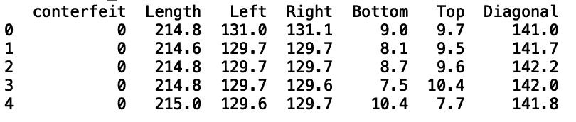
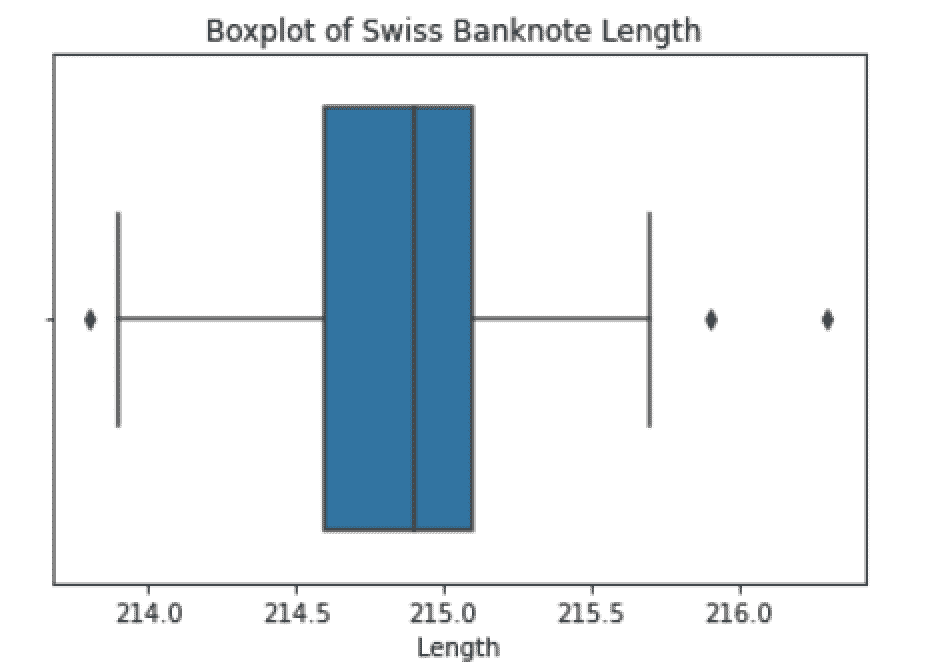
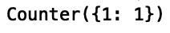
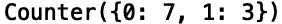
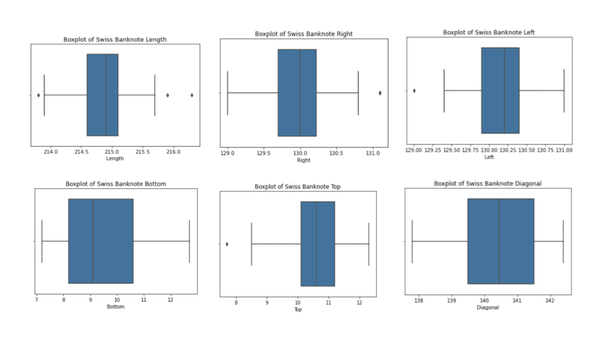
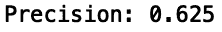
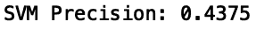

# 掌握 Python 中的异常检测

> 原文：<https://towardsdatascience.com/mastering-outlier-detection-in-python-61d1090a5b08?source=collection_archive---------19----------------------->

## Python 中检测数据异常值的有用方法


马库斯·斯皮斯克在[的照片](https://www.pexels.com/photo/one-black-chess-piece-separated-from-red-pawn-chess-pieces-1679618/)

离群点检测，也称为异常检测，是许多数据科学团队的常见任务。它是识别与分布的其余部分相比具有极值的数据点的过程。异常值检测具有广泛的应用，包括数据质量监控、识别金融中的价格套利、检测网络安全攻击、医疗欺诈检测、钞票伪造检测等等。

在每一个应用中，异常值对应于罕见的事件。例如，在网络安全攻击的情况下，数据中表示的大多数事件不会反映实际的攻击。一小部分数据将代表真正的网络攻击。

类似地，对于伪钞检测，大部分记录将代表真钞，而伪钞将构成总数据的一小部分。异常值检测的任务是量化常见事件，并将其用作识别数据中相对异常的参考。

Python 提供了各种易于使用的异常检测方法和包。然而，在选择方法之前，您需要首先考虑模态。这是分布中包含的峰值数量。例如，假设您有一个由运动员体重组成的数据列。如果数据是多峰的，则分布中有许多高度密集的区域。这可能意味着许多运动员的体重在 200 到 210 磅之间，相当数量的运动员体重在 230 到 240 磅之间。除了模态之外，在考虑异常值检测的方法时，您应该考虑数据集的大小和维度，也就是列的数量。

如果您的数据相对较小，比如只有几十个要素和几千行，那么简单的统计方法(如箱线图可视化)就足够了。如果您的数据是单峰的，这意味着分布中有一个单峰，像椭圆包络这样的方法是有用的。如果您的数据是中等大小和多模态的(意味着有许多峰值)，隔离林是更好的选择。如果您的数据是高维、大型和多模态的，那么 OneClassSVM 可能是更好的选择。

在这里，我们将使用各种方法来解决使用[瑞士钞票伪钞检测数据集](https://www.kaggle.com/chrizzles/swiss-banknote-conterfeit-detection)识别伪钞的任务。

**读入数据**

首先，让我们导入 Pandas 库，它用于读入、转换和分析数据。我们将使用 Pandas 将我们的数据读入数据框:

进口熊猫作为 pd

```
df = pd.read_csv(“banknotes.csv”)
```

接下来，让我们使用。head()方法:

```
print(df.head())
```



作者图片

这里我们看到数据包含列长度、左、右、下、上和对角线，它们都对应于以毫米为单位的钞票尺寸。我们还看到一个伪造列，它具有表示钞票是伪造的还是真实的基础真值。值 1 对应于伪造，值 0 表示真实。

**使用箱线图进行异常值检测**

箱线图是可视化数据中数值四分位数的标准方法。四分位数将数字数据分为四组:

1.  第一个四分位数是最小值和中值之间的中间数，因此 25%的数据低于这个点。
2.  第二个四分位数是中间值，这意味着 50%的数据低于这个点。
3.  第三个四分位数是最大值和中值之间的中间数，因此 75%的数据低于这个点。
4.  第四个四分位数是最高的 25%的数据

让我们来看看长度列的箱线图。为此，让我们导入 Seaborn 并使用方框图方法。让我们也导入 Matplotlib，我们将使用它来命名我们的方框图:

```
import seaborn as snsimport matplotlib.pyplot as pltsns.boxplot(data=df,x=df[“Length”])plt.title(“Boxplot of Swiss Banknote Length “)
```



作者图片

方框图中的点对应极端异常值。我们可以通过过滤我们的数据帧并使用计数器方法计算伪造的数量来验证这些是异常值:

```
df_outlier1 = df[df[‘Length’]> 216].copy()print(Counter(df_outlier1[‘conterfeit’]))
```



作者图片

我们看到，在这些条件下，我们只能捕获每 100 张假钞中的一张。如果我们放宽过滤条件来捕捉额外的异常值，我们会发现我们也捕捉到了真实的钞票:

```
df_outlier2 = df[df[‘Length’]> 215.5].copy()print(Counter(df_outlier2[‘conterfeit’]))
```



作者图片

这相当于 0.30 的精度，这不是很好的性能。更糟糕的是，这相当于 1.5%的精度。

为了帮助解决这种不准确性，我们可以查看额外列的箱线图。让我们为剩余的列创建盒状图，以及一个允许我们为任何数字列生成盒状图的函数:

```
def boxplot(column): sns.boxplot(data=df,x=df[f”{column}”]) plt.title(f”Boxplot of Swiss Banknote {column}”) plt.show()
```

让我们用列长度(左、右、下、上和对角线)来调用函数:

```
boxplot(‘Length’)boxplot(‘Right’)boxplot(‘Left’)boxplot(‘Bottom’)boxplot(‘Top’)boxplot(‘Diagonal’)
```



作者图片

我们可以过滤前 50%的长度、右侧、左侧和底部:

```
df_outlier3 = df[(df[‘Length’]> 215)&(df[‘Right’]> 130)&(df[‘Left’]> 130)&(df[‘Bottom’]> 10)].copy()print(Counter(df_outlier3[‘conterfeit’]))
```

我们看到我们现在捕获了八个伪造品。虽然这是对我们之前捕获的单张假钞的改进，但我们仍然错过了另外 92 张假钞，这相当于 4%的准确率。此外，数据中的数字列越多，异常值检测的任务就变得越麻烦。因此，箱线图非常适合于只有几列的小而简单的数据集。

**使用隔离森林进行异常值检测**

隔离林是一种异常值检测方法，它通过随机选择列及其值来分离数据的不同部分。它适用于更复杂的数据，例如包含更多列和多模态数值的集合。

让我们导入 IsolationForest 包，并使其适合长度、左、右、下、上和对角线列。请注意，该算法只接受输入，因为它是一种无监督的机器学习技术，不像有监督的机器学习技术，它对特征和目标都进行了训练。幸运的是，我们仍然可以验证我们的预测，因为我们的数据来自假冒标签。

首先，让我们导入必要的包:

```
from sklearn.ensemble import IsolationForestfrom sklearn.model_selection import train_test_splitfrom sklearn.metrics import precision_scoreimport numpy as np
```

接下来，让我们定义我们的输入和输出(我们将仅用于验证，而不是训练)，并分割我们的数据:

```
X = df[[‘Length’, ‘Left’, ‘Right’, ‘Bottom’, ‘Top’, ‘Diagonal’]]y = df[‘conterfeit’]X_train, X_test, y_train, y_test = train_test_split(X, y, test_size=0.33, random_state=42)
```

接下来，让我们将模型与输入相匹配:

```
clf = IsolationForest(random_state=0)clf.fit(X_train)y_pred = clf.predict(X_test)
```

最后，我们来预测一下测试数据，评估一下精度评分。同样，在实践中，由于这是无监督的机器学习，我们不会有标签来验证我们的模型。但是，对于我们这里的目的，我们将进行验证，以便我们对这些方法检测异常值的能力有所了解:

```
pred = pd.DataFrame({‘pred’: y_pred})pred[‘y_pred’] = np.where(pred[‘pred’] == -1, 1, 0)y_pred = pred[‘y_pred’]print(“Precision:”, precision_score(y_test, y_pred))
```



作者图片

我们看到我们的异常值检测模型的精度为 0.625。将此与我们通过箱线图获得的 0.30 的精度进行比较。该模型还提供了 56%的准确度(相比之下，箱线图的准确度为 4%)，这表明在异常值检测方面有了显著的改进。这是因为隔离林能够对数据进行分区，并根据多个要素识别异常值。当我们使用箱线图时，我们必须手动检查异常值，并尝试使用多个特征得出结论，这在特征数量越多时变得越来越困难。例如，您可以拥有一个点聚类，其中单个特征值可能不是异常值，但值的组合可能是异常值。这种类型的行为很难通过检查箱线图来发现。

**使用 OneClassSVM 进行离群点检测**

现在，让我们探索如何使用 OneClassSVM 进行离群点检测。这是另一种无监督的机器学习技术，对于高维和大数据集很有用。让我们导入必要的包，适应我们的模型并评估性能:

```
clf_svm = OneClassSVM(gamma=’auto’)clf_svm.fit(X_train)y_pred_svm = clf_svm.predict(X_test)pred[‘svm’] = y_pred_svmpred[‘svm_pred’] = np.where(pred[‘svm’] == -1, 1, 0)y_pred_svm = pred[‘svm_pred’]print(“SVM Precision:”, precision_score(y_test, y_pred_svm))
```



作者图片

我们发现，与 IsolationForest 相比，我们的精度有所下降。当我们将 IsolationForests 与 OneClassSVM 进行比较时，我们的准确率也从 56%下降到 47%。这可能是因为我们的数据相对较小且维度较低，而我们的模型过度拟合了这些数据。这意味着该算法对数据中不符合可辨别模式的随机噪声和波动进行建模。在这种情况下，模型学习的随机噪声无法帮助捕获异常值和内值(正常数据点)之间的分离。OneClassSVM 过度拟合的趋势解释了与 IsolationForest 相比性能下降的原因。

这篇文章的代码可以在 GitHub 上找到。

**结论**

虽然我们着眼于解决用于识别伪钞的异常值检测任务的方法，但是这些方法可以应用于各种异常值检测任务。例如，箱线图可用于信用卡欺诈检测等任务。隔离林可用于制造业中的缺陷项目检测等任务。OneClassSVM 可用于涉及高维数据的任务，例如使用社交媒体文本数据检测欺凌或恐怖活动。

无论您处理的是金融数据、制造数据还是社交媒体数据，掌握这些工具的相关知识对任何数据科学家都是有用的。虽然我们只考虑了表格数字数据，但是异常值检测的基本概念适用于所有用例。本文可以作为刚刚开始学习 Python 离群点检测技术的数据科学家的基础。这些易于使用的软件包可以帮助数据科学家解决各种常见的异常值检测问题，从而为客户、数据科学团队和公司整体带来附加值。

如果你有兴趣学习 python 编程的基础知识、Pandas 的数据操作和 python 中的机器学习，请查看[*Python for Data Science and Machine Learning:Python 编程、Pandas 和 sci kit-初学者学习教程*](https://www.amazon.com/dp/B08N38XW2Q/ref=sr_1_1?dchild=1&keywords=sadrach+python&qid=1604966500&s=books&sr=1-1) *。我希望你觉得这篇文章有用/有趣。*

***本帖原载于*** [***内置博客***](https://builtin.com/data-science) ***。原片可以在这里找到***[****。****](https://builtin.com/data-science/outlier-detection-python)