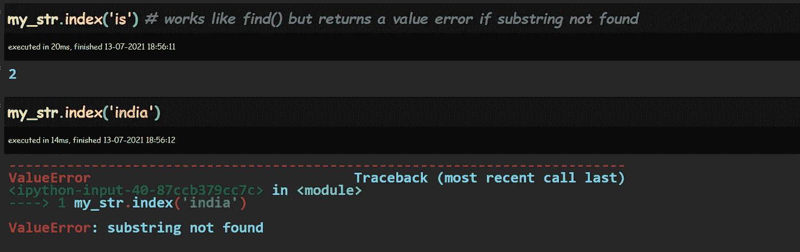

# 掌握 Python 字符串

> 原文：<https://towardsdatascience.com/mastering-python-strings-3c933686962a?source=collection_archive---------30----------------------->

蒙罗工作室在 [Unsplash](https://unsplash.com/s/photos/strings?utm_source=unsplash&utm_medium=referral&utm_content=creditCopyText) 拍摄的照片

在解决现实世界的数据科学挑战时，处理字符串是不可避免的。数据集中的许多要素在引用时都具有文本内容或字符串形式的值。舒适地处理字符串变得非常重要——创建、操作、修改——即使你不处理自然语言处理之类的东西。

在这篇文章中，我们的目标是带您了解 python 中字符串对象的基本知识，以及如何使用大量可用函数来处理字符串，这样您就可以像专业人士一样开始处理字符串了！。

所以让我们开始吧！

这篇文章大致分为以下几个主题:

1.  **创建字符串对象**
2.  **分析字符串**
3.  **字符串操作**
4.  **格式化字符串输出**

1.  **创建字符串对象**

在 python 中，我们通过用单引号或双引号将内容括起来来创建字符串对象。

作者图片

我们还可以使用`str()`函数将几乎任何 python 对象转换成它的字符串表示。这里有几个微不足道的例子:

**2。分析字符串**

**检查长度:**

内置的`len()`函数给出了字符串对象的长度，其中也包括空格字符。

**检查机箱:下、上、标题机箱**

我们可以使用`islower()`内置的 python 函数来检查一个字符串对象是否全部是小写字符。`isupper()`检查所有的大写字母。`istitle()`检查每个单词开头的大写字母。

**检查字符串对象**的内容

字符串是字母数字吗？它包含字母和数字吗？`isalnum()`方法给出了答案。

我们还可以使用`isdigit()`方法检查字符串是否只有数字，并使用`isdecimal()`检查它是否是十进制字符串。

**搜索字符串对象内容**

我们可以使用 string 对象的`find()`方法在一个更大的字符串中搜索一个字符串(子字符串)。这将返回子字符串在字符串中第一个匹配项的索引位置，如果没有找到，则返回值-1。

`index()`方法做同样的事情，但是如果没有找到子串，就返回一个值错误。

或者，我们可以使用`in`关键字在另一个字符串对象中搜索一个字符串，它会返回一个布尔值，如下所示:

使用`replace()`方法可以实现“搜索和替换”。它接受 3 个参数——要替换的字符串、将替换找到的字符串的字符串和一个可选的 count 参数，我们可以在该参数中指示要执行多少次这样的搜索和替换操作。

注意在下面的例子中，对于`long_string`对象，最后一次出现的 long 没有被替换，因为我们只指定了 3 次替换。

`rfind()`的工作方式与`find()`类似，但是`rfind()`返回子串最近一次出现的索引号，如果没有找到子串，则返回-1。下面是`find`和`rfind`的对比。

作为搜索子字符串的一个特例，如果我们想检查一个字符串对象是以一个特定的子字符串开始还是结束，那么我们可以使用`startswith()`和`endswith()`方法。

作为在字符串中搜索这一主题的自然延伸，我们可以使用 string 对象的`count()`方法来计算子字符串的出现次数。请注意，这将返回子字符串不重叠出现的次数。

**3。字符串操作**

现在，让我们看看修改字符串对象的可用方法。

之前我们使用`isupper()`、`islower()`和`istitle()`方法检查了字符串对象中字符的大小写。没有“是”的相应方法实际上实现了更改。

使用`swapcase()`方法，我们可以在全大写和全小写之间切换。

`capitalize()`让我们将字符串对象的第一个字符转换成大写。

**分割一个字符串对象**

我们可以使用指定的拆分字符将一个字符串对象拆分成一系列子字符串。默认的拆分字符是空格，这会导致字符串被拆分成一系列“单词”。

**加入字符串对象列表**

现在让我们试着将一系列字符串对象连接在一起。我们为此使用了`join()`方法。在一个字符串对象上调用了`join()`方法，我们想用它来连接多个字符串对象。在下面的例子中，我们使用字符串`-`连接拆分的字符串

现在让我们通过使用`join()`方法将由空格分隔的字符串列表连接在一起，得到 my_str 对象的原始值。

请注意，字符串操作是在原始字符串对象的副本上执行的，如果您希望在原始对象上进行更改，则必须将输出重新分配给相同的字符串对象名称。

**修剪字符串中的前导字符和尾随字符**

通常这是指修剪字符串前面或后面多余的空格，尽管相应的方法也可以用来删除开头或结尾的任何其他字符。`strip()`删除两端的字符(如果没有指定，默认为空格)，而`lstrip()`和`rstrip()`分别删除调用它们的字符串对象开头和结尾的空格(`或其他指定字符)。

从 python 3.9 开始，我们有了一个`removeprefix()`和`removesuffix()`，它们在动作上与`rstrip()`和`lstrip()`相同。

**划分字符串**

`partition()`方法将一个字符串分成 3 部分——所提供的子字符串第一次出现之前的部分、子字符串本身以及子字符串第一次出现之后的部分。下面的例子应该可以说明这一点。

**拆分多行字符串**

类似于`split()`方法，我们有`splitlines()`方法，它将一个多行字符串对象分解成每行的字符串列表。行尾定义为在创建字符串时按下“enter”键的位置。

然后可以根据索引号访问结果列表元素。让我们看看如果我们再插入几个空行，输出是如何变化的，以便清楚地了解`splitlines()`是如何工作的。

**4。格式化字符串输出**

我们经常会发现自己不得不在报告中包含 python 代码的字符串输出。这对于确保正确对齐以确保更好的可读性来说是一个挑战。生成此输出的代码有时也会变得令人毛骨悚然。幸运的是，我们可以使用多种多样的字符串格式选项来管理这种情况。

首先让我们看看代码的可读性。在 python 的早期版本(3.7 之前的版本)中，必须使用`%`方法或`format`方法。从 python 3.7 开始，我们有了`f-strings`，这使得事情变得更加简单。

在第一种方法中，`%s`和`%d`占位符指的是字符串和进入字符串的数字值。如果相应的变量 field 和 time 还不是字符串对象，则它们将被转换为字符串形式，并被插入到输出中的占位符中。

在第二种方法中，在显示输出之前，在 string 对象上调用的 format 方法将变量的字符串形式传递给 string 对象中的`{ }`占位符。或者，可以在`{ }`中提及格式内变量的序列号。否则，这些值将以传递给`format()`方法的相同顺序插入。

就代码可读性而言，第三种方法比其他两种方法好。要插入到字符串输出中的变量的名称在`{}`中直接提及。我们需要在左引号前添加一个 f，以向 python 表明我们希望 string 对象被视为 f 字符串(对于格式化字符串)。

**对齐字符串输出**

在格式化的字符串中，各种格式规范选项可以帮助我们整齐地对齐输出。我们可以指定输出应该占用的最小插槽数量，无论是左对齐、右对齐还是居中对齐等。点击[此处](https://docs.python.org/3/library/string.html)查看详细文档。

来源:https://docs.python.org/3/library/string.html

下面的代码和输出展示了如何使用它。让我们创建 3 个变量— `name, location, salary` —看看我们如何使用一些格式化选项来更改默认输出，使其更好地对齐。当然，您可以选择将这些变量作为数据帧中的列来格式化输出，但是如果这不是一个选项或者不适合给定的情况，那么下面的字符串格式化选项是可用的。

`:`后的`{}`中的整数表示输出值必须占用的最小槽数。默认情况下，字符串变量的值左对齐，数值变量右对齐。

可以使用整数规格前的`<`或`>`改变默认校准行为。数字格式——整数或浮点、浮点精度和逗号分隔符(用于千位)也可以在`{}.`内的整数后显示

**结论**

感谢您的阅读，希望您现在能够自如地处理 python 中的字符串。很乐意在 bala@python4u.in 上听到您的反馈，或者我们可以在 [Linkedin](https://www.linkedin.com/in/balajisundararaman/) 上联系。你可能也会对我关于 https://balaji4u.medium.com/的其他文章感兴趣