# 掌握 SQL 窗口函数

> 原文：<https://towardsdatascience.com/mastering-sql-window-functions-6cd17004dfe0?source=collection_archive---------25----------------------->


丹尼尔·塞勒在 [Unsplash](https://unsplash.com/s/photos/windows?utm_source=unsplash&utm_medium=referral&utm_content=creditCopyText) 上拍摄的照片

## 三个清晰的例子让你开始运行

窗口函数是一个非常有用的 SQL 功能。如果你是新手，他们肯定会觉得有点棘手，但是读完这篇文章后，你会很快写出漂亮的查询。

# **窗口函数是做什么的？**

在高层次上，窗口函数遵循三个关键步骤:

1.  他们将数据分组
2.  他们对每个组进行计算
3.  他们将这些计算的结果组合回原始数据集

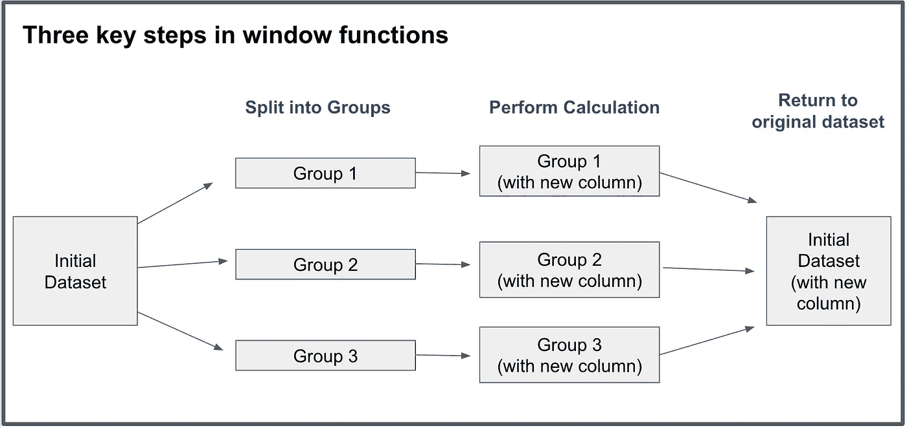

作者图片

# 三个例子来统治他们

演示窗口函数用途的最好方法是通过例子来完成。一旦你能激发对窗口函数的需求，编写它们就变得相当简单了。

下面，我们将使用一个包含世界上所有主要城市的每日气温的 [Kaggle 数据集](https://www.kaggle.com/sudalairajkumar/daily-temperature-of-major-cities)来完成 3 个示例。

这是数据的一个快速峰值:

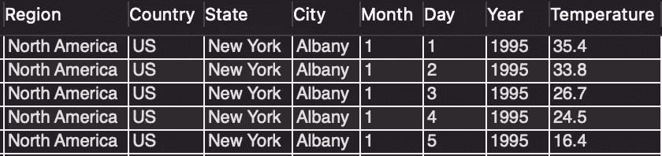

作者图片

## 示例 1:

假设我们有下面的问题陈述:**在整个数据集中找出每个城市最热的一天。**

在进入这个问题之前，有必要考察几个类似的问题，这些问题我们不用窗口函数也能轻松回答。

如果我们的任务是找出每个城市最热的温度，那就很简单了:

```
select city, max(temperature) as warmest_temp
from temperature_data.city_temperature
group by 1;
```

或者如果我们想找出总的 n 个最热的日子:

```
select *
from temperature_data.city_temperature
order by temperature desc
limit 10;
```

让我们的原始问题与众不同的是，它要求我们为数据中的特定组单独找出一条信息**，**但也要保留原始数据集中的信息。我们需要每个城市最热的一天**，我们需要分别计算。**

**如果你不清楚用例，我强烈建议在继续之前再读一遍上面的部分。**

**继续——让我们首先从概念上回答这个问题，使用上面概述的三个步骤:**

1.  ****将数据分组:**在这种情况下，我们希望按城市进行分组。**
2.  ****执行聚合:**一旦我们将数据分开，我们就可以按温度进行排序。**
3.  ****将数据重新组合在一起**:当我们将数据重新组合在一起时，每个原始记录将会有一列显示它与该城市所有其他日子相比的排名顺序。**

**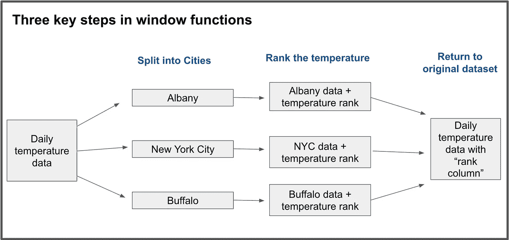**

**作者图片**

**现在我们有了一个概念性的理解，让我们把我们的查询放在 SQL 中:**

```
select *, row_number() over (partition by city order by temperature desc) as temperature_rank
from temperature_data.city_temperature
limit 5;
```

**下面是语法的分解:**

*   **“ **row_number** ”是我们应用于每个组的排名函数**
*   **“ **over()** ”是我们用来表示我们想要应用一个窗口函数的语法**
*   **“**partition by”**关键字是我们指定要按城市拆分的地方**
*   ****“order by”**帮助我们以某种方式对数据进行排序(在本例中是平均温度递减)**

**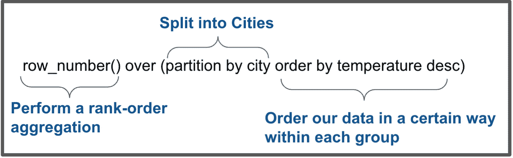**

**作者图片**

**下面是我们的输出结果:**

**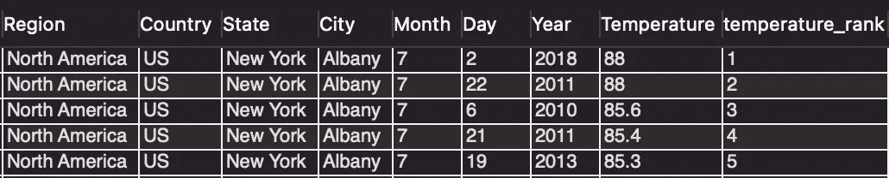**

**作者图片**

**请注意，现在每个记录都有一个温度等级列。**

**最后，我们可以添加一些逻辑，只提取温度排名第一的一天:**

```
select * from(select *, row_number() over (partition by city order by temperature desc) as temperature_rank
from temperature_data.city_temperature) subquerywhere temperature_rank = 1
limit 5;
```

**最终，我们得到了我们一直在寻找的结果——每个城市最热的一天。**

**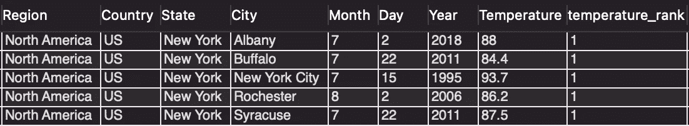**

**作者图片**

## **示例 2:**

****问题陈述:**对于每一天，求该城市当天的温度与当月平均温度之差。**

**例如，该查询可以帮助我们获得如下见解:**

***“2020 年 1 2 月 1 日，奥尔巴尼的气温比奥尔巴尼 12 月份的正常气温高 32 度”***

**让我们再次完成这三个步骤中的每一步:**

1.  ****将数据分组:**在这种情况下，我们需要按照城市和月份进行分组**
2.  ****执行聚合:**一旦我们将数据分开，我们就可以找到平均温度**
3.  ****将数据重新组合在一起**:当我们将数据重新组合在一起时，每个原始记录都会有一列显示该城市和月份的平均温度。从那里，很容易得到当天的温度和平均温度之间的差异。**

**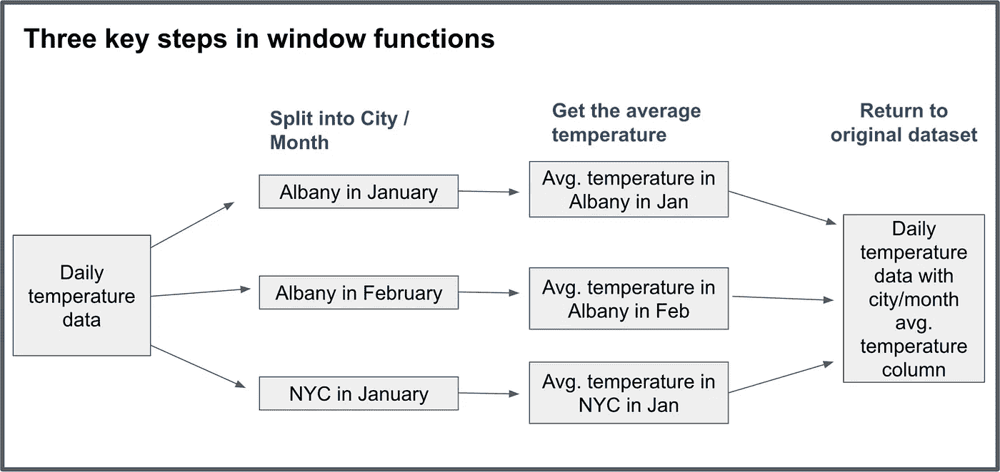**

**作者图片**

**我们的查询和输出可能是这样的:**

```
select *, avg(temperature) over (partition by city, month) as average_monthly_temperature
from temperature_data.city_temperature 
limit 5;
```

**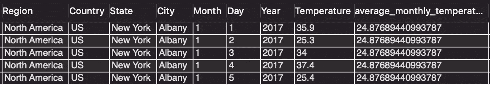**

**作者图片**

**最后，我们可以添加一个子查询并创建一个“与平均值的差异”列:**

```
select *, temperature - average_monthly_temperature as diff_from_avg
from (select *, avg(temperature) over (partition by city, month) as average_monthly_temperature
from temperature_data.city_temperature) subquery
```

**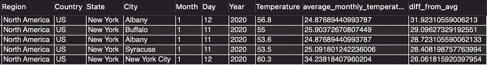**

**作者图片**

**有趣的是，在我们的第一个例子中，我们使用了一个名为“row_number”的排名函数，它为我们的城市组中的每一行返回一个值。**

**在我们的第二个例子中，我们使用了一个聚合函数 avg，它只为每个组产生一个值。**

**SQL 支持窗口函数中的两种类型的计算。如果函数的结果是单个值，则为原始数据集中组中的每条记录返回该值。**

**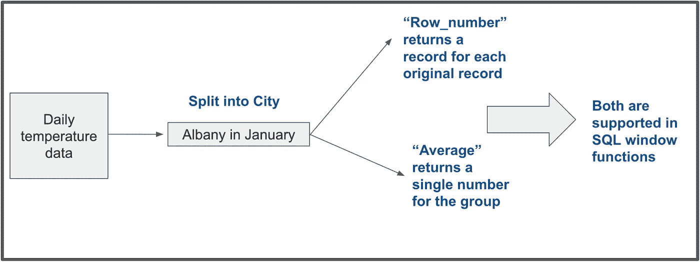**

**作者图片**

## **示例 3:**

**在我们的最后一个例子中，我们将为窗口函数引入一种新的语法——它允许我们不仅基于像“city”这样的列，而且基于数据中的位置来生成组。**

****问题陈述:**对于每条记录，找出该城市过去 5 天的平均温度。**

**为了说明这一点，让我们展示一下在奥尔巴尼的第六天我们可能会看到什么:**

**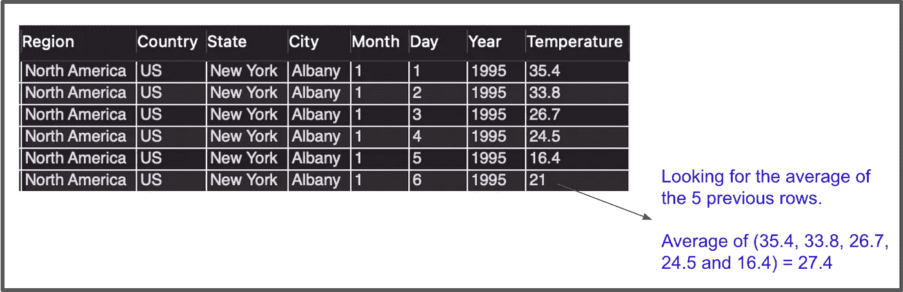**

**作者图片**

**为了回答这类问题，我们需要引入一个叫做“框架子句”的概念**

**frame 子句允许我们指定包含在窗口计算中的相对行。**

**我们可以使用以下语法来实现这一点，其中 boundary1 和 boundary2 是我们希望包含在计算中的位置:**

```
rows between boundary1 and boundary2
```

**我们可以用以下任何子句替换 boundary1 和 boundary2，以便指定我们想要的确切框架:**

**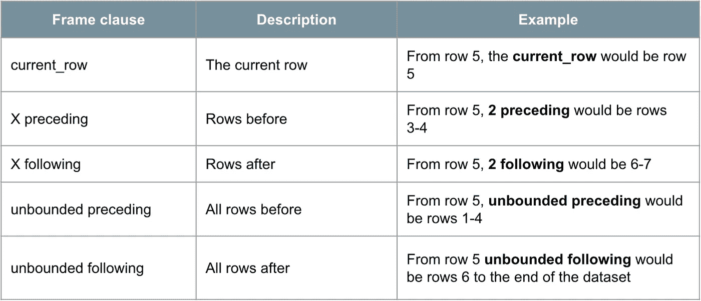**

**作者图片**

**在上面的例子中，我们希望只根据前面的 5 行来计算窗口。为了做到这一点，我们可以写:**

```
rows between 6 preceding and 1 preceding
```

**下面是最终的查询和输出:**

```
select *, avg(temperature) over (partition by city order by year, month, day rows between 6 preceding and 1 preceding) as temp_rolling_5
from temperature_data.city_temperature
limit 10;
```

**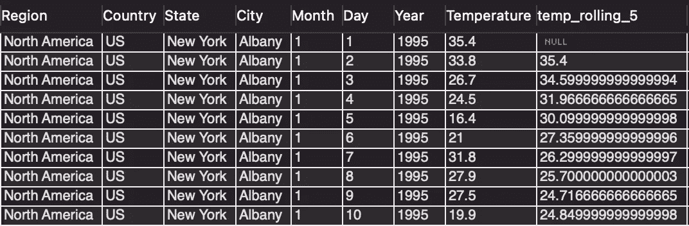**

**作者图片**

**以下是一些需要注意的事项:**

1.  **我们现在得到了第 6 行的预期值 27.4。您可以参考本例开头的图表来确认这就是我们所期望的。**
2.  **第 1-5 行是使用“尽可能多的数据”计算的从第 5 行的角度来看，我们想要返回 6 条记录，但是那里没有数据，所以 SQL 使用第一行作为范围的开始。**
3.  **滚动 5 的计算是由城市完成的**，因为我们在“partition by”子句中包含了城市。这是一个强有力的例子，因为它表明我们可以在一个非常可定制的数据区域上执行窗口函数计算。****

# **常见错误**

**下面是一些可能导致调试困难的常见错误:**

1.  ****错别字**:确保你拼写正确！像“partition”这样的单词很容易拼错**
2.  ****不需要的逗号**:在“partition by”和“order by”之间或者“order by”和“rows between”之间放一个逗号可能比较合理，但是为了运行查询，必须将它们排除在外。**
3.  **将它们放在 where 子句中:不幸的是，在 where 子句中不能使用窗口函数。但是很容易进行子查询或使用 cte 将逻辑放在计算列的顶部，就像我们在上面的示例 1–2 中所做的那样。**

# **我想我明白了，但是我怎样才能得到更多的练习呢？**

**获得更多实践的一个简单方法是自己完成上面的三个例子。为此，我建议:**

1.  **点击从 Kaggle [下载免费数据集](https://www.kaggle.com/sudalairajkumar/daily-temperature-of-major-cities)**
2.  **上传到 SQL 数据库。如果您还没有设置，您可以在下面找到我的指南，了解如何快速有效地设置:**

**[](/4-steps-to-start-practicing-sql-at-home-cb771beeca20) [## 在家开始练习 SQL 的 4 个步骤

### 下载 MySQL 自己做

towardsdatascience.com](/4-steps-to-start-practicing-sql-at-home-cb771beeca20) 

3.试着自己回答上面的问题，确保你的结果与我的相符，有意义(注意:我在分析中去掉了所有-99 的温度值)

4.自己写问题给自己回答！没有什么比提出你自己的研究问题更好的了，因为它能帮助你内化“什么时候”和“为什么”你会使用这些功能。

**如果您认为本文有帮助，请:**

1.  对您希望我接下来撰写的 SQL 或数据科学主题发表评论，然后
2.  ***订阅我的*** [***免费邮箱列表***](https://subscribe.to/everythingdata)

你也可以在下面找到我的熊猫视窗功能指南:

[](/ultimate-pandas-guide-window-functions-f527f64fd550) [## 熊猫终极指南——窗口功能

### 窗口函数是一种有效的方法，可以更好地了解我们的…

towardsdatascience.com](/ultimate-pandas-guide-window-functions-f527f64fd550) [](/ultimate-pandas-guide-time-series-window-functions-a5362b782f3e) [## 终极熊猫指南:时间序列窗口函数

### 掌握时间序列分析的“移位”、“滚动”和“扩展”

towardsdatascience.com](/ultimate-pandas-guide-time-series-window-functions-a5362b782f3e)**