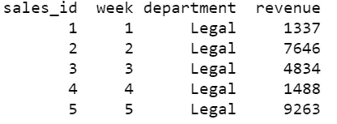
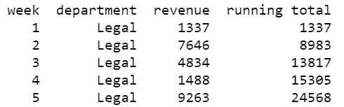
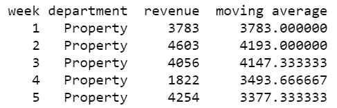

# 掌握 SQL 中的 OVER 子句

> 原文：<https://towardsdatascience.com/mastering-the-over-clause-in-sql-ff783fe91914?source=collection_archive---------10----------------------->

## 对数据行的迭代


茱莉亚·萨比尼亚兹在 [Unsplash](https://unsplash.com?utm_source=medium&utm_medium=referral) 上的照片

随着对它们需求的增长，更多的数据库集成了[窗口函数](https://en.wikipedia.org/wiki/Window_function_(SQL))来对数据子集进行计算。使用与[滑动窗口技术](https://www.geeksforgeeks.org/window-sliding-technique/)相同的原理，窗口函数计算单个数据点与数据集的其余部分或其中的一部分相比如何。

在统计学中，移动窗口最著名的应用之一是[移动平均](https://en.wikipedia.org/wiki/Moving_average)，也称为滚动平均。在财务和会计中，一个[运行总数](https://en.wikipedia.org/wiki/Running_total)也是窗口函数的一个非常常见的例子。

随着使用窗口功能的需求增长，许多数据库开始在子句上集成[，这允许用户执行这些操作以及其他操作。现在，OVER 子句已被微软程序、开源数据库(如 MySQL 和 Google 的 BigQuery)所采用，并已成为数据专业人员的必备工具。](https://docs.microsoft.com/en-us/sql/t-sql/queries/select-over-clause-transact-sql?view=sql-server-ver15)

# 对运行总计使用 OVER 子句

财务和会计专业人员在审阅财务信息时喜欢使用累计。在许多情况下，他们可能会使用 Excel 的内置函数来创建累计，但使用 SQL 通常可以节省一些时间，尤其是对于较大的数据集。

为了演示如何使用 SQL 创建一个运行总数，我们将使用一个示例数据库，其中包括一个销售 ID、周数、部门和应计收入。

```
CREATE TABLE SALES_2021(
sales_id INTEGER PRIMARY KEY AUTOINCREMENT,
week INTEGER,
department VARCHAR(255),
revenue INTEGER);
```



表格的前五个条目

随着时间的推移，利益相关者可能会自然地要求获得总收入。

```
SELECT week, department, revenue, SUM(revenue) 
OVER(PARTITION BY department ORDER BY week)
FROM SALES_2021;
```

SELECT 子句选择表示为正常的列以及收入的 SUM 函数。OVER 子句表示按部门对结果进行划分，这确保了对每个部门的累计重新开始，而不是对所有部门的总和进行累计。over 子句还指定按周对结果进行排序，以便它们保持时间顺序。

为了便于阅读，添加了一个别名，将列重命名为“运行总计”。



法律部前五周的总收入

# 对移动平均线使用 OVER 子句

数据分析师可能希望查看移动平均线，以粗略预测未来收入。与普通平均值不同的是，移动平均值只考虑子集而不是整个数据集，它通常用于时间序列数据，通常使用一个间隔，如最近几天、几周、几个月、几个季度或几年。根据定义，这提供了一个窗口函数的强大例子。

为了说明 SQL 如何自动生成这个统计数据，可以编写一个最近三周的查询平均值。

```
SELECT week, department, revenue, AVG(revenue) 
OVER(ORDER BY week ROWS BETWEEN 2 PRECEDING AND CURRENT ROW) 
AS 'moving average' 
FROM SALES_2021 
WHERE department = 'Property';
```

第一行的内容与前面的例子几乎相同，只是现在采用的是收入的平均值而不是总和。OVER 子句再次使用 ORDER BY 语句来按时间顺序保存周。它还详细描述了哪些行要进行移动平均。由于本例说明了过去 3 周的情况，因此取当前行和前面 2 行的平均值。

再次添加一个别名，将该列标记为“移动平均值”,以提高可读性。

请注意，添加了一个额外的 WHERE 子句，以确保只使用来自财产部门的收入。如果省略，移动平均数将包括所有部门的数字。为了将它们分开，也可以在 OVER 子句中使用 PARTITION BY 子句，与前面的示例非常相似。



物业部首五个星期的流动平均数

# 使用 OVER 子句进行排序

最后，让我们假设一个利益相关者要求对每周的收入进行排名。他们可能想回顾自己表现最好和最差的几周，以确定是什么影响了他们的表现。

```
SELECT week, department, revenue, RANK() 
OVER(ORDER BY revenue DESC) AS 'rank' 
FROM SALES_2021 
WHERE department = 'Management';
```

SELECT 子句包含不带任何参数的 RANK 函数。OVER 子句 simple 包含一个 ORDER BY 函数，指示将根据收入对行进行排序。请注意 WHERE 子句，该子句仅指示来自管理部门的结果。如果没有它，OVER 子句中将需要一个额外的 PARTITION BY 语句。


表现最好的前五周

请注意，即使两个值相等，RANK 函数也会分配一个序列号。例如，如果第 20 周和第 30 周都筹集了 10，000 美元的收入，则第 20 周为第一，第 30 周为第二。

为了允许值之间的联系，DENSE_RANK 函数可以在查询中同样使用:

```
SELECT week, department, revenue, DENSE_RANK() 
OVER(ORDER BY revenue DESC) AS 'rank' 
FROM SALES_2021 
WHERE department = 'Management';
```

在这种情况下，第 20 周和第 30 周都将获得排名为$10，000 的第一名；然而，该排名将跳过第二名，授予下一个最高周第三名，类似于奥运会在比赛中处理平局的方式。

# 结论

OVER 子句提供了一种对数据实现窗口函数的便捷方式。在普通函数中使用，如运行总计和移动平均，它也可以用于迭代任意数量的数据转换的数据子部分。