# 掌握 sci kit-学习库

> 原文：<https://towardsdatascience.com/mastering-the-scikit-learn-library-843b5641e9cc?source=collection_archive---------28----------------------->

## 使用 Python 机器学习库


照片由[爆发](https://www.pexels.com/@burst)在[像素](https://www.pexels.com/photo/man-using-ballpoint-pen-374820/)上拍摄

Scikit-learn 是一个强大的机器学习库，它提供了各种各样的数据访问、数据准备和统计模型构建模块。它有一个很好的干净的玩具数据集选择，非常适合刚刚开始数据分析和机器学习的人。轻松访问这些数据集消除了从外部数据源搜索和下载文件的麻烦。该图书馆还支持数据处理任务，如插补、数据标准化和数据标准化。这些任务通常可以显著提高模型性能。

Scikit-learn 还提供了各种用于构建线性模型、基于树的模型、聚类模型等的包。它为每种模型对象类型提供了一个易于使用的接口，这有助于快速原型化和模型实验。机器学习的初学者也会发现这个库很有用，因为每个模型对象都配备了提供基线性能的默认参数。总的来说，Scikit-learn 提供了许多易于使用的模块和方法，用于访问和处理数据以及在 Python 中构建机器学习模型。本教程将介绍它的一些功能。

**Scikit-learn 数据集**

Scikit-learn 提供了各种各样的玩具数据集。玩具数据集是一个简单、干净、有时是虚构的数据集，可用于探索性数据分析和构建简单的预测模型。scikit-learn 中可用的玩具数据集可应用于监督学习任务，如回归和分类任务。例如，它有一个名为鸢尾数据的集合，其中包含与不同类型的鸢尾植物相对应的信息。用户可以利用这些数据建立、训练和测试分类模型，这些模型可以根据鸢尾属植物的特征对它们进行分类。

Scikit-learn 还有一个波士顿住房数据集，其中包含波士顿的房价信息。这些数据对于回归任务非常有用，比如预测房子的美元价值。最后，手写数字数据集是一个非常适合建立图像分类模型的图像数据集。使用几行简单的 Python 代码就可以轻松加载所有这些数据集。

首先，让我们看一下如何加载*虹膜数据*。我们首先需要导入熊猫和 numpy 包:

```
import pandas as pd
import numpy as np
```

接下来，我们放宽列和行的显示限制:

```
pd.set_option('display.max_columns', None)
pd.set_option('display.max_rows', None)
```

然后，我们从 scikit-learn 加载*虹膜数据*，并将其存储在 pandas 数据框中:

```
from sklearn.datasets import load_iris
data = load_iris()
df = pd.DataFrame(data.data,columns=data.feature_names)
df[‘target’] = pd.Series(data.target)
```

最后，我们使用 head()方法打印前五行数据:

```
print(df.head())
```

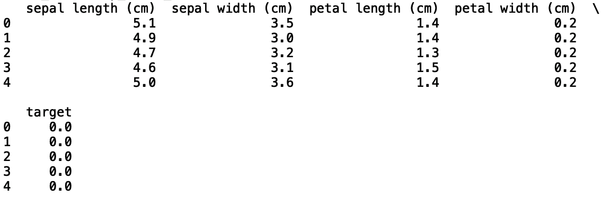

我们可以对波士顿住房数据集重复这个过程。为此，让我们将现有代码封装在一个函数中，该函数将 scikit-learn 数据集作为输入:

```
def get_data(dataset):
    data = dataset
    df = pd.DataFrame(data.data,columns=data.feature_names)
    df['target'] = pd.Series(data.target)
    print(df.head())
```

我们可以用虹膜数据调用这个函数，得到和以前一样的输出:

```
get_data(load_iris())
```


现在我们看到我们的函数工作了，让我们导入*波士顿住房数据*并用数据调用我们的函数:

```
from sklearn.datasets import load_iris, load_boston
get_data(load_boston())
```

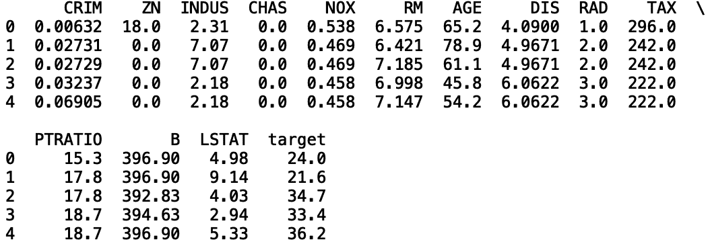

最后，让我们加载手写数字数据集，它包含从 0 到 9 的手写数字的图像。由于这是一个图像数据集，因此将其存储在数据框中没有必要也没有用。相反，我们可以使用可视化库 matplotlib 显示数据中的前五位数字:

```
from sklearn.datasets import load_iris, load_boston, load_digitsimport matplotlib.pyplot as pltdef get_data(dataset):
    try:
        data = dataset
        df = pd.DataFrame(data.data,columns=data.feature_names)
        df['target'] = pd.Series(data.target)
        print(df.head())
    except(AttributeError):
        data = dataset
        plt.gray()
    for i in range(0,5):
        plt.matshow(data.images[i])
        plt.show()
```

如果我们用 load_digits()调用我们的函数，我们会得到下面显示的图像:

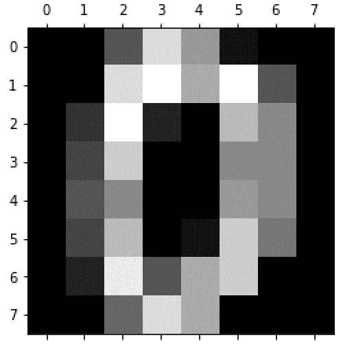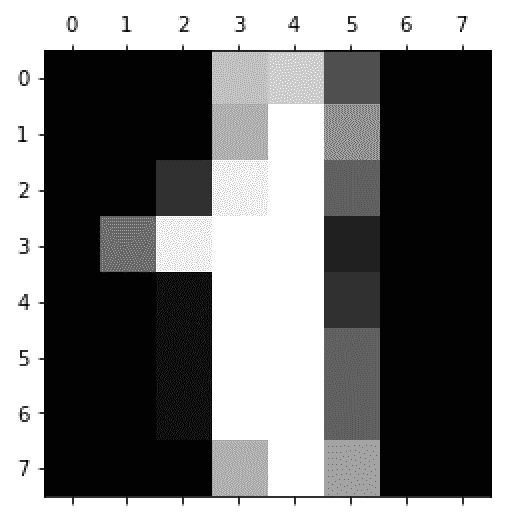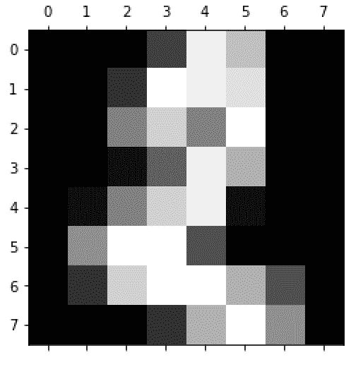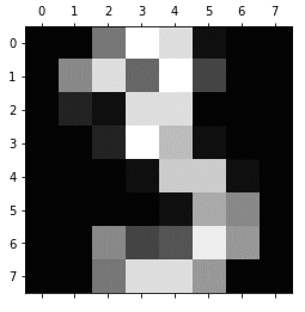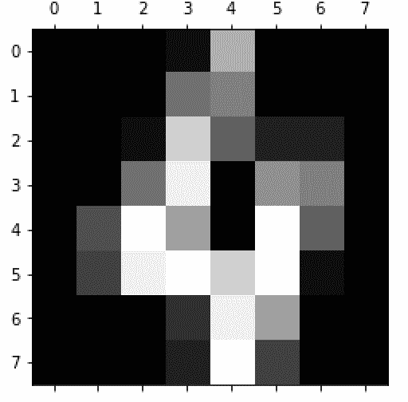

该领域的初学者访问这些玩具数据集的容易程度不能被夸大。这些数据使初学者能够快速接触不同类型的数据和用例，如回归、分类和图像识别。

**数据插补**

Scikit-learn 还为数据处理任务提供了多种方法。首先，让我们看看数据插补，这是一个替换缺失数据的过程，非常重要，因为真实数据经常包含不准确或缺失的元素。这可能导致误导的结果和较差的模型性能。

能够准确估算缺失值是数据科学家和行业领域专家都应该具备的技能。为了演示如何使用 scikit-learn 执行数据插补，我们将使用加州大学欧文分校关于住房电力消耗的数据集，可在此处获得。由于数据集非常大，为简单起见，我们将随机抽取 40，000 条记录，并将向下采样的数据存储在一个名为“hpc.csv”的单独 csv 文件中:

```
df = pd.read_csv('household_power_consumption.txt', sep=';')
df = df.sample(40000)
df.to_csv('hpc.csv')
```

接下来，让我们读入新创建的数据集并打印前五行:

```
df = pd.read_csv('hpc.csv')
print(df.head())
```

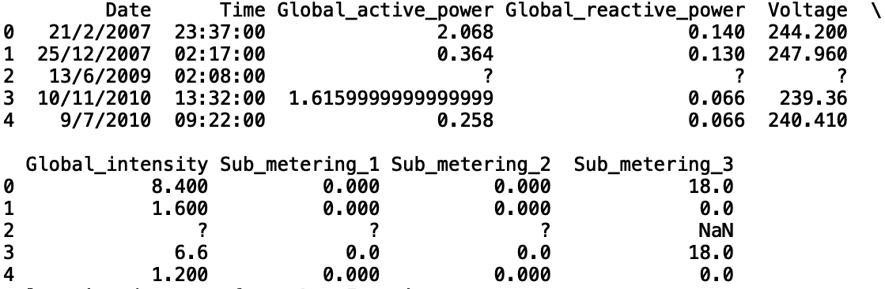

正如我们所看到的，第三行(第二个索引)包含由？还有南。我们能做的第一件事是替换？具有 NaN 值的值。让我们用 Global_active_power 来证明这一点:

```
df['Global_active_power'].replace('?', np.nan, inplace = True)
print(df.head())
```

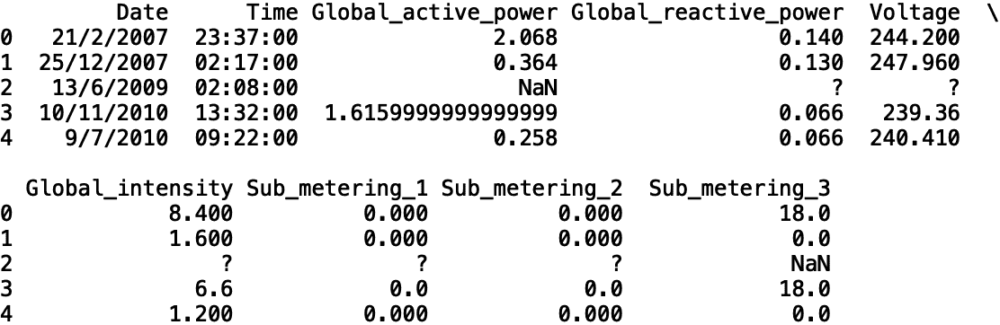

我们可以对其余的列重复这一过程:

```
df['Global_reactive_power'].replace('?', np.nan, inplace = True)
df['Voltage'].replace('?', np.nan, inplace = True)
df['Global_intensity'].replace('?', np.nan, inplace = True)
df['Sub_metering_1'].replace('?', np.nan, inplace = True)
df['Sub_metering_2'].replace('?', np.nan, inplace = True)
```

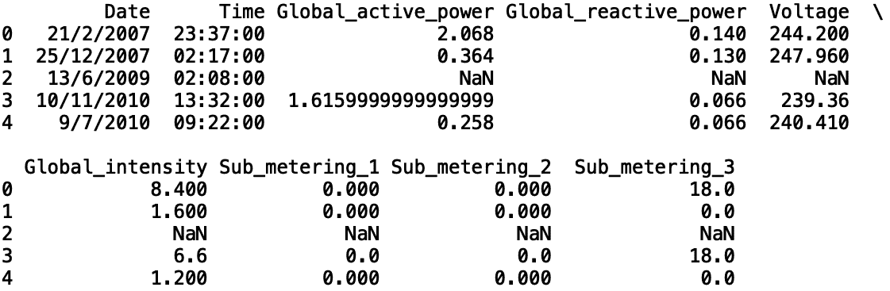

现在，为了估算丢失的值，我们从 scikit-learn 导入 SimpleImputer 方法。我们将定义一个简单估算缺失值平均值的估算对象:

```
from sklearn.impute import SimpleImputer
imp_mean = SimpleImputer(missing_values=np.nan, strategy='mean')
```

我们可以用缺失值来拟合我们的估算值:

```
X = df[['Global_active_power', 'Global_reactive_power', 'Voltage', 'Global_intensity', 'Sub_metering_1', 'Sub_metering_2' ]]
imp_mean.fit(X)
```

将结果存储在数据框中:

```
df_new = pd.DataFrame(imp_mean.transform(X), columns = ['Global_active_power', 'Global_reactive_power', 'Voltage', 'Global_intensity', 'Sub_metering_1', 'Sub_metering_2' ])
```

添加额外的日期和时间列:

```
df_new['Date'] = df['Date']
df_new['Time'] = df['Time']
```

并打印新数据框的前五行:

```
print(df_new.head())
```

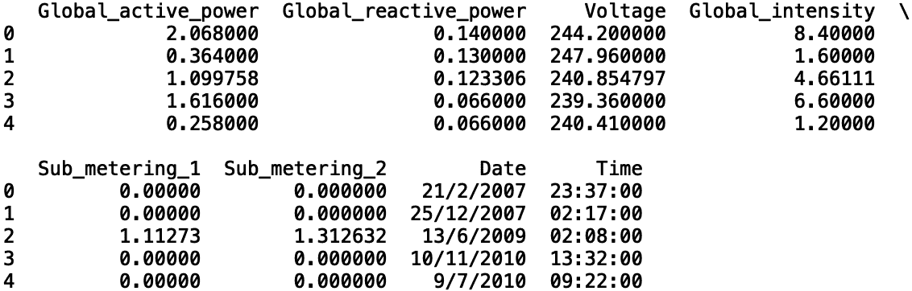

正如我们所看到的，丢失的值已经被替换。虽然 scikit-learn 的 SimpleImputer 不是最复杂的估算方法，但它消除了构建自定义估算器的许多麻烦。这种简单性对于第一次处理缺失数据的初学者很有用。此外，它还很好地展示了插补的工作原理。通过引入这一过程，它可以促进这类插补的更复杂的扩展，例如使用统计模型来替换缺失值。

**数据标准化&规范化**

使用 scikit-learn，数据标准化和规范化也很容易。这两者在机器学习方法中都很有用，包括计算距离度量，如*K*-最近邻和支持向量机。在我们可以假设数据呈正态分布的情况下，以及在线性模型中解释系数具有可变重要性的情况下，它们也很有用。

**标准化**

标准化是用平均值减去数字列中的值并换算成单位方差(通过除以标准偏差)的过程。在大范围的数值可能人为地支配预测结果的情况下，标准化是必要的。

让我们考虑标准化功耗数据集*中的 Global_intensity。*该列的值范围从 0.2 到 36。首先，让我们从 scikit-learn 导入 StandardScalar()方法:

```
scaler = StandardScaler()
scaler.fit(np.array(df_new[['Global_intensity']]))
df_new['Global_intensity'] = scaler.transform(np.array(df_new[['Global_intensity']]))
```

现在我们看到最小值和最大值分别为 7.6 和-1.0:

```
print(df_new.head())
print("Max: ", df_new['Global_intensity'].max())
print("Min: ", df_new['Global_intensity'].min())
```

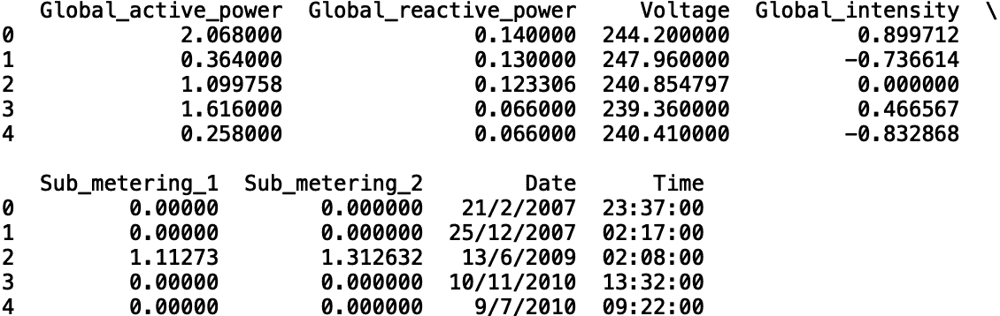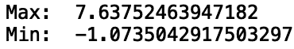

**正常化**

数据规范化对数字列进行缩放，使其值介于 0 和 1 之间。使用 scikit-learn 标准化数据遵循与标准化相似的逻辑。让我们将规格化方法应用于 Sub_metering_2 列:

```
from sklearn.preprocessing import Normalizer
normalizer = Normalizer()
normalizer.fit(np.array(df_new[['Sub_metering_2']]))
df_new['Sub_metering_2'] = normalizer.transform(np.array(df_new[['Sub_metering_2']]))
print(df_new.head())
print("Max: ", df_new['Sub_metering_2'].max())
print("Min: ", df_new['Sub_metering_2'].min())
```

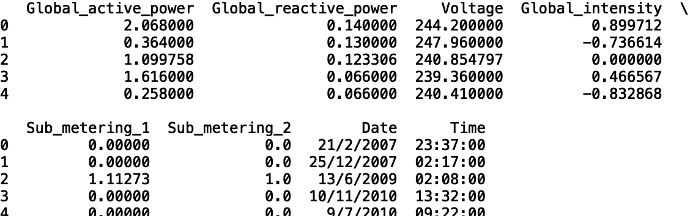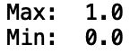

现在我们看到最小值和最大值分别为 1.0 和 0。一般来说，如果您可以安全地假设数据是正态分布的，那么您应该将数据标准化。相反，如果您可以安全地假设您的数据不是正态分布的，那么规范化是一个缩放数据的好方法。考虑到这些转换只需几行代码就可以应用于数字数据，StandardScaler()和 Normalizer()方法对于处理值变化很大的数据字段或非正态分布数据的初学者来说是很好的选择。

**使用 Scikit-Learn 进行统计建模**

Scikit-learn 还拥有构建各种统计模型的方法，包括线性回归、逻辑回归和随机森林。线性回归用于回归任务。具体来说，它适用于预测连续输出，例如房价。逻辑回归用于分类任务，其中模型预测二进制输出或多类，如基于特征预测鸢尾植物类型。随机森林可用于回归和分类。我们将介绍如何使用 Python 中的 scikit-learn 机器学习库来实现这些模型。

**线性回归**

线性回归是一种统计建模方法，其中线性函数表示输入变量和标量响应变量之间的关系。为了演示它在 Python 中的实现，让我们考虑波士顿住房数据集。我们可以建立一个线性回归模型，使用年龄作为预测住房价值的输入。首先，让我们定义输入和输出变量:

```
X = df_housing[['AGE']]
y = df_housing[['target']]
```

接下来，让我们将数据分为训练和测试两部分:

```
from sklearn.model_selection import train_test_split
X_train, y_train, X_test, y_test = train_test_split(X, y, random_state = 42)
```

现在让我们从 scikit-learn 导入线性回归模块:

```
from sklearn.linear_models import LinearRegression
```

最后，让我们使用 R 和 RMSE 来训练、测试和评估我们的模型的性能:

```
linear_model = LinearRegression()
linear_model.fit(X_train, y_train)
y_pred = linear_model.predict(X_test)from sklearn.metrics import mean_squared_error
from sklearn.metrics import r2_scorerms = mean_squared_error(y_test, y_pred)
r2 = r2_score(y_test, y_pred)
print("MSE:”, rms)
print("R^2:", r2)
```

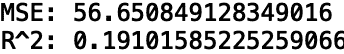

因为我们使用一个变量来预测反应，这是一个简单的线性回归。但是我们也可以在多元线性回归中使用多个变量。让我们用年龄(age)、平均房间数(RM)、生师比(PTRATION)建立一个线性回归模型。我们需要做的就是重新定义 X(输入)如下:

```
X = df_housing[['AGE', 'PTRATIO', 'RM']]
```

这带来了以下性能改进:

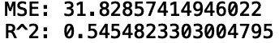

如果您确信输入和输出之间存在线性关系，线性回归是一种很好的方法。相对于随机森林和支持向量机等更复杂的方法，它也是一个有用的基准。

**逻辑回归**

逻辑回归是一种简单的分类模型，可以预测二元甚至多类输出。训练和测试的逻辑类似于线性回归。

让我们考虑一下逻辑回归模型的 Python 实现的 iris 数据。我们将使用萼片长度(cm)、萼片宽度(cm)、花瓣长度(cm)和花瓣宽度(cm)来预测鸢尾属植物的类型:

```
df_iris= get_data(load_iris())X = df_iris[['sepal length (cm)', 'sepal width (cm) ', 'petal length (cm)', 'petal width (cm)']]
y = df_iris[['target']]X_train, X_test, y_train, y_test = train_test_split(X, y, random_state = 42)logistic_model = LogisticRegression()
logistic_model.fit(X_train, y_train)
y_pred = linear_model.predict(X_test)
```

我们可以使用混淆矩阵来评估和可视化模型性能:

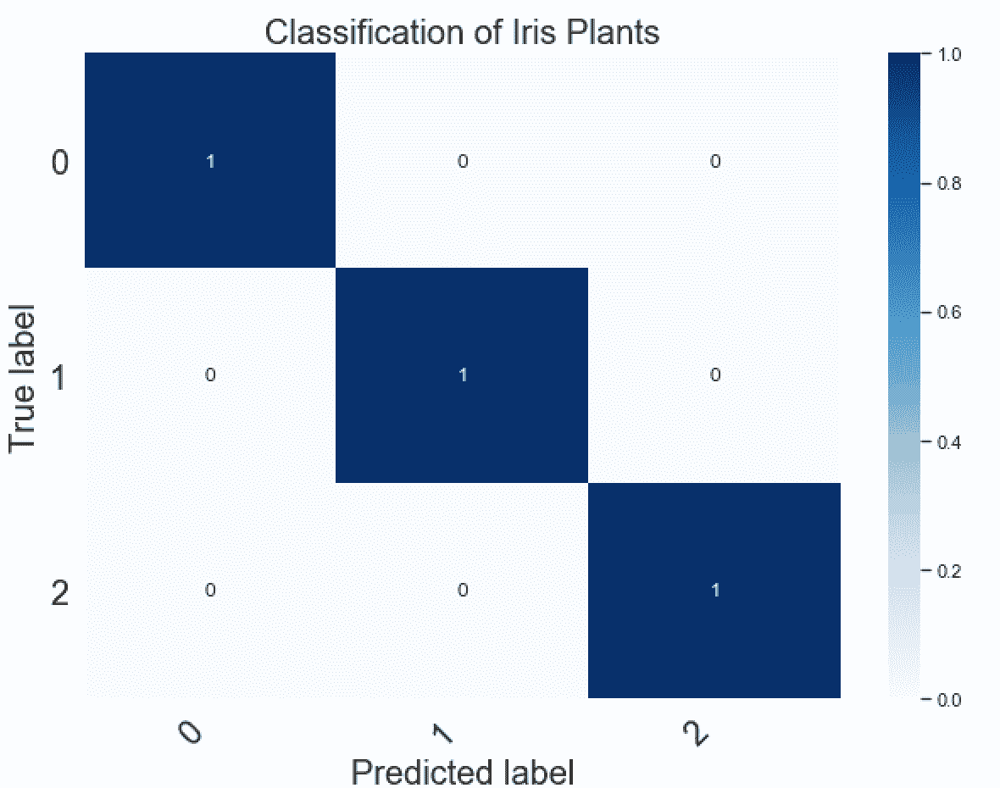

我们看到，该模型正确地捕捉了三个鸢尾植物类别的所有真阳性。与线性回归类似，逻辑回归依赖于用于预测每个类别的输入的线性和。因此，逻辑回归模型被称为广义线性模型。考虑到逻辑回归对输入和输出之间的线性关系进行建模，当您知道输入和类成员之间存在线性关系时，最好使用逻辑回归。

**随机森林**

随机森林，也称为随机决策树，是用于分类和回归任务的统计模型。随机森林基本上是一组关于以树状结构组织的数据的问题和答案。

这些问题将数据分成子组，以便每个连续子组中的数据彼此最相似。例如，假设我们想要预测借款人是否会拖欠贷款。我们可以使用历史贷款数据提出的一个问题是，客户的信用评分是否低于 700。与落入“否”桶的数据相比，落入“是”桶的数据将有更多的客户违约。

在 yes 桶中，我们可以进一步询问借款人的收入是否低于 30，000 美元。据推测，这里的“是”桶将有更大比例的客户违约。决策树继续询问关于数据的统计问题，直到在对应于违约者和未违约者的数据之间实现最大分离。

随机森林通过构建大量决策树来扩展决策树。在每一棵树上，我们都会问一些关于随机数据块和不同数据特征的统计问题。例如，一棵树可能会询问一部分训练数据的年龄和信用评分。另一个人可能会在培训数据的单独部分询问收入和性别，等等。随机森林然后在这些决策树中执行一致投票，并使用多数投票进行最终预测。

为回归和分类实现随机森林模型非常简单，与我们为线性回归和逻辑回归所经历的步骤非常相似。让我们考虑使用波士顿住房数据预测房价的回归任务。我们需要做的就是导入随机森林回归器模块，启动回归器对象，拟合、测试和评估我们的模型:

```
from sklearn.ensemble import RandomForestRegressorrf_reg = RandomForestRegressor()
rf_reg.fit(X_train, y_train)
y_pred = rf_reg.predict(X_test)from sklearn.metrics import mean_squared_error
from sklearn.metrics import r2_scorerms = mean_squared_error(y_test, y_pred)
r2 = r2_score(y_test, y_pred)print("RF MSE: ", rms)
print("RF R^2: ", r2)
```

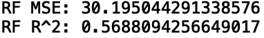

与线性回归相比，我们看到性能略有提高。

随机森林对象接受几个参数，可以修改这些参数以提高性能。这里我要指出的三个是 n 估计量、最大深度和随机状态。您可以查看[文档](https://scikit-learn.org/stable/modules/generated/sklearn.ensemble.RandomForestClassifier.html)以获得所有随机森林参数的完整描述。

参数 n_estimators 就是组成随机森林的决策树的数量。Max_depth 测量从第一个问题到树的底部的一个问题的最长路径。Random_state 是算法随机选择数据块进行提问的方式。

由于我们没有为这些参数指定任何值，随机森林模块会自动为每个参数选择一个默认值。n_estimators 的默认值是 10，相当于 10 棵决策树。max_depth 的默认值是 None，这意味着从第一个问题到决策树底部最后一个问题的路径长度没有截止。这可以大致理解为我们对数据提问次数的限制。random_state 的默认值是 None。这意味着，在每次模型运行时，将随机选择不同的数据块，并用于在随机森林中构建决策树。这将导致输出和性能的轻微变化。

尽管使用了默认值，我们还是获得了相当好的性能。这种准确性展示了随机森林的强大功能，以及数据科学初学者可以轻松实现准确的随机森林模型。

让我们看看如何指定 n_estimators，max_depth 和 random_state。我们将选择 100 个估计值，最大深度为 10，随机状态为 42:

```
rf_reg = RandomForestRegressor(n_estimators= 100, max_depth=10, random_state =42)
```

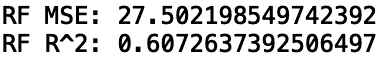

我们看到，我们在 MSE 和 R 上都有轻微的改进。此外，指定 random_state 使我们的结果可重复，因为它确保了使用相同的随机数据块来构建决策树。

将随机森林模型应用于分类任务非常简单。让我们为虹膜分类任务这样做:

```
rf_cass = RandomForestClassifier(n_estimators= 100, max_depth=10, random_state =42)
rf_cass.fit(X_train, y_train)
y_pred = rf_cass.predict(X_test)
```

相应的混淆矩阵也同样准确:

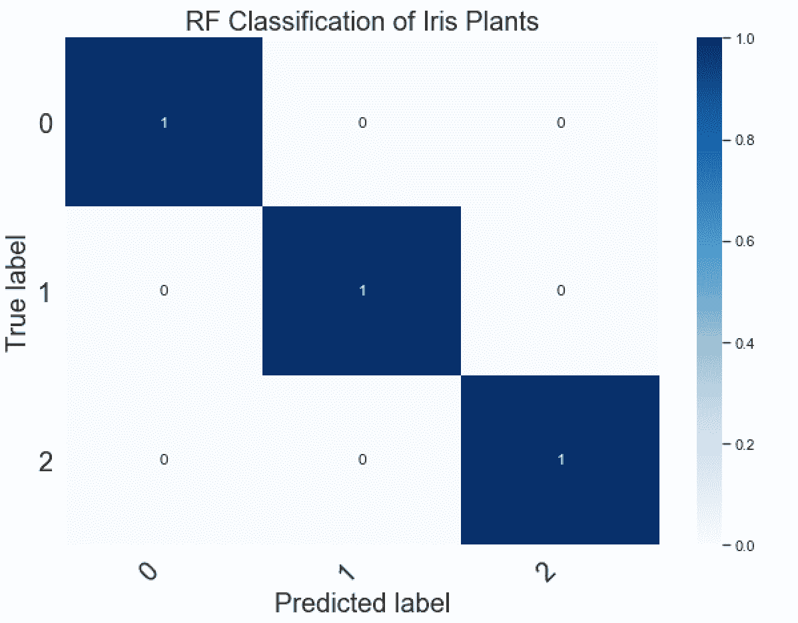

随机森林是构建统计模型的绝佳选择，因为它们可应用于广泛的预测用例。这包括分类、回归甚至无监督聚类任务。这是一个非常棒的工具，每个数据科学家都应该随身携带。在 scikit-learn 的上下文中，它们非常容易实现和修改以提高性能。这使得模型的快速原型和实验能够更快地得到准确的结果。

最后，这篇文章中的所有代码都可以在 [GitHub](https://github.com/spierre91/medium_code/blob/master/builtin_code/sklearn_tutorial.py) 上找到。

**结论**

总的来说，scikit-learn 提供了许多易于使用的工具，用于访问基准数据、执行数据处理以及培训、测试和评估机器学习模型。所有这些任务都需要相对较少的代码行，这使得数据科学和机器学习研究的初学者的入门门槛相当低。用户可以快速访问玩具数据集，并熟悉不同的机器学习用例(分类、回归、聚类)，而无需寻找数据源、下载然后清理数据的麻烦。在熟悉不同的用例后，用户可以轻松地将他们所学的移植到更真实的应用程序中。

此外，不熟悉数据插补的新数据科学家可以快速学会如何使用 scikit 中的 SimpleImputer 包——学习并实施一些标准方法来替换数据中的缺失值或错误值。这可以作为学习更先进的数据插补方法的基础，例如使用统计模型预测缺失值。此外，标准的定标器和规格化器方法使得神经网络和支持向量机等高级模型的数据准备非常简单。为了在支持向量机和神经网络等更复杂的模型中获得令人满意的性能，这通常是必要的。

最后，scikit-learn 使得构建各种各样的机器学习模型变得非常容易。虽然我在这篇文章中只讨论了三个，但是构建其他广泛使用的模型(如支持向量机和 k 近邻)的逻辑非常相似。它也非常适合对这些算法如何工作了解有限的初学者，因为每个模型对象都有默认的参数来提供基线性能。无论任务是用玩具数据进行模型基准标记、准备/清理数据还是评估模型性能，scikit-learn 都是为各种用例构建机器学习模型的绝佳工具。如果你有兴趣学习 python 编程的基础知识、Pandas 的数据操作以及 python 中的机器学习，请查看[*Python for Data Science and Machine Learning:Python 编程、Pandas 和 sci kit-初学者学习教程*](https://www.amazon.com/dp/B08N38XW2Q/ref=sr_1_1?dchild=1&keywords=sadrach+python&qid=1604966500&s=books&sr=1-1) *。我希望你觉得这篇文章有用/有趣。*

***本帖原载于*** [***内置博客***](https://builtin.com/machine-learning) ***。原片可以在这里找到***<https://builtin.com/machine-learning/scikit-learn-guide>****。****