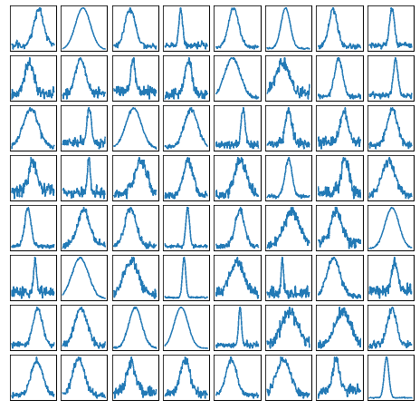
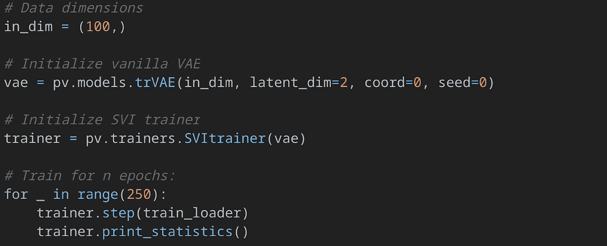
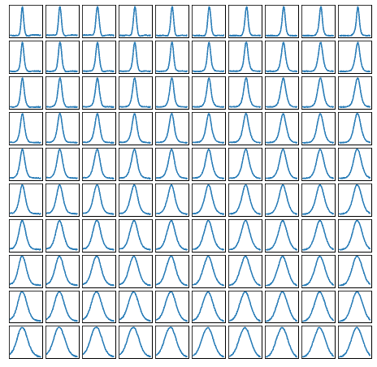
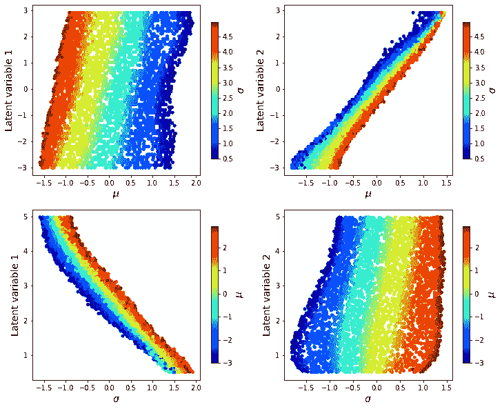
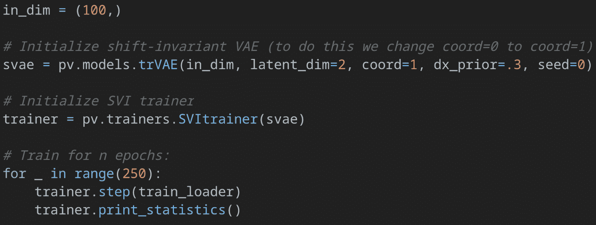
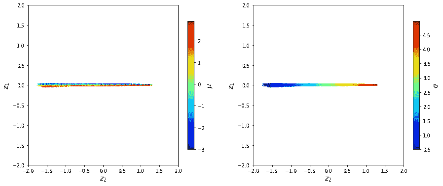
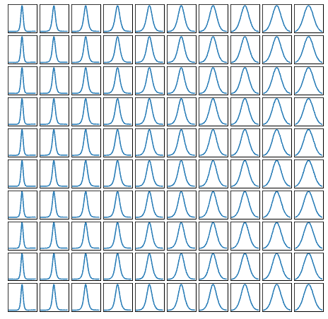
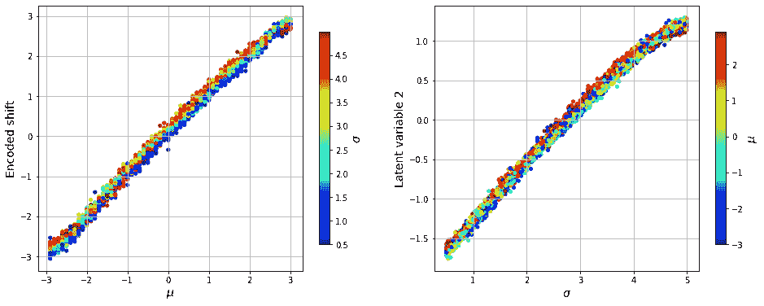

# 用可变自动编码器控制移位

> 原文：<https://towardsdatascience.com/mastering-the-shifts-with-variational-autoencoders-ca609ec84f1?source=collection_archive---------31----------------------->

## [思想和理论](https://towardsdatascience.com/tagged/thoughts-and-theory)

## 变分自动编码器如何用于分析一维信号

*马克西姆·兹亚迪诺夫&谢尔盖·加里宁*

*美国田纳西州橡树岭橡树岭国家实验室纳米材料科学和计算科学与工程中心*

数据通常以一维信号的形式出现。这些可以是来自传感器或检测器的时间序列记录，这些传感器或检测器测量气象学中的温度、湿度和风速，个人健身追踪器中的心率，或者是由于物联网(IoT)设备和轻边缘计算(如 Arduino、Raspberry Pi 和 NVIDIA Jetson)的激增而变得普遍的更复杂的检测系统。即使没有任何专门的电子设备，最近的应用程序，如 Arduino Science Journal，也可以访问手机上的压力、磁场和加速度传感器，允许进行大量的家庭实验(“*如果我走上楼梯，压力会改变多少*？”、“*我跑步或者走路*时的加速度模式是怎样的？”).

在许多此类应用中，信号具有一些特征方面，无论是心跳节律、步行门、包含健身、健康信息的振动模式，还是我们想要发现的其他特征。如果信号的时间参考点是众所周知的，或者数据是周期性的，那么这种数据的分析是简单明了的。然而，事件和典型特征的精确定位通常是不可获得的，并且可以是我们旨在与它们的典型模式一起发现的东西。

类似的问题在科学领域比比皆是。一个简单的例子可以是 X 射线散射数据，其中对应于特定指数的峰可以随着固溶体中材料的摩尔体积而移动。另一个例子可以是质谱数据，其中峰值可以由于数据采集期间的表面充电而移动，拉曼光谱，其中峰值移动指示材料中的应变，等等。在许多情况下，这种数据可以在大的参数空间中获得，例如超光谱成像中的位置、组合库评估中的浓度或有源器件表征中的电压。问题是——机器学习能否帮助我们以无监督的方式处理和理解这些类型的数据？

对于合著者之一(S.V.K .)，对该领域的兴趣始于扫描探针显微镜( [SPM](https://en.wikipedia.org/wiki/Scanning_probe_microscopy) )中能带激发(BE)方法的引入。各种现有的 SPM 方法通常基于尖锐(有时是原子级尖锐)的探针和表面之间的相互作用。探针位于悬臂的末端，激光束从背面反射回来。探针的小位移导致检测器上激光束的大位移，从而允许检测微小的位移。实际上，小到几分之一纳米的位移都可以检测到。就相关力而言，对于数量级为~1 N/m 的弹簧常数，相应的力将是原子间力的数量级。因此得名原子力显微镜。

90 年代末，动态 SPM 方法被广泛引入[1，2]。在这些方法中，悬臂由施加到驱动悬臂的压电元件(间歇接触形貌成像、磁力显微镜)或直接施加到悬臂(开尔文探针力显微镜和静电力显微镜)的振荡信号激励。显微镜电子设备检测单一频率信号的振幅和相位(锁定检测，LIA)，或者通过跟踪由于针尖-表面相互作用引起的共振频率的变化(锁相环，PLL)。然而，LIA 和 PLL 都只检测单一频率的信号，使得系统在物理上欠定(即简谐振子有三个参数——幅度、谐振频率和品质因数)。恒定驱动力的假设在许多 SPM 方法中仅是近似正确的，导致虚假的信号变化和定量信息的缺乏，并且不适用于许多其他方法。

已经开发了带激发(BE)扫描探针显微镜来解决这个问题[3，4]。在这种方法中，原子力显微镜并行检测选定频带内的振幅/相位-频率共振曲线段(因此得名)。2D SPM 图像因此变成 3D，其中每个空间像素现在包含完整的频率相关响应曲线。然后，通过简单谐振子方程的拟合允许重构振幅、共振频率和品质因数图，从这些图中可以提取材料特性。然而，峰值形状可以(并且经常)不同于 SHO 形状。该峰形信息在分析中被忽略。作为一种可能的策略，我们可以利用反应的函数形式等形式的先验物理知识。，在最小平方拟合或贝叶斯推断[5]。然而，这种策略通常是耗时的，并且在许多情况下，分析解决方案是不可用的。

无监督机器学习来拯救！主成分分析(PCA)在 2007–2008 年的 BE 数据中的应用[6]开启了我们小组对 ML 方法的探索，这一探索仍在继续。然而，具有讽刺意味的是，PCA 对带激发数据的第一次应用表明，只有在图像内的峰值偏移很小并且噪声水平相对较高的少数情况下，才能获得有意义的结果。那么少量的 PCA 分量就足以代表数据，甚至可以用特定的物理机制来识别它们。对于共振频率变化较大或噪声水平较低的数据集，主成分分析产生大量成分[7]，其物理意义(甚至对探索性数据分析的有用性)尚不清楚。同样的命运降临到其他线性分解方法，如非负矩阵分解，贝叶斯线性分解[8]和其他[9]。

然而，现在我们可以清楚地表达我们对这种数据集的“理想”无监督 ML 方法的期望。它应该能够找到描述符或解开 1D 数据集的表示，忽略(或分离)峰的相对位置。这正是移位变分自动编码器(移位 VAE)的设计目的。

在移位 VAE 中，我们指定一个潜在变量来捕获关于光谱相对位置的信息，而其余的潜在变量“寻找”其他(而不是位置)变化因素，例如高度、宽度、峰间距离(如果不止一个峰)等。我们姑且称这个特殊的潜变量为“偏移潜变量”。我们首先创建一个 1D *x* 坐标网格，其长度等于光谱中的点数。我们的编码器将输入(光谱)映射到偏移潜变量和两个(或更多)常规潜变量。假设位置的移动是正态分布的，偏移潜在向量是从单位高斯分布中采样的。采样值用于移动我们的坐标网格，然后与传统的潜在变量连接，并传递到 VAE 解码器，以加强移动光谱之间的几何一致性。

现在，让我们试验一下移位 VAE，并将其与主成分分析/NMF 和常规 VAE 进行比较。作为第一步，我们可以生成一个由高斯型(或具有相同中心的高斯型和洛伦兹型的线性组合)形成的合成数据集。

这里，高斯曲线的中心和宽度存储为地面真实数据，而曲线本身形成了特征集。

*来自合成数据集的 64 条典型曲线。x 范围从(-12，12)开始变化，高斯中心均匀分布在(-3，3)上，宽度均匀分布在(0.5，5)上。(加性)噪声的幅度值在 0 和 0.1 之间均匀采样。图片由作者提供。*

在附带的笔记本中实现的简单 PCA 分析(参见本文末尾的链接)确实说明了表示这种数据集所需的组件数量很大，并且欢迎读者将组件的行为作为参数空间和噪声水平中数据分布的函数。

现在让我们应用简单的 VAE。为此，我们将使用我们的 [pyroVED](https://github.com/ziatdinovmax/pyroVED) 包，它构建在 Pyro 概率编程语言之上。使用 pyroVED(如 *pv* )，只需几行代码就可以训练 VAEs:

在这种情况下，VAE 通过两个潜在变量对数据集进行编码，经过训练的 VAE 模型的潜在空间中的数据点分布如下图所示。

*数据点在常规 VAE 的潜在空间。图片由作者提供。*

*投影到光谱空间的传统 VAE 学习到的潜在流形。*

成绩还不算太差！我们的数据点清楚地显示了类似于联合均匀分布的结构。为了验证这一猜测，我们可以使用地面真实标签对每个点进行着色，并看到对应于宽度的标签(主要)从图像的顶部到底部变化，而对应于中心位置的标签(主要)从左到右变化。我们也可以从潜在空间中的网格点重建曲线，并观察到实际上宽度从上到下变化，位置从左到右变化。因此，我们的变化自动编码器(大部分)解开了数据的表示，在这种情况下，变化的一个解开因素是宽度，另一个是位置。

然而，一旦我们将潜在变量与基本事实相对照，我们会发现，虽然基本事实变量和潜在变量之间存在明确的关系，但它们并不相等。此外，偏移以任意单位编码，这没有很大的实际用途。

*VAE 的潜在变量与地面真相。图片由作者提供。*

现在，让我们用移位 VAE 重复这个分析。这里，相对位移被分离为一个特殊的(偏移)潜在变量，其余的可变性被编码为两个常规潜在变量。要在 pyroVED 中做到这一点，我们只需将 *coord=0* 改为 *coord=1* :

相应的潜在空间表示如下所示:

*移位-VAE 潜在空间中的数据点。图片由作者提供。*

注意，潜在空间是准塌陷的，数据点形成 1D 流形(尽管从偏移潜在变量到第一(“塌陷”)潜在变量有微小的“泄漏”)。在 VAEs 中，这种潜在空间的崩溃被认为是一个需要调整“损失”函数的问题。然而，这里我们知道我们的地面真实数据集只有两个可变性因素，其中之一是位置。因此，我们潜在空间的维度暗示了数据的真实物理维度！

将通过移位 VAE 学习的潜在流形投影到光谱空间。图片由作者提供。

注意，从系统的潜在空间重建的光谱都以零为中心，表明位移 VAE 能够分离位移和其他可变性因素。最后，从移位 VAE 得到的偏移在数值上非常接近地面真实值:

*转变——VAE 的潜在变量与地面真相。请注意，这里我们没有绘制一个“折叠”的潜在变量。图片由作者提供。*

这概括了转移-VAE 的介绍。请随意使用笔记本，并将其应用于您的数据集。请查看我们的 [pyroVED](https://github.com/ziatdinovmax/pyroVED) 软件包，将该软件包和其他 VAEs 应用于科学图像和光谱数据(它处于 alpha 阶段，非常欢迎投稿/建议！).如果您有兴趣了解更多关于应用于电气和机电表征的不同 SPM 模式，欢迎您登录我们的 YouTube 频道 [M*N:显微镜、机器学习、材料](https://www.youtube.com/channel/UCyh-7XlL-BuymJD7vdoNOvw)。

最后，在科学界，我们感谢资助这项研究的赞助商。这项工作在橡树岭国家实验室纳米材料科学中心(CNMS)进行并得到支持，该中心是美国能源部科学用户设施办公室。您可以使用[此链接](https://my.matterport.com/show/?m=MT819FqAwbT)进行虚拟漫游，如果您想了解更多，请告诉我们。

可执行的 Google Colab 笔记本在[这里](https://colab.research.google.com/github/ziatdinovmax/notebooks_for_medium/blob/main/shiftVAE_medium.ipynb)有。

**参考文献**

1.巴特，H. J。无伴奏合唱；用原子力显微镜测量力:技术、解释和应用。*冲浪。Sci。代表* **2005，***59*(1–6)，1–152。

2.加西亚河；动态原子力显微镜方法。*冲浪。Sci。众议员* **2002，***47*(6–8)，197–301。

3.杰西；加里宁公司；普罗克什河；巴德多夫公司；Rodriguez，B. J,《扫描探针显微镜中的能带激发方法，用于纳米尺度能量耗散的快速绘图》。*纳米技术* **2007，** *18* (43)，435503。

4.杰西；扫描探针显微镜中的带激发:变化的正弦。*j . phys . D-appl . phys .***2011、** *44* (46)、464006。

5.瓦苏德万；凯利，K. P。叶利舍耶夫，e；杰西；Funakubo，h；莫罗佐夫斯卡；用于成像中最佳动态模型选择的带状激发扫描探针显微术中的贝叶斯推断。 *J. Appl. Phys.* **2020，** *128* (5)，10。

6.杰西；扫描探针显微镜中光谱成像数据的主成分和空间相关性分析。*纳米技术* **2009，** *20* (8)，085714。

7.别利亚尼诺夫。加里宁公司；动态力显微镜中的完整信息获取。 *NatCommun。* **2015，** *6* 。

8.多比根，新泽西州；EELS 光谱图像的光谱混合分析。*超显微* **2012，** *120* ，25–34。

9.坎南河；耶夫列夫公司；新泽西州拉纳伊特；文学硕士齐亚特迪诺夫；瓦苏德万；杰西；Kalinin，S. V,《通过物理约束线性分解进行深度数据分析:通用框架、领域示例和社区范围平台》。*高级结构。化学。Imag。* **2018、** *4* 、20。