# 掌握 Python 中的时间序列分析

> 原文：<https://towardsdatascience.com/mastering-time-series-analysis-in-python-8219047a0351?source=collection_archive---------5----------------------->

## Python 中的时间序列分析和预测工具


照片由[乔丹本顿](https://www.pexels.com/@bentonphotocinema)在[像素](https://www.pexels.com/photo/shallow-focus-photography-of-hourglass-1095602/)上拍摄

在各行各业中，组织通常在运营中使用时间序列数据，这意味着在固定的时间间隔内收集的任何信息。示例包括每日股票价格、能源消耗率、社交媒体参与度指标和零售需求等。分析时间序列数据可以获得趋势、季节模式和对未来事件的预测等见解，从而有助于创造利润。例如，通过了解零售产品需求的季节性趋势，公司可以计划促销活动，以最大限度地提高全年销售额。

当分析时间序列数据时，您应该采取一些步骤。首先，您需要检查平稳性和自相关性。平稳性是一种衡量数据是否具有季节性趋势等结构模式的方法。当时间序列中的未来值线性依赖于过去值时，就会发生自相关。您需要在时间序列数据中检查这两种情况，因为它们是时间序列分析中许多广泛使用的方法做出的假设。例如，预测时间序列的自回归综合移动平均(ARIMA)方法假设平稳性。此外，时间序列预测的线性回归假设数据没有自相关。

在时间序列分析过程中，您还需要执行趋势分解和预测未来值。分解允许您可视化数据中的趋势，这是清楚地解释它们的行为的好方法。

最后，预测可以让你预测未来的事件，有助于决策。您可以使用许多不同的技术进行时间序列预测，但在这里，我们将讨论自回归综合移动平均(ARIMA)。

我们将使用公开的航空乘客时间序列数据，这些数据可以在[这里](https://www.kaggle.com/chirag19/air-passengers)找到。

**读取和显示数据**

首先，让我们导入 Pandas 库并将航班乘客数据读入数据框:

```
import pandas as pddf = pd.read_csv(“AirPassengers.csv”)
```

现在，让我们使用 data frame head()方法显示前五行数据:

```
print(df.head())
```

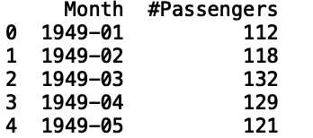

作者图片

我们可以看到数据包含一个标有“月”的列，其中包含日期。在该列中，日期格式为年-月。我们还看到数据开始于 1949 年。

第二列标记为“#Passengers”，它包含年-月的乘客数量。让我们来看看使用 tail()方法记录的最后五个数据:

```
print(df.tail())
```

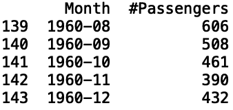

作者图片

我们看到数据截止于 1960 年。接下来我们要做的是将 month 列转换成 datetime 对象。这将允许它以编程方式为每个记录提取时间值，如年或月。为此，我们使用 Pandas to_datetime()方法:

```
df[‘Month’] = pd.to_datetime(df[‘Month’], format=’%Y-%m’)print(df.head())
```

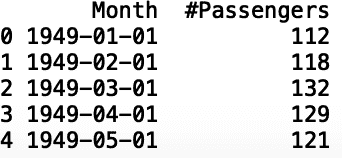

作者图片

请注意，这个过程会自动插入每个月的第一天，这基本上是一个虚拟值，因为我们没有每天的乘客数据。

接下来我们要做的是将 month 列转换成一个索引。这将使我们能够更容易地处理我们将在后面介绍的一些包:

```
df.index = df[‘Month’]del df[‘Month’]print(df.head())
```

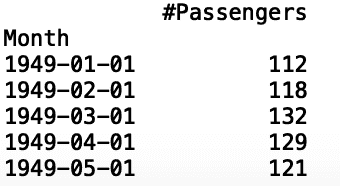

作者图片

接下来，让我们使用 Seaborn 和 Matplotlib 生成一个时间序列图。这将允许我们可视化时间序列数据。

首先，让我们导入 Matplotlib 和 Seaborn:

```
import matplotlib.pyplot as pltimport seaborn as sns
```

接下来，让我们使用 Seaborn 生成一个线图:

```
sns.lineplot(df)
```

并用 Matplotlib 标记 y 轴:

```
plt.ylabel(“Number of Passengers”)
```

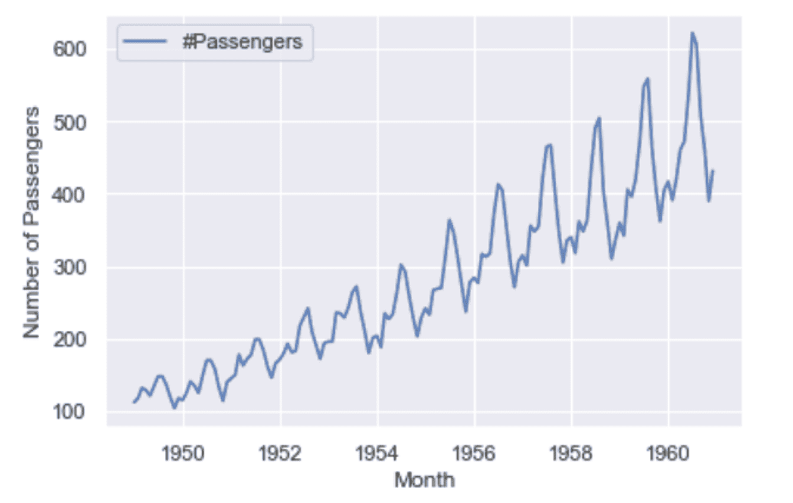

作者图片

# **分析**

平稳性是时间序列分析的关键部分。简单地说，平稳性意味着时间序列数据变化的方式是恒定的。平稳的时间序列不会有任何趋势或季节模式。您应该检查平稳性，因为它不仅使时间序列建模更容易，而且是许多时间序列方法的基本假设。具体来说，平稳性被假设用于多种时间序列预测方法，包括自回归移动平均(ARMA)、ARIMA 和季节性 ARIMA (SARIMA)。

我们将使用迪基富勒测试来检查我们的数据的平稳性。该测试将生成临界值和 p 值，这将允许我们接受或拒绝不存在平稳性的零假设。如果我们拒绝零假设，我们接受另一种说法，即存在平稳性。

这些值允许我们测试当前值随过去值变化的程度。如果数据集中没有平稳性，当前值的变化不会引起过去值的显著变化。

让我们测试一下航空乘客数据的平稳性。首先，让我们计算一个七个月的滚动平均值:

```
rolling_mean = df.rolling(7).mean()rolling_std = df.rolling(7).std()
```

接下来，让我们用七个月的滚动平均值和七个月的滚动标准差来覆盖我们的时间序列。首先，让我们制作一个时间序列的 Matplotlib 图:

```
plt.plot(df, color=”blue”,label=”Original Passenger Data”)
```

然后滚动的意思是:

```
plt.plot(rolling_mean, color=”red”, label=”Rolling Mean Passenger Number”)
```

最后是滚动标准偏差:

```
plt.plot(rolling_std, color=”black”, label = “Rolling Standard Deviation in Passenger Number”)
```

让我们接着添加一个标题

```
plt.title(“Passenger Time Series, Rolling Mean, Standard Deviation”)
```

还有一个传说:

```
plt.legend(loc=”best”)
```

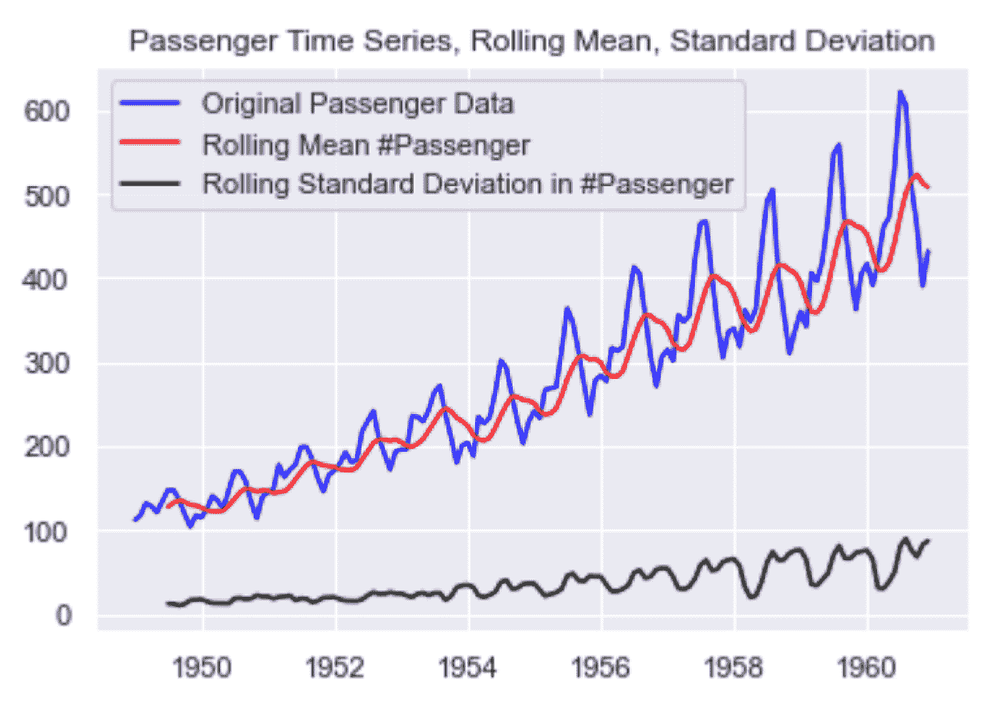

作者图片

接下来，让我们从 statsmodels 包中导入增强的 Dickey-Fuller 测试。测试文档可以在[这里](https://www.statsmodels.org/dev/generated/statsmodels.tsa.stattools.adfuller.html)找到。

```
from statsmodels.tsa.stattools import adfuller
```

接下来，让我们将数据帧传递给 adfuller 方法。这里，我们将自动标记参数指定为“AIC”，这意味着选择滞后以最小化信息标准:

```
adft = adfuller(df,autolag=”AIC”)
```

接下来，让我们将结果存储在数据框中并显示出来:

```
output_df = pd.DataFrame({“Values”:[adft[0],adft[1],adft[2],adft[3], adft[4][‘1%’], adft[4][‘5%’], adft[4][‘10%’]] , “Metric”:[“Test Statistics”,”p-value”,”No. of lags used”,”Number of observations used”,“critical value (1%)”, “critical value (5%)”, “critical value (10%)”]})print(output_df)
```

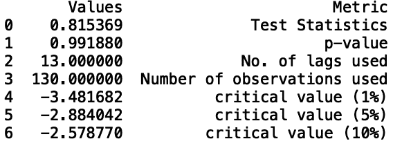

作者图片

从我们的 p 值大于 5%并且检验统计量大于临界值这一事实中，我们可以看出我们的数据不是稳定的。我们也可以从检查数据中得出这些结论，因为我们看到了乘客数量明显增加的趋势。

*自相关*

检查时间序列数据中的自相关是分析过程的另一个重要部分。这是对给定时间点的时间序列数据与过去值的相关程度的衡量，这对许多行业都有巨大的影响。例如，如果我们的乘客数据具有很强的自相关性，我们可以假设今天的高乘客数量表明明天的乘客数量也很可能很高。

Pandas 数据框具有一种自相关方法，可用于计算乘客数据的自相关。让我们滞后一个月来做这件事:

```
autocorrelation_lag1 = df[‘#Passengers’].autocorr(lag=1)print(“One Month Lag: “, autocorrelation_lag1)
```

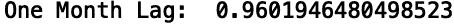

作者图片

现在，让我们试试三个月、六个月和九个月:

```
autocorrelation_lag3 = df[‘#Passengers’].autocorr(lag=3)print(“Three Month Lag: “, autocorrelation_lag3)autocorrelation_lag6 = df[‘#Passengers’].autocorr(lag=6)print(“Six Month Lag: “, autocorrelation_lag6)autocorrelation_lag9 = df[‘#Passengers’].autocorr(lag=9)print(“Nine Month Lag: “, autocorrelation_lag9)
```

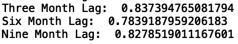

作者图片

我们看到，即使有 9 个月的滞后，数据也高度自相关。这进一步说明了数据的短期和长期趋势。

*分解*

趋势分解是另一种可视化时间序列数据趋势的有用方法。要继续，让我们从 statsmodels 包中导入季节性分解:

```
from statsmodels.tsa.seasonal import seasonal_decompose
```

接下来，让我们将数据框传递给季节性分解方法，并绘制结果:

```
decompose = seasonal_decompose(df[‘#Passengers’],model=’additive’, period=7)decompose.plot()plt.show()
```

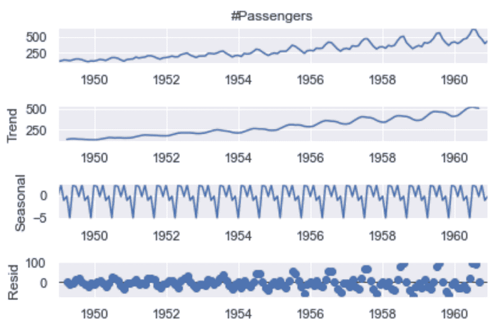

作者图片

从该图中，我们可以清楚地看到乘客数量的增长趋势以及每年价值上升和下降的季节性模式。

# **预测**

时间序列预测允许我们在给定当前和过去数据的情况下预测时间序列中的未来值。在这里，我们将使用 ARIMA 方法来预测乘客数量。ARIMA 允许我们根据过去值的线性组合来预测未来值。我们将使用 auto_arima 包，它将允许我们放弃耗时的超参数调整过程。

首先，让我们分割数据用于训练和测试，并可视化分割:

```
df[‘Date’] = df.indextrain = df[df[‘Date’] < pd.to_datetime(“1960–08”, format=’%Y-%m’)]train[‘train’] = train[‘#Passengers’]del train[‘Date’]del train[‘#Passengers’]test = df[df[‘Date’] >= pd.to_datetime(“1960–08”, format=’%Y-%m’)]del test[‘Date’]test[‘test’] = test[‘#Passengers’]del test[‘#Passengers’]plt.plot(train, color = “black”)plt.plot(test, color = “red”)plt.title(“Train/Test split for Passenger Data”)plt.ylabel(“Passenger Number”)plt.xlabel(‘Year-Month’)sns.set()plt.show()
```

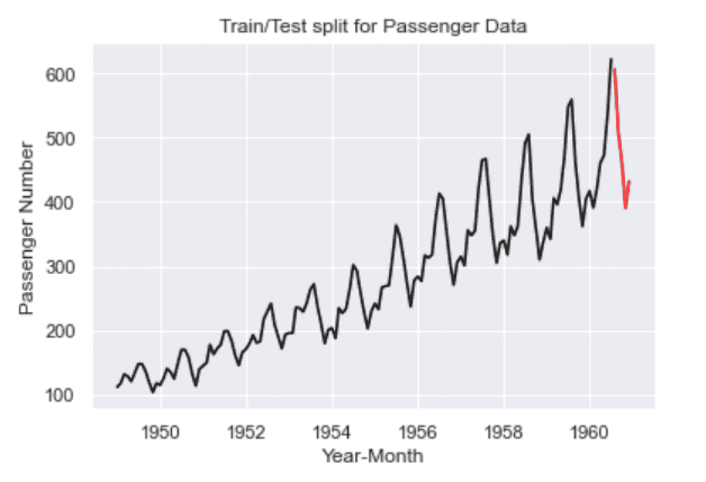

作者图片

黑线对应我们的训练数据，红线对应我们的测试数据。

让我们从 pdmarima 包中导入 auto_arima，训练我们的模型并生成预测:

```
from pmdarima.arima import auto_arimamodel = auto_arima(train, trace=True, error_action=’ignore’, suppress_warnings=True)model.fit(train)forecast = model.predict(n_periods=len(test))forecast = pd.DataFrame(forecast,index = test.index,columns=[‘Prediction’])
```

以下是输出的截断示例:

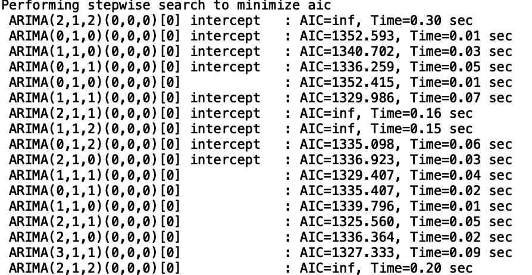

作者图片


作者图片

现在，让我们显示模型的输出:

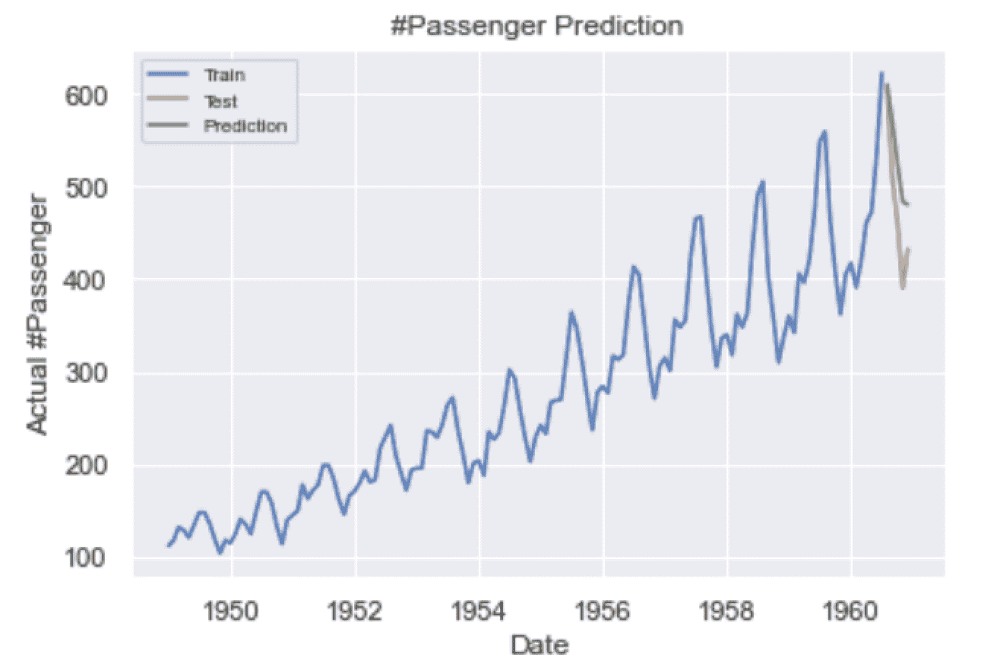

作者图片

我们的预测显示为绿色，实际值显示为橙色。

最后，让我们计算均方根误差(RMSE):

```
from math import sqrtfrom sklearn.metrics import mean_squared_errorrms = sqrt(mean_squared_error(test,forecast))print(“RMSE: “, rms)
```

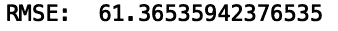

作者图片

# **结论**

时间序列数据分析是几乎每个数据科学家在职业生涯中都会面临的任务。对分析工具和方法有很好的理解，可以使数据科学家发现趋势、预测事件，从而为决策提供信息。通过平稳性、自相关和趋势分解了解季节性模式可以指导全年的促销计划，从而提高公司的利润。最后，时间序列预测是在时间序列数据中预测未来事件的一种强有力的方法，这也可以显著影响决策。这些类型的分析对于任何希望通过时间序列数据为公司带来价值的数据科学家或数据科学团队来说都是无价的。这篇文章的代码可以在 GitHub 上找到。

如果你有兴趣学习 python 编程的基础知识、Pandas 的数据操作以及 python 中的机器学习，请查看[*Python for Data Science and Machine Learning:Python 编程、Pandas 和 sci kit-初学者学习教程*](https://www.amazon.com/dp/B08N38XW2Q/ref=sr_1_1?dchild=1&keywords=sadrach+python&qid=1604966500&s=books&sr=1-1) *。我希望你觉得这篇文章有用/有趣。*

***本帖原载于*** [***内置博客***](https://builtin.com/data-science/) ***。原片可以在这里找到***<https://builtin.com/data-science/time-series-python>****。****