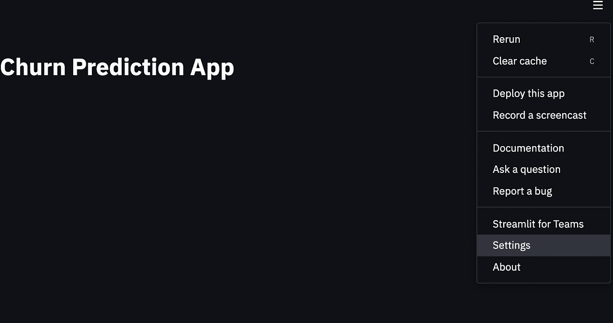
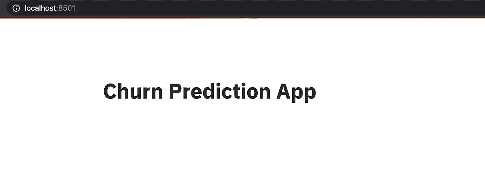
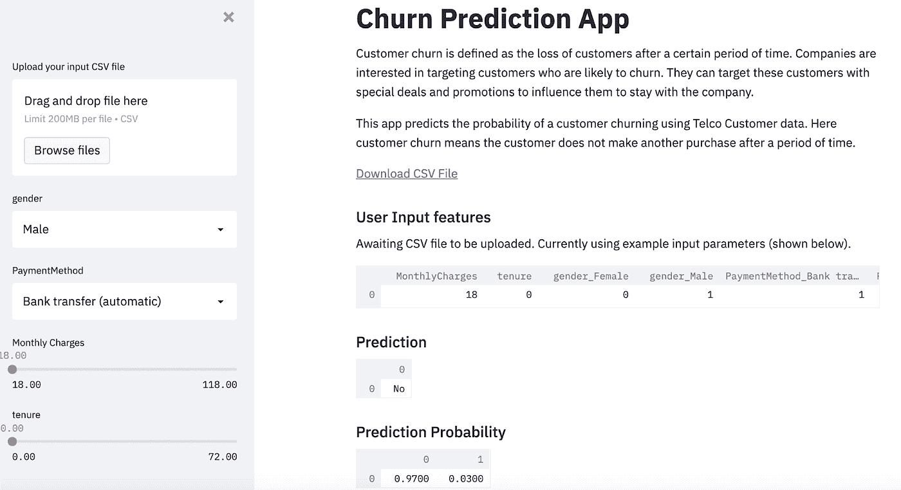

# 使用 Streamlit 掌握 Web 应用程序

> 原文：<https://towardsdatascience.com/mastering-web-applications-with-streamlit-95f84420fe13?source=collection_archive---------41----------------------->

## 使用 Streamlit 构建基于 ML 的 Web 应用程序


照片由[底片](https://www.pexels.com/@negativespace)上的空间[像素](https://www.pexels.com/photo/gray-laptop-computer-showing-html-codes-in-shallow-focus-photography-160107/)拍摄

公司对向客户清楚地传达他们基于 ML 的预测分析非常感兴趣。无论模型有多精确，客户都想知道机器学习模型是如何从数据中做出预测的。例如，如果一个基于订阅的公司有兴趣寻找那些取消订阅的高风险客户，他们可以使用他们的历史客户数据来预测某人离开的可能性。

从那里，他们会想要分析驱动这个事件的因素。通过了解驱动因素，他们可以采取有针对性的促销或折扣等措施来防止客户离开。在不了解影响任何给定结果的因素的情况下，使用机器学习模型来做出决策是很困难的。

公司交流数据见解和机器学习模型结果的一种常见方式是通过分析仪表板。像 Tableau、Alteryx 这样的工具，甚至是使用 Django 或 Flask 这样的 web 框架的定制工具，都使得创建这些仪表板变得很容易。

然而，在实践中，创建这些类型的仪表板通常非常昂贵和耗时。那么，使用 Streamlit 是更传统方法的一个好的替代方法。Streamlit 是一个基于 Python 的库，允许您轻松创建免费的机器学习应用程序。您可以轻松地读取保存的模型，并通过直观的用户友好界面与之交互。它允许您显示描述性文本和模型输出、可视化数据和模型性能、使用侧栏通过 UI 修改模型输入等等。

总的来说，Streamlit 是一个易于学习的框架，允许数据科学团队在短短几个小时内创建免费的预测分析 web 应用程序。 [Streamlit gallery](https://streamlit.io/gallery) 展示了许多使用它进行分析和机器学习的开源项目。你也可以在这里找到 Streamlit [的文档。](https://docs.streamlit.io/en/stable/)

由于其易用性和多功能性，您可以使用 Streamlit 来交流各种数据见解。这包括来自探索性数据分析(EDA)的信息，来自分类和回归等监督学习模型的结果，甚至来自非监督学习模型的见解。出于我们的目的，我们将考虑预测客户是否会停止购买某家公司产品的分类任务，这种情况称为流失。我们将在这个项目中使用虚构的[电信客户流失数据](https://www.kaggle.com/blastchar/telco-customer-churn)。

这篇文章的灵感来自于[数据教授 YouTube 频道](https://www.youtube.com/channel/UCV8e2g4IWQqK71bbzGDEI4Q)上的一个 Streamlit 教程。教程可以在这里找到[。还有一个中等文章版本的教程可以在](https://www.youtube.com/watch?v=zK4Ch6e1zq8)[这里](/how-to-create-and-deploy-a-machine-learning-app-to-heroku-d6965aa4f627)找到。

**建立并保存分类模型**

我们将从使用随机森林构建和保存一个简单的流失分类模型开始。首先，让我们使用以下命令在终端中创建一个文件夹:

```
mkdir my_churn_app
```

接下来，让我们将目录更改到新文件夹中:

```
cd my_churn_app
```

现在，让我们使用文本编辑器创建一个名为 churn-model.py 的新 Python 脚本。在这里，我将使用 vi 文本编辑器:

```
vi churn-model.py
```

现在，让我们导入几个包。我们将与熊猫、Scikit-learn 的 RandomForestClassifier 和 Pickle 合作:

```
import pandas as pdfrom sklearn.ensemble import RandomForestClassifierimport pickle
```

现在，让我们放宽熊猫数据框行和列的显示限制，然后读入并显示我们的数据:

```
pd.set_option(‘display.max_columns’, None)pd.set_option(‘display.max_rows’, None)df_churn = pd.read_csv(‘telco_churn.csv’)print(df_churn.head())
```


让我们过滤数据框，使其仅包含性别、支付方式、每月费用、任期和流失等列。这些列中的前四列将被输入到我们的分类模型中，我们的输出是“流失”:

```
pd.set_option(‘display.max_columns’, None)pd.set_option(‘display.max_rows’, None)df_churn = pd.read_csv(‘telco_churn.csv’)df_churn = df_churn[[‘gender’, ‘PaymentMethod’, ‘MonthlyCharges’, ‘tenure’, ‘Churn’]].copy()print(df_churn.head())
```


接下来，让我们将数据框的副本存储在一个名为 df 的新变量中，并用零替换缺失值:

```
df = df_churn.copy()df.fillna(0, inplace=True)
```

接下来，让我们为分类列 Gender 和 PaymentMethod 创建机器可读的虚拟变量:

```
encode = [‘gender’,’PaymentMethod’]for col in encode:dummy = pd.get_dummies(df[col], prefix=col)df = pd.concat([df,dummy], axis=1)del df[col]
```

接下来，让我们将 churn 列值映射到二进制值。我们将客户流失值“是”映射到值 1，将“否”映射到值 0:

```
import numpy as npdf[‘Churn’] = np.where(df[‘Churn’]==’Yes’, 1, 0)Now, let’s define our input and output :X = df.drop(‘Churn’, axis=1)Y = df[‘Churn’]
```

然后，我们定义 RandForestClassifier 的一个实例，并使我们的模型适合我们的数据:

```
clf = RandomForestClassifier()clf.fit(X, Y)
```

最后，我们可以将模型保存到 Pickle 文件中:

```
pickle.dump(clf, open(‘churn_clf.pkl’, ‘wb’))
```

现在，在终端中，让我们使用以下命令运行 Python 脚本:

```
python churn-model.py
```

这应该会在我们的文件夹中生成一个名为 churn_clf.pkl 的文件。这是我们保存的模型。

接下来，在终端中，使用以下命令安装 Streamlit:

```
pip install streamlit
```

让我们定义一个名为 churn-app.py 的新 Python 脚本。这将是我们用来运行 Streamlit 应用程序的文件:

```
vi churn-app.py
```

现在，让我们导入一些额外的库。我们将导入 Streamlit、Pandas、Numpy、Pickle、Base64、Seaborn 和 Matplotlib:

```
import streamlit as stimport pandas as pdimport numpy as npimport pickleimport base64import seaborn as snsimport matplotlib.pyplot as plt
```

**显示文本**

我们要做的第一件事是如何向我们的应用程序添加文本。我们使用 Streamlit 对象上的 write 方法来实现这一点。让我们创建我们的应用程序头，称为流失预测应用程序:

我们可以使用以下命令在本地运行我们的应用程序:

```
streamlit run churn-app.py
```

我们应该看到这一点:


从应用程序右上方的下拉菜单中，我们可以将主题从暗变亮:



现在我们的应用程序应该是这样的:



最后，让我们在 UI 中添加更多的描述性文本，然后重新运行我们的应用程序:

```
st.write(“””# Churn Prediction AppCustomer churn is defined as the loss of customers after a certain period of time. Companies are interested in targeting customerswho are likely to churn. They can target these customers with special deals and promotions to influence them to stay withthe company.This app predicts the probability of a customer churning using Telco Customer data. Herecustomer churn means the customer does not make another purchase after a period of time.“””)
```


**允许用户下载数据**

接下来我们可以做的是修改我们的应用程序，以便用户可以下载训练他们模型的数据。这对于执行应用程序不支持的任何分析非常有用。为此，我们首先读入数据:

```
df_selected = pd.read_csv(“telco_churn.csv”)df_selected_all = df_selected[[‘gender’, ‘Partner’, ‘Dependents’, ‘PhoneService’,’tenure’, ‘MonthlyCharges’, ‘target’]].copy()
```

接下来，让我们定义一个允许我们下载读入数据的函数:

```
def filedownload(df): csv = df.to_csv(index=False) b64 = base64.b64encode(csv.encode()).decode() # strings <->   bytes conversions href = f’<a href=”data:file/csv;base64,{b64}”     download=”churn_data.csv”>Download CSV File</a>’ return href
```

接下来，让我们将 showPyplotGlobalUse deprecation 警告指定为 False。

```
st.set_option(‘deprecation.showPyplotGlobalUse’, False)st.markdown(filedownload(df_selected_all), unsafe_allow_html=True)
```

当我们重新运行我们的应用程序时，我们应该看到以下内容:


**数值输入滑块&分类输入选择框**

我们可以做的另一件有用的事情是为用户创建输入侧栏，允许他们更改输入值，并查看它如何影响流失概率。为此，让我们定义一个名为 user_input_features 的函数:

```
def user_input_features(): pass
```

接下来，让我们为分类列 Gender 和 PaymentMethod 创建一个侧栏。

对于分类列，我们调用侧栏对象上的 Selectbox 方法。Selectbox 方法的第一个参数是分类列的名称:

```
def user_input_features(): gender = st.sidebar.selectbox(‘gender’,(‘Male’,’Female’)) PaymentMethod = st.sidebar.selectbox(‘PaymentMethod’,(‘Bank transfer (automatic)’, ‘Credit card (automatic)’, ‘Mailed check’, ‘Electronic check’)) data = {‘gender’:[gender],‘PaymentMethod’:[PaymentMethod],} features = pd.DataFrame(data) return features
```

让我们调用我们的函数并将返回值存储在一个名为 input 的变量中:

```
input_df = user_input_features()
```

现在，让我们运行我们的应用程序。我们应该看到一个性别和支付方式的下拉菜单选项:


这项技术非常强大，因为用户可以选择不同的支付方式，并根据支付方式了解客户流失的可能性有多大。例如，如果银行转账导致客户流失的可能性更高，也许一家公司会向这些客户发送有针对性的信息，鼓励他们改变支付方式。他们也可以选择提供某种形式的财务激励来改变他们的支付方式。关键是，这些类型的见解可以推动公司的决策，让他们更好地留住客户。

我们还可以添加月度费用和任期:

```
def user_input_features(): gender = st.sidebar.selectbox(‘gender’,(‘Male’,’Female’)) PaymentMethod = st.sidebar.selectbox(‘PaymentMethod’,(‘Bank   transfer (automatic)’, ‘Credit card (automatic)’, ‘Mailed check’, ‘Electronic check’)) MonthlyCharges = st.sidebar.slider(‘Monthly Charges’, 18.0,118.0, 18.0) tenure = st.sidebar.slider(‘tenure’, 0.0,72.0, 0.0) data = {‘gender’:[gender],‘PaymentMethod’:[PaymentMethod], ‘MonthlyCharges’:[MonthlyCharges],‘tenure’:[tenure],} features = pd.DataFrame(data) return featuresinput_df = user_input_features()
```


接下来，我们可以显示模型的输出。为了做到这一点，我们首先需要指定默认的输入和输出，如果用户没有选择任何。我们可以将用户输入函数插入到 if/else 语句中，该语句表示如果用户没有指定输入，则使用默认输入。这里，我们还将为用户提供一个选项，使用侧栏方法 file_uploader()上传包含输入值的 CSV 文件:

```
uploaded_file = st.sidebar.file_uploader(“Upload your input CSV file”, type=[“csv”])if uploaded_file is not None: input_df = pd.read_csv(uploaded_file)else: def user_input_features(): … #truncated code from above return featuresinput_df = user_input_features()
```


接下来，我们需要显示模型的输出。首先，让我们显示默认的输入参数。我们在数据中读到:

```
churn_raw = pd.read_csv(‘telco_churn.csv’)churn_raw.fillna(0, inplace=True)churn = churn_raw.drop(columns=[‘Churn’])df = pd.concat([input_df,churn],axis=0)Encode our features:encode = [‘gender’,’PaymentMethod’]for col in encode: dummy = pd.get_dummies(df[col], prefix=col) df = pd.concat([df,dummy], axis=1) del df[col]df = df[:1] # Selects only the first row (the user input data)
df.fillna(0, inplace=True)
```

选择我们想要显示的功能:

```
features = [‘MonthlyCharges’, ‘tenure’, ‘gender_Female’, ‘gender_Male’,‘PaymentMethod_Bank transfer (automatic)’,‘PaymentMethod_Credit card (automatic)’,‘PaymentMethod_Electronic check’, ‘PaymentMethod_Mailed check’]df = df[features]
```

最后，我们使用 write 方法显示默认输入:

```
# Displays the user input featuresst.subheader(‘User Input features’)print(df.columns)if uploaded_file is not None: st.write(df)else: st.write(‘Awaiting CSV file to be uploaded. Currently using example input parameters (shown below).’) st.write(df)
```


现在，我们可以使用默认输入或用户输入进行预测并显示它们。首先，我们需要读入我们保存的模型，它在一个 Pickle 文件中:

```
load_clf = pickle.load(open(‘churn_clf.pkl’, ‘rb’))
```

生成二进制分数和预测概率:

```
prediction = load_clf.predict(df)prediction_proba = load_clf.predict_proba(df)
```

并写出输出:

```
churn_labels = np.array([‘No’,’Yes’])st.write(churn_labels[prediction])st.subheader(‘Prediction Probability’)st.write(prediction_proba)
```



我们发现，使用银行转账作为支付方式、月费为 18 美元的新男性客户有 97%的可能性会选择这家公司。我们现在已经完成了应用程序的构建。接下来，我们将使用 Heroku 将它部署到一个实时网站上。

**部署应用程序**

Web 应用程序部署是 ML 管道中另一个耗时且昂贵的步骤。Heroku 使快速部署免费的网络应用程序变得容易。首先，我们需要向我们的应用程序文件夹添加一些额外的文件。我们将添加一个 setup.sh 文件和一个 Procfile。Streamlit 和 Heroku 将在运行应用程序之前使用这些文件来配置环境。在“终端”的应用程序文件夹中，创建一个名为 setup.sh 的新文件:

```
vi setup.sh
```

在文件副本中，粘贴以下内容:

```
mkdir -p ~/.streamlit/echo “\[server]\n\port = $PORT\n\enableCORS = false\n\headless = true\n\\n\“ > ~/.streamlit/config.toml
```

保存并离开文件。我们需要创建的下一件事是一个 Procfile。

```
vi Procfile
```

将以下内容复制并粘贴到文件中:

```
web: sh setup.sh && streamlit run churn-app.py
```

最后，我们需要创建一个 requirement.txt 文件。我们将添加我们在那里使用的库的包版本:

```
streamlit==0.76.0numpy==1.20.2scikit-learn==0.23.1matplotlib==3.1.0seaborn==0.10.0
```

要检查软件包版本，您可以在“终端”中运行以下命令:

```
pip freeze
```

我们现在准备部署我们的应用程序。按照以下步骤进行部署:

1.  首先，如果您有 Github 帐户，请登录。如果没有，请先创建一个 Github 帐户。
2.  在左侧面板中，单击“存储库”旁边的绿色新建按钮。
3.  为您的存储库创建一个名称。{您的姓名}-churn-app 应该没问题。对我来说，应该是 sadrach-churn-app。
4.  单击“上传现有文件”链接，然后单击“选择文件”。
5.  将 codecrew_churn_app-main 中的所有文件添加到 repo 中，然后单击 Commit。
6.  去 Heroku.com 创建一个账户。
7.  登录您的帐户。
8.  点击右上角的新建按钮，然后点击创建新应用。
9.  你可以给这个应用起任何你喜欢的名字。我给我的应用命名如下:{name}-churn-app。即:sadrach-churn-app，点击创建 app。
10.  在部署方法中，单击 GitHub
11.  连接到您的 GitHub repo。
12.  登录，复制并粘贴您的回购名称。单击搜索并连接。
13.  向下滚动到手动部署，然后单击部署分支。
14.  等待几分钟，你的应用程序应该是活的！

你可以在这里找到我版本的 churn 应用[，在这里](https://sadrach-churn-app.herokuapp.com/)找到 GitHub 库[。](https://github.com/spierre91/medium_code/tree/master/streamlit_builtin)

**结论**

Streamlit 是一个强大的库，允许快速轻松地部署机器学习和数据应用程序。它允许开发人员为机器学习模型和数据分析创建直观的用户界面。对于机器学习模型预测，这意味着更好的模型解释能力和透明度，这可以帮助公司做出决策。许多机器学习模型公司面临的一个已知问题是，不管准确性如何，都需要对哪些因素驱动事件做出一些直观的解释。

Streamlit 为模型的可解释性和解释提供了许多途径。侧边栏对象使开发人员能够创建易于使用的滑块，允许用户修改数字输入值。它还提供了一个选择框方法，允许用户查看分类值的变化如何影响事件预测。文件上传方法允许用户上传 csv 文件形式的输入，并随后显示模型预测。

虽然我们的应用程序侧重于客户流失分类模型，但 Streamlit 可用于其他类型的机器学习模型，包括监督和非监督模型。例如，为回归机器学习模型(如房价预测)构建一个类似的 web 应用程序会相对简单。此外，您可以使用 streamlit 为使用 K-means 或层次聚类等方法的无监督学习工具开发 UI。最后，Streamlit 并不局限于机器学习。您可以将 streamlit 用于任何数据分析任务，如数据可视化和探索。

除了支持简单的 UI 开发之外，使用 Streamlit 和 Heroku 可以省去 web 应用程序部署的许多麻烦。正如我们在本文中看到的，我们可以在几个小时内轻松部署一个实时的机器学习 web 应用程序，而传统方法需要几个月。

如果你有兴趣学习 python 编程的基础知识、Pandas 的数据操作以及 python 中的机器学习，请查看[*Python for Data Science and Machine Learning:Python 编程、Pandas 和 sci kit-初学者学习教程*](https://www.amazon.com/dp/B08N38XW2Q/ref=sr_1_1?dchild=1&keywords=sadrach+python&qid=1604966500&s=books&sr=1-1) *。我希望你觉得这篇文章有用/有趣。*

***本帖原载于*** [***内置博客***](https://builtin.com/machine-learning) ***。原片可以在这里找到***[](https://builtin.com/machine-learning/streamlit-tutorial)****。****