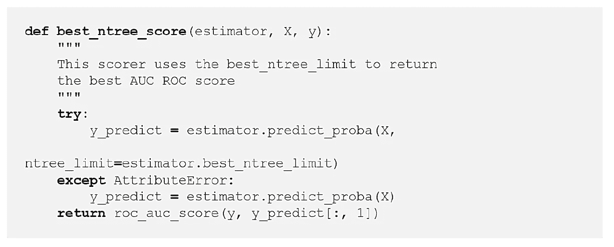

# 掌握 XGBoost

> 原文：<https://towardsdatascience.com/mastering-xgboost-2eb6bce6bc76?source=collection_archive---------6----------------------->

## 超参数调整和优化

伊曼纽尔·基翁克在 [Unsplash](https://unsplash.com?utm_source=medium&utm_medium=referral) 上的照片

X GBoost 已经成为机器学习领域的一个传奇。其成就包括:(1)2015 年在机器学习竞赛网站 Kaggle 上的 29 场挑战中，有 17 场以 XGBoost 获胜，8 场专门使用 XGBoost，9 场使用 XGBoost 与神经网络进行集成；(2)在 2016 年杯，一个领先的基于会议的机器学习比赛中，所有前 10 名的位置都使用了 XGBoost(陈，XGBoost:一个可扩展的树提升系统，2016)。

简单来说，XGBoost 是一种超级优化的梯度下降和提升算法，它异常快速和准确。这种“超级优化”是通过组合批量梯度下降函数(如上所述)和模型复杂性的惩罚(也称为回归树函数)来实现的；然而，它通常只适用于一种类型的机器学习模型——
决策树(更正式的名称是分类和回归树或购物车)(亚马逊 SageMaker，2019)。

XGBoost 的竞争优势很大程度上是因为它能够快速调查许多超参数并识别最佳参数，然后可以手动设置这些参数，以便模型自动识别正确的参数。

【XGBoost 的超参数调整

在 XGBoost 的例子中，讨论超参数调优比底层数学更有用，因为超参数调优异常复杂、耗时，而且是部署所必需的，而数学已经嵌入到代码库中。虽然手动超参数调整在许多机器学习算法或模型中是必不可少且耗时的，但在 XGBoost 中尤其如此。因此，虽然本节的重点是确定部署 XGBoost 的关键要素——在我们的案例研究和此处的示例中，预测新时尚(“快速时尚”)以在在线服装销售中获得竞争优势——但这些超参数调整课程对 XGBoost 的所有应用都有效，本文中的许多其他机器学习模型应用
也是如此。

参数和超参数的区别和作用对于经济、及时和准确的机器学习部署至关重要。机器学习的一个核心优势是，它能够通过自动调整数千或数百万个“可学习”的参数，发现和识别大数据中的模式和规律。例如，在像 XGBoost
(以及决策树和随机森林)这样的基于树的模型中，这些可学习的参数是每个节点上有多少决策变量。超参数是手动调整，优化逻辑在算法或模型之外。此外，机器学习算法或模型越强大，它拥有或可能拥有的手动设置的超参数就越多。例如，在基于树的算法(如 XGBoost)中，超参数包括树的深度、树的数量、每棵树内的变量、用于每棵树的观察值等。

可以说，对于 XGBoost，有六(6)个超参数是最重要的，其被定义为算法产生最准确、无偏结果的概率最高、最快且没有过度拟合的超参数:(1)要训练多少个子树；(2)最大树深度(一个正则化超参数)；(3)学习率；(4)确定叶子上权重极值的 L1 (reg_alpha)和 L2 (reg_ lambda)正则化率；(5)复杂度控制(γ=γ)，伪正则化超参数；以及(6)最小儿童体重，另一个正则化超参数。让我们先按顺序总结一下这些超参数的信息，然后再检查对它们进行微调的系统方法，以便快速获得 XGBoost 的最大收益(Laurae，2016) (Tseng，2018)。

设置树的数量通知算法何时停止，以防止过拟合，这是机器学习的最大危险之一。这也很重要，因为通过足够多遍的训练数据，XGBoost 算法会学习或记忆它，每个训练周期都会降低预测的准确性。注意，通过提前停止，XGBoost 交付的最终模型将是您告诉它停止的帧，而不一定是验证分数最低的帧；然而，您可以通过插入如图 1 所示的代码片段来确保它产生最佳模型(Tseng，2018)。

图 1:从 XGBoost 中选择具有早期停止的最佳模型的代码(Tseng，2018)

或者，在 sklearn 的 GridSearchCV 中，使用 best_ntree-limit 定义一个评分方法，如下所示(图 2):

图 sklearn 的 GridSearchCV (Tseng，2018)中 XGBoost 评分限制的代码

最大树深默认为三(3)，很少需要超过五(5) (Tseng，2018)。当值小于 3 时(< 3), it implies a problem with the data wherein it is missing useful interactions that would be expected. There are some arguments that changing the maximum tree depth to fractions of whole numbers is over-tuning, meaning it takes lots of time and works to figure out the decimal fraction, which is more effort than the resulting benefits. The larger the tree depth, the higher the probability of over-fitting; therefore, it is prudent to increase it reluctantly and only by units of one and even then, probably never higher than five (5). Alternatively, attempt to adjust other hyperparameters that will enable the model to be more robust, meaning the influence of outliers in the data will be minimized (Chris, 2016). Also, XGBoost “aggressively consumes” memory when training deep trees. Therefore, the available memory and/or maximum tree depth may need to be set accordingly (xgboost developers, 2019).

The learning rate (α) will be multiplied by the weight in every tree. There is usually an inverse relationship between the learning rate and accuracy. In other words, a lower learning rate improves the final model measured in predictive accuracy (lower cost or error), even though it makes it slower to train. While incrementally reducing the learning rate helps ensure the model
不会在神经网络或随机梯度下降中的理想和最小错误率附近振荡，这是决策树不太常见的问题(Ng，2018) (Tseng，2018)。

L1 和 L2 仅适用于以线性模型而非树形模型为基础进行提升的情况(Chris，2016)。这些正则化因素有助于防止过度拟合，从而在有许多要素时使模型更加简洁(不那么复杂)。具体来说，最小绝对收缩和选择运算符(LASSO)回归使用 L1，而岭回归使用 L2。他们之间的主要区别是刑罚条款。岭回归将系数的平方值作为惩罚项添加到损失函数中，而拉索回归将系数的绝对值作为惩罚项添加到损失函数中(Nagpal，2017)。
L1 通过降低接近于零的权重来鼓励稀疏性，而 L2 鼓励权重更小(Chris，2016)。L1 和 L2 应用了大数据集，其中交叉验证和逐步推进(防止对较小数据集过度拟合的技术)是不切实际的(Nagpal，2017)。对于树木，最好将 L2(λ)值设置为高值，将 L1 (alpha)设置为零(Chris，2016)。

复杂性控制(gamma=γ)或拉格朗日乘数，可以说是挑战大多数机器学习实践者的 XGBoost 超参数。它可以从零(0)变化到无穷大，并且完全取决于数据集和其他超参数。这意味着单个数据集可以有多个理想伽马超参数，具体取决于其他超参数的设置方式。默认值为零(无正则化)，灰度系数越高，正则化程度越高。实际上，伽马值的极限在 20 左右，非常罕见(Laurae，2016)。

有两种采样方法来确定最佳伽玛:从零开始或从 10 开始。从零开始时，使用 xgb.cv 并观察训练和测试速度。如果训练速度比测试速度快得多，则增加 gamma 而不是 min_child_weight 超参数，因为目标是控制来自损失而不是损失导数的复杂性。和/或，您可以逐步降低 max_depth。伽马值越高，训练/测试之间的速度差异越小(Laurae，2016)。

最小儿童体重超参数在技术上被定义为儿童必需的瞬时体重的 Hessian 最小和，这对于没有广泛数学背景的人来说没有什么价值。在外行看来，它通过限制树的深度来进行调整，这有助于防止过度拟合(Hahdawg，2016)。其默认值为一(1)；
最小儿童体重超参数设置越大，模型就越保守，就越远离潜在的过度拟合(xgboost developers，2019)。

XGBoost 中使用了许多其他的超参数和参数，这些参数或者是自动设置的，或者是不经常调整的，可以在它的文档中引用。然而，剩下最值得注意的是:(1)“助推器”决定使用哪个助推器；有三种— gbtree(默认)、gblinear 或 dart —第一种和最后一种使用基于树的模型；(2)“tree _ method”允许设置使用哪种树构造算法；大约有五种选择。，auto，exact，hist，& gpu_hist —但“近似”“历史”只能用于分布式培训和“大约”对于外部存储器版本。“自动”使用试探法来选择最快的方法，通常是“精确的”，这是对中小型数据集或单个
机器的贪婪和“近似的”对于非常大的数据集；(3)更新(默认设置为 grow_colmaker，prune)。这是一个逗号分隔的字符串，它定义了更新树的顺序，并作为高级用户构造和修改树的模块化方式；它通常是自动设置的，但可以手动覆盖(xgboost developers，2019)。

**XGBoost 超参数优化方法**

考虑到手动设置超参数以使机器学习算法能够学习最佳参数和结果的重要性，开发系统地接近超参数编程而不是任意猜测值的方法是有意义的。本质上，有三种这样的常用方法:(1)穷举网格搜索(GS)；(2)坐标下降(CD)；或者，(3)遗传算法
(雷斯特雷波，2018)。

穷举网格搜索(GS)是一种跨越所有超参数设置的强力搜索。它通过计算和比较每个设置的交叉验证损失来发现最佳设置。理想情况下，为了提高效率，搜索模式是随机的(Restrepo，2018)。

坐标下降(CD)可能是设置超参数的最简单的优化方法。像梯度下降一样，它是一种迭代算法，一次搜索一个可能的超参数设置的向量或方向，并在看起来最有希望的方向上继续。它继续这种扫描，直到没有进一步的方向产生任何更多的改进(雷斯特雷波，2018)。

遗传算法是一整类优化算法，在高维离散搜索空间中表现出色。它们通过模拟一群可能的解决方案和最正确的生存方案来模仿自然选择。新的世代或者通过杂交产生，其中两个可能的解决方案被组合，或者通过突变产生，其中单个参数设置可以通过被替换而“突变”。适应度或“最佳”被定义为损失函数为负值的选项(Restrepo，2018)。