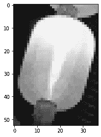
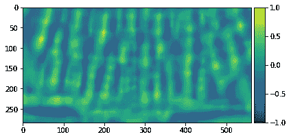
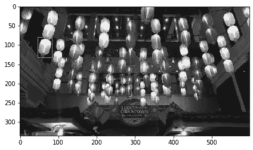
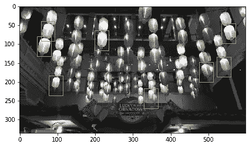

# 火柴火柴！Python 中使用模板匹配的对象检测

> 原文：<https://towardsdatascience.com/matchy-matchy-object-detection-using-template-matching-in-python-3b2bdfa6e250?source=collection_archive---------32----------------------->


照片由[德文·艾弗里](https://unsplash.com/@devintavery?utm_source=medium&utm_medium=referral)在 [Unsplash](https://unsplash.com?utm_source=medium&utm_medium=referral) 上拍摄

我们在我的上一篇文章中讨论了对象检测，所以这次我将展示另一个如何识别对象的例子:模板匹配。

让我们看看这张参考图片


作者图片

模板匹配意味着你找到一个大图像的一小部分，你可以用它作为参考模板[1]。这种特殊的方法被证明在图像检测以及跟踪物体方面是有用的。

对于这种特殊情况，我们将尝试一种简单的方法，在灰度图像中使用模板匹配

```
from skimage.io import imread, imshow
from skimage.color import rgb2graylights = imread('medium/lights.jpg')
lights_gray = rgb2gray(lights)
imshow(lights_gray);
```


作者图片

现在让我们选择一个黄色的灯笼作为模板

```
template = lights_gray[79:132,46:83]
imshow(template);
```



作者图片

为了执行模板匹配，我们简单地使用 skimage 的`match_template`

```
from skimage.feature import match_template
result = match_template(lights_gray, template)
imshow(result, cmap='viridis');
```



作者图片

从`match_template`结果中，我们可以看到原始图像中有多个区域的亮度值几乎等于 1。假设模板只能在原始图像中找到一次，我们可以从结果输出中确定具有最高值的像素

```
import numpy as np
x, y = np.unravel_index(np.argmax(result), result.shape)
print((x, y))
```

`Output: (79,46)`

现在，让我们使用这个像素根据我们之前使用的模板来绘制出被识别的对象

```
import matplotlib.pyplot as plt
imshow(lights_gray)
template_width, template_height = template.shape
rect = plt.Rectangle((y, x), template_height, template_width, color='y', 
                     fc='none')
plt.gca().add_patch(rect);
```



作者图片

为了一次识别多个图像，我们可以基于给定的阈值寻找峰值，以便与识别的峰值相关，并且将那些峰值与模板大小匹配

```
from skimage.feature import peak_local_max
imshow(lights_gray)
template_width, template_height = template.shape#set threshold initially at 0.65
for x, y in peak_local_max(result, threshold_abs=0.65):
    rect = plt.Rectangle((y, x), template_height, template_width, color='y', 
                         fc='none')
    plt.gca().add_patch(rect);
```



作者图片

我们可以看到，通过将阈值设置为 0.65，我们能够确定一些被算法识别为与我们设置的模板相似的对象。然而，其中一个被识别的物体似乎有两个灯笼，而不是一个。在这种情况下，调整一些参数可能有助于识别所有的灯。这方面的例子如下:

1.  更改模板大小
2.  更改模板的方向(向任一方向翻转)
3.  更改图像属性，如对比度

现在你有了它，模板匹配和几行代码

**参考文献**

[1] R. Brunelli，[计算机视觉中的模板匹配技术:理论与实践](https://www.researchgate.net/publication/252620698_Template_Matching_Techniques_in_Computer_Vision) (2008)，ResearchGate

对我的工作感兴趣？你可以在我的个人资料中看到更多的故事

<https://nico-aguila.medium.com/> 