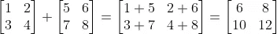
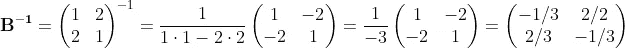

# 数据科学访谈中的矩阵

> 原文：<https://towardsdatascience.com/math-refresher-for-data-scientist-part-1-matrices-88620a92d046?source=collection_archive---------17----------------------->

## 数据科学家的数学复习

## 数据科学家的基本数学从零开始解释

克里斯·利维拉尼在 [Unsplash](https://unsplash.com?utm_source=medium&utm_medium=referral) 上的照片

矩阵通常用于许多领域，如物理、图形、风险建模和统计。熟悉矩阵及其转换相对容易，但对于理解数据科学概念(包括线性回归)至关重要。所以，让我们开始吧！

文章分为两部分:
一、数学复习
二。数据科学访谈中的相关问题

# **一、数学复习**

# **1。矩阵符号**

矩阵**的简单定义**是一个数字的矩形阵列。它按行和列排列，例如:

**A** 为 2×3 矩阵( *m* x *n* 矩阵*，m* = 2 行， *n* = 3 列)。粗体大写字母，如 **A** 或 **B** 用于表示矩阵。如上图所示，方括号 **[ ]** 或圆括号 **( )** 用于定义矩阵，两者没有区别。

如果 *m* = *n* ，则该矩阵称为*方阵*，例如:

单个元素表示为 *a* ᵢ,ⱼ，其中 *i* 表示行数， *j* 表示列数:

# **2。矩阵转置**

矩阵转置(**a’**或 **Aᵀ)** 简单地互换列和行，所以对于上面的矩阵 **A** :

如果一个矩阵是正方形并且**B**=**B’:**

那么矩阵 **B** 就是一个*对称矩阵。*

# **3。点积**

为了计算具有相同维数的两个非零*向量*(矩阵的一列)的点积，我们对逐个元素的乘积求和:

# **4。加减法**

首先要注意的是，我们要加或减的矩阵的维数必须相同。如果这个条件为真，那么我们将两个矩阵的相同位置的值相加:

同样的程序适用于减法。

# **5。矩阵乘法**

乘法被认为是最神秘的矩阵运算。正如您将在下面看到的，有了这一步一步的指导，就没有必要害怕了。

**标量—矩阵乘法**

当我们想用一个数乘一个矩阵时，我们只需用这个标量乘矩阵的每个元素。

**矩阵——矩阵乘法**

a)首先，我们需要检查两个矩阵是否可以相乘。只有当第一个矩阵的列数等于第二个矩阵的行数时，两个矩阵的矩阵乘积才存在:

如果我们取之前的矩阵:

乘法**A**(*m*x*n*)x**B(**kx*j)*由于 *n* (3 列 **A** )不等于 *k* (2 行 **B** ):

但我们可以将 **B** x **A** 相乘，因为 *j* 等于 *m* (2 列 **B** 和 2 行 **A** ):

b)乘法，使用符号:

从上面我们知道矩阵乘积是 *k* (第一个矩阵的行数)x *n* (第二个矩阵的列数):

因此，对于矩阵 2x2 和 2x3，结果矩阵的尺寸为 2x3:

我们希望计算位于第 1 行第 1 列的*位置 1* 的值，因此我们使用第一个矩阵的第一行(*a*b)和第二个矩阵的第一列( *e，h*)’，如符号示例中用红色标记的。因此，对于放置在第 2 行第 3 列的*位置 6* ，考虑到乘法运算 **BA** ，我们使用第一个矩阵的第二行和第二个矩阵的第三列:

我们对每个位置重复这个过程。最后，我们得到矩阵乘积:

记住乘法的顺序很重要，一般来说 **AB** 不等于 **BA *。*** 但是矩阵是*结合律:***(AB)C*=*A(BC)***。*

# **6。单位/单位矩阵**

单位或单位矩阵 **I** 是对角线上为 1，其他地方为 0 的矩阵:

# **7。行列式**

一个 2×2 方阵的行列式 **B** 是一个标量(简单的数)，表示为 det( **B** )或| **B** |:

使用符号:

还可以计算更高维度的行列式，例如 3×3 矩阵:

因此，我们只需从第一行中取出值，删除给定值的行和列，留下一个 2x2 矩阵，例如，对于等式右侧的第一项:

请注意，我们不能使用||来定义矩阵，因为:

# **8。逆矩阵**

逆矩阵是一个方阵 **B⁻** ，乘以矩阵 **B** 得到单位矩阵 **I:**

如果矩阵的行列式不为零，则 2x2 矩阵的逆矩阵为:

所以，对于我们矩阵的逆矩阵 **B:**

我们可以看看这个:

*   逆矩阵只存在于矩阵是方阵的情况下，但并不是每个方阵都有逆矩阵。
*   具有逆矩阵的矩阵是*非奇异矩阵*
*   没有逆矩阵的矩阵是*奇异矩阵*
*   对于方阵 **A** 和**b:**(**ab**)**⁻**=**b⁻a⁻**

# 二。数据科学面试问题

1.  从下面的矩阵中，哪些乘法是可能的？

我们需要考虑矩阵的维数:

**AB:**2x**3*3***x2-‘内’尺寸*相等，所以*可能*

**BA:**3x**2 2**x3——‘内部’尺寸相等，所以*可能*

**AC:**2x**3**2x2-‘内部’尺寸不相等，*不可能*

**BC:**3x**2 2**x2——‘内部’尺寸相等，所以*可能*

**CA:**2x**2 2**x3——‘内部’尺寸相等，所以*可能*

**CB:**2x**2 3**x2-‘内部’尺寸不相等，*不可能*

**(AB)C:**(2x**2**)**2**x2—“内部”尺寸相等，因此*可能*

**A(BC):**2x**3(3**x2)—“内部”尺寸相等，因此*可能*。而且我们知道矩阵是结合律， **(AB)C = A(BC)，**所以我们可以提前知道这一点，甚至不用查维数。

**(BA)C:**(3x**3**)**2**x2—“内部”尺寸不相等，*不可能*

**B(AC)** -不可能

以及其他可能的结果。

*对于“内部”维度，我在这里考虑第一个矩阵的行数和第二个矩阵的列数

如果你对这个问题有任何疑问，请回到关于矩阵乘法的章节(上面的章节 I.5)。

**2。矩阵乘以单位矩阵的乘积是多少？**

矩阵乘以相同维数的单位矩阵得到原始矩阵。

**3。请用矩阵表示法写出线性回归公式。**

我们有一个特点:

更多功能:

所以用矩阵符号:

**4。上面矩阵 a 中的 *a_* ₁₂是哪个值？**

因为第一个数字(1)指的是行，第二个数字(2)指的是列，所以答案是 2。

这个问题可能会让你觉得太简单了。但是面试问题并不总是过于复杂，尤其是对于初学者来说。这是为了评估你是否能快速学习新东西。对基础感到舒适是一个很好的起点。

**5。请计算矩阵 c 的行列式，关于这个矩阵你能说什么？**

矩阵 **C** 是单位矩阵，单位矩阵的行列式总是 1。

# **感谢阅读！**

我们学习了矩阵的基础知识，包括常用的符号、矩阵转置、矩阵的数学运算(+- *)、行列式和逆矩阵。最后，我们分析了数据科学访谈中的几个问题。

记住学习(数学)技能最有效的方法是实践。所以，不要等到你觉得“准备好了”，就拿起笔和纸，自己尝试几个例子。

您可能还喜欢:

<https://kujaga.medium.com/statistical-moments-in-data-science-interviews-bfecd207843d>  

我很乐意直接通过*akujawska@yahoo.com*或我的 [LinkedIn](https://www.linkedin.com/in/agnieszka-kujawska/) 个人资料，在下面的评论区听到你的想法和问题。回头见！