# 数学你需要在 ML 面试中取得成功

> 原文：<https://towardsdatascience.com/math-you-need-to-succeed-in-ml-interviews-9e717d61f296?source=collection_archive---------9----------------------->

## 机器学习中有许多等式，但对于面试，你需要知道这些等式

[free pik 创建的背景向量](https://www.freepik.com/vectors/background)——【www.freepik.com 

我应该在这篇博客的前面加上目标受众——这是给那些对机器学习工程采访感兴趣的人，而不是研究科学家(或类似的角色，如数据科学)。这是因为研究科学家的面试往往非常偏重于理论(数据科学——统计)，你需要知道更多的等式，而不是像[的 MLE 面试](https://machinelearninginterviews.com/)那样，重点更多地放在工程和充分理解 ML 上，而不是专家水平。

如果你在准备 MLE 面试时像我一样，你开始阅读书籍和博客并做笔记。过了一会儿，你意识到有许多数学方程式，你开始想知道哪些对你的面试很重要。既然你不确定，你就研究所有的方程:(

对于 MLE 面试来说，好消息是你很难得到一个明确要求等式甚至推导公式的问题(警告是早期初创企业，他们的面试过程没有正式化，主要取决于面试官)。但是，在回答机器学习问题时，我们需要了解并使用某些等式。

通常，你会用这些等式来支持你的答案。例如，如果面试官问如何减少过度拟合，你提到了 L1(套索)和 L2(岭)正则化，你应该补充说，L2 增加了一个惩罚项，它是损失函数系数的平方，与 L1 相似。在这种情况下，我们没有明确地写出等式，但我们让面试官知道我们意识到了它们，并可以在回答问题时使用它们。

我整理了一份(非详尽的)方程式和解释清单，你在准备 MLE 面试时必须知道。它是为一般的 ML 工程师编写的，对于特定的领域，你需要知道其他的方程。

# 损失函数

你应该熟悉所有这些损失函数，因为当你谈论一个 ML 模型很多次，面试官会期望强有力的候选人提到他们的损失函数没有提示。

## 平均绝对误差(MAE) /均方误差(MSE)

这些是用于回归模型的损失函数

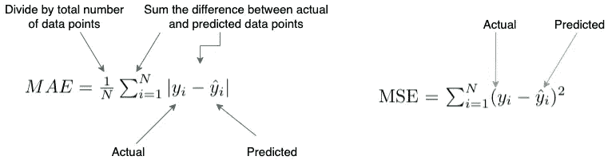

## 原木损失

二元输出分类模型的损失函数

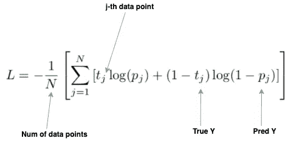

## 交叉熵损失

多输出分类模型的损失函数

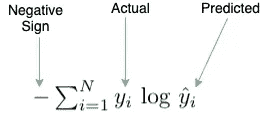

## 铰链损耗

支持向量机的损失函数

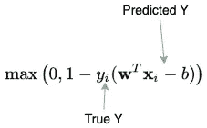

# 模型

## ***线性回归***

尽管线性回归问题不像逻辑回归那样受欢迎，但了解在什么情况下会出现线性回归问题是至关重要的。它是传统 ML 中的基本模型之一，方程非常简单。

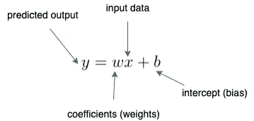

## **逻辑回归**

一个非常受欢迎的 ML 面试主题，因为它通常是分类问题的基线模型，面试官可以跟进过度拟合和分类指标。

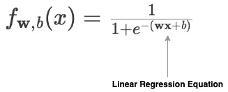

## **支持向量机**

像线性回归一样，关于 SVM 的问题在 ML 面试中并不流行。然而，了解支持向量机的成本函数公式将有助于您理解控制所允许的错误分类数量的超参数(这是一个关于支持向量机的常见问题)。如果超参数为 0，则模型不允许任何误分类，反之，超参数值越大，允许的误分类越多。

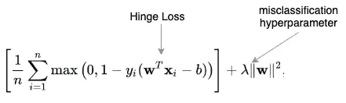

## 神经网络的正向传递

神经网络在面试中很受欢迎，所以在面试时你至少会遇到一个问题。您应该非常熟悉正向传递方程，以便更好地理解激活函数、权重和输入是如何组合的。

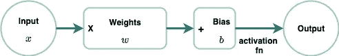

## **贝叶斯定理**

这是机器学习中非常流行的等式，如果不是最流行的话。问题并不倾向于解决贝叶斯定理问题-这些通常是数据科学家的问题-但有时你需要解释朴素贝叶斯模型，这个定理是核心。

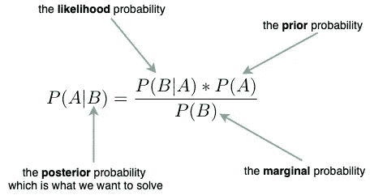

## **L1 和 L2 正规化**

了解这两个方程以及它们如何防止过拟合非常重要。过度拟合问题在 ML 面试中相当普遍。

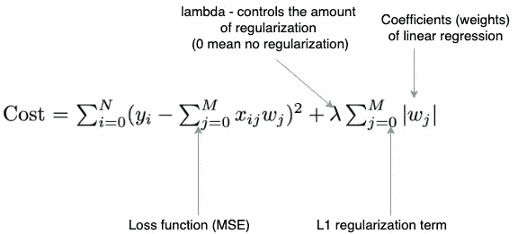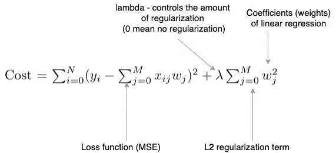

## **决策树**

决策树和它们的表亲随机森林和提升树在 ML 访谈中非常流行，你应该知道两个等式来衡量一个节点的杂质:

**基尼指数**

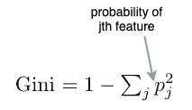

**熵**

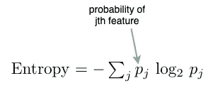

**决策树的代价函数** —由于编码这个代价函数很简单，所以可以得到一个问题来编码这个代价函数，作为 ML 编码问题的一部分。

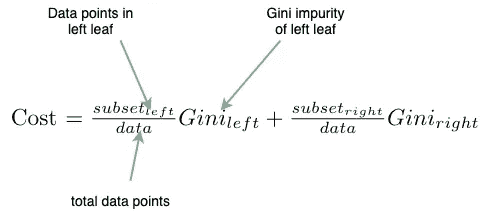

# **指标**

当提到 ML 模型时，您需要知道如何评估它们，因此了解每个模型的指标非常重要。

**分类指标(精确度、召回率、准确度、F1)**

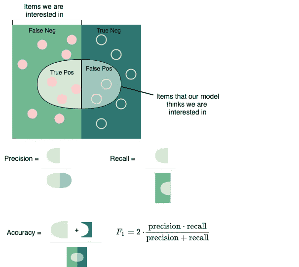

**回归指标(平均绝对误差、均方误差)**

一些其他指标:

*   标准化折扣累积收益(排名指标)
*   并集上的交集(计算机视觉度量)
*   骰子系数(计算机视觉度量)
*   BLEU 评分(NLP 指标)

# **激活功能**

如前所述，神经网络是一个流行的面试话题，了解流行的激活函数对于回答涉及神经网络和其他 ML 模型的问题是必要的。

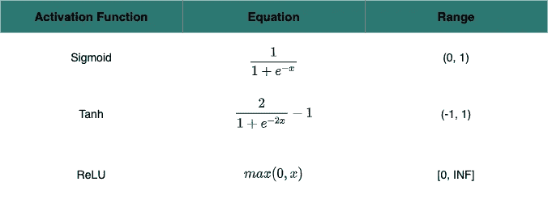

**Softmax**

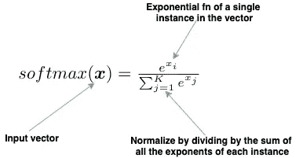

# **距离功能**

距离函数可以出现在机器学习面试的许多领域:k 近邻、k 均值甚至推荐系统。因此，您应该熟悉 3 种最流行的方法:

**余弦**

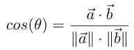

**欧几里得**

**曼哈顿**

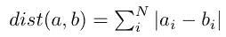

# 统计数字

虽然 MLE 面试不会像数据科学家面试那样有那么多的统计问题，但你倾向于将这些等式用于数据分析问题。这类问题经常出现在面试中，因为你工作的主要部分是处理数据。

## 卡方

用于确定分类特征的预期频率和该特征的观察频率之间是否存在统计显著差异的检验。

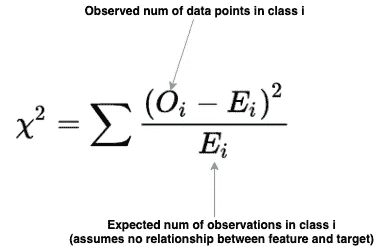

## **置信区间**

该区间给出了估计区间将包含感兴趣的值的概率。最常见的置信度是 95%。

## **标准化**

一种数据预处理技术，用于根据平均值调整数据，使其具有单位标准偏差。

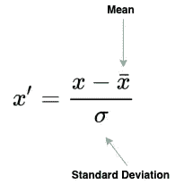

## **正常化**

一种数据预处理技术，用于在 0 和 1 之间缩放数据。

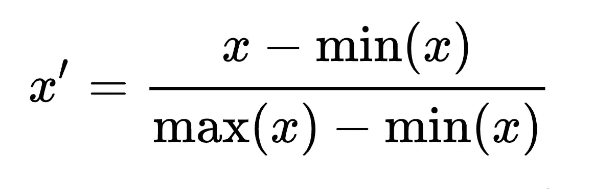

摘自[维基百科](https://en.wikipedia.org/wiki/Feature_scaling)

## **偏差-方差权衡方程**

虽然您应该从概念上了解偏差-方差权衡，但理解这个等式会让您有更好的理解，并让您在回答问题时有更深入的了解

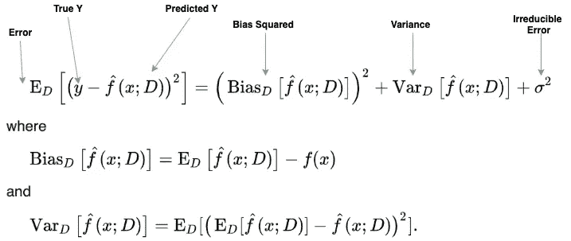

摘自[维基百科](https://en.wikipedia.org/wiki/Bias%E2%80%93variance_tradeoff)

# 结论

现在你已经有了在 MLE 面试中获得成功所需要知道的一些基本等式，下一步就是[练习](https://machinelearninginterviews.com/)。