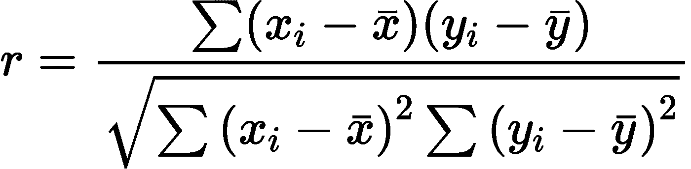
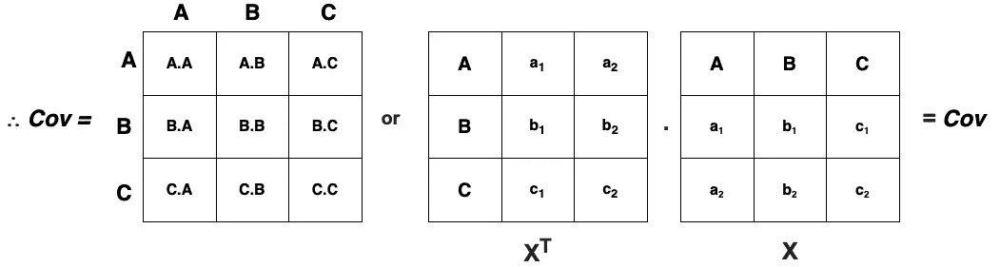

# 降维的数学方法

> 原文：<https://towardsdatascience.com/mathematical-recipe-of-dimensionality-reduction-281ff37957e4?source=collection_archive---------31----------------------->


图像由[**乔舒亚**](https://unsplash.com/@joshstyle) 上 [**下**](https://unsplash.com)

随着数据集中*变量*的增加，其维度也随之增加，这可能会带来以下挑战:

1.  变量越多，数据可视化就越困难。
2.  对于特定的业务问题，所有的变量可能都不重要。
3.  更复杂的模型，因为模型试图从所有变量中学习，需要更多的计算时间。
4.  探索性数据分析变得困难。

因此， ***降维*** 就是降低数据的维度，以保证其传达最大限度的信息的过程。有两种主要的方法来降低数据集的维度: **1。**通过*从基于不同标准的数据中只选择*有用的特征，或 **2。**通过*从给定数据中提取*新特征。

# **特征选择/减少**

# 1.缺失值比率

对于数据集中的每个特征列，使用以下公式计算 ***缺失值比率*** :


图一。计算缺失值比率的公式

现在，决定一个阈值保持值，超过该值时，您将删除缺失值比率超过阈值的变量。然后，对于其余的缺失值，尝试找出原因，如数据收集过程中的无响应或错误或读取数据时的错误，并对缺失值进行插补。

# 2.低方差

***方差*** 较低的变量(价差较小，因此所有值趋于相同)对目标变量的影响较小。因此，决定一个阈值，去掉方差小的变量。使用以下公式计算差异:


图二。计算方差的公式

方差与*范围相关*。因此，在计算方差之前，*标准化*变量。

# 3.高度相关

在建立模型时，没有必要保留所有 ***相关*** 变量，因为它们都具有相似的特征(*消息/信息*)。此外，高相关性导致*多重共线性*问题。这是公式。



图三。计算相关性的公式

为了减少维度，计算所有独立变量之间的*相关性*，然后如果相关性超过阈值，则删除该变量。在两个变量之间，去掉与目标变量相关性低的一个。

# 4.反向特征消除

假设所有先前的*降维*方法都已实施，使用所有变量训练模型并计算其性能。 ***一次消除*** 一个变量，每次计算性能。找出对性能影响不大的被剔除变量，直到不再有变量被剔除。

# 5.正向特征选择

分别使用每个特征训练模型并检查性能，然后 ***选择给出最佳性能的*** 变量。重复该过程，一次添加一个变量，产生最高改进的变量为*重新训练的变量*。除非模型的性能没有显著提高，否则重复整个过程。

# 特征抽出

# 1.主成分分析

***PCA*** 就是*无监督*的降维算法。让我们考虑一个例子，我们有一个 2D 数据，该数据是沿着 **X1** 的。


图 4。实例一

我们可以使用低方差滤波器选择 **X1** 并消除 **X2** (因为它有*低方差*)。


图五。实例二

考虑这个例子，没有一个特征具有低方差。因此，我们需要找到新的轴， **Z1** 和 **Z2** ，并沿着 **Z1** 对每个数据点进行投影(使用点积)。

**Z1** 称为 ***主成分*** ，在数据中具有*最大方差*的方向。这里我们看到，在 2D，数据在一个平面内变化。类似地，在 3D 中，数据在 2D 平面上变化。因此，我们有两个主要组成部分。

***n 维情况:*** 在 ***n*** 特征中，我们需要找到 ***k*** 独立方向的变异数据(*n-特征* : f₁、…、fₙ、*k-方向* : z₁、z₂、…、zₖ).因此，我们有*k-主成分*， **k < n** 。这些新特征( ***k*** )相对于原始数据没有可解释的意义。

## 步伐

## 1.标准化:

不同的特征有不同的范围和尺度，因此*方差*也不同。因此，使用 ***标准化*** 使得每个特征对 PCA 算法的贡献相等。

## 2.协方差矩阵:

***协方差*** 是两个特征之间*相关性*的*强度*的度量。


图六。计算协方差的公式

一个 ***正*** 协方差意味着两个特征一起*向同一个方向*移动，而 ***负*** 协方差意味着两个特征反向*移动*。


假设有三个特征: ***Y₁*** ，***y₂*&***y₃***， ***V₁*** ，***v₂***&***v₃***是**的方差这就是协方差矩阵的样子。


现在，假设有三个特征: ***A*** ， ***B*** ， ***C*** 有两排并且它们被*标准化*使得**的意思是(A)** = **的意思是(B)** = **的意思是(C)** = **0** 。设这个矩阵等于 ***X*** 。然后，



因此，**协方差** = **转置** ( **X** ) **。**T**T**

因此，协方差矩阵是**的 ***矩阵乘*** ( *点积*)转置** **的****X**与 **X** 。

## 3.特征向量和特征值:

***特征向量*** ( ***z*** )是非零向量，与矩阵相乘得到*乘以常数 **λ** ， **cov z** = **λz** 。对于一个 *NxN* 矩阵，有 ***N 个*** *相互独立*的特征向量*相互垂直*。*

在 PCA 中，协方差矩阵的特征向量给出了数据方差的*方向*。*越大*的**特征值**，越*的*方向的方差越大**特征向量**。因此，*特征值*代表扩散的*幅度*。


图 7。公式化特征对

## 4.选择主成分:

我们需要根据特征值选择 ***k*** 方向/特征向量。考虑一个 *3x3* 协方差矩阵 **C** 及其对应的特征值( **λ₁** ， **λ₂** ， **λ₃** )和特征向量( **V₁** ， **V₂** ， **V₃** )。


图 8。矩阵 **C**

下面是 [*步骤*](https://lpsa.swarthmore.edu/MtrxVibe/EigMat/MatrixEigen.html) 计算*特征值*和*特征向量*。或者，可以在 python 中使用线性代数的库 ***scipy.linalg*** 来完成。

```
**In [1]:** import scipy.linalg as la
        import numpy as np**In [2]:** A = np.array([[5,-1,0],[-1,8,3],[0,3,1]])
        print(A) *[[ 5 -1  0]
         [-1  8  3]
         [ 0  3  1]]***In [3]:** EigenValue, EigenVector = la.eig(A)
**In [4]:** print(EigenValue) *[ 9.31426594+0.j  4.81939667+0.j -0.13366261+0.j]***In [5]:** print(EigenVector) *[[ 0.21302554  0.97462873 -0.06869469]
         [-0.91904881  0.17602119 -0.35265538]
         [-0.33161634  0.13825838  0.93322839]]*
```

从上面看，我们有


图九。特征值和特征向量

现在，|λ₃| > |λ₁| > |λ₂|，总和= |λ₃| + |λ₁| + |λ₂| = 14.26


Var₁ + Var₂ = 0.35

Var₂ + Var₃ =0.66

Var₁ + Var₃ =0.99

由于 **Var₁** 和 **Var₃** 一起可以解释*数据中 99%* 的方差，我们可以从数据中去掉 **Var₂** ，因此 **Var₁** 和 **Var₃** 是数据的 ***主成分*** 。

# 2.要素分析

考虑一个*的例子*:


图 10。实例三

一般来说*经验*和*薪资*有很好的(正)相关性。一个新的变量 ***值*** 可以定义这两个变量。

**值**可以认为是*经验*和*薪资*两个变量的线性组合，或者你可以说特性*经验*或*薪资*可以由**值**导出。因此，**值**被称为 ***因子*** 。

*线性*组合相关特征的过程称为 ***因子分析*** 。**因子**是*原*变量的线性组合。

## 目标

1.  对*减少*变量的数量。
2.  *考察*变量之间的关系。
3.  *解决*多重共线性的问题。

## 假设

1.  原始变量应*规格化*。
2.  因素是相互独立的。
3.  存在一些潜在的*因素*可以*描述*原始变量。

## 类型

1.  **探索性因素分析(EFA):** 在 ***EFA*** 中，确定变量之间的关系，并将属于*相似* *概念*的变量分组。没有关于因素之间关系数量的预先假设。
2.  **验证性因素分析(CFA):***CFA***中的**，对*因素*的数量进行假设，检验变量与 ***n*** 具体*因素*相关的假设。

## 步伐

1.**验证数据需求:**

*   样本量:


*   样本与变量的比率应为 15:1 或更高
*   变量的相关值:


2.**取变量**

为了提取*因子*，让我们考虑原始变量( **Y₁** 、 **Y₂** 和 **Y₃** )和要提取的*因子*(**f₁**和 **F₂** )。


***因子加载*** 定义了每个*因子*在定义原始变量时*的贡献*是多少。

3.**假设**

*   错误术语 ***eᵢ*** 相互独立。【**表示(*eᵢ*)**=**0**和**var(*eᵢ*)**=**σᵢ**)
*   *因子*(**【fⱼ】**)是相互独立的*，并且带有误差项。[ **mean(Fⱼ)** = **0** 和 **var(Fⱼ)** = **1***

**

*图 11。方程式 1*

*4.**观测协方差矩阵***

*设 ***S*** 为数据的实际已知值。那么观察到的协方差矩阵变成:*

**

*5.**计算协方差***

*现在，我们需要根据*因子负载*计算协方差。为此，我们需要计算因子权重的 **β** **值。***

***从*方差*的性质，我知道***

******

***然后是*等式 1* (图 11。)变成了，***

******

***还有，***

******

***在理想情况下，*变量*的所有*变量*都可以用 ***因子*** 来解释。因此，***

******

***6.**计算协方差矩阵*****

***我们需要 ***因子加载*** ( **β** )和 **σ** 的值。实际值也是我们已知的( **S₁** 、 **S₂** 、 **S₃** )，解下面的方程就可以得到**β**s 和**σ**s***

******

***图 12 **最终协方差矩阵*****

***因此，我们可以将 ***因子载荷*** 和 ***因子*** 计算为*变量*的*线性组合。因子加载表示每个变量与**潜在因子**的*关系*。****

# ***结论***

***在多维数据中寻找趋势是困难的。当数据庞大且有多个自变量时，存储、处理和可视化数据变得困难。因此， ***降维*** 有助于缓解这些问题，同时保留有用的特征。***

******

***[https://www.linkedin.com/in/shubhamdhingra27/](https://www.linkedin.com/in/shubhamdhingra27/)***