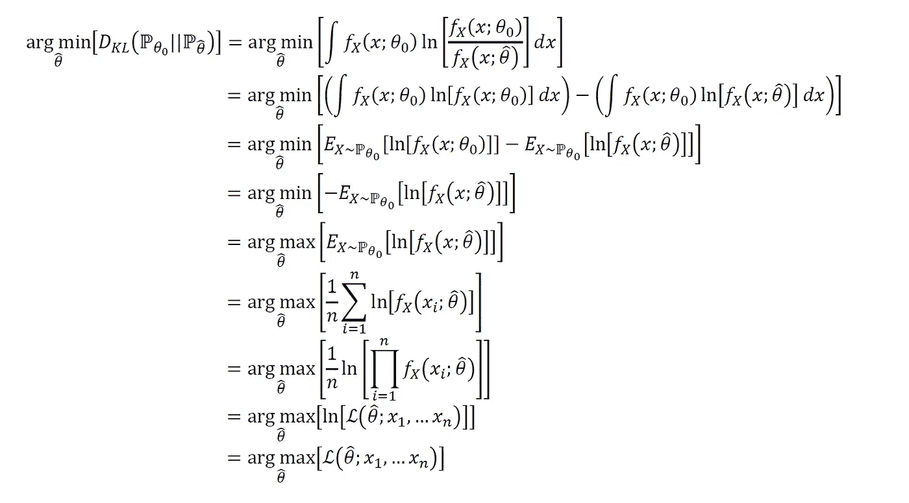

# 数理统计:最大似然估计的数学证明

> 原文：<https://towardsdatascience.com/mathematical-statistics-mathematical-justifications-of-maximum-likelihood-estimation-e489dd013557?source=collection_archive---------15----------------------->

## 全变差、KL 散度和最大似然估计之间关系的说明和推导

由 [Unsplash](https://unsplash.com?utm_source=medium&utm_medium=referral) 上的 [Pietro Jeng](https://unsplash.com/@pietrozj?utm_source=medium&utm_medium=referral) 拍摄

# 1:介绍和动机

在这篇文章中，我试图涵盖最大似然估计(MLE)的数学基础；构造分布参数的抽样估计量的一种常用方法。虽然 MLE 非常常用，但从教学的角度来看，它并不总是被很好地理解或很好地数学化。

这篇文章试图涵盖分布的总变差(TV)、分布的 Kullbac-Leibler (KL)散度和最大似然估计(MLE)之间的联系。

这篇文章的目录如下:

作者图片

# 2:玩具问题的说明

让我们暂时假设:

作者图片

最大似然估计(MLE)是构造抽样估计量的一种非常常用的估计方法。MLE 估计量是“插入式”估计量，从这个意义上说，它们是以样本构造的经验分布作为输入的泛函。

最大似然估计顾名思义；它们是关于感兴趣参数的似然函数的 ***arg-max*** :

作者图片

尽管这个问题回避了，最大似然估计的数学依据是什么？为什么关于感兴趣参数的似然函数的 ***arg-max*** 是该参数的“好”抽样估计量？

我们现在开始介绍分布之间的总变差(TV)。

# 3.总变分(TV)、Kullbac-Leibler (KL)散度和最大似然估计(MLE)

## 总变差(电视):

让我们再次提出我们的玩具问题:

作者图片

作者图片

作者图片

## 库尔巴克-莱布勒(KL)散度:

作者图片

作者图片

作者图片

还有维奥拉。我们证明了 KL 散度相对于我们的抽样估计量的 ***arg-min*** 等价于似然函数的 ***arg-max*** (即最大似然估计)。

完整的推导过程如下:

作者图片

# 4:总结和结论

总之，最大似然估计(MLE)的数学依据如下:

作者图片

希望以上有见地。正如我在以前的一些文章中提到的，我认为没有足够的人花时间去做这些类型的练习。对我来说，这种基于理论的洞察力让我在实践中更容易使用方法。我个人的目标是鼓励该领域的其他人采取类似的方法。以后我会继续写类似的作品。请 [**订阅并关注我在**](https://anr248.medium.com/) 和 [**LinkedIn**](http://www.linkedin.com/in/andrew-rothman-49739630) 上的更新！